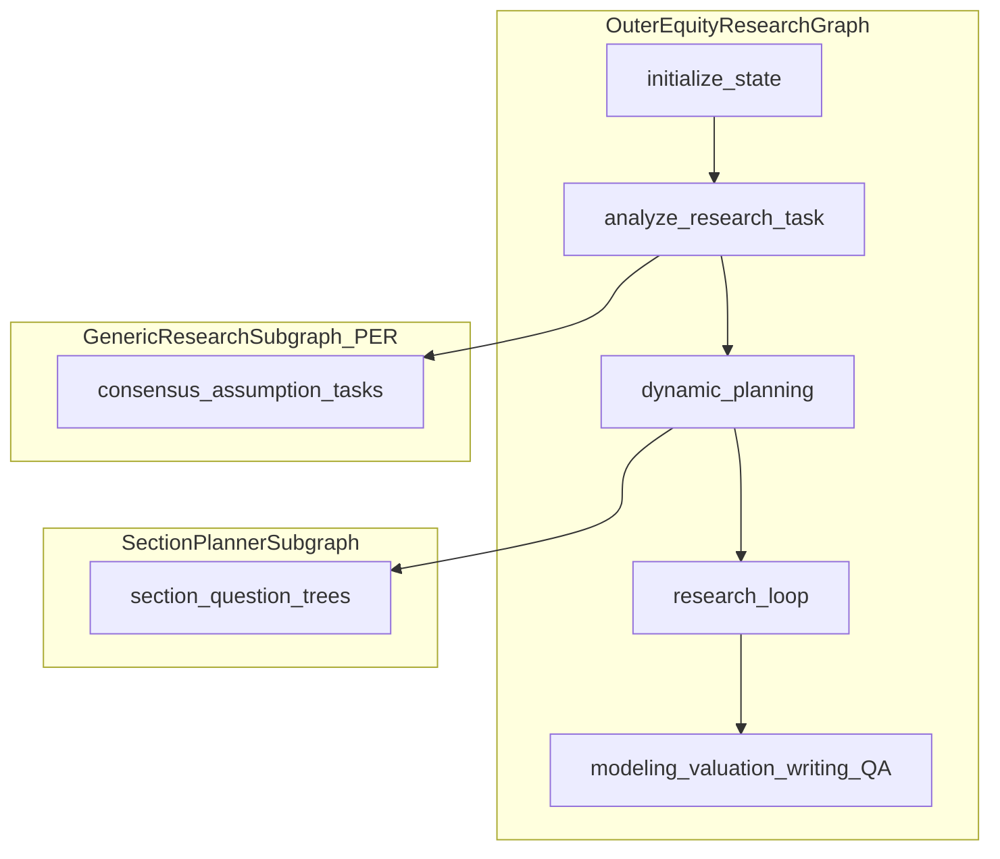
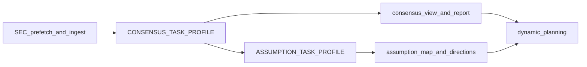
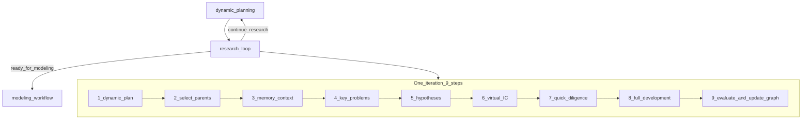
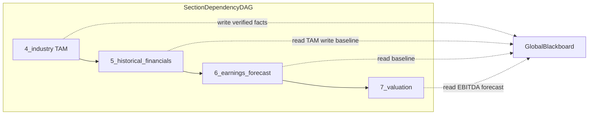
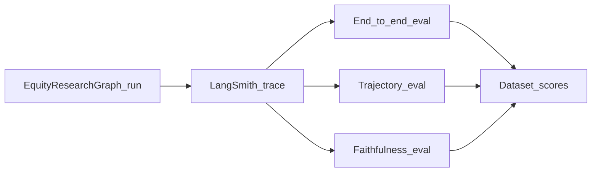

---

# Equity Research: R&D-Agent for Sell-Side Style Reports

中文版 | [README.zh-CN.md](README.zh-CN.md) · [文档索引](docs/zh/README.md)

> **Looking for the original TradingAgents trading framework?**
> See [docs/TRADINGAGENTS.md](docs/TRADINGAGENTS.md) — multi-agent trading workflow, CLI, and `TradingAgentsGraph`.

> Equity Research is designed for research purposes. [It is not intended as financial, investment, or trading advice.](https://tauric.ai/disclaimer/)


[Overview](#overview) | [Quick Start](#quick-start) | [Architecture](#architecture) | [Consensus & Assumption](#consensus--assumption) | [Research Loop](#research-loop) | [Memory Design](#memory-design) | [vs TradingAgents](#vs-tradingagents) | [Trace & Compliance](#trace--compliance) | [Evaluation](#evaluation) | [Examples](#examples) | [Docs Index](#documentation-index) | [TradingAgents →](docs/TRADINGAGENTS.md)


---

## Overview

`EquityResearchGraph` implements an **Equity R&D-Agent**: a hypothesis-driven sell-side equity research pipeline. The product principle is simple — **do not let the agent generate a report in one shot**. Research investment theses first, develop evidence and models, then write sections.

```text
Research Phase    →  thesis graph exploration, evidence, quick diligence
Development Phase →  modeling, valuation, section artifacts
Evaluation Phase  →  aggregated scoring, IC review, final QA
```

**Public API:**

```python
from tradingagents.equity_research import EquityResearchGraph

graph = EquityResearchGraph(debug=True, config=config)
final_state, summary = graph.propagate("NVDA")
```

Code lives under `tradingagents/equity_research/`. Install the optional extra:

```bash
pip install "tradingagents[equity-research]"
```

---

## Quick Start

### 1. Configure PostgreSQL + Redis (optional)

```bash
createdb tradingagents_equity
docker compose exec postgres psql -U postgres -d tradingagents_equity -f /docker-entrypoint-initdb.d/10-setup-paradedb.sql
```

The `postgres` service uses the ParadeDB Docker image, so `pg_search` and `pgvector` are available inside the container.


| Variable                     | Purpose                                       |
| ---------------------------- | --------------------------------------------- |
| `TRADINGAGENTS_POSTGRES_URL` | PostgreSQL connection string                  |
| `TRADINGAGENTS_REDIS_URL`    | Redis URL (rate limit + budget)               |
| `PERPLEXITY_API_KEY`         | Perplexity Search API                         |
| `SEC_EDGAR_USER_AGENT`       | SEC EDGAR user agent (email)                  |
| `FMP_API_KEY`                | Financial Modeling Prep (earnings calls only) |
| `TRADINGAGENTS_LLM_PROVIDER` | LLM provider (shared with trading graph)      |


Set `equity_research_use_memory=True` in config to run without PostgreSQL/Redis.

### 3. Run

```python
from tradingagents.default_config import DEFAULT_CONFIG
from tradingagents.equity_research import EquityResearchGraph

config = DEFAULT_CONFIG.copy()
graph = EquityResearchGraph(debug=True, config=config, init_database=True)
final_state, summary = graph.propagate("NVDA")

print(final_state["rating"], final_state["target_price"])
print(final_state.get("final_report", "")[:2000])
```

Or use the example entry point: `python equity_research_main.py`

### Report sections (10)


| Section                | ID                           |
| ---------------------- | ---------------------------- |
| Investment summary     | `1_investment_summary`       |
| Company overview       | `2_company_overview`         |
| Business model         | `3_business_model`           |
| Industry & competition | `4_industry_and_competition` |
| Historical financials  | `5_historical_financials`    |
| Earnings forecast      | `6_earnings_forecast`        |
| Valuation              | `7_valuation`                |
| Scenario & sensitivity | `8_scenario_and_sensitivity` |
| Risks                  | `9_risks`                    |
| Appendix               | `10_appendix`                |


Investment summary is written **last** (after IC review) but displayed **first** in the final report.

### SEC filings (EDGAR)

Before consensus/assumption subgraphs, `analyze_research_task` prefetches recent **10-K / 10-Q / 8-K** via `edgartools`, caches metadata under `{data_cache_dir}/equity_research/sec/{TICKER}/`, and registers documents in PostgreSQL. Set `SEC_EDGAR_USER_AGENT` to a valid email (SEC requirement).

MVP1 stores a short `text_excerpt` per filing; full **semantic chunking + vector RAG** over 10-K body text is not yet wired into `research_loop`. For a reference implementation (FAISS, section-aware chunking, LangGraph query decomposition), see:

- [docs/equity_research/sec-filing-rag.md](docs/equity_research/sec-filing-rag.md) — MVP1 ingest + planned SEC Filing RAG module

---

## Architecture

Three layers of loops coexist — do not conflate them:


| Layer                    | Implementation            | State                 | Goal                                                             |
| ------------------------ | ------------------------- | --------------------- | ---------------------------------------------------------------- |
| **Outer pipeline**       | `graph/setup.py`          | `EquityResearchState` | Full report: consensus → thesis → modeling → valuation → writing |
| **Single-task subgraph** | `runtime/subgraph.py`     | `AgentState`          | One research task via `TaskProfile` (e.g. consensus)             |
| **Thesis R&D loop**      | `agents/research_loop.py` | `research_graph`      | Multi-branch hypothesis exploration and scoring                  |





### Outer workflow

```text
initialize_state
  → analyze_research_task      # SEC ingest, consensus + assumption subgraphs
  → dynamic_planning           # section question trees (9 sections)
  → research_loop              # inner 9-step R&D iteration
      ↺ continue_research → dynamic_planning
      → ready_for_modeling → modeling_workflow
  → valuation_workflow
  → branch_merge → risk_mapping
  → investment_committee_review
      ↺ revise_research / revise_model / revise_valuation
  → write_investment_focus → write_remaining_sections
  → plan_tables_and_charts → chart_generation
  → assemble_report → final_qa → export_report
```

After `dynamic_planning`, the pipeline continues through `research_loop` (9-step inner R&D), then modeling/valuation/writing. Deep-search tasks reuse **GenericResearchSubgraph + TaskProfile** (`consensus`, `assumption`). See [docs/EQUITY_RESEARCH.md](docs/EQUITY_RESEARCH.md) for downstream phase nodes.

### Module layout

```
tradingagents/equity_research/
├── graph/              # Outer LangGraph (setup, routers, propagation)
├── agents/
│   ├── task_analysis.py, dynamic_planning.py, research_loop.py
│   ├── section_planner/    # Section Question Tree Compiler
│   ├── consensus/, assumption/   # GenericResearchSubgraph wrappers
│   └── domain/             # 9 domain analyst agents
├── runtime/            # GenericResearchSubgraph framework (zero business logic)
├── tasks/              # TaskProfile configs (consensus, assumption, section_planner)
├── skills/, tools/     # SkillRegistry, ToolRegistry
├── state/              # EquityResearchState, ledgers, research_graph
├── memory/             # Collaborative memory retrieval
├── computation/        # Deterministic forecast + valuation engine
├── storage/            # PostgreSQL + in-memory fallback
└── export/             # Markdown memory export
```

Full directory tree: [docs/equity_research/file-structure.md](docs/equity_research/file-structure.md)

---

## Node design (through `dynamic_planning`)

The following nodes are documented in detail. Later phases (`research_loop` onward) are summarized above.

### `initialize_state`

**Source:** `agents/init_agents.py`


|             |                                                                                                                                                                                                         |
| ----------- | ------------------------------------------------------------------------------------------------------------------------------------------------------------------------------------------------------- |
| **Input**   | `ticker`, optional `mandate`, `report_type`, `time_horizon`                                                                                                                                             |
| **Actions** | Resolve instrument identity; build `instrument_context`; fetch current price/currency; generate `report_id`; init `research_budget` and Redis budget counters; load 10-section report template coverage |
| **Output**  | `report_id`, `instrument_context`, `section_coverage`, budget fields, `company_name`, `sector`, `industry`                                                                                              |


### `analyze_research_task`

**Source:** `agents/task_analysis.py`

Prefetches SEC filings, ingests documents, then runs the **consensus → assumption** subgraph chain (see [Consensus & assumption](#consensus--assumption)). SEC cache and RAG roadmap: [sec-filing-rag.md](docs/equity_research/sec-filing-rag.md). Outputs feed `dynamic_planning` and later `research_loop`.

### `dynamic_planning`

**Source:** `agents/dynamic_planning.py`, `agents/section_planner/`

This is the **Section Question Tree Compiler** — not the legacy single `dynamic_research_planning` skill. For each report section (skips `1_investment_summary`; 9 sections total), it serially invokes `SectionPlannerSubgraph`:

```text
template_interpreter → background_extractor
  → [optional] grounding_dispatch → grounding_tools → grounding_apply
  → question_tree_generator → coverage_validator → finalize_plan
```


|                        |                                                                                  |
| ---------------------- | -------------------------------------------------------------------------------- |
| **Does**               | `section schema + background reports → executable research question tree (JSON)` |
| **Does not**           | Write report prose; run PER deep search; load skills; score hypotheses           |
| **LLM**                | All calls use `quick_llm`                                                        |
| **Optional grounding** | Light `web_search` (≤5 queries) when `planner_grounding` enabled                 |


**Parent state outputs:**


| Field                       | Content                                                  |
| --------------------------- | -------------------------------------------------------- |
| `section_plans`             | `section_id → SectionResearchPlan`                       |
| `research_plan`             | Aggregated `core_questions` (legacy compat)              |
| `research_strategy`         | Shim for `research_loop` (`stage`, `priority_questions`) |
| `planner_exploration_graph` | Merged exploration nodes per section                     |


Example `SectionResearchPlan` fragment:

```json
{
  "section_id": "4_industry_and_competition",
  "root_question": "What is the TAM and competitive structure for NVDA's data-center GPU market?",
  "nodes": [
    {
      "id": "q1",
      "question": "What is the total addressable market for AI accelerators through FY27?",
      "expected_output": "tam_estimate",
      "downstream_agent": "industry_research"
    }
  ],
  "coverage_map": { "tam_estimate": ["q1"] },
  "execution_order": ["q1", "q0"]
}
```

Full schema and node I/O: [tradingagents/equity_research/agents/section_planner/RUNTIME.md](tradingagents/equity_research/agents/section_planner/RUNTIME.md)

---

## Consensus & assumption

Early in the pipeline, `analyze_research_task` builds **market context** before section planning or thesis exploration. Both steps use the same **GenericResearchSubgraph** engine (Plan–Execute–Reflect); only the `TaskProfile` differs.



### Shared PER loop

Each subgraph runs this fixed topology (details: [agent-loop-and-tasks.md](docs/equity_research/agent-loop-and-tasks.md)):

```text
skill_selector → initial_planner → executor → synthesizer → reflector
  ↺ loop_planner → finalizer → human_review (optional) → END
```

| Step | What happens |
|------|----------------|
| **Plan** | `initial_planner` / `loop_planner` fill `query_queue` with dimension-tagged search queries |
| **Execute** | `executor` runs up to 5 parallel Perplexity searches per batch |
| **Reflect** | `synthesizer` merges evidence into `structured_view`; `reflector` scores coverage and decides exit vs replan |
| **Finalize** | `finalizer` writes a markdown report; optional `human_review` |

Exit when `overall_score ≥ coverage_threshold` and no critical gaps, or `iterations ≥ max_iterations`.

### Consensus task

**Profile:** `tasks/consensus/profile.py` · **Objective:** structured **market consensus** across sell-side views.

**Five search dimensions:**

| Dimension | Typical content |
|-----------|-----------------|
| `quantitative_estimates` | Revenue / EPS consensus ranges |
| `kpi_focus` | KPIs analysts track most |
| `pricing_assumptions` | Forward multiples, implied growth |
| `narrative_framework` | Bull / bear narratives |
| `recent_delta` | Post-earnings estimate revisions |

**Parent state outputs:**

| Field | Meaning |
|-------|---------|
| `consensus_view` | `StructuredConsensusView` (five dimensions + citations) |
| `consensus_report` | Human-readable consensus markdown |
| `consensus_search_memory` | Perplexity query history (dedupe for assumption) |

**Manual test:**

```bash
uv run python demo_consensus.py NVDA --mode subgraph --json -o out/nvda.json
```

### Assumption task

**Profile:** `tasks/assumption/profile.py` · **Objective:** surface **implicit assumptions** behind consensus and derive **research directions**.

Runs **after** consensus. Seeds from `parent_context` (`consensus_view`, `consensus_report`); inherits `consensus_search_memory` for dedupe only (does not reuse consensus evidence buffer).

**Search dimensions** include `demand_assumptions`, `product_ramp_assumptions`, `margin_assumptions`, etc. **Quality dimensions** for the reflector include `assumption_identification`, `falsifiability`, `model_driver_linkage`.

**Parent state outputs:**

| Field | Meaning |
|-------|---------|
| `assumption_map` | `{id → statement}` of key assumptions |
| `assumption_view` | Full `AssumptionView` |
| `research_suggestions` | Follow-up research ideas |
| `research_directions` | Top priorities for later loops |
| `assumption_report` | Markdown summary |

```bash
uv run python demo_consensus.py NVDA --mode subgraph --with-assumption --json -o out/nvda.json
```

### Downstream use

- `dynamic_planning` reads `consensus_report` + `assumption_report` as **background** for section question trees.
- `research_loop` uses `expectation_gaps`, `research_directions`, and `get_consensus_view_for_prompt()` when generating hypotheses.
- Compliance: consensus queries get a public-source suffix via `tasks/consensus/compliance.py`.

---

## Research loop

After `dynamic_planning`, the outer graph enters **`research_loop`** — the thesis **R&D** runtime (`agents/research_loop.py`). Unlike consensus/assumption (single-task PER subgraphs), this loop explores a **branching investment-thesis DAG** (`research_graph`) over multiple outer iterations.



### One iteration (9 steps)

| Step | Action | Key outputs |
|------|--------|-------------|
| ① | **Dynamic planning** — stage-aware strategy (`orientation` → `convergence`); may set `skills_to_run` | `research_strategy` |
| ② | **Select parent nodes** — pick thesis branches from `research_graph` | `active_hypothesis_ids` |
| ③ | **Memory context** — `build_memory_context()` from ledgers | evidence / claims / assumptions snippets |
| ④ | **Key problems** — from `expectation_gaps` or LLM | priority research problems |
| ⑤ | **Scientific hypotheses** — 5-dimension scored hypotheses | candidate theses |
| ⑥ | **Virtual IC** — select most promising branch | `selected` hypothesis |
| ⑦ | **Quick diligence** — ≤~5 evidence items; `reject` / `park` / `full_diligence` | quick diligence verdict |
| ⑧ | **Full development** — retrieve evidence → extract facts → verify claims → run `strategy.skills_to_run` | `evidence_ledger`, `claims` |
| ⑨ | **Evaluate** — `aggregate_thesis_score()`; update `research_graph` node | `best_node_id`, branch scores |

**Quick diligence reject** writes a `rejected` node to the graph and ends the iteration early without full development.

### Stages and routing

`research_strategy.stage` progresses by iteration count:

| Stage | Rough share of `max_research_iterations` |
|-------|------------------------------------------|
| `orientation` | first ~30% |
| `thesis_discovery` | ~30–60% |
| `diligence_modeling` | ~60–85% |
| `convergence` | final ~15% |

Outer router (`graph/routers.py` → `research_loop_router`):

| Condition | Next node |
|-----------|-----------|
| `research_status == "sufficient"` or `research_iterations ≥ max_research_iterations` | `modeling_workflow` |
| `research_status == "needs_human"` | `investment_committee_review` |
| otherwise | `dynamic_planning` (another iteration) |

Thesis scoring weights (evidence 20%, consensus gap 20%, financial materiality 20%, valuation impact 15%, catalyst 10%, risk-adjusted 10%, novelty 5%) live in `evaluation/aggregators.py`.

### Inputs and outputs

**Reads:** `section_plans`, `research_strategy` (from planner shim), `consensus_view`, `expectation_gaps`, `research_directions`, ledgers.

**Writes:** `research_graph` (nodes, edges, `best_node_id`), `research_iterations`, `research_status`, updated evidence/claim/assumption ledgers.

**Differs from consensus/assumption:**

| | Consensus / assumption | Research loop |
|--|------------------------|---------------|
| Engine | `GenericResearchSubgraph` + `TaskProfile` | `ResearchLoopRuntime` (Python orchestrator inside one graph node) |
| Goal | Market consensus + assumption map | Multi-branch thesis exploration |
| Search | Perplexity PER batches | Evidence agents + skills from `SkillRegistry` |
| Stop | Coverage threshold | Graph score, iteration budget, `research_status` |

Further detail: [docs/equity_research/agent-loop-and-tasks.md §6.2](docs/equity_research/agent-loop-and-tasks.md)

---

## Runtime frameworks


| Runtime                 | Class                                | State                 | Purpose                                                                  |
| ----------------------- | ------------------------------------ | --------------------- | ------------------------------------------------------------------------ |
| GenericResearchSubgraph | `runtime/subgraph.py`                | `AgentState`          | Single-task PER loop; `TaskProfile` injects dimensions, prompts, schemas |
| SectionPlannerSubgraph  | `agents/section_planner/subgraph.py` | `SectionPlannerState` | One-pass section question tree; no iteration                             |


Shared infrastructure: `EquityResearchDeps`, `deps.trace()`, `ExplorationGraph`, `runtime/utils/structured_invoke.py`.

Registered tasks (`tasks/registry.py`): `consensus`, `assumption`. Extend by adding a `TaskProfile` and invoking `GenericResearchSubgraph(deps, PROFILE)`.

---

## Memory design

> 财务变量之间存在严格依赖拓扑；不能将所有 Subquestion 或 section 完全扁平并行。目标架构是**带状态共享的全局 DAG** + **黑板架构 (Blackboard Architecture)**。

### Structural premise

Running downstream sections without upstream facts causes hallucinations and logical breaks. Example dependency chain:

```text
4_industry_and_competition (TAM)
  → 5_historical_financials (baseline)
    → 6_earnings_forecast
      → 7_valuation
```




### Current implementation (MVP1)


| Capability               | How it works today                                                                                          | Code                                    |
| ------------------------ | ----------------------------------------------------------------------------------------------------------- | --------------------------------------- |
| Central memory           | Multiple **Ledgers** inside LangGraph `EquityResearchState`                                                 | `state/ledgers.py`, `write_to_ledger()` |
| Memory types             | evidence, claim, assumption, consensus, thesis, forecast, valuation, issue                                  | `equity_research_state.py`              |
| Writes                   | Skills, `evidence_memory.store_*`, `memory_write` tool                                                      | `tools/evidence_memory.py`              |
| Reads                    | `build_memory_context()` scores and returns top-N (token overlap by default)                                | `memory/retrieval.py`                   |
| Cross-branch             | `cross_branch_discoveries` field; **no Pub/Sub event bus**                                                  | `memory/retrieval.py`                   |
| Thesis DAG               | `research_graph` for investment-thesis branches (separate from section DAG)                                 | `state/research_graph.py`               |
| Section orchestration    | `dynamic_planning` runs sections **serially** in `MVP1_SECTION_ORDER`; intra-section `execution_order` only | `section_planner/aggregate.py`          |
| Persistence              | Optional PG `EvidenceStore`, `FactStore`, pgvector                                                          | `storage/`                              |
| Early stopping (partial) | PER `coverage_threshold`; `research_loop` score threshold + `max_iterations`; quick diligence reject/park   | `runtime/nodes/reflector.py`            |
| Typed numerics           | `assumption_ledger` + `facts[]` → `computation/forecast.py` reads `metric_name` as `float`                  | `computation/`                          |


**Current limitations (motivation for roadmap):**

- Ledgers live on graph state — no standalone thread-safe Blackboard with field-level write isolation
- Cross-branch sharing is pull-based (`build_memory_context`), not event-driven
- Inter-section dependencies are implicit (serial planner order), not encoded as DAG edges
- No global contradiction interrupt or diminishing-returns cutoff bus
- Unstructured text → compute params relies on claim verification + `_fact_value()`; no unified `FactEntity` gateway yet

Implementation detail: [docs/equity_research/memory.md](docs/equity_research/memory.md)

### Target design: global Blackboard *(roadmap)*


| Design point                | Target behavior                                                                                             |
| --------------------------- | ----------------------------------------------------------------------------------------------------------- |
| **Entity-Component Store**  | Each verified fact is an immutable JSON object, not a prose blob                                            |
| **Field-level granularity** | e.g. `{"entity":"TAM","value":50e9,"currency":"USD","source":"Gartner 2025","confidence":0.95}`             |
| **Read/write isolation**    | Research nodes read freely; **write only after cross-validation**                                           |
| **Ledger evolution**        | Ledger entries become typed `FactEntity` on the Blackboard; `write_to_ledger()` becomes a compatibility API |


### Target design: cross-branch sharing *(roadmap)*


| Mechanism                     | Target behavior                                                                                                                 | Gap vs today     |
| ----------------------------- | ------------------------------------------------------------------------------------------------------------------------------- | ---------------- |
| **Pub/Sub**                   | Branches subscribe to readiness events (e.g. `EBITDA_FORECAST_READY`); valuation blocks until fired, then pulls from Blackboard | No event bus     |
| **Dynamic context injection** | Branch entity as query → vector Top-3 facts injected into `intent_hint`                                                         | Fixed top-N pull |
| **Interaction Kernel**        | R&D-Agent probabilistic interaction → events + retrieval in structured ER                                                       | Planned          |


### Target design: early stopping *(roadmap)*

1. **Confidence Gating** — Per `required_output` evidence threshold; multi-source agreement ≥ 0.85 → success early-stop. *Today:* PER coverage and thesis score thresholds only.
2. **Contradiction Interrupt** — Fatal contradiction (e.g. core patent invalidated) broadcasts **Interrupt Signal**; forecast/valuation branches halt and revert. *Today:* `issue_ledger` + IC/final_qa revise routes; no real-time bus.
3. **Diminishing Returns Cut-off** — N retrieval iterations with no information gain → fail early-stop, mark `Data Insufficient` or use industry default. *Today:* `research_budget` / `max_search_queries` only.

### Unstructured assumptions → strongly typed compute params

**Current (MVP1):**

```text
Unstructured text (evidence / LLM claim)
  → evidence agent extract + verify
  → claim_ledger (verified) + assumption_ledger
  → FactStore / facts[{metric_name, metric_value}]
  → computation/forecast.py, valuation_mock.py (deterministic float reads)
```

Target price and EPS **must** come from `computation/` — the LLM must not invent final numbers.

**Target (aligned with Blackboard):**

```text
LLM extraction candidate → Schema Validator (FactEntity)
  → Cross-validation (≥2 sources) → Blackboard.write(entity, immutable)
  → ComputationEngine.get("TAM" | "EBITDA_FY1") → DCF / Monte Carlo
```

Planned components: `FactEntity` JSON Schema, `SchemaValidator`, `CrossValidationGate`, `ComputationBinding` (maps `required_outputs` / `coverage_map` to engine input slots), `InterruptSignal` wired to existing `revise_*` routers in `graph/routers.py`.

---

## vs TradingAgents


| Dimension      | TradingAgents                                  | Equity Research                                        |
| -------------- | ---------------------------------------------- | ------------------------------------------------------ |
| Entry class    | `TradingAgentsGraph`                           | `EquityResearchGraph`                                  |
| Goal           | Trading decision (buy/sell/hold)               | Sell-side research report (rating, target price)       |
| Orchestration  | Analyst → Debate → Trader → Risk/PM            | Research → Development → Evaluation                    |
| State / output | Decision log                                   | Ledgers + `research_graph` → `final_report`            |
| Numerics       | Market data grounding                          | Deterministic calculators (no LLM-invented EPS/target) |
| Documentation  | [docs/TRADINGAGENTS.md](docs/TRADINGAGENTS.md) | This README                                            |


### Independence statement

Equity Research is developed **independently** from the trading pipeline:

- `EquityResearchGraph` and `TradingAgentsGraph` do **not** share LangGraph orchestration (separate `graph/setup.py`, separate state schema).
- All equity research code lives in `tradingagents/equity_research/`, isolated from `tradingagents/graph/`.
- **Shared only:** `default_config`, LLM client factory, a few utilities (e.g. `resolve_instrument_identity`), and the same pip package distribution.
- Does **not** depend on trading graph nodes (Analyst, Trader, Portfolio Manager). Tests (`tests/equity_research/`) and docs evolve on their own track.
- Optional install: `pip install "tradingagents[equity-research]"`.

---

## Trace & compliance

### Trace

- Runtime: `deps.trace(state, node_name, payload)` appends to `research_traces`
- Persistence: optional PostgreSQL `trace_store`
- Typical node names: `skill_selector_agent`, `initial_planner`, `executor`, `reflector`, `section_planner_*`, `dynamic_planning`, `final_qa`
- Visualization:

```bash
uv run python scripts/visualize_consensus_trace.py out/nvda.json -o out/nvda_trace.html
uv run python scripts/visualize_planner_trace.py out/nvda_planner.json -o out/nvda_planner.html
```

### Compliance

- Search queries: `tasks/consensus/compliance.py` appends public-source suffix; blocks MNPI keywords; filters non-public URL hosts
- Evidence: claims without citations must not reach `verified` status; synthesizer marks `[UNVERIFIED]` where needed
- Report: `final_qa` runs consistency + compliance checks → `compliance_flags`, `issue_ledger`
- Config: `equity_research.consensus_compliance`

### Design constraints

- Target price and EPS from **deterministic calculators**, not LLM invention
- `7_valuation` requires `requires_model_output: True`
- Rating based on `12_month_total_return` (price upside + dividend yield)
- IC / Final QA can route back to `dynamic_planning`, `modeling_workflow`, or `valuation_workflow`
- FMP is used for **earnings call transcripts only**, not quote data

---

## Evaluation

Equity Research runs are **LangGraph-native** and compatible with [LangSmith](https://smith.langchain.com/) tracing. Use LangSmith to record full runs, then evaluate outputs offline or in CI — complementary to local `pytest` mocks in `tests/equity_research/`.

### Enable tracing

Set environment variables (or add to `.env`):

```bash
export LANGSMITH_TRACING=true
export LANGSMITH_API_KEY=ls__...          # your LangSmith API key
export LANGSMITH_PROJECT=equity-research  # isolate ER runs from other projects
# optional:
export LANGSMITH_ENDPOINT=https://api.smith.langchain.com
```

Any run through `EquityResearchGraph`, `GenericResearchSubgraph`, or `demo_consensus.py` / `demo_planner.py` that uses LangChain LLM clients will emit traces when tracing is on. Perplexity search via `ChatPerplexity` is also traced when configured through the LangChain stack.

`EquityResearchGraph` accepts optional `callbacks=` for custom LangChain callbacks; LangSmith hooks in automatically when `LANGSMITH_TRACING=true`.

### Three evaluation dimensions


| Dimension              | Question                                                            | Methods                                                                                             |
| ---------------------- | ------------------------------------------------------------------- | --------------------------------------------------------------------------------------------------- |
| **End-to-end** (最终结果)  | Did the agent finish the task? Is the output format correct?        | Heuristic rules (regex, exact match), JSON Schema validation, LLM-as-a-judge (vs reference answers) |
| **Trajectory** (执行轨迹)  | Were the right tools called? Valid arguments? Dead loops?           | Walk the LangSmith **Run tree**; extract step count; validate tool names and API payloads           |
| **Faithfulness** (忠实度) | Is the final answer grounded in retrieved context and tool returns? | Injected eval prompt: LLM cross-checks tool outputs vs final text for hallucination                 |





### 1. End-to-end (最终结果)

**What to check**

- Pipeline completed without graph failure (`final_report` present, `rating` / `target_price` set when modeling ran).
- Structured outputs match schema: `consensus_view`, `section_plans`, `SectionResearchPlan`, `CoverageEvaluation`, etc.
- Report sections cover `required_outputs` from `MVP1_REPORT_TEMPLATE`.

**How to evaluate in LangSmith**

1. Create a **dataset** with rows: `ticker`, optional `reference_report` or golden `structured_view` JSON.
2. Run `graph.propagate(ticker)` with tracing enabled; link each run to a dataset example.
3. Attach **evaluators** on the root run output:
  - **Heuristic:** regex on `final_report` (e.g. required section headings, rating line `Overweight|Neutral|Underweight`); exact match on `target_price` when a frozen fixture is used.
  - **JSON Schema:** validate `structured_view` / `section_plans` against Pydantic models in `state/consensus_schemas.py`, `tasks/section_planner/schemas.py`.
  - **LLM-as-a-judge:** compare generated `final_report` or `consensus_report` to a reference answer; score completeness, rating consistency, and numeric claims vs `computation/` outputs.

Example schema check (offline, same logic as LangSmith custom evaluator):

```python
from tradingagents.equity_research.tasks.section_planner.schemas import SectionResearchPlan

plan = final_state["section_plans"]["4_industry_and_competition"]
SectionResearchPlan.model_validate(plan)  # raises if invalid
```

### 2. Trajectory (执行轨迹)

**What to check**

- Expected nodes appear in order (e.g. `analyze_research_task` → `dynamic_planning` → `research_loop` …).
- Tool calls use allowed tools from `ToolRegistry` / skill bindings; arguments are well-formed (ticker, query length, no blocked hosts).
- No runaway loops: step count and `iterations` within `max_iterations`, `max_recur_limit`, and `research_budget`.

**How to evaluate in LangSmith**

1. Open a trace → expand the **Run tree** (LLM spans, LangGraph nodes, `ToolNode` children).
2. Programmatically (LangSmith SDK):

```python
from langsmith import Client

client = Client()
run = client.read_run(run_id)
children = list(client.list_runs(trace_id=run.trace_id, run_type="tool"))
step_count = len(children)
tool_names = [r.name for r in children]
assert step_count <= max_steps, f"possible loop: {step_count} tool calls"
assert all(t in allowed_tools for t in tool_names)
```

1. Cross-check with in-state `research_traces` (node names from `deps.trace()`) and `api_calls` counters for Perplexity budget.

**Red flags:** repeated identical tool queries, `reflector` → `loop_planner` cycles past `max_iterations`, recursion limit errors from LangGraph.

### 3. Faithfulness (忠实度)

**What to check**

- Claims in `final_report` / section drafts trace back to `evidence_ledger` entries with citations.
- Numeric targets in the report match `computation/` outputs, not free-form LLM invention.
- Consensus synthesizer output does not contradict `search_memory` / `evidence_buffer` (no fabricated figures without `[UNVERIFIED]`).

**How to evaluate in LangSmith**

1. Collect **retrieved context** from the trace: tool return payloads (`executor`, `web_search`, `store_evidence`), plus `pending_evidence` / `search_memory` logged on child runs.
2. Run an **LLM-as-a-judge faithfulness evaluator** with a fixed rubric prompt, e.g.:

```text
You are a faithfulness auditor for equity research.

TOOL_AND_RETRIEVAL_OUTPUT:
{tool_outputs}

FINAL_TEXT:
{final_report_excerpt}

List every factual claim in FINAL_TEXT. For each claim, label:
- SUPPORTED (directly in tool output)
- UNSUPPORTED (not in tool output — likely hallucination)
- CONTRADICTED (conflicts with tool output)

Score faithfulness 0.0–1.0.
```

1. In LangSmith, implement this as a **custom evaluator** on the root run, feeding `run.outputs` and aggregated tool-child inputs/outputs from the same `trace_id`.
2. Align with product rules: claims without evidence must not be `verified`; `final_qa` `compliance_flags` should correlate with low faithfulness scores.

### Local tests vs LangSmith


|              | `pytest tests/equity_research/`               | LangSmith evaluation                             |
| ------------ | --------------------------------------------- | ------------------------------------------------ |
| Purpose      | Fast regression, mocked LLM                   | Real-model runs, trajectory audit, judge scoring |
| Trajectory   | Assert node names in `test_workflow_spine.py` | Full tool-call tree and step counts              |
| Faithfulness | `test_ledgers.py`, claim/evidence rules       | LLM judge over live retrieval + report           |
| CI           | Default (`-m "not integration"`)              | Optional nightly with `LANGSMITH_API_KEY`        |


```bash
# unit tests (no LangSmith required)
pytest tests/equity_research/ -m "not integration" -q

# traced demo run for manual review in LangSmith UI
LANGSMITH_TRACING=true LANGSMITH_PROJECT=equity-research \
  uv run python demo_consensus.py NVDA --mode subgraph --json -o out/nvda.json
```

---

## Examples

### A. Full pipeline (Python API)

```python
from tradingagents.default_config import DEFAULT_CONFIG
from tradingagents.equity_research import EquityResearchGraph

config = DEFAULT_CONFIG.copy()
graph = EquityResearchGraph(debug=True, config=config)
final_state, summary = graph.propagate("NVDA")

print(final_state["rating"], final_state["target_price"])
print(final_state["research_graph"]["best_node_id"])
print(final_state.get("final_report", "")[:2000])
```

### B. Consensus subgraph (manual debug)

```bash
uv run python demo_consensus.py NVDA --mode subgraph --json -o out/nvda.json
uv run python scripts/visualize_consensus_trace.py out/nvda.json -o out/nvda_trace.html
```

**Input:** `ticker`, `--sector`, `--max-iterations`

**Output fields:**


| Field               | Meaning                                              |
| ------------------- | ---------------------------------------------------- |
| `structured_view`   | Five-dimension consensus view with citations         |
| `final_report`      | Human-readable consensus markdown                    |
| `coverage_report`   | `overall_score`, `critical_gaps`, `routing_decision` |
| `exploration_graph` | Per-iteration reflector snapshots                    |
| `research_traces`   | Node-level debug log                                 |


Example consensus dimension fragment:

```json
{
  "quantitative_estimates": {
    "status": "partial",
    "summary": "FY26 revenue consensus ~$180B range",
    "sources": ["https://example.com/consensus"]
  }
}
```

### C. Section planner (`dynamic_planning` kernel)

```bash
uv run python demo_planner.py NVDA --with-task-analysis --all-sections -o out/nvda_planner.json
```

**Output:** `section_plans` (per-section question trees), `planner_exploration_graph`

---

## Documentation index

Recommended reading order:

1. **This README** — Equity Research overview (architecture, memory current vs target)
2. [docs/TRADINGAGENTS.md](docs/TRADINGAGENTS.md) — Original trading framework
3. [docs/EQUITY_RESEARCH.md](docs/EQUITY_RESEARCH.md) — Product overview, design constraints, testing
4. [docs/equity_research/memory.md](docs/equity_research/memory.md) — Ledger read/write, retrieval scoring, persistence
5. [docs/equity_research/file-structure.md](docs/equity_research/file-structure.md) — Directory tree and execution flow
6. [docs/equity_research/agent-loop-and-tasks.md](docs/equity_research/agent-loop-and-tasks.md) — GenericResearchSubgraph PER, TaskProfile, demo walkthrough
7. [tradingagents/equity_research/agents/section_planner/RUNTIME.md](tradingagents/equity_research/agents/section_planner/RUNTIME.md) — Section planner node I/O
8. [docs/equity_research/context.md](docs/equity_research/context.md) — Context budgets and skill injection
9. [docs/equity_research/skills-and-tools.md](docs/equity_research/skills-and-tools.md) — Skill/Tool registry
10. [docs/equity_research/storage.md](docs/equity_research/storage.md) — PostgreSQL, Redis, local files
11. [docs/equity_research/sec-filing-rag.md](docs/equity_research/sec-filing-rag.md) — SEC Filing RAG (MVP1 + planned module)
12. [docs/ARCHITECTURE.md](docs/ARCHITECTURE.md) — Cross-framework architecture summary

**中文文档：** [README.zh-CN.md](README.zh-CN.md) · [docs/zh/README.md](docs/zh/README.md)（完整索引）

### By role


| Goal                        | Start here                                                               |
| --------------------------- | ------------------------------------------------------------------------ |
| Understand memory evolution | This README § Memory Design → memory.md                                  |
| Run a demo                  | EQUITY_RESEARCH.md Quick Start + `demo_consensus.py` / `demo_planner.py` |
| Understand consensus / assumption | This README § [Consensus & assumption](#consensus--assumption) |
| Understand thesis exploration   | This README § [Research loop](#research-loop) |
| Modify PER subgraph         | agent-loop-and-tasks.md + `runtime/`                                     |
| Modify section planner      | section_planner/RUNTIME.md + `tasks/section_planner/`                    |
| Modify compliance           | memory.md + `tasks/consensus/compliance.py`                              |
| SEC filing RAG              | [sec-filing-rag.md](docs/equity_research/sec-filing-rag.md) |
| Evaluate agent quality      | This README § Evaluation → LangSmith project `equity-research`           |


### Testing

See [Evaluation](#evaluation) for LangSmith-based output testing. Quick unit-test command:

```bash
pytest tests/equity_research/ -m "not integration" -q
```

