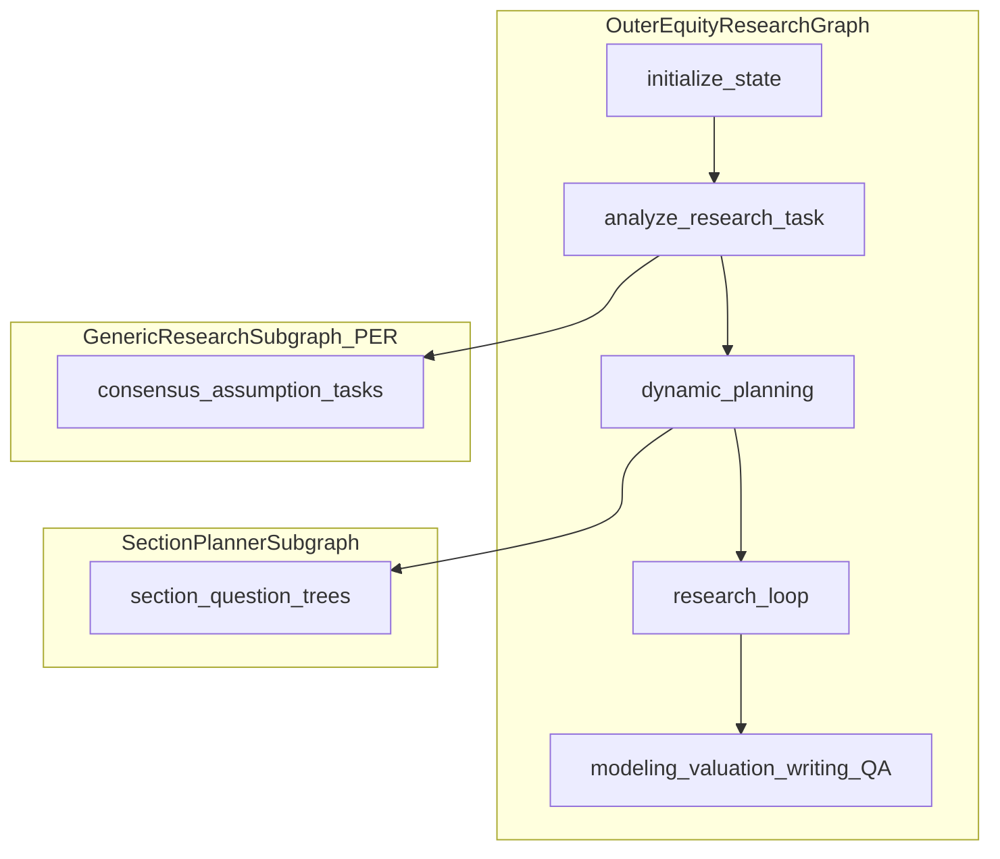
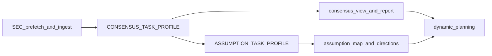
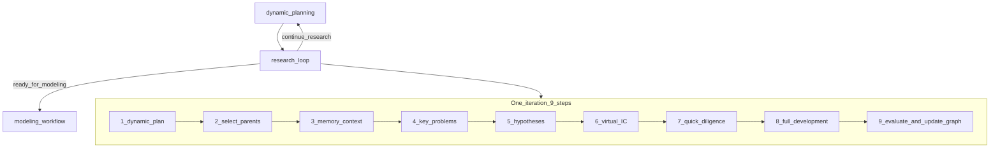
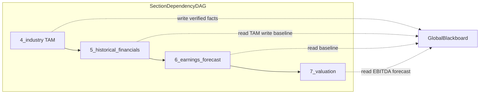
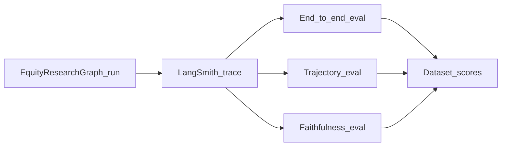

# 股票研究：卖方风格报告的 R&D-Agent

英文版 | [README.md](README.md)

> **在找原始的 TradingAgents 交易框架？**
> 请参阅 [docs/zh/TRADINGAGENTS.md](docs/zh/TRADINGAGENTS.md) — 多智能体交易工作流、CLI 与 `TradingAgentsGraph`。

> 股票研究（Equity Research）仅供研究用途。[不构成财务、投资或交易建议。](https://tauric.ai/disclaimer/)


[概览](#overview) | [快速开始](#quick-start) | [架构](#architecture) | [共识与假设](#consensus--assumption) | [研究循环](#research-loop) | [记忆设计](#memory-design) | [与 TradingAgents 对比](#vs-tradingagents) | [追踪与合规](#trace--compliance) | [评估](#evaluation) | [示例](#examples) | [文档索引](#documentation-index) | [中文文档枢纽](docs/zh/README.md) | [TradingAgents →](docs/zh/TRADINGAGENTS.md)


---

## 概览 {#overview}

`EquityResearchGraph` 实现了一个**股票研发智能体（Equity R&D-Agent）**：假设驱动的卖方股票研究流水线。产品原则很简单 — **不要让智能体一次性生成整份报告**。先研究投资论点，再发展证据与模型，最后撰写各章节。

```text
Research Phase    →  thesis graph exploration, evidence, quick diligence
Development Phase →  modeling, valuation, section artifacts
Evaluation Phase  →  aggregated scoring, IC review, final QA
```

**公开 API：**

```python
from tradingagents.equity_research import EquityResearchGraph

graph = EquityResearchGraph(debug=True, config=config)
final_state, summary = graph.propagate("NVDA")
```

代码位于 `tradingagents/equity_research/`。安装可选扩展：

```bash
pip install "tradingagents[equity-research]"
```

---

## 快速开始 {#quick-start}

### 1. 配置 PostgreSQL + Redis（可选）

```bash
createdb tradingagents_equity
psql -d tradingagents_equity -f scripts/setup_pgvector.sql
```


| 变量                         | 用途                                       |
| ---------------------------- | --------------------------------------------- |
| `TRADINGAGENTS_POSTGRES_URL` | PostgreSQL 连接字符串                  |
| `TRADINGAGENTS_REDIS_URL`    | Redis URL（速率限制 + 预算）               |
| `PERPLEXITY_API_KEY`         | Perplexity Search API                         |
| `SEC_EDGAR_USER_AGENT`       | SEC EDGAR 用户代理（邮箱）                  |
| `FMP_API_KEY`                | Financial Modeling Prep（仅用于业绩电话会议） |
| `TRADINGAGENTS_LLM_PROVIDER` | LLM 提供商（与交易图共享）      |


在配置中设置 `equity_research_use_memory=True` 即可无需 PostgreSQL/Redis 运行。

### 3. 运行

```python
from tradingagents.default_config import DEFAULT_CONFIG
from tradingagents.equity_research import EquityResearchGraph

config = DEFAULT_CONFIG.copy()
graph = EquityResearchGraph(debug=True, config=config, init_database=True)
final_state, summary = graph.propagate("NVDA")

print(final_state["rating"], final_state["target_price"])
print(final_state.get("final_report", "")[:2000])
```

或使用示例入口：`python equity_research_main.py`

### 报告章节（10 节）


| 章节                | ID                           |
| ---------------------- | ---------------------------- |
| 投资摘要     | `1_investment_summary`       |
| 公司概览       | `2_company_overview`         |
| 商业模式         | `3_business_model`           |
| 行业与竞争 | `4_industry_and_competition` |
| 历史财务  | `5_historical_financials`    |
| 盈利预测      | `6_earnings_forecast`        |
| 估值              | `7_valuation`                |
| 情景与敏感性 | `8_scenario_and_sensitivity` |
| 风险                  | `9_risks`                    |
| 附录               | `10_appendix`                |


投资摘要**最后**撰写（IC 审阅之后），但在最终报告中**首先**展示。

---

## 架构 {#architecture}

三层循环并存 — 请勿混淆：


| 层级                    | 实现            | 状态                 | 目标                                                             |
| ------------------------ | ------------------------- | --------------------- | ---------------------------------------------------------------- |
| **外层流水线**       | `graph/setup.py`          | `EquityResearchState` | 完整报告：共识 → 论点 → 建模 → 估值 → 撰写 |
| **单任务子图** | `runtime/subgraph.py`     | `AgentState`          | 通过 `TaskProfile`（任务配置）执行一项研究任务（如共识）             |
| **论点研发循环**      | `agents/research_loop.py` | `research_graph`      | 多分支假设探索与评分                  |





### 外层工作流

```text
initialize_state
  → analyze_research_task      # SEC ingest, consensus + assumption subgraphs
  → dynamic_planning           # section question trees (9 sections)
  → research_loop              # inner 9-step R&D iteration
      ↺ continue_research → dynamic_planning
      → ready_for_modeling → modeling_workflow
  → valuation_workflow
  → branch_merge → risk_mapping
  → investment_committee_review
      ↺ revise_research / revise_model / revise_valuation
  → write_investment_focus → write_remaining_sections
  → plan_tables_and_charts → chart_generation
  → assemble_report → final_qa → export_report
```

`dynamic_planning` 之后，流水线经 `research_loop`（9 步内层研发）继续，再进入建模/估值/撰写。深度搜索任务复用 **GenericResearchSubgraph（通用研究子图）+ TaskProfile（任务配置）**（`consensus`、`assumption`）。下游阶段节点详见 [docs/zh/EQUITY_RESEARCH.md](docs/zh/EQUITY_RESEARCH.md)。

### 模块布局

```
tradingagents/equity_research/
├── graph/              # Outer LangGraph (setup, routers, propagation)
├── agents/
│   ├── task_analysis.py, dynamic_planning.py, research_loop.py
│   ├── section_planner/    # Section Question Tree Compiler
│   ├── consensus/, assumption/   # GenericResearchSubgraph wrappers
│   └── domain/             # 9 domain analyst agents
├── runtime/            # GenericResearchSubgraph framework (zero business logic)
├── tasks/              # TaskProfile configs (consensus, assumption, section_planner)
├── skills/, tools/     # SkillRegistry, ToolRegistry
├── state/              # EquityResearchState, ledgers, research_graph
├── memory/             # Collaborative memory retrieval
├── computation/        # Deterministic forecast + valuation engine
├── storage/            # PostgreSQL + in-memory fallback
└── export/             # Markdown memory export
```

完整目录树：[docs/equity_research/file-structure.md](docs/equity_research/file-structure.md)

---

## 节点设计（至 `dynamic_planning`）

以下节点有详细说明。后续阶段（`research_loop` 及之后）见上文概要。

### `initialize_state`

**源码：** `agents/init_agents.py`


|             |                                                                                                                                                                                                         |
| ----------- | ------------------------------------------------------------------------------------------------------------------------------------------------------------------------------------------------------- |
| **输入**   | `ticker`，可选 `mandate`、`report_type`、`time_horizon`                                                                                                                                             |
| **动作** | 解析标的身份；构建 `instrument_context`；获取当前价格/货币；生成 `report_id`；初始化 `research_budget` 与 Redis 预算计数器；加载 10 节报告模板覆盖 |
| **输出**  | `report_id`、`instrument_context`、`section_coverage`、预算字段、`company_name`、`sector`、`industry`                                                                                              |


### `analyze_research_task`

**源码：** `agents/task_analysis.py`

预取 SEC 申报文件、摄取文档，然后运行 **共识 → 假设** 子图链（见[共识与假设](#consensus--assumption)）。输出供 `dynamic_planning` 及后续 `research_loop` 使用。

### `dynamic_planning`

**源码：** `agents/dynamic_planning.py`、`agents/section_planner/`

这是 **章节问题树编译器（Section Question Tree Compiler）** — 而非旧版单一 `dynamic_research_planning` 技能。对每个报告章节（跳过 `1_investment_summary`；共 9 节），串行调用 `SectionPlannerSubgraph`：

```text
template_interpreter → background_extractor
  → [optional] grounding_dispatch → grounding_tools → grounding_apply
  → question_tree_generator → coverage_validator → finalize_plan
```


|                        |                                                                                  |
| ---------------------- | -------------------------------------------------------------------------------- |
| **做什么**               | `section schema + background reports → executable research question tree (JSON)` |
| **不做什么**           | 撰写报告正文；运行 PER 深度搜索；加载技能；为假设评分           |
| **LLM**                | 所有调用使用 `quick_llm`                                                        |
| **可选 grounding** | 启用 `planner_grounding` 时轻量 `web_search`（≤5 次查询）                 |


**父状态输出：**


| 字段                       | 内容                                                  |
| --------------------------- | -------------------------------------------------------- |
| `section_plans`             | `section_id → SectionResearchPlan`                       |
| `research_plan`             | 聚合的 `core_questions`（旧版兼容）              |
| `research_strategy`         | 供 `research_loop` 使用的垫片（`stage`、`priority_questions`） |
| `planner_exploration_graph` | 每节合并的探索节点                     |


`SectionResearchPlan` 片段示例：

```json
{
  "section_id": "4_industry_and_competition",
  "root_question": "What is the TAM and competitive structure for NVDA's data-center GPU market?",
  "nodes": [
    {
      "id": "q1",
      "question": "What is the total addressable market for AI accelerators through FY27?",
      "expected_output": "tam_estimate",
      "downstream_agent": "industry_research"
    }
  ],
  "coverage_map": { "tam_estimate": ["q1"] },
  "execution_order": ["q1", "q0"]
}
```

完整 schema 与节点 I/O：[docs/zh/runtime/section_planner.md](docs/zh/runtime/section_planner.md)

---

## 共识与假设 {#consensus--assumption}

流水线早期，`analyze_research_task` 在章节规划或论点探索之前构建**市场背景**。两步均使用同一 **GenericResearchSubgraph（通用研究子图）** 引擎（Plan–Execute–Reflect，即 PER 计划-执行-反思循环）；仅 `TaskProfile` 不同。



### 共享 PER 循环

每个子图运行此固定拓扑（详情：[agent-loop-and-tasks.md](docs/equity_research/agent-loop-and-tasks.md)）：

```text
skill_selector → initial_planner → executor → synthesizer → reflector
  ↺ loop_planner → finalizer → human_review (optional) → END
```

| 步骤 | 发生的事 |
|------|----------------|
| **Plan（计划）** | `initial_planner` / `loop_planner` 用维度标签填充 `query_queue` 搜索查询 |
| **Execute（执行）** | `executor` 每批最多并行 5 次 Perplexity 搜索 |
| **Reflect（反思）** | `synthesizer` 将证据合并到 `structured_view`；`reflector` 评分覆盖度并决定退出或重规划 |
| **Finalize（收尾）** | `finalizer` 写入 markdown 报告；可选 `human_review` |

当 `overall_score ≥ coverage_threshold` 且无关键缺口，或 `iterations ≥ max_iterations` 时退出。

### 共识任务

**配置：** `tasks/consensus/profile.py` · **目标：** 跨卖方观点的结构化**市场共识**。

**五个搜索维度：**

| 维度 | 典型内容 |
|-----------|-----------------|
| `quantitative_estimates` | 营收 / EPS 共识区间 |
| `kpi_focus` | 分析师最关注的 KPI |
| `pricing_assumptions` | 远期倍数、隐含增长 |
| `narrative_framework` | 看多 / 看空叙事 |
| `recent_delta` | 业绩后预测修订 |

**父状态输出：**

| 字段 | 含义 |
|-------|---------|
| `consensus_view` | `StructuredConsensusView`（五维度 + 引用） |
| `consensus_report` | 人类可读的共识 markdown |
| `consensus_search_memory` | Perplexity 查询历史（供假设任务去重） |

**手动测试：**

```bash
uv run python demo_consensus.py NVDA --mode subgraph --json -o out/nvda.json
```

### 假设任务

**配置：** `tasks/assumption/profile.py` · **目标：** 揭示共识背后的**隐含假设**并推导**研究方向**。

在共识**之后**运行。从 `parent_context`（`consensus_view`、`consensus_report`）播种；继承 `consensus_search_memory` 仅用于去重（不重用共识证据缓冲区）。

**搜索维度**包括 `demand_assumptions`、`product_ramp_assumptions`、`margin_assumptions` 等。**质量维度**供 reflector 使用，包括 `assumption_identification`、`falsifiability`、`model_driver_linkage`。

**父状态输出：**

| 字段 | 含义 |
|-------|---------|
| `assumption_map` | 关键假设的 `{id → statement}` |
| `assumption_view` | 完整 `AssumptionView` |
| `research_suggestions` | 后续研究想法 |
| `research_directions` | 后续循环的优先事项 |
| `assumption_report` | Markdown 摘要 |

```bash
uv run python demo_consensus.py NVDA --mode subgraph --with-assumption --json -o out/nvda.json
```

### 下游使用

- `dynamic_planning` 将 `consensus_report` + `assumption_report` 作为章节问题树的**背景**。
- `research_loop` 在生成假设时使用 `expectation_gaps`、`research_directions` 和 `get_consensus_view_for_prompt()`。
- 合规：共识查询通过 `tasks/consensus/compliance.py` 附加公开来源后缀。

---

## 研究循环 {#research-loop}

`dynamic_planning` 之后，外层图进入 **`research_loop`** — 论点**研发**运行时（`agents/research_loop.py`）。与共识/假设（单任务 PER 子图）不同，此循环在多个外层迭代中探索**分支投资论点 DAG**（`research_graph`）。



### 单次迭代（9 步）

| 步骤 | 动作 | 关键输出 |
|------|--------|-------------|
| ① | **动态规划** — 阶段感知策略（`orientation` → `convergence`）；可设置 `skills_to_run` | `research_strategy` |
| ② | **选择父节点** — 从 `research_graph` 选取论点分支 | `active_hypothesis_ids` |
| ③ | **记忆上下文** — 从账本 `build_memory_context()` | 证据 / 主张 / 假设片段 |
| ④ | **关键问题** — 来自 `expectation_gaps` 或 LLM | 优先研究问题 |
| ⑤ | **科学假设** — 五维度评分假设 | 候选论点 |
| ⑥ | **虚拟 IC** — 选择最有前景的分支 | `selected` 假设 |
| ⑦ | **快速尽调** — ≤~5 条证据；`reject` / `park` / `full_diligence` | 快速尽调裁决 |
| ⑧ | **完整开发** — 检索证据 → 提取事实 → 验证主张 → 运行 `strategy.skills_to_run` | `evidence_ledger`、`claims` |
| ⑨ | **评估** — `aggregate_thesis_score()`；更新 `research_graph` 节点 | `best_node_id`、分支分数 |

**快速尽调 reject** 向图中写入 `rejected` 节点并提前结束迭代，不进行完整开发。

### 阶段与路由

`research_strategy.stage` 按迭代次数推进：

| 阶段 | 约占 `max_research_iterations` |
|-------|------------------------------------------|
| `orientation` | 前约 30% |
| `thesis_discovery` | 约 30–60% |
| `diligence_modeling` | 约 60–85% |
| `convergence` | 最后约 15% |

外层路由器（`graph/routers.py` → `research_loop_router`）：

| 条件 | 下一节点 |
|-----------|-----------|
| `research_status == "sufficient"` 或 `research_iterations ≥ max_research_iterations` | `modeling_workflow` |
| `research_status == "needs_human"` | `investment_committee_review` |
| 其他 | `dynamic_planning`（再迭代一轮） |

论点评分权重（证据 20%、共识缺口 20%、财务重要性 20%、估值影响 15%、催化剂 10%、风险调整 10%、新颖性 5%）位于 `evaluation/aggregators.py`。

### 输入与输出

**读取：** `section_plans`、`research_strategy`（来自规划器垫片）、`consensus_view`、`expectation_gaps`、`research_directions`、账本。

**写入：** `research_graph`（节点、边、`best_node_id`）、`research_iterations`、`research_status`、更新的证据/主张/假设账本。

**与共识/假设的差异：**

| | 共识 / 假设 | 研究循环 |
|--|------------------------|---------------|
| 引擎 | `GenericResearchSubgraph` + `TaskProfile` | `ResearchLoopRuntime`（单图节点内的 Python 编排器） |
| 目标 | 市场共识 + 假设图 | 多分支论点探索 |
| 搜索 | Perplexity PER 批次 | 证据智能体 + `SkillRegistry` 技能 |
| 停止 | 覆盖度阈值 | 图分数、迭代预算、`research_status` |

更多细节：[docs/equity_research/agent-loop-and-tasks.md §6.2](docs/equity_research/agent-loop-and-tasks.md)

---

## 运行时框架


| 运行时                 | 类                                | 状态                 | 用途                                                                  |
| ----------------------- | ------------------------------------ | --------------------- | ------------------------------------------------------------------------ |
| GenericResearchSubgraph | `runtime/subgraph.py`                | `AgentState`          | 单任务 PER 循环；`TaskProfile` 注入维度、提示、schema |
| SectionPlannerSubgraph  | `agents/section_planner/subgraph.py` | `SectionPlannerState` | 单次章节问题树；无迭代                             |


共享基础设施：`EquityResearchDeps`、`deps.trace()`、`ExplorationGraph`、`runtime/utils/structured_invoke.py`。

已注册任务（`tasks/registry.py`）：`consensus`、`assumption`。通过添加 `TaskProfile` 并调用 `GenericResearchSubgraph(deps, PROFILE)` 扩展。

---

## 记忆设计 {#memory-design}

> 财务变量之间存在严格依赖拓扑；不能将所有 Subquestion 或 section 完全扁平并行。目标架构是**带状态共享的全局 DAG** + **黑板架构 (Blackboard Architecture)**。

### 结构前提

在没有上游事实的情况下运行下游章节会导致幻觉与逻辑断裂。依赖链示例：

```text
4_industry_and_competition (TAM)
  → 5_historical_financials (baseline)
    → 6_earnings_forecast
      → 7_valuation
```




### 当前实现（MVP1）


| 能力               | 当前工作方式                                                                                          | 代码                                    |
| ------------------------ | ----------------------------------------------------------------------------------------------------------- | --------------------------------------- |
| 中央记忆           | LangGraph `EquityResearchState` 内的多个 **Ledger（账本）**                                                 | `state/ledgers.py`、`write_to_ledger()` |
| 记忆类型             | evidence、claim、assumption、consensus、thesis、forecast、valuation、issue                                  | `equity_research_state.py`              |
| 写入                   | 技能、`evidence_memory.store_*`、`memory_write` 工具                                                      | `tools/evidence_memory.py`              |
| 读取                    | `build_memory_context()` 评分并返回 top-N（默认 token 重叠）                                | `memory/retrieval.py`                   |
| 跨分支             | `cross_branch_discoveries` 字段；**无 Pub/Sub 事件总线**                                                  | `memory/retrieval.py`                   |
| 论点 DAG               | 投资论点分支的 `research_graph`（与章节 DAG 分离）                                 | `state/research_graph.py`               |
| 章节编排    | `dynamic_planning` 按 `MVP1_SECTION_ORDER` **串行**运行章节；仅节内 `execution_order` | `section_planner/aggregate.py`          |
| 持久化              | 可选 PG `EvidenceStore`、`FactStore`、pgvector                                                          | `storage/`                              |
| 早停（部分） | PER `coverage_threshold`；`research_loop` 分数阈值 + `max_iterations`；快速尽调 reject/park   | `runtime/nodes/reflector.py`            |
| 类型化数值           | `assumption_ledger` + `facts[]` → `computation/forecast.py` 将 `metric_name` 读为 `float`                  | `computation/`                          |


**当前限制（路线图动机）：**

- 账本位于图状态 — 无独立线程安全、字段级写隔离的 Blackboard
- 跨分支共享为拉取式（`build_memory_context`），非事件驱动
- 章节间依赖为隐式（串行规划器顺序），未编码为 DAG 边
- 无全局矛盾中断或收益递减截止总线
- 非结构化文本 → 计算参数依赖主张验证 + `_fact_value()`；尚无统一 `FactEntity` 网关

实现细节：[docs/equity_research/memory.md](docs/equity_research/memory.md)

### 目标设计：全局 Blackboard *（路线图）*


| 设计点                | 目标行为                                                                                             |
| --------------------------- | ----------------------------------------------------------------------------------------------------------- |
| **Entity-Component Store**  | 每条已验证事实为不可变 JSON 对象，而非散文块                                            |
| **Field-level granularity** | 例如 `{"entity":"TAM","value":50e9,"currency":"USD","source":"Gartner 2025","confidence":0.95}`             |
| **Read/write isolation**    | 研究节点自由读取；**仅在交叉验证后写入**                                           |
| **Ledger evolution**        | 账本条目变为 Blackboard 上的类型化 `FactEntity`；`write_to_ledger()` 成为兼容 API |


### 目标设计：跨分支共享 *（路线图）*


| 机制                     | 目标行为                                                                                                                 | 与现状差距     |
| ----------------------------- | ------------------------------------------------------------------------------------------------------------------------------- | ---------------- |
| **Pub/Sub**                   | 分支订阅就绪事件（如 `EBITDA_FORECAST_READY`）；估值阻塞直至触发，再从 Blackboard 拉取 | 无事件总线     |
| **Dynamic context injection** | 分支实体作查询 → 向量 Top-3 事实注入 `intent_hint`                                                         | 固定 top-N 拉取 |
| **Interaction Kernel**        | R&D-Agent 概率交互 → 结构化 ER 中的事件 + 检索                                                         | 规划中          |


### 目标设计：早停 *（路线图）*

1. **Confidence Gating（置信度门控）** — 每个 `required_output` 的证据阈值；多源一致 ≥ 0.85 → 成功早停。*现状：* 仅 PER 覆盖度与论点分数阈值。
2. **Contradiction Interrupt（矛盾中断）** — 致命矛盾（如核心专利失效）广播 **Interrupt Signal**；预测/估值分支停止并回退。*现状：* `issue_ledger` + IC/final_qa 修订路由；无实时总线。
3. **Diminishing Returns Cut-off（收益递减截止）** — N 轮检索无信息增益 → 失败早停，标记 `Data Insufficient` 或使用行业默认。*现状：* 仅 `research_budget` / `max_search_queries`。

### 非结构化假设 → 强类型计算参数

**当前（MVP1）：**

```text
Unstructured text (evidence / LLM claim)
  → evidence agent extract + verify
  → claim_ledger (verified) + assumption_ledger
  → FactStore / facts[{metric_name, metric_value}]
  → computation/forecast.py, valuation_mock.py (deterministic float reads)
```

目标价与 EPS **必须**来自 `computation/` — LLM 不得编造最终数字。

**目标（与 Blackboard 对齐）：**

```text
LLM extraction candidate → Schema Validator (FactEntity)
  → Cross-validation (≥2 sources) → Blackboard.write(entity, immutable)
  → ComputationEngine.get("TAM" | "EBITDA_FY1") → DCF / Monte Carlo
```

规划组件：`FactEntity` JSON Schema、`SchemaValidator`、`CrossValidationGate`、`ComputationBinding`（将 `required_outputs` / `coverage_map` 映射到引擎输入槽）、`InterruptSignal` 接入 `graph/routers.py` 中现有 `revise_*` 路由。

---

## 与 TradingAgents 对比 {#vs-tradingagents}


| 维度      | TradingAgents                                  | Equity Research（股票研究）                                        |
| -------------- | ---------------------------------------------- | ------------------------------------------------------ |
| 入口类    | `TradingAgentsGraph`                           | `EquityResearchGraph`                                  |
| 目标           | 交易决策（买/卖/持有）               | 卖方研究报告（评级、目标价）       |
| 编排  | 分析师 → 辩论 → 交易员 → 风险/PM            | 研究 → 开发 → 评估                    |
| 状态 / 输出 | 决策日志                                   | 账本 + `research_graph` → `final_report`            |
| 数值       | 市场数据 grounding                          | 确定性计算器（LLM 不编造 EPS/目标价） |
| 文档  | [docs/zh/TRADINGAGENTS.md](docs/zh/TRADINGAGENTS.md) | 本 README                                            |


### 独立性说明

股票研究与交易流水线**独立**开发：

- `EquityResearchGraph` 与 `TradingAgentsGraph` **不**共享 LangGraph 编排（独立的 `graph/setup.py`、独立状态 schema）。
- 所有股票研究代码位于 `tradingagents/equity_research/`，与 `tradingagents/graph/` 隔离。
- **仅共享：** `default_config`、LLM 客户端工厂、少量工具（如 `resolve_instrument_identity`）及同一 pip 包分发。
- **不**依赖交易图节点（Analyst、Trader、Portfolio Manager）。测试（`tests/equity_research/`）与文档各自演进。
- 可选安装：`pip install "tradingagents[equity-research]"`。

---

## 追踪与合规 {#trace--compliance}

### 追踪

- 运行时：`deps.trace(state, node_name, payload)` 追加到 `research_traces`
- 持久化：可选 PostgreSQL `trace_store`
- 典型节点名：`skill_selector_agent`、`initial_planner`、`executor`、`reflector`、`section_planner_*`、`dynamic_planning`、`final_qa`
- 可视化：

```bash
uv run python scripts/visualize_consensus_trace.py out/nvda.json -o out/nvda_trace.html
uv run python scripts/visualize_planner_trace.py out/nvda_planner.json -o out/nvda_planner.html
```

### 合规

- 搜索查询：`tasks/consensus/compliance.py` 附加公开来源后缀；阻止 MNPI 关键词；过滤非公开 URL 主机
- 证据：无引用的主张不得达到 `verified` 状态；synthesizer 在需要处标记 `[UNVERIFIED]`
- 报告：`final_qa` 运行一致性 + 合规检查 → `compliance_flags`、`issue_ledger`
- 配置：`equity_research.consensus_compliance`

### 设计约束

- 目标价与 EPS 来自**确定性计算器**，非 LLM 编造
- `7_valuation` 要求 `requires_model_output: True`
- 评级基于 `12_month_total_return`（股价上涨 + 股息率）
- IC / Final QA 可路由回 `dynamic_planning`、`modeling_workflow` 或 `valuation_workflow`
- FMP **仅**用于业绩电话会议转录，非行情数据

---

## 评估 {#evaluation}

股票研究运行是 **LangGraph 原生**的，兼容 [LangSmith](https://smith.langchain.com/) 追踪。使用 LangSmith 记录完整运行，再离线或在 CI 中评估输出 — 与 `tests/equity_research/` 中本地 `pytest` mock 互补。

### 启用追踪

设置环境变量（或写入 `.env`）：

```bash
export LANGSMITH_TRACING=true
export LANGSMITH_API_KEY=ls__...          # your LangSmith API key
export LANGSMITH_PROJECT=equity-research  # isolate ER runs from other projects
# optional:
export LANGSMITH_ENDPOINT=https://api.smith.langchain.com
```

通过 `EquityResearchGraph`、`GenericResearchSubgraph` 或 `demo_consensus.py` / `demo_planner.py` 的任何运行，在使用 LangChain LLM 客户端且追踪开启时都会发出 trace。通过 LangChain 栈配置的 Perplexity 搜索（`ChatPerplexity`）也会被追踪。

`EquityResearchGraph` 接受可选 `callbacks=` 用于自定义 LangChain 回调；`LANGSMITH_TRACING=true` 时 LangSmith 自动挂钩。

### 三个评估维度


| 维度              | 问题                                                            | 方法                                                                                             |
| ---------------------- | ------------------------------------------------------------------- | --------------------------------------------------------------------------------------------------- |
| **End-to-end**（最终结果）  | 智能体是否完成任务？输出格式是否正确？        | 启发式规则（正则、精确匹配）、JSON Schema 验证、LLM-as-a-judge（对照参考答案） |
| **Trajectory**（执行轨迹）  | 是否调用了正确工具？参数有效？死循环？           | 遍历 LangSmith **Run tree**；提取步数；验证工具名与 API 载荷           |
| **Faithfulness**（忠实度） | 最终答案是否基于检索上下文与工具返回？ | 注入评估提示：LLM 交叉核对工具输出与最终文本是否存在幻觉                 |





### 1. End-to-end（最终结果）

**检查项**

- 流水线无图失败完成（存在 `final_report`，建模运行后设置 `rating` / `target_price`）。
- 结构化输出符合 schema：`consensus_view`、`section_plans`、`SectionResearchPlan`、`CoverageEvaluation` 等。
- 报告章节覆盖 `MVP1_REPORT_TEMPLATE` 的 `required_outputs`。

**在 LangSmith 中评估**

1. 创建**数据集**，行含：`ticker`、可选 `reference_report` 或黄金 `structured_view` JSON。
2. 开启追踪运行 `graph.propagate(ticker)`；将每次运行关联到数据集示例。
3. 在根运行输出上附加**评估器**：
  - **启发式：** 对 `final_report` 正则（如必需章节标题、评级行 `Overweight|Neutral|Underweight`）；使用冻结 fixture 时对 `target_price` 精确匹配。
  - **JSON Schema：** 对照 `state/consensus_schemas.py`、`tasks/section_planner/schemas.py` 中的 Pydantic 模型验证 `structured_view` / `section_plans`。
  - **LLM-as-a-judge：** 将生成的 `final_report` 或 `consensus_report` 与参考答案比较；评分完整性、评级一致性及数字主张与 `computation/` 输出的一致性。

Schema 检查示例（离线，与 LangSmith 自定义评估器逻辑相同）：

```python
from tradingagents.equity_research.tasks.section_planner.schemas import SectionResearchPlan

plan = final_state["section_plans"]["4_industry_and_competition"]
SectionResearchPlan.model_validate(plan)  # raises if invalid
```

### 2. Trajectory（执行轨迹）

**检查项**

- 预期节点按序出现（如 `analyze_research_task` → `dynamic_planning` → `research_loop` …）。
- 工具调用使用 `ToolRegistry` / 技能绑定中的允许工具；参数格式正确（ticker、查询长度、无被阻止主机）。
- 无失控循环：步数与 `iterations` 在 `max_iterations`、`max_recur_limit`、`research_budget` 内。

**在 LangSmith 中评估**

1. 打开 trace → 展开 **Run tree**（LLM span、LangGraph 节点、`ToolNode` 子节点）。
2. 编程方式（LangSmith SDK）：

```python
from langsmith import Client

client = Client()
run = client.read_run(run_id)
children = list(client.list_runs(trace_id=run.trace_id, run_type="tool"))
step_count = len(children)
tool_names = [r.name for r in children]
assert step_count <= max_steps, f"possible loop: {step_count} tool calls"
assert all(t in allowed_tools for t in tool_names)
```

1. 与状态内 `research_traces`（`deps.trace()` 的节点名）及 Perplexity 预算的 `api_calls` 计数交叉核对。

**红旗信号：** 重复相同工具查询、`reflector` → `loop_planner` 循环超过 `max_iterations`、LangGraph 递归限制错误。

### 3. Faithfulness（忠实度）

**检查项**

- `final_report` / 章节草稿中的主张可追溯到带引用的 `evidence_ledger` 条目。
- 报告中的数字目标与 `computation/` 输出一致，非 LLM 自由编造。
- 共识 synthesizer 输出不与 `search_memory` / `evidence_buffer` 矛盾（无 `[UNVERIFIED]` 的捏造数字）。

**在 LangSmith 中评估**

1. 从 trace 收集**检索上下文**：工具返回载荷（`executor`、`web_search`、`store_evidence`），以及子运行上记录的 `pending_evidence` / `search_memory`。
2. 使用固定评分提示运行 **LLM-as-a-judge 忠实度评估器**，例如：

```text
You are a faithfulness auditor for equity research.

TOOL_AND_RETRIEVAL_OUTPUT:
{tool_outputs}

FINAL_TEXT:
{final_report_excerpt}

List every factual claim in FINAL_TEXT. For each claim, label:
- SUPPORTED (directly in tool output)
- UNSUPPORTED (not in tool output — likely hallucination)
- CONTRADICTED (conflicts with tool output)

Score faithfulness 0.0–1.0.
```

1. 在 LangSmith 中，在根运行上实现为**自定义评估器**，从同一 `trace_id` 馈入 `run.outputs` 及聚合的工具子输入/输出。
2. 与产品规则对齐：无证据的主张不得为 `verified`；`final_qa` 的 `compliance_flags` 应与低忠实度分数相关。

### 本地测试 vs LangSmith


|              | `pytest tests/equity_research/`               | LangSmith 评估                             |
| ------------ | --------------------------------------------- | ------------------------------------------------ |
| 用途      | 快速回归、mock LLM                   | 真实模型运行、轨迹审计、评判打分 |
| 轨迹   | 在 `test_workflow_spine.py` 中断言节点名 | 完整工具调用树与步数              |
| 忠实度 | `test_ledgers.py`、主张/证据规则       | LLM 评判器覆盖实时检索 + 报告           |
| CI           | 默认（`-m "not integration"`）              | 可选夜间任务，需 `LANGSMITH_API_KEY`        |


```bash
# unit tests (no LangSmith required)
pytest tests/equity_research/ -m "not integration" -q

# traced demo run for manual review in LangSmith UI
LANGSMITH_TRACING=true LANGSMITH_PROJECT=equity-research \
  uv run python demo_consensus.py NVDA --mode subgraph --json -o out/nvda.json
```

---

## 示例 {#examples}

### A. 完整流水线（Python API）

```python
from tradingagents.default_config import DEFAULT_CONFIG
from tradingagents.equity_research import EquityResearchGraph

config = DEFAULT_CONFIG.copy()
graph = EquityResearchGraph(debug=True, config=config)
final_state, summary = graph.propagate("NVDA")

print(final_state["rating"], final_state["target_price"])
print(final_state["research_graph"]["best_node_id"])
print(final_state.get("final_report", "")[:2000])
```

### B. 共识子图（手动调试）

```bash
uv run python demo_consensus.py NVDA --mode subgraph --json -o out/nvda.json
uv run python scripts/visualize_consensus_trace.py out/nvda.json -o out/nvda_trace.html
```

**输入：** `ticker`、`--sector`、`--max-iterations`

**输出字段：**


| 字段               | 含义                                              |
| ------------------- | ---------------------------------------------------- |
| `structured_view`   | 五维度共识视图（含引用）         |
| `final_report`      | 人类可读的共识 markdown                    |
| `coverage_report`   | `overall_score`、`critical_gaps`、`routing_decision` |
| `exploration_graph` | 每轮 reflector 快照                    |
| `research_traces`   | 节点级调试日志                                 |


共识维度片段示例：

```json
{
  "quantitative_estimates": {
    "status": "partial",
    "summary": "FY26 revenue consensus ~$180B range",
    "sources": ["https://example.com/consensus"]
  }
}
```

### C. 章节规划器（`dynamic_planning` 内核）

```bash
uv run python demo_planner.py NVDA --with-task-analysis --all-sections -o out/nvda_planner.json
```

**输出：** `section_plans`（每节问题树）、`planner_exploration_graph`

---

## 文档索引 {#documentation-index}

推荐阅读顺序：

1. **本 README** — 股票研究概览（架构、记忆现状 vs 目标）
2. [docs/zh/TRADINGAGENTS.md](docs/zh/TRADINGAGENTS.md) — 原始交易框架
3. [docs/zh/EQUITY_RESEARCH.md](docs/zh/EQUITY_RESEARCH.md) — 产品概览、设计约束、测试
4. [docs/equity_research/memory.md](docs/equity_research/memory.md) — 账本读写、检索评分、持久化
5. [docs/equity_research/file-structure.md](docs/equity_research/file-structure.md) — 目录树与执行流
6. [docs/equity_research/agent-loop-and-tasks.md](docs/equity_research/agent-loop-and-tasks.md) — GenericResearchSubgraph PER、TaskProfile、演示走读
7. [docs/zh/runtime/section_planner.md](docs/zh/runtime/section_planner.md) — 章节规划器节点 I/O
8. [docs/equity_research/context.md](docs/equity_research/context.md) — 上下文预算与技能注入
9. [docs/equity_research/skills-and-tools.md](docs/equity_research/skills-and-tools.md) — 技能/工具注册表
10. [docs/equity_research/storage.md](docs/equity_research/storage.md) — PostgreSQL、Redis、本地文件
11. [docs/ARCHITECTURE.md](docs/ARCHITECTURE.md) — 跨框架架构摘要

### 按角色


| 目标                        | 从这里开始                                                               |
| --------------------------- | ------------------------------------------------------------------------ |
| 理解记忆演进 | 本 README § 记忆设计 → memory.md                                  |
| 运行演示                  | EQUITY_RESEARCH.md 快速开始 + `demo_consensus.py` / `demo_planner.py` |
| 理解共识 / 假设 | 本 README § [共识与假设](#consensus--assumption) |
| 理解论点探索   | 本 README § [研究循环](#research-loop) |
| 修改 PER 子图         | agent-loop-and-tasks.md + `runtime/`                                     |
| 修改章节规划器      | section_planner 运行时文档 + `tasks/section_planner/`                    |
| 修改合规           | memory.md + `tasks/consensus/compliance.py`                              |
| 评估智能体质量      | 本 README § 评估 → LangSmith 项目 `equity-research`           |


### 测试

LangSmith 输出测试见[评估](#evaluation)。快速单元测试命令：

```bash
pytest tests/equity_research/ -m "not integration" -q
```
