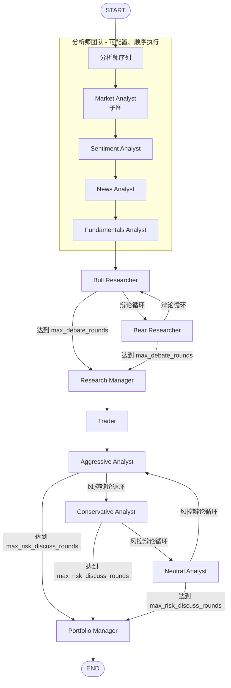

# TradingAgents 项目架构设计

> 版本参考：v0.2.5  
> 最后更新：2026-06-22  
> 用途：供后续开发、扩展与代码审查时快速引用

---

## 1. 项目概述

**TradingAgents** 是一个基于大语言模型（LLM）的多智能体金融交易分析框架，由 [TauricResearch](https://github.com/TauricResearch/TradingAgents) 开源。其核心思想是模拟真实交易公司的组织分工：分析师团队收集信息、研究团队多空辩论、交易员提出方案、风控团队评估风险、投资组合经理做出最终评级决策。

技术栈要点：

| 层次 | 技术 |
|------|------|
| 编排框架 | [LangGraph](https://github.com/langchain-ai/langgraph) `StateGraph` |
| LLM 接入 | LangChain 各厂商 Client + 统一工厂 |
| 数据获取 | yfinance、Alpha Vantage、FRED、Polymarket、StockTwits、Reddit 等 |
| CLI | Typer + Rich |
| 配置 | `default_config.py` + `TRADINGAGENTS_*` 环境变量 |

---

## 2. 总体架构

```
┌─────────────────────────────────────────────────────────────────────────┐
│                           入口层 (Entry)                                 │
│   cli/main.py (tradingagents CLI)  │  main.py / Python API               │
└────────────────────────────┬────────────────────────────────────────────┘
                             │
┌────────────────────────────▼────────────────────────────────────────────┐
│                    编排层 (Orchestration)                                │
│              TradingAgentsGraph  (graph/trading_graph.py)               │
│   ┌──────────┐ ┌──────────┐ ┌────────────┐ ┌──────────┐ ┌────────────┐  │
│   │GraphSetup│ │Propagator│ │Conditional │ │Reflector │ │SignalProc. │  │
│   │ setup.py │ │          │ │Logic       │ │          │ │            │  │
│   └──────────┘ └──────────┘ └────────────┘ └──────────┘ └────────────┘  │
└────────────────────────────┬────────────────────────────────────────────┘
                             │
        ┌────────────────────┼────────────────────┐
        ▼                    ▼                    ▼
┌───────────────┐   ┌───────────────┐   ┌───────────────────┐
│  Agent 层     │   │  LLM 层       │   │  Dataflows 层      │
│  agents/      │   │  llm_clients/ │   │  dataflows/        │
│  多角色智能体  │   │  多厂商统一接入 │   │  多数据源路由       │
└───────────────┘   └───────────────┘   └───────────────────┘
                             │
┌────────────────────────────▼────────────────────────────────────────────┐
│                    持久化层 (Persistence)                                │
│  决策日志 ~/.tradingagents/memory/trading_memory.md                     │
│  运行结果 ~/.tradingagents/logs/<TICKER>/...                            │
│  Checkpoint ~/.tradingagents/cache/checkpoints/<TICKER>.db (可选)       │
└─────────────────────────────────────────────────────────────────────────┘
```

---

## 3. 目录结构

```
TradingAgents/
├── cli/                          # 命令行入口与交互 UI
│   ├── main.py                   # Typer 应用主入口 (tradingagents 命令)
│   ├── utils.py                  # 交互式选择（厂商、模型、分析师等）
│   ├── models.py                 # CLI 数据模型
│   └── stats_handler.py          # LLM/工具调用统计回调
│
├── tradingagents/
│   ├── default_config.py         # 默认配置 + 环境变量覆盖
│   │
│   ├── graph/                    # LangGraph 工作流编排
│   │   ├── trading_graph.py      # 主类 TradingAgentsGraph
│   │   ├── setup.py              # 图节点与边的装配
│   │   ├── propagation.py        # 初始状态构造
│   │   ├── conditional_logic.py  # 工具循环 / 辩论轮次路由
│   │   ├── analyst_execution.py  # 分析师执行计划与耗时追踪
│   │   ├── checkpointer.py       # SQLite checkpoint 恢复
│   │   ├── reflection.py         # 事后反思（决策日志 Phase B）
│   │   └── signal_processing.py  # 从 PM 决策提取 5 档评级
│   │
│   ├── agents/                   # 各角色 Agent 实现
│   │   ├── analysts/             # 分析师团队
│   │   ├── researchers/          # 多空研究员
│   │   ├── managers/             # Research Manager / Portfolio Manager
│   │   ├── trader/               # 交易员
│   │   ├── risk_mgmt/            # 风控辩论三方
│   │   ├── utils/                # 工具封装、状态、记忆、结构化输出
│   │   └── schemas.py            # Pydantic 结构化输出 Schema
│   │
│   ├── dataflows/                # 数据获取与厂商路由
│   │   ├── interface.py          # 统一路由入口 route_to_vendor()
│   │   ├── y_finance.py          # Yahoo Finance OHLCV / 基本面
│   │   ├── alpha_vantage*.py     # Alpha Vantage 各数据类型
│   │   ├── yfinance_news.py      # 新闻
│   │   ├── fred.py                 # 宏观数据
│   │   ├── polymarket.py           # 预测市场
│   │   ├── stocktwits.py / reddit.py
│   │   └── symbol_utils.py       # 代码规范化
│   │
│   └── llm_clients/              # LLM 厂商抽象
│       ├── factory.py            # create_llm_client()
│       ├── openai_client.py      # OpenAI + OpenAI-compatible 全家桶
│       ├── anthropic_client.py
│       ├── google_client.py
│       ├── azure_client.py
│       ├── bedrock_client.py
│       ├── model_catalog.py      # 模型目录
│       └── capabilities.py       # 结构化输出能力表
│
├── tests/                        # pytest 测试套件
├── main.py                       # 示例脚本入口
└── pyproject.toml                # 包定义 (v0.2.5)
```

---

## 4. 核心工作流（LangGraph）

### 4.1 主类：`TradingAgentsGraph`

文件：`tradingagents/graph/trading_graph.py`

职责：

1. 加载配置，创建 **deep** / **quick** 两套 LLM 客户端
2. 装配 `ToolNode`（按分析师类型分组的数据工具）
3. 通过 `GraphSetup` 构建并编译 `StateGraph`
4. `propagate(ticker, trade_date)` 执行完整分析流水线
5. 将最终状态写入 JSON 日志与决策记忆日志
6. 通过 `SignalProcessor` 从 PM 输出提取 `Buy/Overweight/Hold/Underweight/Sell`

关键初始化参数：

- `selected_analysts`：默认 `("market", "social", "news", "fundamentals")`
- `deep_think_llm`：用于 Research Manager、Portfolio Manager 等复杂推理
- `quick_think_llm`：用于分析师、研究员、交易员等

### 4.2 设计意图：完整流水线

框架设计的完整决策链路如下（与 README 及 CLI `MessageBuffer.FIXED_AGENTS` 一致）：



路由逻辑见 `conditional_logic.py`：

- **分析师**：若 LLM 返回 `tool_calls` → 进入 `tools_<analyst>` → 回到分析师；否则 → `Msg Clear` → 下一位分析师
- **多空辩论**：Bull ↔ Bear 交替，计数达到 `2 * max_debate_rounds` 后进入 Research Manager
- **风控辩论**：Aggressive → Conservative → Neutral 轮转，达到 `3 * max_risk_discuss_rounds` 后进入 Portfolio Manager

### 4.3 当前图装配状态（重要）

`graph/setup.py` 中，**研究员 / 交易员 / 风控 / PM 的边目前被注释掉**，最后一个分析师的 `Msg Clear` 节点直接连到 `END`。下游节点虽已 `add_node`，但**当前运行时不可达**。

恢复完整流水线需取消注释 `setup.py` 中约 203–250 行的边定义，并将最后一个分析师的 `Msg Clear` 改为连接 `Bull Researcher`。

### 4.4 分析师执行模式

| 分析师 key | 图节点名 | 报告字段 | 工具循环 |
|------------|----------|----------|----------|
| `market` | Market Analyst | `market_report` | **子图自包含**（无父图 ToolNode） |
| `social` | Sentiment Analyst | `sentiment_report` | ReAct + `tools_social` |
| `news` | News Analyst | `news_report` | ReAct + `tools_news` |
| `fundamentals` | Fundamentals Analyst | `fundamentals_report` | ReAct + `tools_fundamentals` |

> `social` 为历史兼容 key，对应 Sentiment Analyst（v0.2.5 更名）。

每个分析师完成后经 `create_msg_delete()` 清空 `messages`，避免上下文膨胀。

---

## 5. Agent 层设计

### 5.1 共享状态：`AgentState`

文件：`agents/utils/agent_states.py`

继承 LangGraph `MessagesState`，除消息外还维护：

| 字段 | 说明 |
|------|------|
| `company_of_interest` / `trade_date` / `asset_type` | 分析标的与日期 |
| `instrument_context` | 启动时确定性解析的标的身份（防幻觉） |
| `past_context` | 历史决策记忆注入 |
| `market_report` / `sentiment_report` / `news_report` / `fundamentals_report` | 四位分析师输出 |
| `price_action_report` / `momentum_report` / `order_flow_report` | Market 子图细分报告 |
| `investment_debate_state` | 多空辩论状态 (`InvestDebateState`) |
| `investment_plan` | Research Manager 输出 |
| `trader_investment_plan` | Trader 输出 |
| `risk_debate_state` | 风控辩论状态 (`RiskDebateState`) |
| `final_trade_decision` | Portfolio Manager 最终决策 |

### 5.2 Market Analyst 子图

文件：`agents/analysts/market_analyst.py`

Market Analyst 是唯一使用**嵌套子图**的分析师：

```
START ─┬─► Price Action Agent  (ReAct: get_stock_data, get_briefing_stock_info)
       ├─► Momentum Agent      (ReAct: get_stock_data, get_indicators)
       └─► Order Flow Agent     (ReAct: get_stock_data, get_indicators, get_briefing_stock_info)
                │
                ▼
         Market Synthesizer (deep LLM，无工具，综合三份报告)
                │
                ▼
              END
```

三个 Specialist 并行启动，Synthesizer 等待全部完成后生成 `market_report`。

### 5.3 其他分析师

| 模块 | 角色 | 主要工具 |
|------|------|----------|
| `sentiment_analyst.py` | 情绪分析 | `get_news`（含 StockTwits、Reddit） |
| `news_analyst.py` | 新闻与宏观 | `get_news`, `get_global_news`, `get_insider_transactions`, `get_macro_indicators`, `get_prediction_markets` |
| `fundamentals_analyst.py` | 基本面 | `get_fundamentals`, `get_balance_sheet`, `get_cashflow`, `get_income_statement` |

### 5.4 研究与决策 Agent

| 模块 | 角色 | LLM | 结构化输出 |
|------|------|-----|------------|
| `bull_researcher.py` / `bear_researcher.py` | 多空辩论 | quick | 否 |
| `research_manager.py` | 综合研究计划 | deep | `ResearchPlan` |
| `trader.py` | 交易提案 | quick | `TraderProposal` (Buy/Hold/Sell) |
| `aggressive_debator.py` / `conservative_debator.py` / `neutral_debator.py` | 风控三角辩论 | quick | 否 |
| `portfolio_manager.py` | 最终评级 | deep | `PortfolioDecision` (5 档) |

结构化输出通过 `agents/utils/structured.py` 的 `bind_structured` + `invoke_structured_or_freetext` 实现，不支持时降级为自由文本。Schema 定义在 `agents/schemas.py`，渲染为 Markdown 供下游消费。

### 5.5 Agent 工具层

Agent 不直接调用 dataflows，而是通过 `agents/utils/*_tools.py` 中的 LangChain `@tool` 封装，最终路由到 `dataflows/interface.py`。

公共导出集中在 `agents/utils/agent_utils.py`。

---

## 6. 数据层（Dataflows）

### 6.1 厂商路由

核心文件：`dataflows/interface.py`

```
Agent Tool  →  route_to_vendor(method)  →  具体厂商实现
```

配置优先级：`tool_vendors[method]` > `data_vendors[category]`

默认 `data_vendors`（见 `default_config.py`）：

| 类别 | 默认厂商 |
|------|----------|
| core_stock_apis | yfinance |
| technical_indicators | yfinance |
| fundamental_data | yfinance |
| news_data | yfinance |
| macro_data | fred |
| prediction_markets | polymarket |

支持逗号分隔的显式回退链，如 `"yfinance,alpha_vantage"`；**不会**静默切换到未配置的厂商。

### 6.2 主要数据源

| 厂商 | 用途 |
|------|------|
| yfinance | OHLCV、技术指标、基本面、新闻 |
| Alpha Vantage | 同上（备选） |
| FRED | 宏观指标（需 `FRED_API_KEY`） |
| Polymarket | 预测市场概率 |
| StockTwits / Reddit | 情绪数据（经 news 路径） |

### 6.3 标的身份与校验

- `resolve_instrument_identity()`：启动时用 yfinance 确定性解析公司身份
- `get_verified_market_snapshot()`：Market Analyst 用于校验价格声明
- `symbol_utils.normalize_symbol()`：统一 ticker 格式（如 `XAUUSD` → `GC=F`）

---

## 7. LLM 层

### 7.1 工厂模式

```python
from tradingagents.llm_clients import create_llm_client

client = create_llm_client(
    provider="openai",          # 或 google, anthropic, azure, bedrock, ollama, ...
    model="gpt-5.5",
    base_url=None,              # 可由 TRADINGAGENTS_LLM_BACKEND_URL 覆盖
    temperature=0.2,
)
llm = client.get_llm()
```

### 7.2 支持的 Provider

| Provider | 客户端 | 说明 |
|----------|--------|------|
| `openai` | OpenAIClient | 原生 OpenAI |
| `google` | GoogleClient | Gemini |
| `anthropic` | AnthropicClient | Claude |
| `azure` | AzureOpenAIClient | 企业 Azure |
| `bedrock` | BedrockClient | AWS（需 `[bedrock]` extra） |
| `openai_compatible` 等 | OpenAIClient | Ollama、vLLM、DeepSeek、Qwen、GLM、MiniMax、OpenRouter、Groq、xAI 等 |

API Key 通过 `llm_clients/api_key_env.py` 按 provider 自动检测环境变量。

### 7.3 双模型策略

- **deep_think_llm**：复杂综合与最终决策（Research Manager、Portfolio Manager、可选 Market Synthesizer）
- **quick_think_llm**：数据密集型、循环调用多的节点（分析师、辩论、Trader）

### 7.4 结构化输出能力

`capabilities.py` 维护 per-model 能力表（`json_schema` / `function_calling` / `response_schema` / `none`），`NormalizedChatOpenAI.with_structured_output()` 按能力选择方法。

---

## 8. 状态与持久化

### 8.1 决策记忆日志（始终开启）

路径：`~/.tradingagents/memory/trading_memory.md`（可用 `TRADINGAGENTS_MEMORY_LOG_PATH` 覆盖）

两阶段：

1. **Phase A**：每次 `propagate()` 结束时追加 `pending` 决策
2. **Phase B**：下次同 ticker 运行时，拉取已实现收益（raw + alpha vs 区域基准），LLM 生成反思，批量更新日志

`get_past_context()` 将历史决策 + 跨标的教训注入 Portfolio Manager prompt。

### 8.2 运行结果日志

路径：`~/.tradingagents/logs/<TICKER>/TradingAgentsStrategy_logs/full_states_log_<DATE>.json`

包含全部报告、辩论历史、最终决策。

### 8.3 Checkpoint 恢复（可选）

- 配置：`checkpoint_enabled=True` 或 CLI `--checkpoint`
- 存储：`~/.tradingagents/cache/checkpoints/<TICKER>.db`（SQLite + LangGraph SqliteSaver）
- 成功完成后自动清除；崩溃后可从最后成功节点恢复

> 注意：`TradingAgentsGraph.__init__` 当前将 `checkpoint_enabled` 强制设为 `False`（避免复杂消息对象序列化问题）。启用 checkpoint 需在理解该限制后调整。

### 8.4 Alpha 基准

`benchmark_map` 按交易所后缀自动选择区域指数（如 `.T` → `^N225`），美国默认 `SPY`。可用 `benchmark_ticker` 全局覆盖。

---

## 9. CLI 入口

命令：`tradingagents`（`cli/main.py:app`）

主要流程：

1. 拉取公告、选择 ticker / 日期 / LLM provider / 模型
2. 选择分析师组合与研究深度（辩论轮次）
3. 构建 `TradingAgentsGraph`，`stream` 模式实时更新 Rich UI
4. 展示各阶段报告与最终交易决策

辅助模块：

- `cli/utils.py`：交互式问答（模型、语言、API Key 检测）
- `cli/stats_handler.py`：Token / 工具调用统计
- `AnalystWallTimeTracker`：各分析师耗时

---

## 10. 配置系统

主配置：`tradingagents/default_config.py`

支持 `TRADINGAGENTS_*` 环境变量覆盖（见 `_ENV_OVERRIDES`）：

| 环境变量 | 配置键 |
|----------|--------|
| `TRADINGAGENTS_LLM_PROVIDER` | `llm_provider` |
| `TRADINGAGENTS_DEEP_THINK_LLM` | `deep_think_llm` |
| `TRADINGAGENTS_QUICK_THINK_LLM` | `quick_think_llm` |
| `TRADINGAGENTS_LLM_BACKEND_URL` | `backend_url` |
| `TRADINGAGENTS_OUTPUT_LANGUAGE` | `output_language` |
| `TRADINGAGENTS_MAX_DEBATE_ROUNDS` | `max_debate_rounds` |
| `TRADINGAGENTS_MAX_RISK_ROUNDS` | `max_risk_discuss_rounds` |
| `TRADINGAGENTS_CHECKPOINT_ENABLED` | `checkpoint_enabled` |
| `TRADINGAGENTS_TEMPERATURE` | `temperature` |
| `TRADINGAGENTS_CACHE_DIR` | `data_cache_dir` |
| `TRADINGAGENTS_RESULTS_DIR` | `results_dir` |

---

## 11. 典型调用方式

### Python API

```python
from tradingagents.graph.trading_graph import TradingAgentsGraph
from tradingagents.default_config import DEFAULT_CONFIG

config = DEFAULT_CONFIG.copy()
config["llm_provider"] = "openai"
config["max_debate_rounds"] = 2

ta = TradingAgentsGraph(debug=True, config=config)
final_state, rating = ta.propagate("NVDA", "2026-01-15")
print(rating)  # Buy / Overweight / Hold / Underweight / Sell
```

### 扩展新 Agent 的推荐路径

1. 在 `agents/` 下实现 `create_xxx(llm)` 节点函数
2. 如需工具，在 `agent_utils` 或 `*_tools.py` 添加 `@tool`，并在 `interface.py` 注册路由
3. 在 `setup.py` 中 `add_node` + `add_edge` / `add_conditional_edges`
4. 在 `AgentState` 中增加报告字段（若需要）
5. 更新 `analyst_execution.py` 的 `ANALYST_NODE_SPECS`（若为分析师）

### 扩展 Market 子图 Specialist

在 `market_analyst.py` 顶部修改 `PRICE_ACTION_TOOLS` / `MOMENTUM_TOOLS` / `ORDER_FLOW_TOOLS`，子图自动拾取新工具。

---

## 12. 设计原则摘要

1. **角色分离**：每个 Agent 单一职责，通过共享 `AgentState` 传递报告
2. **工具与推理分离**：数据获取封装为 Tool，LLM 负责选择与解读
3. **厂商无关**：LLM 与数据源均通过工厂/路由抽象，配置驱动
4. **确定性锚点**：标的身份、市场快照在运行开始时解析，减少跨 run 幻觉
5. **结构化 + 降级**：关键决策 Agent 使用 Pydantic Schema，不支持时回退自由文本
6. **可观测性**：CLI 流式输出、JSON 全状态日志、决策记忆与事后反思
7. **研究导向**：非确定性、非投资建议；README 明确声明仅供研究

---

## 13. 可选功能：Equity R&D-Agent

除默认交易分析流水线外，项目提供独立的 **Equity R&D-Agent** 工作流（由原 Hybrid Equity Research 演进而来）：

```text
Research Phase  →  thesis graph 探索、证据链、Quick Diligence
Development Phase →  建模、估值、章节草稿
Evaluation Phase  →  聚合评分、IC 审查、Final QA
```

核心范式：**先围绕投资问题 / thesis branch 研究，再写章节**；不让 agent 一次性生成报告。

- 入口类：`tradingagents.equity_research.EquityResearchGraph`
- 文档：[EQUITY_RESEARCH.md](EQUITY_RESEARCH.md)
- 与 `TradingAgentsGraph` 并行，共享 LLM 工厂、dataflows、配置系统
- 外层 LangGraph **15 个 phase nodes**；内层 `research_loop` 封装 9 步 R&D 迭代
- 核心目录：`agents/research_loop.py`、`agents/domain/`、`state/research_graph.py`、`state/ledgers.py`、`skills/`、`evaluation/`、`memory/`、`prompts/rd_agent.py`

### 外层 Graph（phase nodes）

```text
initialize_state → analyze_research_task → dynamic_planning → research_loop
  ↺ continue → dynamic_planning
  → modeling_workflow → valuation_workflow → branch_merge
  → risk_mapping → investment_committee_review
  → write_investment_focus → … → assemble_report → final_qa → export_report
```

IC / Final QA / 建模门控均可通过 `issue_ledger` 打回研究或建模阶段。

### 内层 Research Loop（单轮 9 步）

```text
Dynamic Planning → Select Parents → Memory Context → Problem ID
→ Scientific Hypotheses → Virtual IC → Quick Diligence → Full Development
→ Evaluate → Update Research Graph
```

### 记忆与 Ledger

| Ledger | 用途 |
|--------|------|
| Evidence / Claim / Assumption | 证据链与观点、预测假设 |
| Consensus / Broker View | 市场共识与券商观点 |
| Forecast / Valuation | 预测与估值版本历史 |
| Issue | Gate 打回与 blocking issues |
| Research Graph | Thesis 分支探索 DAG（`state/research_graph.py`） |

### 领域 Agent（逻辑角色，非全局 node）

`LeadAnalystAgent` 调度 `agents/domain/` 下 9 个薄封装 Agent（Evidence、Consensus、Business、Industry、Forecast、Valuation、Risk、IC、Writing），各自绑定 Skills + Tools。

### 外部集成

| 集成 | 用途 |
|------|------|
| Perplexity | 探索性检索、共识发现 |
| EDGAR | 年报/季报 ingest |
| FMP | Earnings call 转录（**不用于 quote**） |
| Redis | 检索预算与 rate limit |
| PostgreSQL + pgvector | 证据存储（可 in-memory 降级） |

---

## 14. 相关文件索引

| 关注点 | 文件 |
|--------|------|
| 图编排入口 | `tradingagents/graph/trading_graph.py` |
| 节点与边 | `tradingagents/graph/setup.py` |
| 状态定义 | `tradingagents/agents/utils/agent_states.py` |
| 数据路由 | `tradingagents/dataflows/interface.py` |
| LLM 工厂 | `tradingagents/llm_clients/factory.py` |
| 配置 | `tradingagents/default_config.py` |
| 结构化 Schema | `tradingagents/agents/schemas.py` |
| CLI | `cli/main.py` |
| 测试 | `tests/` |
| Deep Equity Research | `tradingagents/equity_research/` |
| Equity R&D Graph 装配 | `tradingagents/equity_research/graph/setup.py` |
| Research Loop 运行时 | `tradingagents/equity_research/agents/research_loop.py` |
| Research Graph 模型 | `tradingagents/equity_research/state/research_graph.py` |
| 聚合评估 | `tradingagents/equity_research/evaluation/aggregators.py` |
| Prompt Pack | `tradingagents/equity_research/prompts/rd_agent.py` |
| Equity Research 文档 | `docs/EQUITY_RESEARCH.md` |
