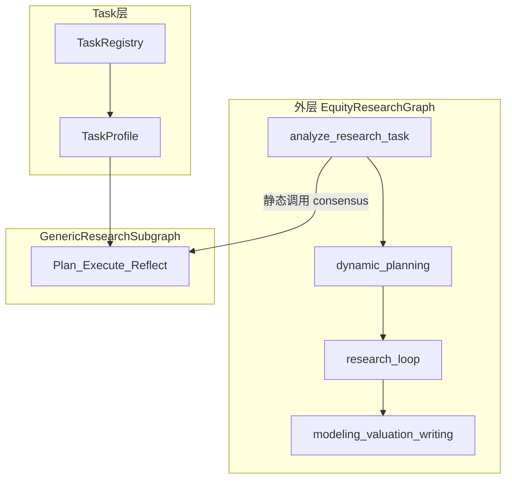
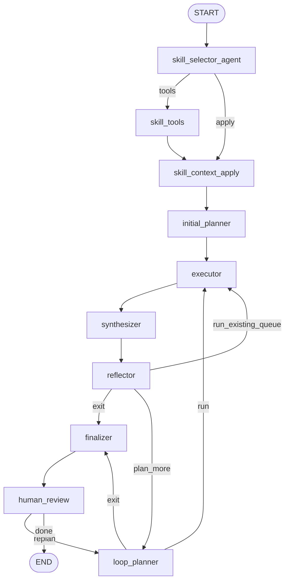
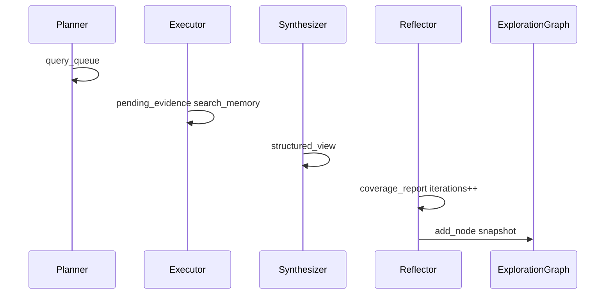
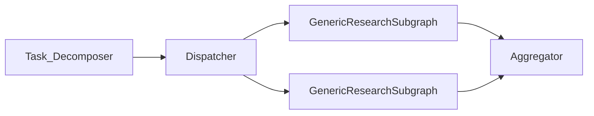
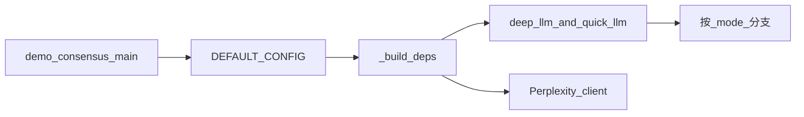
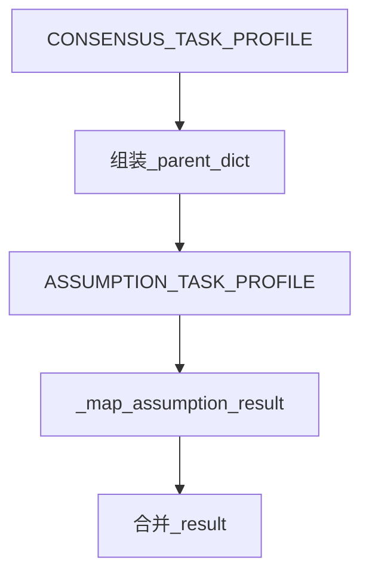
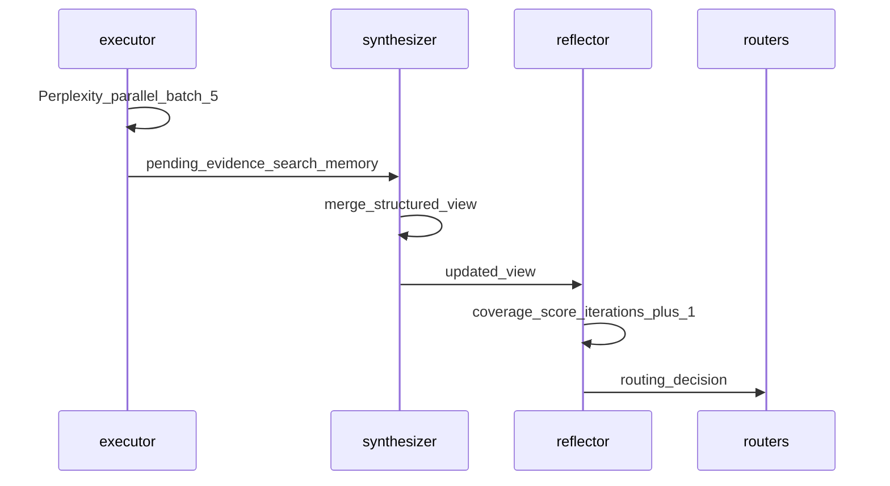

# Agent Loop 与 Task 分配

> 模块路径：`tradingagents/equity_research/runtime/`、`tradingagents/equity_research/tasks/`  
> 相关文档：[产品概览](../EQUITY_RESEARCH.md) · [文件结构](file-structure.md) · [Skills & Tools](skills-and-tools.md)

本文说明 refactor 后的 **GenericResearchSubgraph**（单任务 Plan-Execute-Reflect 循环）、**TaskProfile / TaskRegistry** 机制，以及当前与规划中的 **Task 分配**方式。阅读前建议先了解 [文件结构](file-structure.md) 中的 `runtime/` 与 `tasks/` 目录。

---

## 1. 三层 Agent 架构总览

`equity_research` 中存在三条不同层级的「循环」，不要混用：

| 层级 | 实现 | 状态图 | 目标 |
|------|------|--------|------|
| **外层流水线** | [`graph/setup.py`](../../tradingagents/equity_research/graph/setup.py) | `EquityResearchState` | 完整股票研究：共识 → 论点探索 → 建模 → 估值 → 撰写 |
| **单任务子图** | [`runtime/subgraph.py`](../../tradingagents/equity_research/runtime/subgraph.py) | `AgentState` | 按 `TaskProfile` 完成一类研究（如 consensus） |
| **论点 R&D 循环** | [`agents/research_loop.py`](../../tradingagents/equity_research/agents/research_loop.py) | `research_graph` | 假设驱动、多分支论点探索与评分 |



**关键结论：**

- `GenericResearchSubgraph` 的拓扑**固定**；差异由 `TaskProfile` 注入（维度、schema、prompt、阈值）。
- 当前仅 **consensus** 通过 [`agents/task_analysis.py`](../../tradingagents/equity_research/agents/task_analysis.py) 静态接入外层；`TaskRegistry` 已就绪但外层尚无 LLM 分解器。
- `research_loop` 与 consensus 子图**并行存在**：前者探索投资论点 DAG，后者构建市场共识结构化视图。

---

## 2. GenericResearchSubgraph：Agent Loop 详解

实现类：[`GenericResearchSubgraph`](../../tradingagents/equity_research/runtime/subgraph.py)。  
每个实例绑定一个 [`TaskProfile`](../../tradingagents/equity_research/runtime/task_profile.py)。

### 2.1 拓扑（固定 DAG）



文本等价（与代码一致）：

```text
START → skill_selector_agent → skill_tools / skill_context_apply
     → initial_planner → executor → synthesizer → reflector
     → exit | run_existing_queue | plan_more
     → [loop_planner → executor]*
     → finalizer → [human_review] → END
```

可选开关（`TaskProfile`）：

- `enable_human_review=False`：`finalizer` 直连 `END`。

**Assumption 已拆为独立 TaskProfile**：`analyze_research_task` 串行调用 `GenericResearchSubgraph(CONSENSUS_TASK_PROFILE)` 后再调用 `GenericResearchSubgraph(ASSUMPTION_TASK_PROFILE)`，两图共用上述 PER 拓扑，差异仅在 profile 参数化（prompt / schema / dimensions）。详见 [`agents/task_analysis.py`](../../tradingagents/equity_research/agents/task_analysis.py)。

### 2.2 节点职责

| 节点 | 源文件 | 读/写要点 | TaskProfile 依赖 |
|------|--------|-----------|------------------|
| `skill_selector_agent` | [`runtime/nodes/skill_selector.py`](../../tradingagents/equity_research/runtime/nodes/skill_selector.py) | LLM + `load_research_skills` → `active_skill_context` | `agent_visibility_id`, `skill_objective`, `build_skill_prompt` |
| `skill_tools` | 同上 | ToolNode 执行 skill 加载 | `max_skills` |
| `skill_context_apply` | 同上 | 解析 tool 结果，清空 `messages` | — |
| `initial_planner` | [`runtime/nodes/planner.py`](../../tradingagents/equity_research/runtime/nodes/planner.py) | `mode=initial`，写满 `query_queue` | `build_initial_planner_prompt`, `max_initial_queries`, `default_queries_fn` |
| `loop_planner` | 同上 | `mode=loop`，追加 ≤2 条 gap query | `build_loop_planner_prompt`, `max_loop_queries` |
| `executor` | [`runtime/nodes/executor.py`](../../tradingagents/equity_research/runtime/nodes/executor.py) | 批量 Perplexity，`batch_size=5` | 通用；写 `search_memory`, `pending_evidence` |
| `synthesizer` | [`runtime/nodes/synthesizer.py`](../../tradingagents/equity_research/runtime/nodes/synthesizer.py) | evidence → `structured_view` | `merge_view_fn`, `build_synthesizer_prompt`, schemas |
| `reflector` | [`runtime/nodes/reflector.py`](../../tradingagents/equity_research/runtime/nodes/reflector.py) | coverage 评估 + ExplorationGraph 追加节点 | `coverage_threshold`, `build_reflector_prompt` |
| `finalizer` | [`runtime/nodes/finalizer.py`](../../tradingagents/equity_research/runtime/nodes/finalizer.py) | `final_report` markdown | `build_finalizer_prompt`, `report_max_chars` |
| `human_review` | [`runtime/nodes/human_review.py`](../../tradingagents/equity_research/runtime/nodes/human_review.py) | `human_review_payload`；followup 触发 replan | `enable_human_review` |

### 2.3 一次 Plan-Execute-Reflect 迭代



1. **Plan**：`initial_planner` 或 `loop_planner` 向 `query_queue` 写入 `QueryItem`（含 `target_dimension`）。
2. **Execute**：`executor` 按 priority 取最多 5 条，**并行**调用 Perplexity（`batch_search_concurrency`），追加 `search_memory` 与 `pending_evidence`。
3. **Reflect**：`synthesizer` 将 `pending_evidence` 合并进 `structured_view`；`reflector` LLM 评分各维度，写 `coverage_report.routing_decision`。

### 2.4 路由表

摘自 [`runtime/routers.py`](../../tradingagents/equity_research/runtime/routers.py)：

| Router | 条件 | 下一跳 |
|--------|------|--------|
| `skill_selector_router` | 末条 message 含 tool_calls | `skill_tools` |
| | 否则 | `skill_context_apply` |
| `coverage_reflector_router` | `routing_decision == exit` | `finalizer` |
| | `query_queue` 非空 | `executor` |
| | 否则 | `loop_planner` |
| `loop_planner_router` | `query_queue` 非空 | `executor` |
| | 否则 | exit 路径 |
| `human_review_router` | `_pending_human_followup` | `loop_planner` |
| | 否则 | `END` |

### 2.5 Reflector 退出条件

[`reflector`](../../tradingagents/equity_research/runtime/nodes/reflector.py) 在以下任一成立时设 `routing_decision = exit`：

- `overall_score >= task_profile.coverage_threshold`（默认 0.75）且 `critical_gaps` 为空；
- `iterations >= max_iterations`（来自 state 或 TaskProfile）。

否则为 `continue`，由 router 决定消化现有队列或 `loop_planner` 补搜。


---

## 3. AgentState 与 ExplorationGraph

### 3.1 AgentState 字段分组

定义于 [`runtime/state.py`](../../tradingagents/equity_research/runtime/state.py)：

| 分组 | 字段 | 说明 |
|------|------|------|
| 任务描述 | `task_profile`, `research_objective`, `ticker`, `sector`, `parent_context` | `parent_context` 预留跨任务注入 |
| 探索图 | `exploration_graph`, `current_node_id` | `ExplorationGraph` 序列化 dict |
| PER 流转 | `query_queue`, `pending_evidence`, `search_memory`, `structured_view`, `coverage_report` | 单轮队列与累积视图 |
| 跨任务上下文 | `parent_context` | assumption 子图读取 `consensus_view` / `consensus_report` |
| 产物 | `final_report`, `human_review_payload` | 最终报告与人工评审 |
| 系统 | `iterations`, `max_iterations`, `messages`, `active_skill_context`, `api_calls`, `research_traces` | 迭代计数与 trace |

### 3.2 与父 state 的映射

[`agents/consensus/subgraph.py`](../../tradingagents/equity_research/agents/consensus/subgraph.py) 与 [`agents/assumption/subgraph.py`](../../tradingagents/equity_research/agents/assumption/subgraph.py) 通过 [`runtime/subgraph_runner.py`](../../tradingagents/equity_research/runtime/subgraph_runner.py) 桥接：

**Consensus 子图 → 父 state**

| AgentState | EquityResearchState |
|------------|---------------------|
| `structured_view` | `consensus_view` |
| `final_report` | `consensus_report` |
| `search_memory` | `consensus_search_memory` |
| `evidence_buffer` | `consensus_evidence_buffer` |
| `iterations` | `consensus_iterations` |

**父 state → Assumption 子图 seed**

| EquityResearchState | AgentState |
|---------------------|------------|
| `consensus_view` | `parent_context["consensus_view"]` |
| `consensus_report` | `parent_context["consensus_report"]` |
| `consensus_search_memory` | `search_memory`（继承，避免重复搜索） |
| `consensus_evidence_buffer` | `evidence_buffer` |
| — | `structured_view` 初始为空的 `AssumptionView` |

**Assumption 子图 → 父 state**

| AgentState | EquityResearchState |
|------------|---------------------|
| `structured_view.current_assumptions` | `consensus_assumptions` |
| `structured_view.research_suggestions` | `research_suggestions` |
| `structured_view.research_directions` | `research_directions` |
| `structured_view`（完整） | `assumption_view` |
| `final_report` | `assumption_report` |
| `search_memory` | `assumption_search_memory` |

`exploration_graph` 目前保留在子图 `AgentState` 内（`--json` 导出可见），尚未映射到父 state 专用字段。

### 3.3 ExplorationGraph

[`runtime/exploration_graph.py`](../../tradingagents/equity_research/runtime/exploration_graph.py) 记录每轮 reflector 的 snapshot（chain 模式）：

- `add_node(snapshot)`：每轮追加节点，含 `coverage_score`、`dimensions`、`critical_gaps`；
- `best_node()`：coverage 最高的节点；
- `to_chain()`：按时间顺序的节点列表。

真实样例：[`out/nvda.json`](../../out/nvda.json)（1 轮、coverage 0.94）。可视化：

```bash
uv run python scripts/visualize_consensus_trace.py out/nvda.json -o out/nvda_trace.html
```

---

## 4. TaskProfile 与 TaskRegistry

### 4.1 TaskProfile

[`runtime/task_profile.py`](../../tradingagents/equity_research/runtime/task_profile.py) 是子图行为的**唯一业务配置入口**：

| 类别 | 字段示例 |
|------|----------|
| 身份 | `task_id`, `objective`, `dimensions` |
| Schema | `output_schema`, `view_update_schema`, `coverage_eval_schema`, `assumption_schema` |
| Prompt | `build_*_prompt` 系列 callable |
| 查询 | `default_queries_fn`, `normalize_queries_fn`, `max_initial_queries`, `max_loop_queries` |
| 合并 | `merge_view_fn`, `format_view_fn`, `empty_view_fn` |
| 开关 | `enable_human_review`, `coverage_threshold`, `max_iterations` |
| Skill | `agent_visibility_id`, `skill_objective`, `max_skills` |

### 4.2 当前注册任务

[`tasks/registry.py`](../../tradingagents/equity_research/tasks/registry.py) 注册两个任务：

| task_id | Profile | 用途 |
|---------|---------|------|
| `consensus` | `CONSENSUS_TASK_PROFILE` | 构建市场共识五维结构化视图 |
| `assumption` | `ASSUMPTION_TASK_PROFILE` | 探测共识背后假设，产出 research directions |

```python
from tradingagents.equity_research.tasks.registry import get_task_registry
consensus = get_task_registry().get("consensus")
assumption = get_task_registry().get("assumption")
```

[`tasks/consensus/profile.py`](../../tradingagents/equity_research/tasks/consensus/profile.py) 要点：

- 五维：`quantitative_estimates`, `kpi_focus`, `pricing_assumptions`, `narrative_framework`, `recent_delta`；
- `enable_human_review=True`（可配置关闭）；
- `coverage_threshold=0.75`，`max_iterations=5`（可由父 state `max_consensus_iterations` 覆盖）。

[`tasks/assumption/profile.py`](../../tradingagents/equity_research/tasks/assumption/profile.py) 要点：

- 十一维 assumption 主题（`business_model`, `debates`, `stress_test` 等）；
- 输出 `AssumptionView`（含 `current_assumptions`, `research_suggestions`, `research_directions`）；
- `enable_human_review=False`，`max_iterations=3`。

### 4.3 新增 Task 扩展指南

1. 在 `tasks/<name>/` 添加 `profile.py`、`prompts.py`、`queries.py`（及可选 `merge.py`）；
2. 在 [`tasks/registry.py`](../../tradingagents/equity_research/tasks/registry.py) 注册 `TaskProfile`；
3. （可选）在 `skills/agent_visibility.py` 增加 `{task_id}_subgraph` 可见性；
4. 外层通过 `GenericResearchSubgraph(deps, PROFILE).compile()` 调用，或未来由 Orchestrator 调度。

---

## 5. Task 分配：现状 vs 规划

### 5.1 现状（已实现）— 静态双任务链

[`agents/task_analysis.py`](../../tradingagents/equity_research/agents/task_analysis.py) 在 `analyze_research_task` 节点内串行调用：

```python
prefetch_sec_filings(deps, ticker)
ingest_documents_from_sec_cache(deps, state)
create_run_consensus_subgraph(deps)(state)
create_run_assumption_subgraph(deps)(state)
```

特征：

- SEC 文件预取到 `{data_cache_dir}/equity_research/sec/{ticker}/`；
- 两个 `GenericResearchSubgraph` 实例共用同一 PER 拓扑，仅 TaskProfile 不同；
- `runtime/subgraph_runner.py` 统一 `seed_state` / `map_result` 桥接；
- `TaskRegistry.format_catalog()` 已存在，外层尚未用 LLM 动态选任务。

### 5.2 规划（未实现，Phase 3）

摘自 `feedback2.md` 的 Orchestrator 愿景：



| 组件 | 职责 |
|------|------|
| Task Decomposer | LLM 读 `TaskRegistry.format_catalog()`，分解子任务 |
| Dispatcher | 并行/串行启动多个 `GenericResearchSubgraph` |
| Aggregator | 合并 `structured_view` / `final_report` 回父 state |

**边界说明**：Phase 3 Orchestrator 代码尚未实现；当前以静态 consensus → assumption 双链为准。

---

## 6. 与外层流水线的衔接

### 6.1 consensus 产出下游

```text
analyze_research_task (SEC cache → ingest)
  → GenericResearchSubgraph(CONSENSUS_TASK_PROFILE)
  → GenericResearchSubgraph(ASSUMPTION_TASK_PROFILE)
  → gap_finder (consensus_agents)
  → expectation_gaps
  → dynamic_planning → research_loop → modeling / valuation / writing
```

共识结构化视图进入 `expectation_gaps`；assumption 子图产出 `consensus_assumptions`、`research_suggestions`、`research_directions`。

### 6.2 与 research_loop 对比

| | GenericResearchSubgraph | research_loop |
|--|-------------------------|---------------|
| 状态 | `AgentState` | `EquityResearchState` + `research_graph` |
| 目标 | 单 TaskProfile 维度覆盖 | 多分支投资论点探索 |
| 停止 | coverage / max_iterations | 预算、评分、分支合并策略 |
| 图结构 | 固定 PER DAG | 9 步内层运行时 + 论点 DAG |

二者**不是**同一循环：consensus 在 `analyze_research_task` 早期运行；`research_loop` 在 dynamic planning 之后。

### 6.3 手动测试入口

| 入口 | 用途 |
|------|------|
| [`demo_consensus.py`](../../demo_consensus.py) | CLI：`--mode demo-graph\|subgraph`，`--json`，`-o` |
| [`runtime/demo_graph.py`](../../tradingagents/equity_research/runtime/demo_graph.py) | `ConsensusDemoGraph` 最小 LangGraph |
| [`scripts/visualize_consensus_trace.py`](../../scripts/visualize_consensus_trace.py) | trace JSON → HTML / MD / mermaid |

```bash
uv run python demo_consensus.py NVDA --sector Technology --max-iterations 3
uv run python demo_consensus.py NVDA --mode subgraph --json -o ./out/nvda.json
uv run python scripts/visualize_consensus_trace.py ./out/nvda.json -o ./out/nvda_trace.html
```

端到端业务说明（每一步干什么、得到什么、下一步是什么）见 [§8 demo_consensus 业务流详解](#8-demo_consensus-业务流详解)。

---

## 7. 观测与调试

### 7.1 research_traces

各节点通过 `deps.trace(node_name, payload)` 写入 `research_traces`。典型节点名：

`skill_selector_agent`, `initial_planner`, `executor`, `synthesizer`, `reflector`, `loop_planner`, `assumption_*`, `finalizer`, `human_review`

### 7.2 关键配置项

| 配置 / 字段 | 默认 | 作用 |
|-------------|------|------|
| `coverage_threshold` | 0.75 | reflector 达标退出 |
| `max_iterations` | 5（`CONSENSUS_TASK_PROFILE` 默认；demo 常传 3） | 强制退出上限 |
| `consensus_human_review` | config 开关 | 是否进入 `human_review` |
| `report_max_chars` | 6000 | finalizer 报告长度 |

### 7.3 调试建议

1. 用 `--json -o` 导出完整 state，检查 `structured_view`、`coverage_report`、`exploration_graph`；
2. 用 `visualize_consensus_trace.py` 查看 PER 流程与维度得分；
3. 调高 `max_iterations` 观察 `loop_planner` 补搜行为；
4. 对比 `research_traces` 中 `executor` 的 query 与 `search_memory` 条目是否一一对应。

---

## 8. demo_consensus 业务流详解

本节从 [`demo_consensus.py`](../../demo_consensus.py) 的 CLI 入口出发，按业务视角说明共识研究的完整执行路径：**每一步干什么 → 得到什么 → 下一步是什么**。子图拓扑与路由的通用说明见 [§2](#2-genericresearchsubgraphagent-loop-详解)；本节专注 demo 端到端叙事。

### 8.1 脚本职责与 CLI 参数

[`demo_consensus.py`](../../demo_consensus.py) 是共识子图的**手动 CLI 入口**，不经过外层 `EquityResearchGraph`。适合本地调试 PER 循环、导出 JSON trace、可视化探索图。

| 参数 | 业务含义 |
|------|----------|
| `ticker` | 研究标的，如 `NVDA` |
| `--sector` | 行业标签，注入 planner / skill 选择上下文 |
| `--max-iterations` | PER 循环上限，覆盖 state 中的 `max_iterations`（`CONSENSUS_TASK_PROFILE` 默认 5） |
| `--mode demo-graph`（默认） | 经 `ConsensusDemoGraph` 两层包装运行 |
| `--mode subgraph` | 直接 `GenericResearchSubgraph(deps, CONSENSUS_TASK_PROFILE)` |
| `--with-assumption` | 仅 `subgraph` 模式：共识完成后串行跑 assumption 子图 |
| `--json` | 将完整 state 打印到 stdout |
| `-o` / `--output` | 将完整 state 写入 JSON 文件（如 [`out/nvda2.json`](../../out/nvda2.json)） |

### 8.2 启动准备（main 前半段）



**`_build_deps`**（[`demo_consensus.py`](../../demo_consensus.py)）：

1. 调用 `set_config(config)` 加载全局配置；
2. 创建 `deep_think_llm` 客户端 → `deps.deep_llm`（供 `initial_planner`、`loop_planner` 使用）；
3. 创建 `quick_think_llm` 客户端 → `deps.quick_llm`（供 `synthesizer`、`reflector`、`finalizer`、`skill_selector` 使用）；
4. 组装 [`EquityResearchDeps`](../../tradingagents/equity_research/agents/deps.py)（内含 Perplexity、存储、trace 等集成）。

**环境检查**：若 `PERPLEXITY_API_KEY` 未设置，脚本打印 warning，后续 `executor` 搜索可能失败。

**输出摘要**（`_print_summary`）：读取 `structured_view`（或 `consensus_view`）、`final_report`、`iterations`、`coverage_score`，打印报告前 1200 字符。

### 8.3 两种运行模式对比

| | `demo-graph`（默认） | `subgraph` |
|--|---------------------|------------|
| 入口类 | [`ConsensusDemoGraph`](../../tradingagents/equity_research/runtime/demo_graph.py) | 直接 `GenericResearchSubgraph.compile().invoke()` |
| 外层节点 | `initialize_demo_state` → `run_consensus_subgraph` | 无包装，直接 PER 子图 |
| 状态初始化 | demo 节点内 `empty_agent_state` + `empty_structured_consensus_view` | `main` 内同样逻辑 |
| 字段命名 | 包装层将 `consensus_*` 映射回 `structured_view` 等 | 原生 `AgentState` 字段 |
| `--with-assumption` | 不支持 | 支持 |

#### demo-graph 包装层

[`ConsensusDemoGraph`](../../tradingagents/equity_research/runtime/demo_graph.py) 是一个仅含 2 个节点的最小 LangGraph：


| 节点 | 做什么 | 得到什么 | 下一步 |
|------|--------|----------|--------|
| `initialize_demo_state` | 调用 `empty_agent_state` 写入 `ticker`、`sector`、`max_iterations`、空 `documents`；初始化五维均为 `empty` 的 `structured_view` | 完整 `AgentState` 初始快照 | → `run_consensus_subgraph` |
| `run_consensus_subgraph` | 调用 [`create_run_consensus_subgraph`](../../tradingagents/equity_research/agents/consensus/subgraph.py)，内部仍是 `GenericResearchSubgraph` + seed/map | `structured_view`、`final_report`、`iterations`、`search_memory`、`evidence_buffer` 等 | → END |

桥接逻辑在 [`subgraph_runner.py`](../../tradingagents/equity_research/runtime/subgraph_runner.py)：

```text
seed_state(parent) → compiled.invoke(subgraph_input) → map_result(parent, result)
```

- **seed**（`_seed_consensus_state`）：从 parent 提取 `ticker`、`max_consensus_iterations` 等，构建子图输入；
- **map**（`_map_consensus_result`）：将子图 `structured_view` → `consensus_view`，`final_report` → `consensus_report` 等写回父 dict；demo 包装层再映射为 `structured_view` / `final_report`。

#### subgraph 模式

[`demo_consensus.py`](../../demo_consensus.py) 直接编译并调用：

```python
compiled = GenericResearchSubgraph(deps, CONSENSUS_TASK_PROFILE).compile()
result = compiled.invoke(init)
```

`init` 由 `empty_agent_state` + `empty_structured_consensus_view(ticker)` 构成，字段名与子图内部一致，适合 `--json -o` 导出完整 trace。

### 8.4 可选：consensus → assumption 链（`--with-assumption`）

仅在 `--mode subgraph` 时生效，对应外层 [`task_analysis.py`](../../tradingagents/equity_research/agents/task_analysis.py) 的静态双任务链。



**步骤说明**：

1. 共识子图跑完后，从 `result` 组装 `parent` dict，注入 `consensus_view`、`consensus_report`、`consensus_search_memory`、`consensus_evidence_buffer`（继承搜索记忆，避免重复查询）；
2. 调用 `GenericResearchSubgraph(deps, ASSUMPTION_TASK_PROFILE).invoke(_seed_assumption_state(parent))`；
3. `_map_assumption_result` 将 assumption 产出合并回 `result`。

**assumption seed**（[`assumption/subgraph.py`](../../tradingagents/equity_research/agents/assumption/subgraph.py)）：

| 字段 | 来源 / 含义 |
|------|-------------|
| `structured_view` | 重置为空 `AssumptionView` |
| `search_memory` | 继承 `consensus_search_memory` |
| `evidence_buffer` | 继承 `consensus_evidence_buffer` |
| `parent_context` | 携带 `consensus_view`、`consensus_report` |

**assumption 额外产出**：`consensus_assumptions`、`research_suggestions`、`research_directions`、`assumption_report`、`assumption_view` 等（字段映射见 [§3.2](#32-与父-state-的映射)）。

### 8.5 核心：GenericResearchSubgraph 逐步业务流

无论 `demo-graph` 还是 `subgraph` 模式，内核均为 [`GenericResearchSubgraph`](../../tradingagents/equity_research/runtime/subgraph.py) + [`CONSENSUS_TASK_PROFILE`](../../tradingagents/equity_research/tasks/consensus/profile.py)。固定拓扑见 [§2.1](#21-拓扑固定-dag)；下文按**实际执行顺序**展开每个节点的业务含义。

共识任务目标：在五个维度上构建市场共识结构化视图（`StructuredConsensusView`），达标后生成 Markdown 报告。

#### 阶段 0：Skill 选择（一次性，子图入口）

| 节点 | 读入 | 做什么 | 写出 | 下一步 |
|------|------|--------|------|--------|
| `skill_selector_agent` | `ticker`、`sector`、`report_type`；skill catalog | `quick_llm` 阅读 catalog，决定是否调用 `load_research_skills` tool | `messages`（含 `tool_calls` 或纯文本回复） | 有 tool_calls → `skill_tools`；否则 → `skill_context_apply` |
| `skill_tools` | `messages` 中的 tool_calls | LangGraph `ToolNode` 执行 skill 加载 | `ToolMessage` | → `skill_context_apply` |
| `skill_context_apply` | tool 返回的 skill 名称列表 | 解析加载结果，构建 `active_skill_context`（prompt 模板、query 指引、约束）；无选择时 fallback 到默认 skill；清空 `messages` | `active_skills`、`active_skill_context`、`skill_catalog` | → `initial_planner` |

共识任务配置：`max_skills=2`，`skill_objective="consensus"`，`agent_visibility_id="consensus_subgraph"`。加载的 skill 上下文会在后续 planner prompt 中注入查询指引。

#### 阶段 1：初始规划

| 节点 | 读入 | 做什么 | 写出 | 下一步 |
|------|------|--------|------|--------|
| `initial_planner` | `ticker`、`structured_view`、`active_skill_context`、sector 等 | `deep_llm` 结构化输出 `QueryPlan`；经 `normalize_queries_fn` 归一化；与已执行 query 相似度 >0.7 的条目丢弃；LLM 无有效结果时 fallback 到 [`default_queries`](../../tradingagents/equity_research/tasks/consensus/queries.py) | `query_queue`（最多 5 条 `QueryItem`，各含 `query`、`target_dimension`、`mode`、`priority`） | → `executor` |

**五类搜索维度**（[`CONSENSUS_DIMENSIONS`](../../tradingagents/equity_research/state/consensus_schemas.py)）：

| 维度 | 默认搜索意图（fallback query 示例） |
|------|--------------------------------------|
| `quantitative_estimates` | 分析师一致预期营收/利润未来 3 年区间与中位数 |
| `kpi_focus` | 分析师最关注的关键 KPI |
| `pricing_assumptions` | 远期 PE/EV/EBITDA 倍数与隐含增长 |
| `narrative_framework` | 多空论点与投资叙事框架 |
| `recent_delta` | 财报后一致预期修订与指引变化 |

#### 阶段 2：执行 → 综合 → 反思（一轮 PER）



| 节点 | 读入 | 做什么 | 写出 | 下一步 |
|------|------|--------|------|--------|
| `executor` | `query_queue`（按 `priority` 降序） | 取最多 5 条 query，**并行**调用 Perplexity（[`execute_perplexity_search`](../../tradingagents/equity_research/tools/perplexity_tool.py)）；每条产出 evidence 与 search record | `search_memory`（搜索历史）、`pending_evidence`（待合并证据）、`evidence_buffer`（累积证据）、`documents`（`doc_id` 列表）、`api_calls` 递增；剩余条目写回 `query_queue` | → `synthesizer` |
| `synthesizer` | `structured_view`、`pending_evidence`、`search_memory` | `quick_llm` 结构化输出 `ConsensusViewUpdate`，经 `merge_view_update` 合并进 `StructuredConsensusView`；`preserve_citations_fn` 保留引用；无 LLM 时可用 heuristic fallback | 更新后的 `structured_view`；清空 `pending_evidence` | → `reflector` |
| `reflector` | `structured_view`、`search_memory` | `quick_llm` 对各维度打 coverage 分，输出 `CoverageEvaluation`；`iterations` 加 1；向 `ExplorationGraph` 追加本轮 snapshot 节点 | `coverage_report`（含 `overall_score`、`dimension_scores`、`critical_gaps`、`routing_decision`）、`coverage_history`、`exploration_graph`、`current_node_id`、`iterations` | 由 router 决定（见下） |

**Reflector 退出条件**（[`reflector.py`](../../tradingagents/equity_research/runtime/nodes/reflector.py)）：

- `overall_score >= coverage_threshold`（默认 **0.75**）且 `critical_gaps` 为空 → `routing_decision = "exit"`；
- 或 `iterations >= max_iterations`（CLI `--max-iterations` 或 profile 默认 5）→ `"exit"`；
- 否则 → `routing_decision = "continue"`。

**路由**（[`routers.py`](../../tradingagents/equity_research/runtime/routers.py)，`coverage_reflector_router`）：

| 条件 | 下一节点 | 业务含义 |
|------|----------|----------|
| `routing_decision == "exit"` | `finalizer` | 覆盖达标或迭代次数用尽，进入报告生成 |
| `query_queue` 非空 | `executor` | 初始规划有多条 query 时，先消化剩余队列，**不重新规划** |
| 否则 | `loop_planner` | 队列已空但未达标，针对 `critical_gaps` 补搜 |

#### 阶段 3：循环补搜（可选，可多轮）

| 节点 | 读入 | 做什么 | 写出 | 下一步 |
|------|------|--------|------|--------|
| `loop_planner` | `coverage_report.critical_gaps`、`structured_view`、`search_memory`（已执行 query 列表） | `deep_llm` 针对缺口生成 ≤2 条补搜 query，**追加**到现有 `query_queue`（与 initial 不同，不覆盖队列） | 更新后的 `query_queue` | 非空 → `executor`；空 → `finalizer` |

**典型多轮循环**：

```text
initial_planner → executor → synthesizer → reflector
  →（未达标且队列空）loop_planner → executor → synthesizer → reflector
  → … 重复直到 exit
```

若 `initial_planner` 一次规划了 5 条 query，而 `executor` 每批只跑 5 条，则第一轮 reflector 后可能直接 `run_existing_queue` 回到 `executor`，无需 `loop_planner`。

#### 阶段 4：收尾

| 节点 | 读入 | 做什么 | 写出 | 下一步 |
|------|------|--------|------|--------|
| `finalizer` | `structured_view`、`coverage_report`、`search_memory`、`active_skill_context` | `quick_llm` 生成 Markdown 共识报告（默认 ≤6000 字符）；LLM 失败时 fallback 到 `view.to_legacy_summary()` | `final_report`（同时写 `consensus_report` 别名） | 若 `enable_human_review` → `human_review`；否则 → END |
| `human_review` | `final_report`、`coverage_report`、可选 `human_followup_query` | 构建 `human_review_payload`（报告摘要、coverage gaps、分数）；若存在 followup 则设 `_pending_human_followup` 并改 `routing_decision` 为 `continue` | `human_review_payload` | followup → `loop_planner`；否则 → END |

> `CONSENSUS_TASK_PROFILE.enable_human_review=True`，子图在 `finalizer` 之后**总会经过** `human_review` 节点。demo 默认配置 `consensus_human_review.enabled=False`，因此该节点仅写出 `human_review_payload`、不等待人工输入，随即路由到 END。若配置 `enabled=True` 且 `interrupt=True`，可在 `human_review` 处暂停图执行以接收 `human_followup_query`。

### 8.6 最终产出字段（读 JSON 时看什么）

以 `uv run python demo_consensus.py NVDA --mode subgraph --json -o out/nvda.json` 为例：

| 字段 | 业务含义 |
|------|----------|
| `structured_view` | 五维共识结构化视图：`quantitative_estimates`、`kpi_focus` 等各维内容与 citations；含 `coverage_score`、`dimension_coverage` |
| `final_report` | 面向人类的共识 Markdown 摘要 |
| `iterations` | PER 循环已完成轮数（每经过一次 `reflector` 加 1） |
| `search_memory` | 每次搜索的 query、target_dimension、摘要、时间戳 |
| `evidence_buffer` | 全部原始证据条目（供 synthesizer 与 trace 使用） |
| `coverage_report` | 最近一轮评分：`overall_score`、`critical_gaps`、`suggested_focus`、`routing_decision` |
| `exploration_graph` | 每轮 reflector 的 snapshot 链（节点含 coverage、维度状态、gaps） |
| `research_traces` | 各节点 `deps.trace` 日志，用于调试 |
| `documents` | 搜索引用的 `doc_id` 列表 |
| `api_calls` | Perplexity 调用次数累计 |

使用 `visualize_consensus_trace.py` 可将 `exploration_graph` 与 `research_traces` 渲染为 HTML / Markdown 流程图。

### 8.7 与全文其他章节的关系

| 主题 | 参见 |
|------|------|
| 子图固定拓扑与条件边 | [§2.1–§2.5](#2-genericresearchsubgraphagent-loop-详解) |
| `CONSENSUS_TASK_PROFILE` 参数与五维定义 | [§4.2](#42-当前注册任务) |
| 子图 ↔ 父 state 字段映射 | [§3.2](#32-与父-state-的映射) |
| 外层完整流水线中的位置 | [§6.1](#61-consensus-产出下游) |
| trace 调试与配置项 | [§7](#7-观测与调试) |

---

## 相关源码索引

| 主题 | 路径 |
|------|------|
| 子图装配 | `runtime/subgraph.py` |
| 路由 | `runtime/routers.py` |
| 状态 | `runtime/state.py` |
| 探索图 | `runtime/exploration_graph.py` |
| Task 配置 | `runtime/task_profile.py`, `tasks/consensus/profile.py` |
| 注册表 | `tasks/registry.py`, `runtime/task_registry.py` |
| 外层接入 | `agents/consensus/subgraph.py`, `agents/task_analysis.py` |
| demo CLI | `demo_consensus.py`, `runtime/demo_graph.py` |
| 外层图 | `graph/setup.py` |
| 论点循环 | `agents/research_loop.py` |
