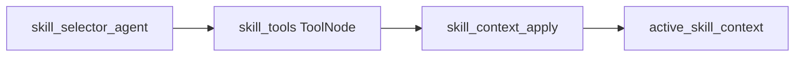
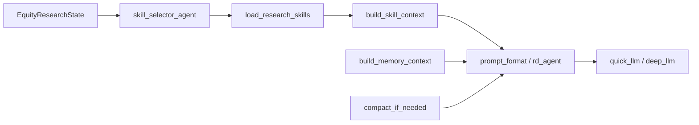

# Equity Research Context 控制方案

> 语言：[中文](context.md) | [English](../../README.md) · [中文主文档](../../README.zh-CN.md) · [文档索引](../zh/README.md)  
> 模块路径：`tradingagents/equity_research/agents/shared/`、`agents/consensus/`、`prompts/`  
> 相关文档：[文件结构](file-structure.md) · [Memory](memory.md) · [Skills & Tools](skills-and-tools.md) · [Storage](storage.md)

## 设计原则

Context 在本模块中经历四个显式阶段，避免 prompt 无限膨胀：

```
状态字段 → 选择/加载 → 格式化 → 预算压缩 → LLM
```

各子图（外层研究循环、共识子图、撰写阶段）共享同一套模式，但注入内容与上限不同。本文描述**谁构建 context、何时注入、限制多少**。

---

## 1. 状态级 Context 字段

主状态定义于 [`state/equity_research_state.py`](../../tradingagents/equity_research/state/equity_research_state.py)。与 context 直接相关的字段：

| 字段 | 来源 | 用途 |
|------|------|------|
| `instrument_context` | `initialize_state` 阶段 `build_instrument_context()` | 标的基本面摘要（行业、市值、业务描述等） |
| `mandate` | 用户 / 配置输入 | 研究委托约束 |
| `research_plan` | `task_analysis` | 研究计划与优先级问题 |
| `research_strategy` | `dynamic_planning` | 阶段感知策略（orientation → convergence） |
| `active_objective` | 各节点运行时设置 | 当前研究目标标识 |
| `skill_catalog` | `SkillRegistry.get_catalog()` 快照 | 轻量技能目录（仅 frontmatter） |
| `loaded_skills` | skill 加载后 | 已解析全文的技能名列表 |
| `active_skills` | skill 选择后 | 当前轮次激活的技能名（共识子图等） |
| `active_skill_context` | `build_skill_context()` | 完整技能注入块（constraints、prompt、guidance、tools） |
| `consensus_view` | 共识子图 | 五维结构化共识视图 |
| `consensus_report` | 共识子图 finalizer | 共识文字报告 |
| `expectation_gaps` | `consensus_agents` gap_finder | 预期差 / 研究缺口 |
| `consensus_search_memory` | 共识搜索执行 | Perplexity 查询历史（见 [Memory 文档](memory.md)） |

共识子图另有独立状态类型 `ConsensusSubgraphState`（[`agents/consensus/state.py`](../../tradingagents/equity_research/agents/consensus/state.py)），在 invoke 结束后将 `consensus_view`、`consensus_search_memory` 等字段合并回父状态。

---

## 2. Skill Context 注入（主模式）

Skill 注入是 context 控制的核心机制，实现于 [`agents/shared/skill_selector.py`](../../tradingagents/equity_research/agents/shared/skill_selector.py)。

### 2.1 三节点流水线

共识子图等场景采用 **agent → ToolNode → apply** 三节点模式：



| 阶段 | 函数 | 行为 |
|------|------|------|
| ① Catalog 注入 | `create_skill_selector_agent` | `format_catalog_for_prompt(eligible)` 生成 markdown 表，连同 ticker/sector/instrument_context 送入 LLM |
| ② LLM 选择 | `load_research_skills` 工具 | LLM 从 catalog 中选最多 2 个 skill 名；空选时回退到 `select_for_objective()` |
| ③ Context Apply | `create_skill_context_apply` | `read_skill()` 懒加载全文 → `build_skill_context()` → 写入 `active_skill_context` |

### 2.2 build_skill_context 输出结构

`build_skill_context(registry, skill_names, state)` 合并多个已加载 skill，返回：

```python
{
    "names": [...],
    "descriptions": [...],
    "when_to_use": [...],
    "constraints": "...",       # 各 skill Constraints 节合并
    "prompt_template": "...",   # 经 format_skill_prompt 变量替换后合并
    "query_guidance": "...",    # Query Guidance 节合并
    "tools": [...],             # 去重后的允许工具名列表
    "compatible_with": [...],
}
```

变量替换由 [`skills/loader.py`](../../tradingagents/equity_research/skills/loader.py) 的 `format_skill_prompt()` 完成，支持 `{ticker}`、`{sector}`、`{report_type}`、`{instrument_context}` 等占位符。

### 2.3 共识子图 Prompt 组装

[`agents/consensus/nodes.py`](../../tradingagents/equity_research/agents/consensus/nodes.py) 在各 planner / synthesizer 节点中拼接：

- ticker / sector 上下文
- `active_skills` + `active_skill_context`（经 `format_skill_context()`）
- `consensus_search_memory`（经 `format_search_memory()`）
- `consensus_view`（经 `format_consensus_view()`）
- 覆盖度报告（`format_coverage_gaps()`）

格式化函数集中于 [`agents/consensus/prompt_format.py`](../../tradingagents/equity_research/agents/consensus/prompt_format.py)。

---

## 3. Research Loop Context

内层研究循环（[`agents/research_loop.py`](../../tradingagents/equity_research/agents/research_loop.py)）的 context 由 [`prompts/rd_agent.py`](../../tradingagents/equity_research/prompts/rd_agent.py) 模板驱动。

### 3.1 各步骤注入内容

| 步骤 | 模板函数 | 主要 context 来源 |
|------|----------|------------------|
| ① 动态规划 | `dynamic_planning_prompt` | 阶段、graph 统计、eligible skill catalog |
| ③ Memory | （经后续步骤传递） | `build_memory_context()` 返回值 |
| ④ 关键问题 | `key_research_problems_prompt` | memory_context（claims、evidence 摘要） |
| ⑤ 假设生成 | `scientific_hypothesis_prompt` | memory_context + `get_consensus_view_for_prompt(state)` |
| ⑦ 快速尽调 | `quick_diligence_prompt` | 选中假设 + 有限证据 |

[`agents/dynamic_planning.py`](../../tradingagents/equity_research/agents/dynamic_planning.py) 在规划阶段额外将 eligible skill catalog 注入 prompt，供 LLM 决定 `strategy.skills_to_run`（最多 2 个）。

### 3.2 与 Skill 执行的关系

Research loop 第 ⑧ 步全量开发时，按 `strategy.skills_to_run` 调用 `SkillRegistry.get(name).run(SkillInput, tools)`，此时 skill 的 `prompt_template` 已在 handler 或 `PromptSkillRunner` 内部使用，不再重复走三节点选择流程。

---

## 4. 其他节点的 Context

| 节点 | Context 来源 |
|------|-------------|
| `consensus_agents` gap_finder | `consensus_view` + `compact_if_needed()` 压缩后的共识报告 |
| `writing_agents` | `claims`（verified）、`section_drafts`、报告模板约束 |
| `final_qa` | 完整 `final_report` + compliance flags |
| `lead_analyst` | 按 objective 调度 domain agent，各 agent 自带 skill 列表 |

Domain agent 通过 [`agents/domain/base.py`](../../tradingagents/equity_research/agents/domain/base.py) 的 `BaseDomainAgent` 执行固定 `skill_names`，context 由 `SkillInput` 从 state 切片传入。

---

## 5. 预算与压缩

### 5.1 硬性上限

| 机制 | 默认值 | 配置键 / 代码位置 |
|------|--------|-------------------|
| 共识 context 压缩阈值 | 6000 字符 | `equity_research.consensus_context_max_chars` |
| 共识报告压缩阈值 | 6000 字符 | `equity_research.consensus_report_max_chars` |
| Memory 检索条数上限 | 20 条 | `build_memory_context(max_items=20)` |
| 技能加载上限 | 2 个 | `load_research_skills(max_skills=2)` |
| 搜索记忆注入条数 | 20 条 | `format_search_memory(max_records=20)` |
| instrument_context 截断 | 500 字符 | `skill_selector._skill_selection_prompt` |
| 共识查询字符串截断 | 500 字符 | `agents/consensus/nodes.py` |
| LangGraph 递归上限 | 200 | `equity_research.max_recur_limit`（[`graph/propagation.py`](../../tradingagents/equity_research/graph/propagation.py)） |

### 5.2 LLM 压缩实现

[`agents/consensus/context_compact.py`](../../tradingagents/equity_research/agents/consensus/context_compact.py) 的 `compact_if_needed(deps, text, purpose, max_chars)`：

1. 若 `len(text) <= limit`，原样返回
2. 否则调用 `deps.quick_llm` 压缩，prompt 要求：
   - 保留所有 citation URL
   - 保留数字估计与维度标签
   - 输出 bullet list 而非 JSON
   - 目标长度低于 `limit`

**调用场景**：

- 共识 planner / synthesizer 中的 consensus view 文本
- `consensus_search_memory` 格式化后的块
- `consensus_agents` 缺口分析中的共识报告
- 报告生成阶段的 `consensus_report`

### 5.3 两阶段 Skill 加载的 Context 意义

启动时仅将 skill **catalog**（frontmatter：`name`、`description`、`when_to_use`、`tags`）注入 LLM，完整 markdown 正文（Constraints、Prompt Template、Query Guidance）在 `read_skill()` 后才进入 `active_skill_context`。这从架构上分离了「发现成本」与「执行成本」，详见 [Skills & Tools 文档](skills-and-tools.md)。

---

## 6. Context 组装流水线



---

## 7. 配置参考

`default_config.py` 中与 context 相关的 `equity_research` 子配置：

```python
"equity_research": {
    "max_recur_limit": 200,
    "budget": {
        "max_search_queries": 5,
        "max_extraction_docs": 8,
    },
    # consensus_context_max_chars / consensus_report_max_chars 可在运行时覆盖
}
```

Agent 级 skill 可见性可通过 `equity_research.agent_skills.{agent_id}` 覆盖，影响 catalog 注入范围（见 [Skills & Tools](skills-and-tools.md)）。

---

## 8. 扩展指南

| 场景 | 建议做法 |
|------|----------|
| 新子图需要 skill 注入 | 复用 `create_skill_selector_agent` + `create_skill_tools_node` + `create_skill_context_apply`，传入唯一 `graph_name` |
| 新增 prompt 注入块 | 在对应 `prompt_format.py` 或 `rd_agent.py` 增加 formatter；超长块走 `compact_if_needed` |
| 调整 context 预算 | 优先通过 config 键覆盖；硬编码上限应集中在 formatter 默认参数中 |
| 自定义 skill 选择 prompt | 向 `create_skill_selector_agent` 传入 `prompt_builder` 回调 |
