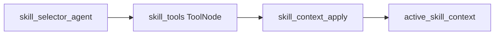
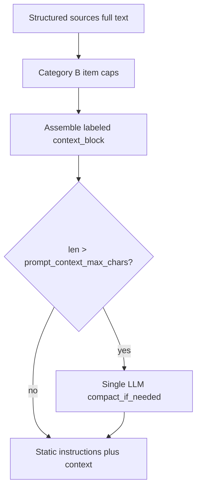
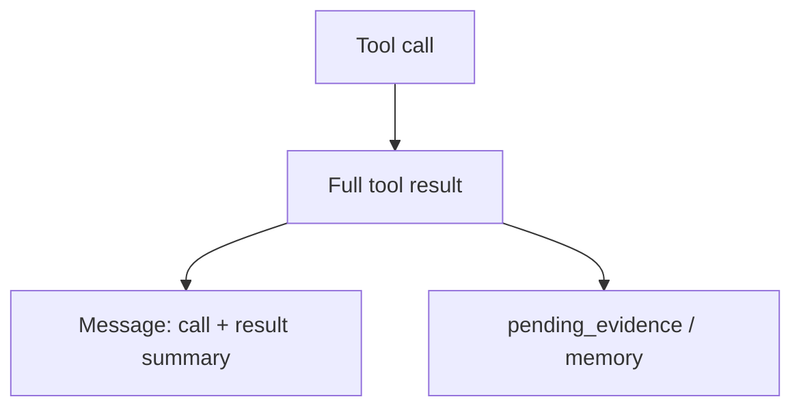
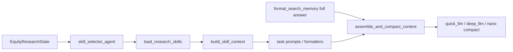

# Equity Research Context 控制方案

> 语言：[中文](context.md) | [English](../../README.md) · [中文主文档](../../README.zh-CN.md) · [文档索引](../zh/README.md)  
> 模块路径：`tradingagents/equity_research/runtime/utils/context_compact.py`、`tasks/*/prompts.py`  
> 相关文档：[文件结构](file-structure.md) · [Memory](memory.md) · [Skills & Tools](skills-and-tools.md) · [Storage](storage.md)

## 设计原则

Context 在本模块中经历四个显式阶段，避免**信息在层层硬切中丢失**，同时控制极端超长：

```
状态字段 → 选择/加载 → 格式化（条数策展） → 拼装 context_block →（超预算才）一次 soft compact → LLM
```

原则摘要：

| 类别 | 策略 |
|------|------|
| Category A（控长字符串 `[:N]`） | **删除**；全文进入 `context_block` |
| Category B（条数 top-N） | **保留**（KPI top-5、search memory 最近 20 条等）；条目内容不再二次硬切 |
| Category C（工具/RAG `max_chars`） | **本轮不动**（检索结果预算，与 prompt 组装正交） |
| Soft compact | 同一 LLM 调用对动态材料 **至多一次** `compact_if_needed`；默认预算 **32000** 字符 |

各子图（共识、假设、section planner、section research）共享同一套模式，但注入内容不同。本文描述**谁构建 context、何时注入、限制多少**。

---

## 1. 状态级 Context 字段

主状态定义于 [`state/equity_research_state.py`](../../tradingagents/equity_research/state/equity_research_state.py)。与 context 直接相关的字段：

| 字段 | 来源 | 用途 |
|------|------|------|
| `instrument_context` | `initialize_state` 阶段 `build_instrument_context()` | 标的基本面摘要（行业、市值、业务描述等） |
| `mandate` | 用户 / 配置输入 | 研究委托约束 |
| `research_plan` | `task_analysis` | 研究计划与优先级问题 |
| `research_strategy` | `dynamic_planning` | 阶段感知策略（orientation → convergence） |
| `active_objective` | 各节点运行时设置 | 当前研究目标标识 |
| `skill_catalog` | `SkillRegistry.get_catalog()` 快照 | 轻量技能目录（仅 frontmatter） |
| `loaded_skills` | skill 加载后 | 已解析全文的技能名列表 |
| `active_skills` | skill 选择后 | 当前轮次激活的技能名（共识子图等） |
| `active_skill_context` | `build_skill_context()` | 完整技能注入块（constraints、prompt、guidance、tools） |
| `consensus_view` | 共识子图 | 五维结构化共识视图 |
| `consensus_report` | 共识子图 finalizer | 共识文字报告 |
| `expectation_gaps` | `consensus_agents` gap_finder | 预期差 / 研究缺口 |
| `consensus_search_memory` | 共识搜索执行 | Perplexity 查询历史（见 [Memory 文档](memory.md)） |

共识子图另有独立状态类型 `ConsensusSubgraphState`（[`agents/consensus/state.py`](../../tradingagents/equity_research/agents/consensus/state.py)），在 invoke 结束后将 `consensus_view`、`consensus_search_memory` 等字段合并回父状态。

---

## 2. Skill Context 注入（主模式）

Skill 注入是 context 控制的核心机制，实现于 [`agents/shared/skill_selector.py`](../../tradingagents/equity_research/agents/shared/skill_selector.py)。

### 2.1 三节点流水线

共识子图等场景采用 **agent → ToolNode → apply** 三节点模式：



| 阶段 | 函数 | 行为 |
|------|------|------|
| ① Catalog 注入 | `create_skill_selector_agent` | `format_catalog_for_prompt(eligible)` 生成 markdown 表，连同 ticker/sector/instrument_context 送入 LLM |
| ② LLM 选择 | `load_research_skills` 工具 | LLM 从 catalog 中选最多 2 个 skill 名；空选时回退到 `select_for_objective()` |
| ③ Context Apply | `create_skill_context_apply` | `read_skill()` 懒加载全文 → `build_skill_context()` → 写入 `active_skill_context` |

### 2.2 build_skill_context 输出结构

`build_skill_context(registry, skill_names, state)` 合并多个已加载 skill，返回：

```python
{
    "names": [...],
    "descriptions": [...],
    "when_to_use": [...],
    "constraints": "...",       # 各 skill Constraints 节合并
    "prompt_template": "...",   # 经 format_skill_prompt 变量替换后合并
    "query_guidance": "...",    # Query Guidance 节合并
    "tools": [...],             # 去重后的允许工具名列表
    "compatible_with": [...],
}
```

变量替换由 [`skills/loader.py`](../../tradingagents/equity_research/skills/loader.py) 的 `format_skill_prompt()` 完成，支持 `{ticker}`、`{sector}`、`{report_type}`、`{instrument_context}` 等占位符。

### 2.3 共识 / 假设 Prompt 组装

[`tasks/consensus/prompts.py`](../../tradingagents/equity_research/tasks/consensus/prompts.py) 与 [`tasks/assumption/prompts.py`](../../tradingagents/equity_research/tasks/assumption/prompts.py) 在各 planner / synthesizer / reflector / finalizer 中：

1. 用 formatter 生成 view / memory / evidence 等**全文**块（仅做 Category B 条数策展）
2. 交给 [`assemble_and_compact_context`](../../tradingagents/equity_research/runtime/utils/context_compact.py) 拼成 labeled `context_block`
3. 静态指令原样保留；仅当 `len(context_block) > budget` 时对整块做 **一次** soft compact

`format_search_memory(..., prefer_full_answer=True)`（默认）优先注入完整 `answer`；`answer_summary` 仅用于对话瘦身 / fallback。

---

## 3. Research Loop Context

内层研究循环（[`agents/research_loop.py`](../../tradingagents/equity_research/agents/research_loop.py)）的 context 由 [`prompts/rd_agent.py`](../../tradingagents/equity_research/prompts/rd_agent.py) 模板驱动。

### 3.1 各步骤注入内容

| 步骤 | 模板函数 | 主要 context 来源 |
|------|----------|------------------|
| ① 动态规划 | `dynamic_planning_prompt` | 阶段、graph 统计、eligible skill catalog |
| ③ Memory | （经后续步骤传递） | `build_memory_context()` 返回值 |
| ④ 关键问题 | `key_research_problems_prompt` | memory_context（claims、evidence 摘要） |
| ⑤ 假设生成 | `scientific_hypothesis_prompt` | memory_context + `get_consensus_view_for_prompt(state)` |
| ⑦ 快速尽调 | `quick_diligence_prompt` | 选中假设 + 有限证据 |

[`agents/dynamic_planning.py`](../../tradingagents/equity_research/agents/dynamic_planning.py) 在规划阶段额外将 eligible skill catalog 注入 prompt，供 LLM 决定 `strategy.skills_to_run`（最多 2 个）。

### 3.2 与 Skill 执行的关系

Research loop 第 ⑧ 步全量开发时，按 `strategy.skills_to_run` 调用 `SkillRegistry.get(name).run(SkillInput, tools)`，此时 skill 的 `prompt_template` 已在 handler 或 `PromptSkillRunner` 内部使用，不再重复走三节点选择流程。

---

## 4. 其他节点的 Context

| 节点 | Context 来源 |
|------|-------------|
| `consensus_agents` gap_finder | `consensus_view` + 超预算时 `compact_if_needed()` |
| `writing_agents` | `claims`（verified）、`section_drafts`、报告模板约束 |
| `final_qa` | 完整 `final_report` + compliance flags |
| `lead_analyst` | 按 objective 调度 domain agent，各 agent 自带 skill 列表 |

Domain agent 通过 [`agents/domain/base.py`](../../tradingagents/equity_research/agents/domain/base.py) 的 `BaseDomainAgent` 执行固定 `skill_names`，context 由 `SkillInput` 从 state 切片传入。

---

## 5. 预算与压缩

### 5.1 统一预算（信息优先）

| 机制 | 默认值 | 配置键 / 代码位置 |
|------|--------|-------------------|
| **Prompt context 统一预算** | **32000 字符** | `equity_research.prompt_context_max_chars` |
| 共识 context（legacy 对齐） | 32000 | `equity_research.consensus_context_max_chars`（回退读新 key） |
| Executor / reflector context | 32000 | `equity_research.executor_context_max_chars` |
| 共识报告字数软引导 | 6000 | `equity_research.consensus_report_max_chars`（**不硬截断输出**） |
| Memory 检索条数上限 | 20 条 | `build_memory_context(max_items=20)` |
| 技能加载上限 | 2 个 | `load_research_skills(max_skills=2)` |
| 搜索记忆注入条数 | 20 条 | `format_search_memory(max_records=20)`（Category B） |
| Blackboard 注入条数 | 6–8 条 | `format_blackboard_for_prompt(max_items=…)`（**不再**按 `max_chars` 硬切） |
| LangGraph 递归上限 | 200 | `equity_research.max_recur_limit` |

`resolve_prompt_context_max_chars(config)` 优先读 `prompt_context_max_chars`，再回退 legacy 键。

### 5.2 单次拼装：`assemble_and_compact_context`

实现于 [`runtime/utils/context_compact.py`](../../tradingagents/equity_research/runtime/utils/context_compact.py)：



1. `assemble_context_block(sections)`：拼接非空 labeled sections
2. `len <= budget` → 原样返回（**不调用 LLM**）
3. 否则 `compact_if_needed`：用 nano LLM 压缩，保留 citation URL、数字与维度标签；结果带 LRU cache

**禁止**：同一 prompt builder 内对 view / memory / evidence / executor 分别多次 compact。

### 5.3 多轮工具对话（软硬结合）

Section executor（[`runtime/nodes/section_executor.py`](../../tradingagents/equity_research/runtime/nodes/section_executor.py)）：



- **硬**：对话 messages 只保留调用内容 + 结果摘要（`slim_tool_message_content`；同 message id 替换）
- **全量**：全文写入 `pending_evidence` / memory
- Reflector 的 `format_executor_messages`：摘要拼接后至多一次 compact（不再对每条 ToolMessage 分别 compact）

### 5.4 Section planner 背景

[`pack_background`](../../tradingagents/equity_research/tasks/section_planner/prompts.py) **不再** `[:20000]` 硬切；background_extractor / question_tree 各自对拼装块做一次 compact。

### 5.5 两阶段 Skill 加载的 Context 意义

启动时仅将 skill **catalog**（frontmatter）注入 LLM，完整正文在 `read_skill()` 后才进入 `active_skill_context`。详见 [Skills & Tools 文档](skills-and-tools.md)。

---

## 6. Context 组装流水线



---

## 7. 配置参考

`default_config.py` 中与 context 相关的 `equity_research` 子配置：

```python
"equity_research": {
    "max_recur_limit": 200,
    "prompt_context_max_chars": 32000,
    "consensus_context_max_chars": 32000,
    "executor_context_max_chars": 32000,
    "budget": {
        "max_search_queries": 5,
        "max_extraction_docs": 8,
    },
    # consensus_report_max_chars 仅作 finalizer 输出软引导
}
```

Agent 级 skill 可见性可通过 `equity_research.agent_skills.{agent_id}` 覆盖，影响 catalog 注入范围（见 [Skills & Tools](skills-and-tools.md)）。

---

## 8. 扩展指南

| 场景 | 建议做法 |
|------|----------|
| 新子图需要 skill 注入 | 复用 `create_skill_selector_agent` + `create_skill_tools_node` + `create_skill_context_apply`，传入唯一 `graph_name` |
| 新增 prompt 注入块 | 用 formatter 生成全文 → 并入 `assemble_and_compact_context` 的 sections；**不要**再单独 `compact_if_needed` |
| 调整 context 预算 | 改 `prompt_context_max_chars`（或 legacy 键）；条数上限留在 formatter 的 `max_items` / `max_records` |
| 自定义 skill 选择 prompt | 向 `create_skill_selector_agent` 传入 `prompt_builder` 回调 |

---

## 9. Session Blackboard 注入

Session Blackboard 是单 section research session 内的跨节点共享笔记板，允许 planner/executor/synthesizer/reflector 共享中间态发现。

### 9.1 注入时机与内容

| 节点 | 注入时机 | 注入内容 |
|------|----------|----------|
| Section Planner (initial / loop) | `prompt_builder()` 之后 | 最近 **8** 条 blackboard entries（全文；预算并入统一 compact） |
| Section Executor | system prompt 构建后 | 最近 **6** 条 entries |
| Section Reflector | reflector prompt 构建后 | 最近 **8** 条 entries |
| Initial Planner (prior sessions) | prompt 构建时 | 前序 section 的 blackboard 摘要（条数 top-5；摘要全文，不再 `[:200]`） |

### 9.2 注入格式

```markdown
## Session Blackboard (Recent Insights)
- [finding, iter=2] NVDA data center revenue +40% YoY (tags: revenue, growth)
- [contradiction, iter=2] Gross margin: 10-K says 72%, call says ~73% (tags: margin)
```

单条 content **不再**硬切到 200 字符；`max_chars` 参数保留兼容但忽略。

### 9.3 与前序 Session 摘要的关系

后续 section 的 planner 会看到前序 section 的 blackboard 摘要（由 LLM 生成），注入到 `build_initial_plan_prompt()` 的 "Prior section research summaries" 部分，并与 consensus / assumption 等一并进入一次 `assemble_and_compact_context`。

详见 [Memory 文档 §5](memory.md#5-session-blackboard单-session-共享笔记板)。
