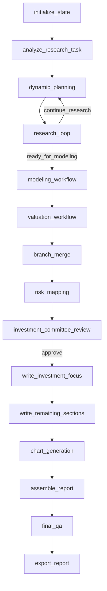
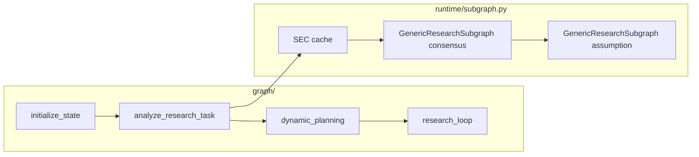

# Equity Research 文件结构

> 模块路径：`tradingagents/equity_research/`  
> 相关文档：[产品概览](../EQUITY_RESEARCH.md) · [Agent Loop 与 Task 分配](agent-loop-and-tasks.md) · [Memory](memory.md) · [Context](context.md) · [Skills & Tools](skills-and-tools.md)

## 模块定位

`equity_research` 是 TradingAgents 项目中的**可选子系统**，与主交易图（`TradingAgentsGraph`）并行存在，不共享编排逻辑。它实现一套假设驱动的卖方股票研究流水线（Equity R&D-Agent），核心原则是：先探索投资论点、积累证据与模型，再撰写报告章节，而非一次性生成全文。

**公开 API**：

```python
from tradingagents.equity_research import EquityResearchGraph

graph = EquityResearchGraph(debug=True, config=config)
final_state, summary = graph.propagate("NVDA")
```

入口类 `EquityResearchGraph`（[`graph/equity_research_graph.py`](../../tradingagents/equity_research/graph/equity_research_graph.py)）负责：装配 LLM 客户端、初始化 `EquityResearchDeps`、编译 LangGraph、调用 `propagate()` 驱动整条流水线。

**共识子图手动测试**（项目根目录）：

```bash
uv run python demo_consensus.py NVDA --sector Technology --max-iterations 3
uv run python demo_consensus.py NVDA --mode subgraph --json -o ./out/nvda.json
uv run python scripts/visualize_consensus_trace.py ./out/nvda.json -o ./out/nvda_trace.html --phase all

# 生成 HTML（默认），浏览器打开即可
uv run python scripts/visualize_consensus_trace.py out/nvda.json -o out/nvda_trace.html

# 不指定 -o 时，输出为同目录下的 out/nvda.html
uv run python scripts/visualize_consensus_trace.py out/nvda.json

# 导出 Markdown（含 mermaid 代码块，可在支持 mermaid 的编辑器中查看）
uv run python scripts/visualize_consensus_trace.py out/nvda.json --format md -o out/nvda_trace.md

# 仅输出 mermaid 源码
uv run python scripts/visualize_consensus_trace.py out/nvda.json --format mermaid --diagram assumption_map

uv run python demo_consensus.py NVDA --max-iterations 3 -o out/nvda.json
uv run python scripts/visualize_consensus_trace.py out/nvda.json -o out/nvda_trace.html
```

---

## 顶层目录树

```
tradingagents/equity_research/
├── __init__.py                 # 懒加载导出 EquityResearchGraph
│
├── graph/                      # 外层 LangGraph 装配（~15 个阶段节点）
│   ├── equity_research_graph.py  # 主编排器：deps、compile、propagate
│   ├── setup.py                  # StateGraph 节点注册与条件边
│   ├── propagation.py            # 初始状态工厂、recursion_limit
│   └── routers.py                # 研究/建模/估值/IC/QA 条件路由
│
├── agents/                     # LangGraph 节点工厂与内层运行时
│   ├── deps.py                   # EquityResearchDeps：LLM、存储、集成客户端
│   ├── init_agents.py            # initialize_state、报告模板加载
│   ├── task_analysis.py          # 初始化脊柱：共识子图 → 缺口 → 计划 → 图引导
│   ├── dynamic_planning.py         # 阶段感知研究策略 + skill catalog 注入
│   ├── research_loop.py            # 内层 9 步 R&D 循环（ResearchLoopRuntime）
│   ├── autonomous_research.py      # 备用 skill 驱动研究运行时
│   ├── lead_analyst.py             # 主分析师：计划、调度领域 Agent、评审
│   ├── consensus_agents.py         # 共识子图后的缺口分析
│   ├── hypothesis_agents.py        # 假设生成、虚拟 IC、预算分配
│   ├── evidence_agents.py          # 证据检索 / 提取 / 验证
│   ├── modeling_workflow.py        # 盈利预测工作流
│   ├── valuation_workflow.py       # 估值工作流
│   ├── branch_merge.py             # 合并最佳论点分支
│   ├── risk_mapping.py             # 风险到论点映射
│   ├── writing_agents.py           # 章节撰写
│   ├── workflow_agents.py          # mandate、文档摄取、卖方观点、计划
│   ├── forecast_agents.py          # 图表生成
│   ├── final_agents.py             # IC 评审、报告组装、导出
│   ├── final_qa.py                 # 最终 QA 门禁
│   ├── consensus/                  # 共识子图兼容层（wrapper）
│   │   ├── subgraph.py               # → subgraph_runner + CONSENSUS_TASK_PROFILE
│   │   └── _legacy.py                # 归档旧实现（不参与运行）
│   ├── assumption/                 # 假设探测子图 wrapper
│   │   └── subgraph.py               # → subgraph_runner + ASSUMPTION_TASK_PROFILE
│   └── domain/                     # 9 个领域 Agent 薄封装
│       ├── base.py                   # BaseDomainAgent：按 skill 列表执行
│       ├── consensus_agent.py, business_agent.py, valuation_agent.py, ...
│       └── ...
│
├── runtime/                    # 通用研究子图框架（零业务逻辑）；详见 agent-loop-and-tasks.md
│   ├── state.py                    # AgentState
│   ├── task_profile.py             # TaskProfile
│   ├── task_registry.py            # TaskRegistry
│   ├── exploration_graph.py        # ExplorationGraph（chain 模式）
│   ├── subgraph.py                 # GenericResearchSubgraph（唯一 PER 拓扑）
│   ├── subgraph_runner.py          # create_run_profile_subgraph 通用 invoke 封装
│   ├── demo_graph.py               # ConsensusDemoGraph 手动测试
│   ├── routers.py                  # 子图条件路由
│   ├── nodes/                      # skill_selector / planner / executor / ...
│   └── utils/                      # structured_invoke、search_memory 等
│
├── tasks/                      # 业务 TaskProfile 配置；详见 agent-loop-and-tasks.md
│   ├── registry.py
│   ├── consensus/                  # CONSENSUS_TASK_PROFILE、prompts、queries
│   └── assumption/                 # ASSUMPTION_TASK_PROFILE、prompts、queries
│
├── state/                      # 共享状态模式
│   ├── equity_research_state.py  # 主 TypedDict + empty_equity_research_state()
│   ├── ledgers.py                # Ledger 模型 + sync/write 辅助函数
│   ├── research_graph.py         # 论点探索 DAG（节点、分支、评分）
│   ├── schemas.py                # Claims、hypotheses、IC review、budgets 等
│   └── consensus_schemas.py      # 结构化共识视图、维度、搜索记录
│
├── memory/                     # 协作记忆检索（图内 ledger 评分）
│   ├── __init__.py
│   └── retrieval.py              # memory_score()、build_memory_context()
│
├── skills/                     # 基于文件的 Skill 系统
│   ├── SKILL.template.md         # Skill 编写规范（catalog vs 全文加载）
│   ├── base.py                   # SkillInput/Output、LoadedSkill、SkillCatalogEntry
│   ├── loader.py                 # 解析 .skill.md（frontmatter + 章节）
│   ├── registry.py               # SkillRegistry：扫描、读取、选择
│   ├── catalog.py                # format_catalog_for_prompt()
│   ├── runnable.py               # RunnableSkill、PromptSkillRunner
│   ├── agent_visibility.py       # 各 Agent 可见 skill 过滤
│   ├── handlers/
│   │   ├── base.py
│   │   └── impl.py               # 15 个 Python skill handler
│   └── definitions/              # 15 个 *.skill.md 清单
│
├── tools/                      # Tool 注册表与实现
│   ├── registry.py               # ToolRegistry：LangChain tools → callables
│   ├── tool_catalog.py           # 元数据分类（system/search/finance/memory/...）
│   ├── tool_adapters.py            # BaseTool → plain callable
│   ├── interface.py                # 厂商路由（yfinance、fmp、edgar、tavily 等）
│   ├── system_tools.py             # ls_tools、tool_registry_lookup、ls_skills 等
│   ├── skill_tools.py              # load_research_skills LangChain 工具
│   ├── memory_tools.py             # memory_retrieve / memory_write
│   ├── evidence_memory.py          # store_evidence/claim/assumption、link、retrieve
│   ├── search_tools.py, finance_tools.py, data_tools.py, document_tools.py, ...
│   ├── stub_impl.py                # 未实现工具的 stub
│   └── lc/                         # 按类别拆分的 LangChain @tool 包装
│       ├── __init__.py             # STATIC_LANGCHAIN_TOOLS + build_system_langchain_tools
│       ├── memory.py, search.py, finance.py, stubs.py, ...
│
├── storage/                    # 持久化与回退存储
│   ├── db.py                     # SQLAlchemy engine
│   ├── evidence_store.py         # 证据片段（可选 pgvector）
│   ├── fact_store.py, document_registry.py, trace_store.py
│   └── in_memory.py              # PostgreSQL 不可用时的内存回退
│
├── integrations/               # 外部 API 客户端
│   ├── fmp.py, edgar.py          # 财务数据与 SEC 文件
│   ├── tavily_client.py, jina_client.py, e2b_sandbox.py
│   ├── embeddings.py, redis_cache.py, info_sources.py
│
├── prompts/
│   └── rd_agent.py               # 研究循环提示词模板（含 memory 注入位）
│
├── computation/                # 确定性计算（非 LLM 发明）
│   ├── valuation_mock.py
│   └── forecast.py
│
├── evaluation/                 # 评分聚合
│   └── aggregators.py            # 论点评分、IC 评分
│
├── export/
│   └── markdown_memory.py        # 导出 research_memory.md + full_state.json
│
└── templates/
    └── report_template.py        # MVP1 十节报告模板约束
```

---

## 执行流与目录映射

### 外层工作流（`graph/setup.py`）



| 阶段 | 主要代码位置 |
|------|-------------|
| 初始化 | `agents/init_agents.py` |
| 任务分析（含共识子图） | `agents/task_analysis.py`、`agents/consensus/` |
| 动态规划 | `agents/dynamic_planning.py` |
| 内层研究循环 | `agents/research_loop.py` |
| 建模 / 估值 | `agents/modeling_workflow.py`、`agents/valuation_workflow.py` |
| 分支合并 / 风险 | `agents/branch_merge.py`、`agents/risk_mapping.py` |
| IC / 撰写 / QA / 导出 | `agents/final_agents.py`、`agents/writing_agents.py`、`agents/final_qa.py`、`export/` |

### 内层研究循环（`agents/research_loop.py`）

每轮 `ResearchLoopRuntime.run()` 执行 9 步：动态规划 → 选父节点 → **memory 上下文** → 关键问题 → 假设生成 → 虚拟 IC → 快速尽调 → 全量开发（证据 + skills）→ 评估并更新 `research_graph`。

### 嵌套研究子图（`agents/task_analysis.py` → `runtime/subgraph.py`）

在 `analyze_research_task` 内串行 invoke 两个 `GenericResearchSubgraph` 实例：

1. `CONSENSUS_TASK_PROFILE` — Plan-Execute-Reflect 构建共识视图
2. `ASSUMPTION_TASK_PROFILE` — 在同一 PER 拓扑上探测假设，产出 `research_suggestions` / `research_directions`

SEC 文件在子图执行前预取到 `{data_cache_dir}/equity_research/sec/`。完整节点与路由见 [Agent Loop 与 Task 分配](agent-loop-and-tasks.md)。



---

## 关键入口文件速查

| 文件 | 职责 |
|------|------|
| [`graph/equity_research_graph.py`](../../tradingagents/equity_research/graph/equity_research_graph.py) | 对外主类；装配 deps、编译图、运行 `propagate()` |
| [`graph/setup.py`](../../tradingagents/equity_research/graph/setup.py) | 注册 ~15 个外层节点与全部条件边 |
| [`graph/propagation.py`](../../tradingagents/equity_research/graph/propagation.py) | `empty_equity_research_state()` 注入、`recursion_limit` |
| [`agents/deps.py`](../../tradingagents/equity_research/agents/deps.py) | 依赖注入中心：LLM、PostgreSQL、Redis、Perplexity 等 |
| [`agents/research_loop.py`](../../tradingagents/equity_research/agents/research_loop.py) | 内层 9 步 R&D 运行时 |
| [`state/equity_research_state.py`](../../tradingagents/equity_research/state/equity_research_state.py) | 主状态 schema 与默认值 |
| [`state/ledgers.py`](../../tradingagents/equity_research/state/ledgers.py) | Ledger 写入与 legacy 同步 |
| [`skills/registry.py`](../../tradingagents/equity_research/skills/registry.py) | Skill 注册与按需加载 |
| [`tools/registry.py`](../../tradingagents/equity_research/tools/registry.py) | Tool 注册与 skill 过滤 |
| [`memory/retrieval.py`](../../tradingagents/equity_research/memory/retrieval.py) | 协作记忆检索评分 |

---

## 测试目录映射

测试位于 `tests/equity_research/`，与模块子系统对应关系如下：

| 测试文件 | 覆盖模块 |
|----------|----------|
| `test_workflow_spine.py` | `graph/setup.py` 外层节点名 |
| `test_research_loop.py` | `agents/research_loop.py` 内层循环 |
| `test_research_graph.py` | `state/research_graph.py` 父节点选择、分支合并 |
| `test_memory_retrieval.py` | `memory/retrieval.py` |
| `test_ledgers.py` | `state/ledgers.py` |
| `test_routers.py` | `graph/routers.py` |
| `test_consensus_subgraph.py` | `agents/consensus/` |
| `test_skill_loader.py` | `skills/loader.py` |
| `test_agent_visibility.py` | `skills/agent_visibility.py` |
| `test_tools_registry.py` | `tools/registry.py` |
| `test_storage_pg.py` | `storage/` |
| `test_e2e_mini_report.py` | 全图冒烟（mock LLM） |

运行方式见 [产品概览 · Testing](../EQUITY_RESEARCH.md#testing)。

---

## 相关文档

| 文档 | 内容 |
|------|------|
| [../EQUITY_RESEARCH.md](../EQUITY_RESEARCH.md) | 产品概览、快速开始、外层/内层流程表 |
| [agent-loop-and-tasks.md](agent-loop-and-tasks.md) | GenericResearchSubgraph PER 循环、TaskProfile、Task 分配现状与规划 |
| [memory.md](memory.md) | Memory 分层与控制方案 |
| [context.md](context.md) | Context 注入与预算压缩 |
| [skills-and-tools.md](skills-and-tools.md) | Skill/Tool 注册、可见性与执行 |
| [storage.md](storage.md) | Redis、PostgreSQL、本地文件存储方案 |
| [`skills/SKILL.template.md`](../../tradingagents/equity_research/skills/SKILL.template.md) | 新增 Skill 的编写规范 |
