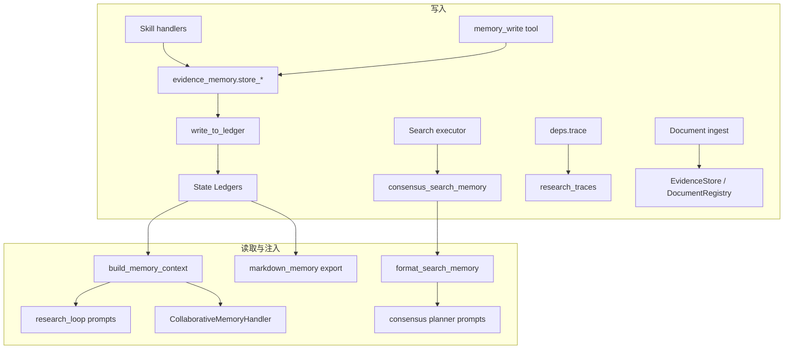

# Equity Research Memory 控制方案

> 语言：[中文](memory.md) | [English](../../README.md#memory-design) · [中文主文档](../../README.zh-CN.md#memory-design) · [文档索引](../zh/README.md)  
> 模块路径：`tradingagents/equity_research/memory/` 及相关 ledger / storage 代码  
> 相关文档：[文件结构](file-structure.md) · [Context](context.md) · [Skills & Tools](skills-and-tools.md) · [Storage](storage.md)

## 设计原则

Memory 在本模块中**不是单一类或数据库表**，而是四层协作结构：

1. **图内 Ledger** — LangGraph 状态中的结构化、追加式记忆（主路径）
2. **共识搜索记忆** — 共识子图专用的 Perplexity 查询历史
3. **外部持久化** — PostgreSQL / pgvector 证据存储（可选）
4. **导出快照** — 流水线结束后的 markdown / JSON 归档

读写分离明确：Skill 与 Tool 通过 `write_to_ledger()` 写入；检索通过 `build_memory_context()` 或专用 formatter 读出并注入 prompt。

---

## 1. 图内 Ledger（主记忆）

### 1.1 状态字段

主状态定义于 [`state/equity_research_state.py`](../../tradingagents/equity_research/state/equity_research_state.py)。Ledger 相关字段如下：

| 字段 | 用途 |
|------|------|
| `evidence_ledger` / `evidence_fragments` | 带来源的证据摘录，含可靠性、时效性评分 |
| `claim_ledger` / `claims` | 研究主张，关联支持/反驳证据 |
| `assumption_ledger` / `model_assumptions` | 预测与估值假设，含与共识的差异 |
| `consensus_ledger` | 结构化市场共识条目 |
| `broker_view_ledger` | 卖方评级、目标价、摘要 |
| `thesis_ledger` | 投资论点陈述 |
| `research_graph` | 论点探索 DAG（节点、边、分支、评分） |
| `cross_branch_discoveries` | 跨分支洞察 |
| `memory_reflections` | 反思与行动记录 |
| `research_traces` | 节点执行轨迹（经 `deps.trace()` 写入） |
| `forecast_ledger` / `valuation_ledger` | 建模迭代版本历史 |
| `issue_ledger` | 门禁拒绝、阻塞问题 |

Pydantic 模型定义见 [`state/ledgers.py`](../../tradingagents/equity_research/state/ledgers.py)（`EvidenceLedgerEntry`、`ClaimLedgerEntry` 等）。

### 1.2 写入路径

**首选写入 API** — [`state/ledgers.py`](../../tradingagents/equity_research/state/ledgers.py) 的 `write_to_ledger(state, ledger_type, entry)`。Skill handler 与 evidence agent 应优先使用此路径，保证字段格式一致。

**Tool 层写入** — [`tools/evidence_memory.py`](../../tradingagents/equity_research/tools/evidence_memory.py)：

| 函数 | 作用 |
|------|------|
| `store_evidence` | 写入证据片段 |
| `store_claim` | 写入主张 |
| `store_assumption` | 写入假设 |
| `link_evidence_to_claim` | 关联证据与主张 |

**LangChain 工具** — [`tools/memory_tools.py`](../../tradingagents/equity_research/tools/memory_tools.py)：

| 工具 | 作用 |
|------|------|
| `memory_write` | 按 `record.type` 路由到对应 ledger |
| `memory_retrieve` | 按类型检索 ledger 条目 |

LangChain 包装位于 [`tools/lc/memory.py`](../../tradingagents/equity_research/tools/lc/memory.py)。

### 1.3 Legacy 同步

历史状态字段（如 `claims`、`evidence_fragments`）与 ledger 结构并存。`sync_ledgers_from_legacy()` 在 `task_analysis` 结束、`research_loop` 每轮迭代后调用，实现双向同步，避免新旧字段漂移。

---

## 2. 检索与评分

核心逻辑位于 [`memory/retrieval.py`](../../tradingagents/equity_research/memory/retrieval.py)。

### 2.1 评分公式

`memory_score()` 对各记忆条目加权（feedback §5.4）：

| 维度 | 权重 |
|------|------|
| semantic_similarity | 30% |
| evidence_reliability | 25% |
| thesis_node_score | 20% |
| recency_score | 15% |
| financial_materiality | 10% |
| redundancy_penalty | −10% |

默认语义相似度在提供 `deps` 且 `memory_use_embedding=True` 时走 **RAGService**（`evidence` corpus：ParadeDB BM25 + pgvector + RRF，见 [`rag/architecture.md`](../rag/architecture.md)），经 [`memory/embedding_retrieval.py`](../../tradingagents/equity_research/memory/embedding_retrieval.py) 合并 ledger 分数；否则回退 **token overlap**（[`memory/similarity.py`](../../tradingagents/equity_research/memory/similarity.py)）。

### 2.2 上下文构建

`build_memory_context(state, parent_nodes, plan, max_items=20, filters=None, deps=None)` 流程：

1. **构造 query**：优先取 `plan.priority_questions` 前 2 条；否则取父论点节点的 `thesis` / `research_question`；再回退到 `active_objective` 或 `ticker`
2. **硬过滤**：`filters` 支持 `metric`、`section_id`、`confidence_min/max`、`sensitivity`、`ledger_types`、`status`（见 [`memory/filters.py`](../../tradingagents/equity_research/memory/filters.py)）
3. **评分排序**：对 evidence / claim / assumption / consensus 逐条 `memory_score`（语义分可走 embedding）
4. **截断返回**（默认 `max_items=20`）：
   - evidence：前 10 条
   - claims：前 10 条
   - assumptions：前 5 条
   - consensus：前 3 条
   - cross_branch_discoveries：前 5 条
   - failure_patterns：已拒绝节点的 `failure_reason`，前 3 条

### 2.3 正交检索 Tools

除聚合工具 `memory_retrieve` 外，提供按检索轴拆分的 LangChain tools（[`tools/memory_search_tools.py`](../../tradingagents/equity_research/tools/memory_search_tools.py)）：

| Tool | 检索轴 | 用途 |
|------|--------|------|
| `search_evidence` | 语义 + metric | 证据摘录 |
| `search_claims` | section / confidence / metric | 主张 |
| `search_assumptions` | sensitivity / metric | 建模假设 |
| `search_consensus` | 语义 + metric | 市场共识 |
| `search_conflicts` | 矛盾 | `memory_conflicts` + `contradiction_fragments` |
| `search_memory_timeline` | 时间 | `iteration_snapshots` 趋势 |
| `search_research_context` | 综合 context | 全 ledger 打包（等同 `build_memory_context`） |

Section executor 的 retrieval 组通过 `make_memory_search_tools(deps)` 注入 embedding 感知版本。

### 2.4 消费方

| 消费方 | 位置 | 用途 |
|--------|------|------|
| Research loop 第 ③ 步 | `agents/research_loop.py` | 注入 `key_research_problems_prompt`、`scientific_hypothesis_prompt` |
| CollaborativeMemoryHandler | `skills/handlers/impl.py` | `collaborative_memory` skill 执行 |
| `memory_retrieve` 工具 | `tools/memory_tools.py` | Agent 按需检索 |

---

## 3. 共识搜索记忆

独立于 ledger 的专用记忆，服务于共识子图。

**状态字段**：`consensus_search_memory`（`list[dict]`，元素为 `SearchRecord`）

**实现**：[`agents/consensus/search_memory.py`](../../tradingagents/equity_research/agents/consensus/search_memory.py)

| 能力 | 说明 |
|------|------|
| 记录搜索 | 每次 Perplexity 查询保存 query、dimension、answer、summary、citations |
| 长回答摘要 | 超过 1500 字符时经 `quick_llm` 压缩 |
| 格式化注入 | `format_search_memory(max_records=20)` → 共识 planner prompt |
| 上下文压缩 | 过长时经 `compact_if_needed()` 二次压缩（见 [Context 文档](context.md)） |

辅助函数 `build_search_memory_for_prompt()`、`queries_from_memory()` 供 [`agents/consensus/prompt_format.py`](../../tradingagents/equity_research/agents/consensus/prompt_format.py) 组装注入块。

---

## 4. 外部持久化

### 4.1 依赖装配

[`agents/deps.py`](../../tradingagents/equity_research/agents/deps.py) 在 `EquityResearchDeps` 中装配：

| 组件 | 文件 | 用途 |
|------|------|------|
| `EvidenceStore` | `storage/evidence_store.py` | 证据片段持久化，可选 pgvector 向量检索 |
| `DocumentRegistry` | `storage/document_registry.py` | 已摄取文档元数据 |
| `FactStore` | `storage/fact_store.py` | 结构化事实 |
| `TraceStore` | `storage/trace_store.py` | 执行轨迹持久化 |
| `LedgerStore` | `storage/ledger_store.py` | 全量 ledger 条目持久化（`ledger_entry` 表） |

数据库连接由 [`storage/db.py`](../../tradingagents/equity_research/storage/db.py) 管理，`EquityResearchGraph` 初始化时可选调用 `init_db()`。

`store_evidence` / `write_to_ledger` 在写入 state 时同步 `LedgerStore.upsert`；`initialize_state` 在 `report_id` 存在且 ledger 为空时从 PG hydrate。

`DocumentRegistry` 扩展 `reliability_score` / `citation_count` / `last_used_at`，`store_evidence` 与 claim 引用时自动更新文档可靠性。

### 4.2 内存回退

当 PostgreSQL 不可用，或配置 `equity_research_use_memory=True` 时，回退到 [`storage/in_memory.py`](../../tradingagents/equity_research/storage/in_memory.py)（含 `InMemoryLedgerStore`）。embedding 回退为 hash 向量 + brute-force cosine；ledger 仅存进程内，但图内 workflow 仍正常。

### 4.3 文档摄取写入

`task_analysis` 阶段的文档 ingest 将片段写入 `EvidenceStore` / `DocumentRegistry`；`store_evidence` 将 ledger 证据双写至 `EvidenceStore`（含 embedding），形成「持久化副本 + 运行时工作集」关系。

### 4.4 维护与快照

每轮 section research 迭代结束（[`agents/research_loop/subgraph.py`](../../tradingagents/equity_research/agents/research_loop/subgraph.py)）：

- [`memory/pruning.py`](../../tradingagents/equity_research/memory/pruning.py)：`merge_similar_evidence` / `prune_stale_evidence` / `decay_claim_confidence`
- [`memory/snapshots.py`](../../tradingagents/equity_research/memory/snapshots.py)：`capture_iteration_snapshot` → `iteration_snapshots`

### 4.5 矛盾检测

[`memory/conflict.py`](../../tradingagents/equity_research/memory/conflict.py) 在 `store_evidence` 时按 metric + value/direction 规则检测冲突，写入 `memory_conflicts` / `contradiction_fragments`，并降级关联 claim confidence。

---

## 5. 导出与 Checkpoint

### 5.1 Markdown 导出

[`export/markdown_memory.py`](../../tradingagents/equity_research/export/markdown_memory.py) 在 `export_report` 节点执行，输出至：

```
~/.tradingagents/equity_research/{ticker}/{report_id}/
├── research_memory.md    # 人类可读的记忆摘要
└── full_state.json       # 完整状态快照
```

输出目录由配置 `equity_research_results_dir` 控制（默认 `~/.tradingagents/equity_research`）。

### 5.2 LangGraph Checkpoint

共识子图在启用 human review 中断时，可使用 LangGraph `MemorySaver` 作为 checkpointer（[`agents/consensus/subgraph.py`](../../tradingagents/equity_research/agents/consensus/subgraph.py)）。这与业务 ledger 无关，仅用于子图状态恢复。

---

## 6. 控制流总览



---

## 7. 配置与约束

| 配置 / 常量 | 默认值 | 说明 |
|-------------|--------|------|
| `equity_research_use_memory` | `False` | 强制使用内存存储回退 |
| `equity_research.embedding_provider` | `"hash"` | 嵌入提供方（持久化向量检索） |
| `memory_use_embedding` | `True` | `build_memory_context` 是否使用 embedding |
| `memory_semantic_top_k` | `30` | PG 混合检索 top-K |
| `memory_prune_max_age_days` | `30` | 未引用 evidence 归档阈值 |
| `memory_merge_threshold` | `0.85` | evidence 去重 Jaccard 阈值 |
| `memory_claim_decay_rate` | `0.95` | claim confidence 日衰减率 |
| `build_memory_context(max_items=...)` | `20` | 单次检索返回上限 |
| `format_search_memory(max_records=...)` | `20` | 共识搜索记忆注入条数 |

**设计约束**（与 [产品概览](../EQUITY_RESEARCH.md) 一致）：

- 无证据支撑的主张不应达到 `verified` 状态
- 目标价与 EPS 来自确定性计算器，不由 LLM 凭空发明
- Skill / Tool 写入应优先走 ledger，避免直接修改无关状态字段

---

## 8. 扩展指南

| 场景 | 建议做法 |
|------|----------|
| 新增记忆类型 | 在 `ledgers.py` 增加 Pydantic 模型 + `write_to_ledger` 分支；同步更新 `equity_research_state.py` |
| 新增检索维度 | 扩展 `memory_score()` 参数或在 `build_memory_context()` 增加评分逻辑 |
| 启用 embedding 检索 | 配置 `memory_use_embedding=True` 并向 `build_memory_context` 传入 `deps` |
| 多维检索 | `build_memory_context(..., filters={"metric": "revenue", "confidence_min": 0.5})` |
| 新增写入 Tool | 在 `evidence_memory.py` 或 `memory_tools.py` 实现，并在 `tools/lc/memory.py` 注册 LangChain 包装 |
