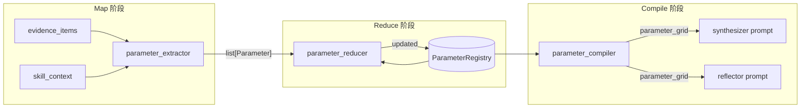

# ParameterPreservingReducer：Skill-Driven 参数提取与版本链架构

> 语言：[中文](parameter-preserving-reducer.md) | [English](../../README.md) · [中文主文档](../../README.zh-CN.md) · [文档索引](../zh/README.md)  
> 模块路径：`tradingagents/equity_research/runtime/parameter_*.py`、`reducers.py`、`skill_parameter_parser.py`  
> 相关文档：[Agent Loop & Tasks](agent-loop-and-tasks.md) · [Memory](memory.md) · [Skills & Tools](skills-and-tools.md) · [Storage](storage.md)

---

## 设计背景与动机

在 Section Research 子图的多轮迭代中，executor 产出大量非结构化证据（SEC 申报、财报电话会、新闻搜索等），经过 synthesizer 和 reflector 处理后进入下一轮。此过程中存在三个核心问题：

| 问题 | 现象 | 根因 |
|------|------|------|
| **证据丢失** | filings_search 等工具返回的数据未被提取为证据 | 提取器未覆盖所有工具输出格式 |
| **有损压缩** | synthesizer 看到的是空的 "Search" 条目而非实际内容 | `compact_prompt_block` 截断后信息丢失 |
| **参数遗忘** | 跨多轮研究时，关键数字/指标在 compact 过程中丢失 | 无结构化参数注册表，依赖 LLM 记忆 |

**ParameterPreservingReducer** 解决第三个问题，同时通过结构化参数提取间接缓解前两个问题。

---

## 架构概览

### 三阶段流水线（Map → Reduce → Compile）



### 设计决策

| 决策项 | 选择 | 理由 |
|--------|------|------|
| 架构层面 | 混合方案 | 简单字段用 LangGraph 原生 reducer，复杂字段用扩展 executor_apply |
| 去重策略 | Jaccard token overlap | 使用现有 `text_similarity()` 基础设施，无额外 embedding 开销 |
| 冲突处理 | 版本链保留 | 完整保留信息，支持追溯 |
| 参数提取 | LLM 提取（schema 由 skill.md 驱动） | 灵活、能处理复杂表述 |
| Reducer 位置 | 扩展 executor_apply | 无额外节点开销，数据局部性好 |
| **as-of 日期** | **必填字段** | 金融数据的时间上下文至关重要 |
| **长度限制** | **不限制，保留所有数据** | 避免有损压缩 |

---

## 数据模型

### Schema 层次

```
ParameterRegistry
├── parameters: dict[str, Parameter]
│   └── Parameter
│       ├── key: str                    # snake_case, e.g. "gross_margin"
│       ├── dimension: str              # from skill.md, e.g. "margin_driver_analysis"
│       ├── current: ParameterValue     # latest version
│       ├── history: list[ParameterValue]  # append-only version chain
│       ├── source_evidence_ids: list[str]
│       ├── question_id: str
│       └── is_conflict: bool           # flagged when values diverge
│
└── dimensions: list[str]               # derived from skill.md

ParameterValue
├── value: Any               # number, string, or list
├── unit: str                # "%", "USD", "x", etc.
├── as_of: str               # **mandatory** — "FY2025", "Q3 2024", "2025-03-15"
├── turn: int                # research iteration round
├── source: str              # evidence source label
├── evidence_id: str         # linked evidence ID
├── timestamp: str           # ISO 8601
├── confidence: float        # 0.0–1.0
└── raw_snippet: str         # original evidence text — retained for audit
```

### 文件映射

| 文件 | 职责 |
|------|------|
| [`parameter_schemas.py`](../../tradingagents/equity_research/runtime/parameter_schemas.py) | Pydantic schema 定义 |
| [`skill_parameter_parser.py`](../../tradingagents/equity_research/runtime/skill_parameter_parser.py) | 从 skill.md 提取参数维度 |
| [`parameter_extractor.py`](../../tradingagents/equity_research/runtime/parameter_extractor.py) | Map 阶段 — LLM 结构化提取 |
| [`parameter_reducer.py`](../../tradingagents/equity_research/runtime/parameter_reducer.py) | Reduce 阶段 — 归并与冲突检测 |
| [`parameter_compiler.py`](../../tradingagents/equity_research/runtime/parameter_compiler.py) | Compile 阶段 — 参数网格文本生成 |
| [`reducers.py`](../../tradingagents/equity_research/runtime/reducers.py) | LangGraph 原生 reducer（evidence_buffer, documents 等） |

---

## LangGraph State Reducer 注解

`AgentState`（[`runtime/state.py`](../../tradingagents/equity_research/runtime/state.py)）中的列表型字段现在使用 `Annotated` 绑定 reducer：

```python
from typing import Annotated
from tradingagents.equity_research.runtime.reducers import (
    evidence_buffer_reducer,
    pending_evidence_reducer,
    documents_reducer,
    errors_reducer,
    fact_store_reducer,
    calculation_store_reducer,
)

class AgentState(TypedDict, total=False):
    evidence_buffer: Annotated[list[dict], evidence_buffer_reducer]
    pending_evidence: Annotated[list[dict], pending_evidence_reducer]
    documents: Annotated[list[dict], documents_reducer]
    errors: Annotated[list[str], errors_reducer]
    fact_store: Annotated[list[dict], fact_store_reducer]
    calculation_store: Annotated[list[dict], calculation_store_reducer]
    
    # ParameterPreservingReducer 新增字段
    parameter_registry: dict[str, Any]   # ParameterRegistry.model_dump()
    parameter_grid: str                  # compiled text grid
```

| Reducer | 策略 | 说明 |
|---------|------|------|
| `evidence_buffer_reducer` | 语义去重 | Jaccard overlap ≥ 0.85 视为重复 |
| `pending_evidence_reducer` | 追加 | synthesizer 消费后由 apply 节点清空 |
| `documents_reducer` | doc_id 去重 | 避免同一文档多次注册 |
| `errors_reducer` | 追加 | 保留所有错误 |
| `fact_store_reducer` | 追加 | 结构化事实记录 |
| `calculation_store_reducer` | 追加 | 计算链记录 |

---

## 三阶段详解

### Map 阶段：LLM 参数提取

`extract_parameters_from_evidence()` 将一批 evidence_items 通过 LLM structured output 转化为 `list[Parameter]`。

**流程：**

1. **维度提取**：从 `skill_context` 的 `prompt_template`（Required outputs）和 `constraints` 中提取分析维度
2. **Prompt 构建**：基于维度 + 约束构建提取 prompt，强制 `as_of` 字段
3. **LLM 调用**：使用 `deps.quick_llm` + `invoke_structured_with_retry`，输出 `LLMExtractionOutput`
4. **对象转换**：将 `ExtractedParameter` 转为 `Parameter`，关联 `evidence_id` 和 `source`

**容错设计：**
- LLM 失败 → 返回空列表，记录 warning
- structured output 不支持 → 跳过提取，不影响主流程
- `as_of` 为空 → 设为 `"unknown"`

### Reduce 阶段：归并与冲突检测

`reduce_parameters()` 将新提取的参数归并到现有 `ParameterRegistry`：

1. **语义键匹配**：使用 `text_similarity(key1, key2) ≥ 0.85` 匹配已有参数
2. **冲突检测**：5% 数值容差，超出则标记 `is_conflict = True`
3. **版本链追加**：新值设为 `current`，旧值推入 `history`
4. **证据 ID 合并**：去重合并 `source_evidence_ids`

```python
# 冲突示例
registry.parameters["gross_margin"]
# → current: 60.0% (Q1 2025, Earnings Call)  ← 最新值
#   history: [75.2% (FY2025, 10-K)]          ← 旧值保留
#   is_conflict: True
```

### Compile 阶段：参数网格生成

`compile_parameter_grid()` 将 `ParameterRegistry` 渲染为人类可读的文本网格：

- 按 `dimension` 分组
- 每个参数显示 `key: value unit (as of: date) — source`
- 历史版本缩进显示（最近 3 个版本）
- 冲突参数用 ⚠️ 标记单独分组
- **无长度限制**：保留所有数据

```
[🔒 Parameter Grid — full-fidelity, do not truncate]

## margin_driver_analysis
- gross_margin: 75.2 % (as of: FY2025) — 10-K:Results of Operations
  ↳ 73.0 % (as of: FY2024, iter 0)
- operating_margin: 32.1 % (as of: FY2025) — 10-K

⚠️ Conflicts:
- revenue_growth:
  * Current: 15.3 % (as of: Q1 2025, source: Earnings)
  * History: 22.1 % (as of: FY2024, source: 10-K)
```

---

## 集成点

### executor_apply 节点

在 [`section_executor.py`](../../tradingagents/equity_research/runtime/nodes/section_executor.py) 的 `apply()` 末尾，当有 `new_evidence` 且 `active_skill_context` 非空时：

```python
# === ParameterPreservingReducer — 3-phase extraction ===
if new_evidence and skill_context:
    extracted_params, narrative = extract_parameters_from_evidence(deps, ...)
    updated_registry = reduce_parameters(existing_registry, extracted_params, ...)
    parameter_grid = compile_parameter_grid(updated_registry, ...)
    result["parameter_registry"] = updated_registry.model_dump()
    result["parameter_grid"] = parameter_grid
```

整个提取包裹在 `try/except` 中，**任何失败不影响主流程**。

### synthesizer prompt

`build_synthesizer_prompt()`（[`prompts.py`](../../tradingagents/equity_research/tasks/section_research/prompts.py)）注入 `parameter_grid`，使 synthesizer 可以看到所有已提取的结构化参数。

### reflector prompt

`build_reflector_user_prompt()` 注入 `parameter_grid`（通过 `compact_prompt_block` 包装），使 reflector 可以评估参数覆盖度。

---

## 配置

在 `default_config.py` 的 `equity_research` 块中新增：

```python
"equity_research": {
    # ... existing config ...
    
    # ParameterPreservingReducer configuration
    "reducer_dedup_threshold": 0.85,    # Jaccard overlap 阈值
    "reducer_conflict_tolerance": 0.05, # 数值冲突容差 (5%)
    "reducer_max_history": 10,          # 每个参数最大历史版本数
}
```

---

## 可视化与调试

### 参数网格查看

运行 Section Research 后，`state["parameter_grid"]` 包含编译后的参数文本。可通过可视化脚本查看：

```bash
uv run python scripts/visualize_nvda_section.py out/nvda_section.json --open
```

HTML 输出的 **Parameter Registry** 区域展示：
- 按维度分组的参数表
- 冲突标记（🔴 红色高亮）
- 版本链展开

### 直接检查注册表

```python
from tradingagents.equity_research.runtime.parameter_schemas import ParameterRegistry

registry = ParameterRegistry.model_validate(state["parameter_registry"])
for key, param in registry.parameters.items():
    print(f"{key}: {param.current.value} {param.current.unit} (as of: {param.current.as_of})")
    if param.is_conflict:
        print(f"  ⚠️ CONFLICT — {len(param.history)} historical values")
```

---

## 测试

44 个单元测试覆盖完整流水线：

```bash
uv run pytest tests/equity_research/test_parameter_reducer.py -v
```

| 测试类 | 数量 | 覆盖范围 |
|--------|------|----------|
| `TestParameterSchemas` | 6 | Schema 验证、roundtrip |
| `TestSkillParameterParser` | 6 | 维度提取、prompt 构建 |
| `TestLangGraphReducers` | 11 | 语义去重、doc_id 去重、追加 |
| `TestParameterExtractor` | 6 | LLM 提取、维度推断、容错 |
| `TestParameterReducer` | 9 | 归并、冲突检测、版本链、容差 |
| `TestParameterCompiler` | 6 | 网格渲染、冲突展示、无长度限制 |

---

## 假设与限制

| 假设 | 影响 |
|------|------|
| `active_skill_context` 在 executor_apply 执行时已填充 | 若为空，跳过参数提取 |
| LLM 能够准确提取 `as_of` 日期 | 不准确的日期会导致错误的版本链排序 |
| 参数注册表大小 < 100 个参数 | state 膨胀可控；超出时考虑分维度归档 |
| Jaccard overlap 0.85 能有效去重 | 对短 snippet 可能过度去重 |
| 5% 数值容差适用于金融数据 | 对高精度场景可能过宽 |

---

## 后续演进

1. **向量嵌入去重**：替换 Jaccard overlap 为 embedding cosine similarity，提升语义去重精度
2. **跨 Section 参数共享**：通过外层 state 传递 `parameter_registry`，支持跨 section 参数引用
3. **参数验证闭环**：在 finalizer 中验证最终报告是否引用了所有关键参数
4. **自适应维度提取**：使用 LLM 从 skill.md 动态提取维度，替代正则匹配
