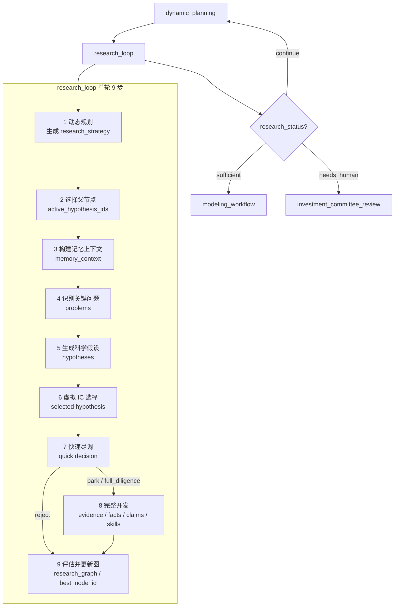
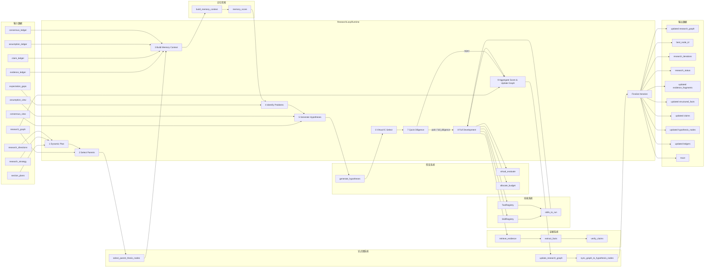
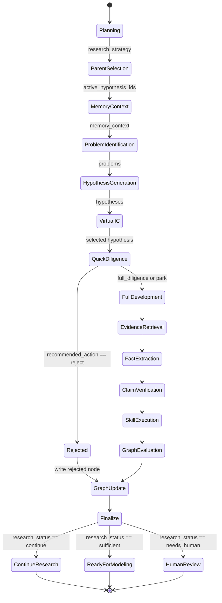

# Research Loop 设计架构与数据流说明

## 1. 总体定位

`research_loop` 是一个面向股票研究 / 投资论点研发的多轮迭代运行时。它位于外层工作流中，承接 `dynamic_planning` 的研究策略输入，并在多个外层迭代中持续探索、验证和更新一个分支化的投资论点 DAG，即 `research_graph`。

与单任务式的假设验证不同，当前 `research_loop` 的核心目标不是一次性完成某个固定问题，而是：

1. 从共识差异、假设账本、研究方向和历史证据中发现潜在投资分歧；
2. 生成多个可验证的投资假设；
3. 通过虚拟 IC 和快速尽调筛选高潜力分支；
4. 对入选分支进行完整证据开发、事实提取、主张验证和技能分析；
5. 将结果写回 `research_graph`；
6. 根据最佳论点分数和迭代阶段决定继续研究或进入建模流程。

---

## 2. 架构分层

当前设计可以拆成六个主要层次。

### 2.1 外层工作流层

负责控制 `research_loop` 与其他节点之间的路由。

主要节点包括：

- `dynamic_planning`
- `research_loop`
- `modeling_workflow`
- `investment_committee_review`

外层路由逻辑由 `research_loop_router` 控制：

| 条件 | 下一节点 |
|---|---|
| `research_status == "sufficient"` | `modeling_workflow` |
| `research_iterations >= max_research_iterations` | `modeling_workflow` |
| `research_status == "needs_human"` | `investment_committee_review` |
| 其他情况 | `dynamic_planning` |

---

### 2.2 ResearchLoopRuntime 编排层

核心类：

```python
ResearchLoopRuntime
```

主要职责：

- 复制并维护当前 `state`
- 执行单轮 9 步研究流程
- 调用假设生成、证据检索、事实提取、主张验证、技能运行等子模块
- 更新 `research_graph`
- 更新 `research_iterations`
- 设置 `research_status`
- 写入 trace 和 ledger

入口函数：

```python
def run(self, state: dict[str, Any]) -> dict[str, Any]
```

外部工厂函数：

```python
def create_research_loop(deps: EquityResearchDeps)
```

---

### 2.3 论点图层：research_graph

核心数据结构：

```python
research_graph = {
    "nodes": {},
    "edges": [],
    "best_node_id": None,
    "branches": {}
}
```

每个节点对应一个投资论点或研究分支。

节点结构由 `ResearchNode` 表示：

| 字段 | 含义 |
|---|---|
| `node_id` | 节点 ID |
| `parent_ids` | 父节点列表 |
| `branch_id` | 所属分支 |
| `thesis` | 投资论点文本 |
| `research_question` | 研究问题 |
| `expected_model_impact` | 对模型的预期影响 |
| `category` | 论点类别 |
| `artifacts` | 研究产物 |
| `evidence_ids` | 证据 ID |
| `claim_ids` | 主张 ID |
| `assumption_ids` | 假设 ID |
| `virtual_score` | 虚拟评估分数 |
| `real_score` | 真实研究评分 |
| `status` | 节点状态 |
| `failure_reason` | 失败原因 |

节点状态包括：

```python
"proposed" | "developed" | "evaluated" | "merged" | "rejected"
```

---

### 2.4 记忆与账本层

主要函数：

```python
build_memory_context()
sync_ledgers_from_legacy()
write_to_ledger()
```

使用的账本包括：

- `evidence_ledger`
- `claim_ledger`
- `assumption_ledger`
- `consensus_ledger`
- `cross_branch_discoveries`
- `issue ledger`

`build_memory_context()` 会根据当前研究问题、父节点和策略，从历史账本中检索相关证据、主张和假设，为下一轮假设生成提供上下文。

---

### 2.5 假设与证据 Agent 层

假设相关 Agent：

| Agent | 作用 |
|---|---|
| `create_generate_hypotheses` | 生成 3-5 个投资假设 |
| `create_virtual_evaluate` | 对假设进行虚拟评分和筛选 |
| `create_allocate_budget` | 分配或读取研究预算 |

证据相关 Agent：

| Agent | 作用 |
|---|---|
| `create_retrieve_evidence` | 检索外部证据 |
| `create_extract_facts` | 从证据中提取结构化事实 |
| `create_verify_claims` | 验证研究主张 |
| `create_evaluate_stop_condition` | 判断假设级研究是否停止 |

---

### 2.6 Skill / Tool 层

完整开发阶段会运行规划器指定的技能：

```python
strategy["skills_to_run"]
```

当前代码最多运行前两个技能：

```python
for skill_name in strategy.get("skills_to_run", [])[:2]:
```

技能通过：

```python
SkillRegistry
ToolRegistry
```

加载并执行。

技能输出可能更新：

- `claims`
- `valuation_model`
- `historical_financials`
- 其他 artifacts

---

## 3. 单轮执行方式

每次进入 `research_loop`，会执行一轮完整的 9 步流程。

整体流程如下：

1. 动态规划当前阶段和研究策略；
2. 从 `research_graph` 中选择父节点；
3. 构造记忆上下文；
4. 识别关键研究问题；
5. 生成科学投资假设；
6. 虚拟 IC 选择最优假设；
7. 快速尽调，判断是否拒绝、搁置或完整开发；
8. 若未拒绝，执行完整证据开发；
9. 聚合评分，更新 `research_graph`，判断是否结束研究。

---

## 4. 研究阶段推进机制

当前阶段由 `research_iterations / max_research_iterations` 决定。

| 阶段 | 触发区间 | 研究倾向 |
|---|---:|---|
| `orientation` | 前 30% | 广泛探索 |
| `thesis_discovery` | 30% - 60% | 发现核心论点 |
| `diligence_modeling` | 60% - 85% | 深入尽调与建模准备 |
| `convergence` | 最后 15% | 收敛到最终论点 |

阶段判断逻辑：

```python
if iterations < max_iter * 0.3:
    stage = "orientation"
elif iterations < max_iter * 0.6:
    stage = "thesis_discovery"
elif iterations < max_iter * 0.85:
    stage = "diligence_modeling"
else:
    stage = "convergence"
```

---

## 5. 单轮 9 步输入输出

### Step 1：动态规划

对应方法：

```python
_dynamic_plan()
```

#### 输入

| 输入 | 来源 | 说明 |
|---|---|---|
| `research_iterations` | state | 当前研究轮次 |
| `max_research_iterations` | state | 最大研究轮次 |
| `research_graph` | state | 当前论点图 |
| `research_strategy` | state | 上一轮策略 |
| `research_gaps` | state | 研究缺口 |
| `research_plan.core_questions` | state | 核心问题 |

#### 处理

优先调用 LLM：

```python
dynamic_planning_prompt(state)
```

若失败则使用规则兜底。

#### 输出

```python
research_strategy = {
    "stage": "...",
    "exploration_vs_exploitation": "...",
    "priority_questions": [...],
    "skills_to_run": [...],
    "budget_allocation": {...},
    "avoid_actions": [...],
    "reason": "..."
}
```

同时更新：

```python
working["research_phase"]
```

---

### Step 2：选择父节点

对应函数：

```python
select_parent_thesis_nodes(graph, strategy)
```

#### 输入

| 输入 | 说明 |
|---|---|
| `research_graph.nodes` | 当前所有论点节点 |
| `research_strategy` | 当前策略 |
| `max_parents` | 默认最多选择 2 个父节点 |

#### 处理

按照节点分数选择父节点：

```python
score = real_score or virtual_score or 0.3
```

对已开发或已评估节点加分：

```python
if status in ("evaluated", "developed", "merged"):
    score += 0.1
```

并尽量保持分支多样性。

#### 输出

```python
active_hypothesis_ids = [...]
```

注意：这里虽然字段名叫 `active_hypothesis_ids`，但实际存储的是 `research_graph` 的父节点 ID。

---

### Step 3：构建记忆上下文

对应函数：

```python
build_memory_context(working, parents, strategy)
```

#### 输入

| 输入 | 说明 |
|---|---|
| `research_strategy.priority_questions` | 当前优先问题 |
| `parents` | 当前父节点 |
| `research_graph.nodes` | 论点节点 |
| `evidence_ledger` | 历史证据 |
| `claim_ledger` | 历史主张 |
| `assumption_ledger` | 历史假设 |
| `consensus_ledger` | 历史共识 |
| `cross_branch_discoveries` | 跨分支发现 |

#### 处理

构造 query：

优先级如下：

1. `strategy.priority_questions`
2. 父节点的 `thesis` 或 `research_question`
3. `active_objective`
4. `ticker`

然后对证据和主张打分：

```python
memory_score = 
    0.30 * semantic_similarity
  + 0.25 * evidence_reliability
  + 0.20 * thesis_node_score
  + 0.15 * recency_score
  + 0.10 * financial_materiality
  - 0.10 * redundancy_penalty
```

#### 输出

```python
memory_context = {
    "query": "...",
    "parent_nodes": [...],
    "evidence": [...],
    "claims": [...],
    "assumptions": [...],
    "consensus": [...],
    "cross_branch_discoveries": [...],
    "failure_patterns": [...]
}
```

---

### Step 4：识别关键研究问题

对应方法：

```python
_identify_problems()
```

#### 输入

| 输入 | 说明 |
|---|---|
| `expectation_gaps` | 共识差异 |
| `memory_context` | 历史记忆上下文 |
| `ticker` | 股票代码 |

#### 处理逻辑

优先使用：

```python
state["expectation_gaps"]
```

如果没有，则调用 LLM：

```python
key_research_problems_prompt(state, memory_context)
```

如果 LLM 失败，则使用兜底问题。

#### 输出

```python
problems = [
    {
        "problem": "...",
        "category": "...",
        "priority": "high",
        "why_it_matters": "...",
        "financial_statement_link": "...",
        "required_evidence": [...]
    }
]
```

---

### Step 5：生成科学投资假设

对应方法：

```python
_generate_scientific_hypotheses()
```

#### 输入

| 输入 | 说明 |
|---|---|
| `state` | 当前状态 |
| `problems` | 关键研究问题 |
| `memory_context` | 历史记忆 |
| `consensus_view` | 共识视图 |
| `assumption_view` | 假设视图 |

#### 处理

调用深度 LLM：

```python
scientific_hypothesis_prompt(state, problems, memory_context)
```

要求输出带五维评分的投资假设。

若没有生成结果，则 fallback 到：

```python
_generate_hypotheses(working)
```

#### 输出

```python
hypotheses = [
    {
        "hypothesis": "...",
        "category": "...",
        "mechanism": "...",
        "expected_financial_impact": "...",
        "expected_valuation_impact": "...",
        "required_evidence": [...],
        "potential_counter_evidence": [...],
        "catalysts": [...],
        "scores": {
            "alignment": ...,
            "financial_impact": ...,
            "variant_view": ...,
            "evidence_feasibility": ...,
            "risk_reward": ...
        },
        "overall_score": ...,
        "recommended_next_action": "..."
    }
]
```

Fallback 情况下会更新：

```python
hypothesis_nodes
active_hypothesis_ids
```

---

### Step 6：虚拟 IC 选择

对应方法：

```python
_virtual_select()
```

#### 输入

| 输入 | 说明 |
|---|---|
| `hypotheses` | 候选假设 |
| `overall_score` | 假设总分 |
| `recommended_next_action` | 建议动作 |

#### 处理

当前实现是规则排序，不实际调用 `virtual_evaluation_prompt()`。

评分调整逻辑：

```python
if recommended_next_action == "reject":
    score *= 0.3
elif recommended_next_action == "park":
    score *= 0.6
```

选择最高分假设。

#### 输出

```python
selected = {
    "hypothesis": "...",
    "category": "...",
    "overall_score": ...
}
```

如果没有可选假设，则使用默认假设：

```python
_default_hypothesis()
```

---

### Step 7：快速尽调

对应方法：

```python
_quick_diligence()
```

#### 输入

| 输入 | 说明 |
|---|---|
| `selected` | 被选中的假设 |
| `state` | 当前状态 |

#### 处理

调用快速 LLM：

```python
quick_diligence_prompt(hypothesis)
```

要求最多使用约 5 条证据进行快速检查。

若 LLM 失败，则使用规则兜底：

```python
score = overall_score / 10
action = "full_diligence" if score >= 0.5 else "park"
```

#### 输出

```python
quick = {
    "hypothesis": "...",
    "quick_evidence_summary": "...",
    "counter_evidence": [...],
    "rough_financial_materiality": "...",
    "confidence": 0.0,
    "recommended_action": "full_diligence" | "park" | "reject",
    "reason": "..."
}
```

#### 特殊路径：reject

如果：

```python
quick["recommended_action"] == "reject"
```

则直接写入 `research_graph`：

```python
status = "rejected"
failure_reason = quick["reason"]
```

然后提前结束本轮，不执行完整开发。

---

### Step 8：完整开发

对应方法：

```python
_full_development()
```

#### 输入

| 输入 | 说明 |
|---|---|
| `state` | 当前状态 |
| `selected` | 选中的假设 |
| `research_strategy` | 当前研究策略 |
| `skills_to_run` | 需要运行的技能 |

#### 处理步骤

完整开发内部又包含几个子步骤：

1. 将 selected hypothesis 写入 `hypothesis_nodes`
2. 设置 `active_hypothesis_ids`
3. 设置 `active_section_id = "1_investment_summary"`
4. 分配预算
5. 虚拟评估假设
6. 检索证据
7. 提取事实
8. 验证主张
9. 运行规划器指定的技能

对应调用：

```python
working.update(self._allocate_budget(working))
working.update(self._virtual_evaluate(working))
working.update(self._retrieve_evidence(working))
working.update(self._extract_facts(working))
working.update(self._verify_claims(working))
```

然后运行技能：

```python
for skill_name in strategy.get("skills_to_run", [])[:2]:
    skill.run(...)
```

#### 输出

```python
dev_updates = {
    "hypothesis_nodes": {...},
    "active_hypothesis_ids": [...],
    "verified_hypothesis_ids": [...],
    "claims": [...],
    "evidence_fragments": [...],
    "contradiction_fragments": [...],
    "structured_facts": [...],
    "documents": [...],
    "research_budget": {...},
    "api_calls": ...,
    "valuation_model": {...},
    "historical_financials": {...}
}
```

---

### Step 9：评估并更新论点图

对应逻辑：

```python
aggregate_thesis_score()
update_research_graph()
_finalize_iteration()
```

#### 输入

| 输入 | 说明 |
|---|---|
| `working` | 完整开发后的状态 |
| `selected` | 当前假设 |
| `quick` | 快速尽调结果 |
| `evidence_fragments` | 最近证据 |
| `claims` | 最近主张 |
| `valuation_model` | 估值模型 |
| `forecast_model` | 预测模型 |
| `research_graph` | 当前论点图 |

#### 构造 artifacts

```python
artifacts = {
    "evidence_ids": [...],
    "claim_ids": [...],
    "valuation_model": working.get("valuation_model"),
    "forecast_model": working.get("forecast_model"),
    "counter_evidence": quick.get("counter_evidence", [])
}
```

#### 聚合评分

```python
evaluation = aggregate_thesis_score(working, artifacts, selected)
real_score = evaluation.aggregate_score
```

当前评分权重：

| 维度 | 权重 |
|---|---:|
| 证据质量 | 20% |
| 共识缺口 | 20% |
| 财务重要性 | 20% |
| 估值影响 | 15% |
| 催化剂 | 10% |
| 风险调整 | 10% |
| 新颖性 | 5% |

#### 更新 `research_graph`

```python
graph = update_research_graph(
    graph,
    parents=parents,
    thesis=selected["hypothesis"],
    research_question=problems[0]["problem"],
    branch_id=selected["category"],
    artifacts=artifacts,
    evidence_ids=artifacts["evidence_ids"],
    claim_ids=artifacts["claim_ids"],
    virtual_score=selected["overall_score"] / 10,
    real_score=real_score,
    status="evaluated" if evaluation.passed else "developed"
)
```

#### 输出

更新后的：

```python
research_graph
best_node_id
research_iterations
research_status
hypothesis_nodes
active_objective
last_updated
trace
ledgers
```

---

## 6. 终止与路由判断

最终由 `_finalize_iteration()` 计算本轮后的 `research_status`。

### 6.1 关键变量

| 变量 | 说明 |
|---|---|
| `best_score` | 当前最佳节点真实评分 |
| `score_threshold` | 论点通过阈值，默认从 config 读取 |
| `stage` | 当前研究阶段 |
| `iterations` | 当前迭代次数 |
| `max_iterations` | 最大迭代次数 |
| `graph_nodes` | 当前论点图节点 |

### 6.2 状态判断逻辑

```python
if rejected:
    research_status = "continue"
elif best_score >= score_threshold and stage == "convergence":
    research_status = "sufficient"
elif iterations >= max_iterations:
    research_status = "sufficient"
elif best_score >= score_threshold and len(graph_nodes) >= 3:
    research_status = "sufficient"
else:
    research_status = "continue"
```

### 6.3 输出状态

| `research_status` | 含义 |
|---|---|
| `continue` | 继续研究，回到外层 `dynamic_planning` |
| `sufficient` | 研究足够，进入 `modeling_workflow` |
| `needs_human` | 需要人工 IC 审查，目前代码中尚未明显设置 |

---

## 7. Mermaid：整体控制流



---

## 8. Mermaid：数据流图



---

## 9. Mermaid：核心状态更新流



---

## 10. 当前设计的关键数据对象

### 10.1 输入对象

| 对象 | 类型 | 作用 |
|---|---|---|
| `section_plans` | dict / json | 报告章节计划 |
| `research_strategy` | dict | 当前研究策略 |
| `consensus_view` | report / text | 市场共识视图 |
| `assumption_view` | json | 当前争论点、股价假设、模型假设 |
| `research_directions` | outline / json | 已规划好的研究方向 |
| `expectation_gaps` | list[dict] | 共识差异 |
| `research_graph` | dict | 投资论点 DAG |
| `evidence_ledger` | list[dict] | 历史证据 |
| `claim_ledger` | list[dict] | 历史主张 |
| `assumption_ledger` | list[dict] | 历史假设 |
| `consensus_ledger` | list[dict] | 历史共识 |

---

### 10.2 中间对象

| 对象 | 产生步骤 | 作用 |
|---|---|---|
| `research_strategy` | Step 1 | 控制当前轮研究方向 |
| `parents` | Step 2 | 当前扩展的父论点节点 |
| `memory_context` | Step 3 | 跨轮研究记忆 |
| `problems` | Step 4 | 当前优先研究问题 |
| `hypotheses` | Step 5 | 候选投资假设 |
| `selected` | Step 6 | 被选中的假设 |
| `quick` | Step 7 | 快速尽调结果 |
| `dev_updates` | Step 8 | 完整开发产物 |
| `artifacts` | Step 9 | 用于聚合评分的研究产物 |
| `evaluation` | Step 9 | 聚合评分结果 |

---

### 10.3 输出对象

| 对象 | 说明 |
|---|---|
| `research_graph` | 更新后的论点图 |
| `research_graph.best_node_id` | 当前最佳论点节点 |
| `research_iterations` | 已完成研究轮次 |
| `research_status` | 当前研究状态 |
| `hypothesis_nodes` | 与 graph 同步后的假设节点 |
| `evidence_fragments` | 新增或累计证据片段 |
| `structured_facts` | 结构化事实 |
| `claims` | 研究主张 |
| `verified_hypothesis_ids` | 已验证假设 |
| `documents` | 文档元数据 |
| `valuation_model` | 估值模型 |
| `historical_financials` | 历史财务数据 |
| `research_budget` | 研究预算状态 |
| `api_calls` | API 调用次数 |
| `trace` | 运行追踪 |
| `ledger_sync` | 同步后的账本更新 |

---

## 11. 当前执行路径总结

单轮执行可以简化为：

```text
state
  → dynamic plan
  → select parent nodes from research_graph
  → retrieve memory context
  → identify key problems
  → generate hypotheses
  → select one hypothesis
  → quick diligence
      → reject: write rejected node and finalize
      → not reject: full development
          → allocate budget
          → virtual evaluate
          → retrieve evidence
          → extract facts
          → verify claims
          → run skills
  → aggregate thesis score
  → update research_graph
  → sync graph to hypothesis_nodes
  → update research_iterations and research_status
  → return updated state
```

---

## 12. 一句话概括

当前 `research_loop` 是一个以 `research_graph` 为核心状态容器、以 LLM 假设生成和证据开发为执行手段、以聚合论点评分为收敛标准的多轮投资论点研发循环。它每轮选择已有论点分支进行扩展，生成并筛选新假设，通过快速尽调和完整开发验证论点，最后将结果写回图结构，并由 `research_status` 控制是否继续研究或进入建模流程。