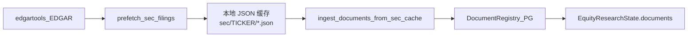
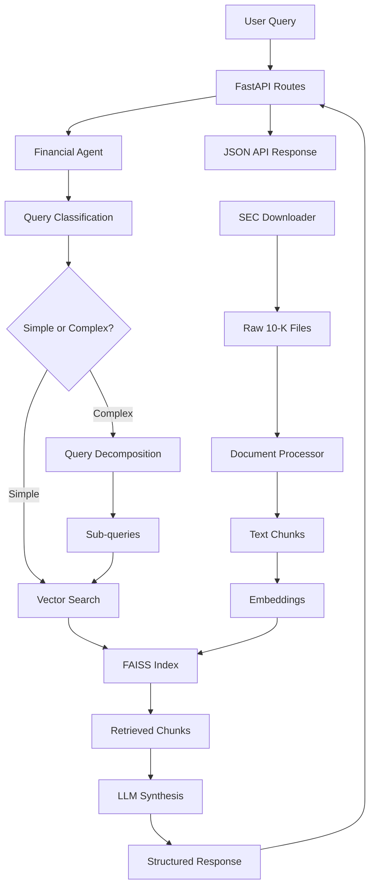

# SEC Filing RAG：现状与规划

> 语言：[中文](sec-filing-rag.md) | [English](../../README.md) · [中文主文档](../../README.zh-CN.md) · [文档索引](../zh/README.md)  
> 相关文档：[storage.md](storage.md) · [memory.md](memory.md) · [file-structure.md](file-structure.md)

本文说明 Equity Research 流水线中 **SEC 申报文件** 的摄取与检索现状（MVP1），以及计划自研并接入主流程的 **SEC Filing RAG** 模块目标架构与集成路径。

---

## 1. 当前实现（MVP1）

在 `analyze_research_task` 节点启动时，SEC 文件在共识子图之前预取并登记为文档元数据：

```text
prefetch_sec_filings(deps, ticker)
  → ingest_documents_from_sec_cache(deps, state)
  → GenericResearchSubgraph(consensus) → …
```

### 1.1 代码路径

| 组件 | 路径 | 职责 |
|------|------|------|
| EDGAR 客户端 | `integrations/edgar.py` | 通过 `edgartools` 拉取最近 `10-K` / `10-Q` / `8-K` |
| 本地缓存 | `integrations/sec_cache.py` | 写入 `{data_cache_dir}/equity_research/sec/{TICKER}/*.json` |
| 文档注册 | `storage/document_registry.py` | 将 filing 元数据写入 PostgreSQL `document_registry` |
| 任务入口 | `agents/task_analysis.py` | 串行调用 prefetch + ingest |

### 1.2 当前数据流



### 1.3 现状特点与局限

| 能力 | MVP1 状态 |
|------|-----------|
| 从 SEC EDGAR 下载真实申报 | ✅ `EdgarClient.fetch_recent_filings` |
| 文本摘录 | ✅ 每份 filing 最多 ~8000 字符 `text_excerpt` |
| 本地文件缓存 | ✅ JSON 元数据 + excerpt |
| 持久化文档注册 | ✅ `DocumentRegistry` |
| **语义分块（chunking）** | ❌ 未按 Item 1 / Item 7 等章节切分 |
| **向量索引（pgvector）** | ⚠️ `EvidenceStore` 已支持 pgvector，但 SEC 全文未走完整 RAG 管线 |
| **查询分解 / 多步检索** | ❌ 深搜主要由 Perplexity PER 子图承担，非 filing 内向量 RAG |
| **跨公司对比查询** | ❌ 单 ticker 流水线 |

环境变量：`SEC_EDGAR_USER_AGENT`（SEC 要求标识请求的 User-Agent，通常为邮箱）。

配置缓存目录：`data_cache_dir`（默认与主项目 `TRADINGAGENTS_CACHE_DIR` 一致）。

---

## 2. 目标模块：SEC Filing RAG

计划在 `tradingagents/equity_research/integrations/` 下新增 **SEC Filing RAG** 子系统，承接 MVP1 的 prefetch/ingest，提供申报内向量检索与多步推理能力，并接入 `research_loop`、证据账本与合规链路。

### 2.1 核心能力（规划）

| 能力 | 说明 |
|------|------|
| **全文摄取** | 在现有 `EdgarClient` 基础上提取 10-K / 10-Q 全文，替代单段 excerpt |
| **章节感知分块** | 按 SEC 结构（Item 1、Item 7、Item 8 等）语义分块，保留公司/财年/章节/页码元数据 |
| **分块策略** | 约 800 词/块、100 词重叠（可调），写入 `EvidenceStore` |
| **向量检索** | 复用 `EvidenceStore.search_similar(ticker, query_embedding)` + pgvector |
| **查询路由** | 简单问题直接检索；复杂问题（跨章节、跨财年、跨公司）分解为子查询队列 |
| **来源引用** | 每条证据附带 filing URL、accession、章节、页码，供 faithfulness 评估与合规校验 |



### 2.2 目标数据管线

```text
prefetch_sec_filings（现有）
  → sec_rag.ingest_full_text（新增）
    → 章节感知分块
    → embedding → EvidenceStore.upsert
  → 向量索引就绪，供 research_loop / PER 子图调用
```

### 2.3 查询处理（规划）

```text
用户 / 子图问题 → SecFilingRAGAgent
  ├─ 简单 → 向量检索 Top-K → 写入 evidence_ledger
  └─ 复杂 → 查询分解为子问题 → 多次检索 → 合并证据 + 来源引用
```

典型查询场景：

1. 基础指标：「该公司最近财年总收入是多少？」
2. 同比：「数据中心收入近两年增速？」
3. 跨公司：「同业 operating margin 对比」
4. 分部：「云业务收入占比及趋势」
5. 战略：「管理层对 AI 投资的表述与资本开支对应关系」

---

## 3. 与现有系统的接入点

| 接入层 | 现状 | 规划变更 |
|--------|------|----------|
| `analyze_research_task` | prefetch + ingest 元数据 | 追加 `sec_rag.build_index(ticker)`，在共识子图前完成索引 |
| `ToolRegistry` | 无 filing 专用检索工具 | 新增 `sec_filing_search`：自然语言问题 + ticker → Top-K chunks |
| `research_loop` | Perplexity 联网深搜为主 | PER 子图可调用 `sec_filing_search`，优先使用已索引申报 |
| `evidence_ledger` | 共识/假设证据写入 | filing chunk 作为 `source_type=sec_filing` 条目 |
| `build_memory_context()` | 账本检索上下文 | 纳入 filing 证据，供写作与 QA 节点引用 |
| `tasks/consensus/compliance.py` | 公开来源策略 | filing 引用须带 EDGAR accession / 章节，与合规规则对齐 |

### 3.1 建议模块布局

```text
tradingagents/equity_research/integrations/
  edgar.py              # 现有 EDGAR 客户端
  sec_cache.py          # 现有 JSON 缓存
  sec_rag/              # 新增
    __init__.py
    chunker.py          # 章节感知分块
    indexer.py          # 全文 → EvidenceStore
    retriever.py        # 向量检索 + 元数据过滤
    query_router.py     # 简单 / 复杂查询路由与分解
```

---

## 4. 实现阶段

| 阶段 | 内容 | 依赖 |
|------|------|------|
| **P0** | 全文提取 + 章节分块 + `EvidenceStore` 写入 | MVP1 prefetch、`embedding_provider` |
| **P1** | `sec_filing_search` 工具 + `research_loop` 接入 | P0、`ToolRegistry` |
| **P2** | 查询分解（复杂问题子查询队列） | P1、`GenericResearchSubgraph` 或独立 `TaskProfile` |
| **P3** | 跨 ticker 对比、多财年联合检索 | P2、多标的索引管理 |

---

## 5. 相关配置速查

| 变量 / 配置 | 用途 |
|-------------|------|
| `SEC_EDGAR_USER_AGENT` | EDGAR API 身份（必填） |
| `data_cache_dir` | SEC JSON 缓存根目录 |
| `TRADINGAGENTS_POSTGRES_URL` | `document_registry`、`evidence_fragment` |
| `equity_research.embedding_provider` | pgvector 嵌入（`hash` / `openai` / `qwen`） |
| `PERPLEXITY_API_KEY` | 当前共识/假设深搜（申报外联网补充） |

---

## 6. 延伸阅读

| 资源 | 路径 |
|------|------|
| SEC 缓存实现 | `tradingagents/equity_research/integrations/sec_cache.py` |
| EDGAR 客户端 | `tradingagents/equity_research/integrations/edgar.py` |
| 证据向量存储 | [storage.md](storage.md) § PostgreSQL |
| 任务分析入口 | `tradingagents/equity_research/agents/task_analysis.py` |
| 合规策略 | `tradingagents/equity_research/tasks/consensus/compliance.py` |
