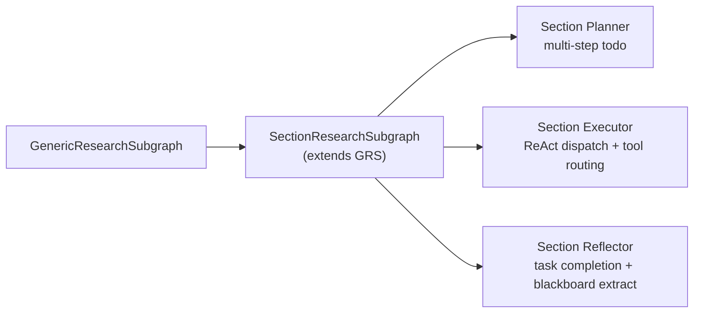
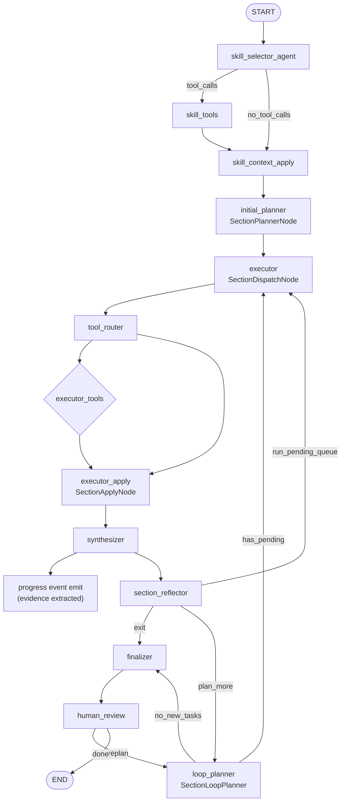
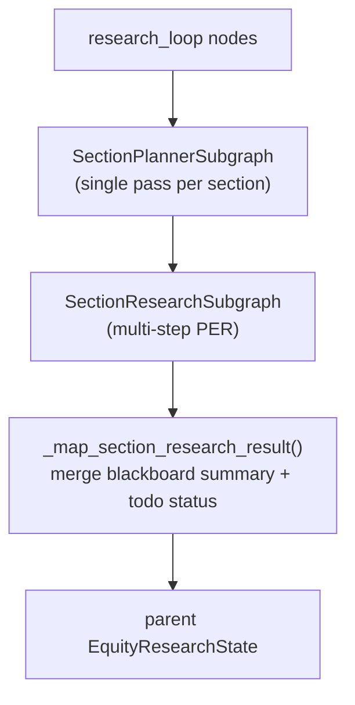

# Section Research Subgraph：多步 todo 驱动的 PER 变体

> 语言：[中文](section-research-subgraph.md) | [English](../EQUITY_RESEARCH.md) · [中文主文档](../../README.zh-CN.md) · [文档索引](../zh/README.md)  
> 模块路径：`tradingagents/equity_research/runtime/section_research_subgraph.py`、`runtime/nodes/section_*.py`  
> 相关文档：[Agent Loop & Tasks](agent-loop-and-tasks.md) · [Context](context.md) · [Skills & Tools](skills-and-tools.md) · [Memory](memory.md)

本文描述 **SectionResearchSubgraph** —— 基于 `GenericResearchSubgraph` 构建的 section research 专用 PER 循环。与 consensus/assumption 子图的 Perplexity query-driven 不同，section research 采用 **多步 todo plan + ReAct executor** 模式。

---

## 1. 定位与目标

### 1.1 与 GenericResearchSubgraph 的关系



| 维度 | GenericResearchSubgraph | SectionResearchSubgraph |
|------|------------------------|-------------------------|
| 调用方 | `consensus`, `assumption`, 手动 demo | `research_loop`（每节一次 subgraph） |
| Planner 产出 | `QueryPlan`（Perplexity queries） | `ResearchTaskPlan`（todo items with actions） |
| Executor | Batch search via Perplexity | ReAct loop: plan → execute → synthesize → reflect → replan |
| Tool grouping | 无 | retrieval / computation / action 三组路由 |
| Stop condition | coverage score threshold | task completion status + max_iterations |
| 参数提取 | 无 | `ParameterPreservingReducer`（Map→Reduce→Compile） |
| Blackboard | 无 | synthesizer/reflector 自动提取 entry |

### 1.2 Section 生命周期

```text
analyze_research_task (consensus + assumption)
  → dynamic_planning (generate section_plans for 9 sections)
  → research_loop:
      for each section_id:
        → SectionResearchSubgraph(section_plan)
          → skill_selector → initial_planner → executor → synthesizer → reflector
          → replan? (loop_planner → executor)* → finalizer
        → merge results to parent state
  → modeling_workflow → valuation_workflow → ...
```

---

## 2. 拓扑结构

继承自 `GenericResearchSubgraph.build()` 并在其后追加/替换专用节点：



文本等价：

```text
START → skill_selector_agent → skill_tools / skill_context_apply
     → initial_planner → executor → tool_router → executor_tools/executor_apply
     → synthesizer → progress_event_emit → section_reflector
     → exit | run_pending_queue | plan_more
     → [loop_planner → executor]*
     → finalizer → [human_review] → END
```

关键差异点（相对于 GenericResearchSubgraph）：

- `initial_planner` → `SectionPlannerNode`（生成 multi-step todo plan 而非 query queue）
- `executor` → `SectionDispatchNode` + `tool_router` + `executor_apply`（ReAct dispatch 分组路由）
- `synthesizer` → 后接 `progress_event_emit`（证据提取时 emit ProgressEvent）
- `reflector` → `section_reflector`（task-level reflector + blackboard extraction）
- `loop_planner` → `SectionLoopPlanner`（从 pending tasks 生成补搜计划）

---

## 3. Section Executor：ReAct Dispatch 与工具路由

### 3.1 SectionDispatchNode

实现于 [`runtime/nodes/section_executor.py`](../../tradingagents/equity_research/runtime/nodes/section_executor.py)。每个 todo item 对应一个 step action，dispatch node 负责：

1. 从 `research_todo.items` 取出下一个待处理 item
2. 根据 `step.action` 选择要用的工具组（retrieval/computation/action）
3. 构建 system prompt，注入 tool group hint、step payload（verify/compare/calculate）、blackboard context
4. 执行多轮 LLM ↔ ToolNode 交互

### 3.2 ToolRouter 与工具分组

[`runtime/nodes/tool_router.py`](../../tradingagents/equity_research/runtime/nodes/tool_router.py) 在执行前将工具分类为三个语义组：

| 组名 | 作用 | 对应 step action | 典型工具 |
|------|------|------------------|----------|
| **retrieval** | 读取/获取/搜索 | orient, fetch_primary, search | filings_search, web_search, transcript_search, filing_reader, memory_retrieve, search_evidence, search_claims |
| **computation** | 分析/验证/计算 | calculate, compare, verify | calculator, time_series_analyzer, conflict_detector, citation_checker, claim_evidence_checker |
| **action** | 写入/持久化/管理 | synthesize | list_research_todos, add_research_todo, remove_research_todo, update_research_todo_status, memory_write |

路由优先级：

1. **Tool names** — 最后一条 AIMessage 的工具调用 → 直接查组
2. **Step action** → ACTION_TO_GROUP 字典查找
3. **Tool hints** — active_step.tool_hints 多数投票
4. **Description keywords** — 最后手段：action > computation > retrieval（默认 retrieval）

### 3.3 Step Payload（确定性上下文）

当 `action ∈ {verify, compare, calculate}` 时，dispatch 在首条 HumanMessage 末尾注入结构化 JSON payload：

| 字段 / 行为 | 说明 |
|-------------|------|
| 过滤 | 优先 `question_id == 当前 qid` 的 evidence；空则回退本 section 未标注 qid 条目 |
| verify/compare | evidence 摘要、metadata 缺口表、claims、citation URLs |
| calculate | 带 metric/value 的 numeric evidence + calculation_store 切片 |
| metadata | 四字段规范 + 别名回填（source_type, fiscal_quarter_or_date, platform, traceable_ref） |
| 截断 | evidence ≤ 8（quote ≤ 240 char）、claims ≤ 15、URLs ≤ 20 |
| 空态 | `status: "empty"` + `gaps`；禁止仪式性计算 |

### 3.4 Skip Verify 配置

通过 `equity_research.skip_verify`（config / env `TRADINGAGENTS_SKIP_VERIFY` / CLI `--skip-verify`）可跳过 verify 步骤。为 `true` 时：dispatch 不调 LLM/工具，直接将 todo 标为 `skipped`（`result_summary=verify_skipped_by_config`）。

---

## 4. Section Reflector：任务完成度评估

实现于 [`runtime/nodes/section_reflector.py`](../../tradingagents/equity_research/runtime/nodes/section_reflector.py)。替代 GenericResearchSubgraph 的 dimension-based reflector。

### 4.1 Exit 条件

设置 `routing_decision = "exit"` 任一成立时：

- **Task completion**: 所有 `pending/in_progress` tasks 已标记 `done` 或 `skipped`
- **Max iterations**: `iterations >= max_iterations`
- **No pending queue + no new tasks**: loop planner 未产生新补搜任务

### 4.2 Blackboard 自动写入

reflector 在完成 coverage 评分后，自动从 coverage insights 中提取有价值的观察并写入 blackboard：

```python
bb_entries = extract_blackboard_entries_from_coverage(state, report, iterations)
updates["blackboard"] = bb_entries
materialized = materialize_blackboard_todos(...)
```

Entry type 映射：
- `critical_gaps` → `entry_type="methodology"`
- `suggested_focus` → `entry_type="hypothesis"`
- 低覆盖度维度矛盾 → `entry_type="contradiction"` 或 `"finding"`
- 跨 question 线索 → `entry_type="cross_question"`

### 4.3 TODO 实例化

reflector 还会将 blackboard entries 中的发现转化为具体的后续 todo 项（`materialize_blackboard_todos`），供下一轮 loop_planner 参考或自动添加到 `research_todo.items`。

---

## 5. Section Planner：初始规划与循环补搜

### 5.1 Initial Planner

实现于 [`runtime/nodes/section_planner.py`](../../tradingagents/equity_research/runtime/nodes/section_planner.py)，mode=`initial`。

不同于 `GenericResearchSubgraph` 的 `QueryPlan`（perplexity queries），section initial planner 产出 `ResearchTaskPlan`（TODO items）：

```python
ResearchTaskPlan = {
    "tasks": [
        {
            "item_id": str,
            "question_id": str | None,   # link to section question tree
            "action": "fetch_primary" | "search" | "calculate" | "verify" | "compare" | "synthesize" | "orient",
            "description": str,
            "payload": dict | None,       # numeric evidence for calculate; claims+evidence for verify
            "tool_hints": list[str],      # suggested tool names
            "priority": int,              # execution order
            "status": "pending" | "in_progress" | "done" | "skipped",
        }
    ],
    "next_action": "fetch_primary",  # first action to take
}
```

**输出示例**：

```json
{
  "tasks": [
    {"item_id": "t1", "question_id": "q1", "action": "orient", "description": "Check prior research on NVDA gross margin trends"},
    {"item_id": "t2", "question_id": "q1", "action": "fetch_primary", "description": "Fetch latest 10-K financials for NVDA"},
    {"item_id": "t3", "question_id": "q2", "action": "search", "description": "Web search: recent analyst reports on data center GPU demand"},
    {"item_id": "t4", "question_id": "q1", "action": "calculate", "description": "Calculate YoY gross margin change from fetched financials"},
    {"item_id": "t5", "question_id": "q1", "action": "verify", "description": "Verify gross margin numbers against SEC filing"}
  ],
  "next_action": "orient"
}
```

### 5.2 Loop Planner

mode=`loop`。从 reflector 的 `critical_gaps` 和 blackboard findings 中推断补搜需求，生成新的 todo items 追加到 `research_todo.items`。不再使用 query queue 概念。

---

## 6. Parameter Preserving Reducer（集成）

在 `executor_apply` 阶段末尾，当有 `new_evidence` 且 `active_skill_context` 非空时：

```python
if new_evidence and skill_context:
    extracted_params, narrative = extract_parameters_from_evidence(deps, ...)
    updated_registry = reduce_parameters(existing_registry, extracted_params, ...)
    parameter_grid = compile_parameter_grid(updated_registry, ...)
    result["parameter_registry"] = updated_registry.model_dump()
    result["parameter_grid"] = parameter_grid
```

完整流程见 [equity_research/parameter-preserving-reducer.md](parameter-preserving-reducer.md)。

---

## 7. Progress Event Integration

实现于 [`runtime/progress.py`](../../tradingagents/equity_research/runtime/progress.py)。每次 synthesizer 产出更新后，emit 一个 `ProgressEvent`：

```python
class ProgressEvent:
    version: int = 1
    stage: str = ""           # e.g. "section_research"
    node: str = ""            # e.g. "synthesizer"
    status: str               # "started" | "succeeded" | "failed" | "interrupted"
    run_id: str = ""
    thread_id: str = ""
    ticker: str = ""
    section_id: str | None
    checkpoint_ns: str | None
    ts: str                   # ISO 8601
    payload: dict             # arbitrary context
```

CLI 通过 `stdout_progress_sink` 订阅并将事件打印到 stdout。未来可扩展为 SSE sink 用于 Web UI 实时追踪。

---

## 8. Session Blackboard 生命周期

完整生命周期由 memory.md §5 详细记录。本节仅概述 section research 内的嵌入点：

| 阶段 | 写入来源 | 注入目标 |
|------|----------|----------|
| Synthesizer 每轮 | `_extract_blackboard_entries_from_evidence()` | planner prompt（后续轮次） |
| Reflector 每轮 | `extract_blackboard_entries_from_coverage()` + `materialize_blackboard_todos()` | executor system prompt |
| Initial Planner | 前序 section summaries（`parent_context.prior_session_summaries`） | initial plan prompt |
| Section End | `_persist_blackboard_to_store()` → `BlackboardStore` | 持久化，LLM summary → parent state |

注入格式：

```markdown
## Session Blackboard (Recent Insights)
- [finding, iter=2] NVDA data center revenue +40% YoY (tags: revenue, growth)
- [contradiction, iter=2] Gross margin: 10-K says 72%, call says ~73% (tags: margin)
```

单条 content 不再硬切到 200 字符；`max_items=8`（planner/reflector）或 `max_items=6`（executor）。总长度预算由 `prompt_context_max_chars`（默认 32000）统一控制，超长时一次 soft compact。

---

## 9. 配置项

| 配置 / 常量 | 默认值 | 说明 |
|-------------|--------|------|
| `max_iterations` | 来自 TaskProfile（通常 3） | 迭代上限 |
| `coverage_threshold` | 0.75 | 不适用（section 用 task completion 代替） |
| `prompt_context_max_chars` | 32000 | 统一 prompt context 预算 |
| `reducer_dedup_threshold` | 0.85 | ParameterPreservingReducer Jaccard 阈值 |
| `reducer_conflict_tolerance` | 0.05 | 数值冲突容差 |
| `skip_verify` | false | 跳过 verify 步骤 |
| `format_blackboard_for_prompt(max_items)` | 8（planner）/ 6（executor） | Blackboard 注入条数 |

---

## 10. 与外层流水线的衔接



Section research 完成后，`_map_section_research_result()` 负责：

1. 持久化 blackboard 到 `BlackboardStore`
2. 生成黑板摘要（≤500 chars）写入 `session_blackboard_summaries`
3. 合并 `parameter_registry` 到 parent state
4. 写入 `section_research_outputs`（每节的 final_report 或 executive_summary）

---

## 源码索引

| 主题 | 路径 |
|------|------|
| Subgraph 装配 | `runtime/section_research_subgraph.py` |
| 状态定义 | `runtime/state.py` (`AgentState`) |
| Initial Planner | `runtime/nodes/section_planner.py` |
| ReAct Executor | `runtime/nodes/section_executor.py` |
| Tool Router | `runtime/nodes/tool_router.py` |
| Section Reflector | `runtime/nodes/section_reflector.py` |
| Skill Selector | `runtime/nodes/skill_selector.py` |
| Synthesizer | `runtime/nodes/synthesizer.py` |
| Finalizer | `runtime/nodes/finalizer.py` |
| Parameter Registry | `runtime/parameter_*.py` |
| Progress Bus | `runtime/progress.py` |
| Blackboard Schema | `state/blackboard.py` |
| Blackboard Store | `storage/blackboard_store.py` |
| Task Profile | `tasks/section_research/profile.py` |
| Seed & Merge | `tasks/section_research/seed.py`, `tasks/section_research/merge.py` |
| Test | `tests/equity_research/test_section_research_subgraph.py` |
