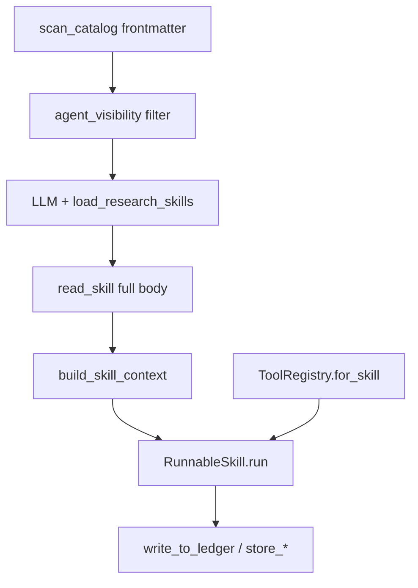

# Equity Research Skills 与 Tools 控制方案

> 语言：[中文](skills-and-tools.md) | [English](../../README.md) · [中文主文档](../../README.zh-CN.md) · [文档索引](../zh/README.md)  
> 模块路径：`tradingagents/equity_research/skills/`、`tradingagents/equity_research/tools/`  
> 相关文档：[文件结构](file-structure.md) · [Memory](memory.md) · [Context](context.md) · [Storage](storage.md)

## 设计原则

本模块将 **Skills**（研究方法论 / 行为指令）与 **Tools**（数据与副作用操作）解耦，通过注册表统一管理：

| 概念 | 加载策略 | 运行时接口 |
|------|----------|-----------|
| **Skill** | 两阶段：catalog 发现 → 按需全文解析 | `RunnableSkill.run(SkillInput, tools)` |
| **Tool** | 启动时全量注册 LangChain `@tool` | Agent 绑定用 `BaseTool`；handler 调用用 plain `callable` |

Skill 声明允许使用的 tool 名；运行时 `ToolRegistry.for_skill()` 过滤，实现最小权限原则。

---

## 1. Skill 定义格式

### 1.1 文件位置

- 定义目录：[`skills/definitions/*.skill.md`](../../tradingagents/equity_research/skills/definitions/)（共 15 个）
- 编写模板：[`skills/SKILL.template.md`](../../tradingagents/equity_research/skills/SKILL.template.md)

### 1.2 Frontmatter 字段

| 字段 | 角色 |
|------|------|
| `name` | 唯一标识，与文件名一致 |
| `description` | 一行英文描述，进入 catalog |
| `when_to_use` | 自然语言触发条件，进入 catalog |
| `tags` | 分类标签，用于 agent 可见性过滤 |
| `tools` | 允许调用的 tool 名列表（启动时校验） |
| `handler` | 可选 Python handler（`module:Class` 格式） |
| `compatible_with` | 可配对 skill 名（仅元数据，不写入 prompt） |
| `composable` | 是否可与其他 skill 组合 |
| `version` | 版本号 |

### 1.3 Markdown 章节

| 章节 | 注入时机 |
|------|----------|
| `## Constraints` | `read_skill()` 后写入 `active_skill_context.constraints` |
| `## Prompt Template` | 变量替换后写入 `active_skill_context.prompt_template` |
| `## Query Guidance` | 写入 `active_skill_context.query_guidance`（搜索型 skill） |

**不在 prompt 中引用其他 skill 名**；配对提示仅通过 `compatible_with` 元数据表达。

### 1.4 已注册 Skill 列表

| Skill | 用途 |
|-------|------|
| `broker_consensus_mining` | 卖方观点与共识挖掘 |
| `variant_view_discovery` | 预期差 / 变异观点 |
| `business_model_analysis` | 商业模式与收入驱动 |
| `historical_financial_analysis` | 历史财务趋势 |
| `industry_analysis` | 行业与竞争格局 |
| `forecast_assumption_builder` | 预测假设构建 |
| `valuation` | 确定性估值计算 |
| `risk_counterthesis` | 风险与反证 |
| `catalyst_monitoring` | 催化剂日历 |
| `dynamic_research_planning` | 阶段感知规划 |
| `thesis_exploration_dag` | 论点 DAG 初始化 |
| `scientific_investment_reasoning` | 结构化假设推理 |
| `collaborative_memory` | 跨分支 ledger 检索 |
| `section_writing` | 章节草稿撰写 |
| `standardized_qa` | 证据 / 模型 / 合规评分 |

---

## 2. Skill 注册与加载链路

```text
SkillLoader.scan_catalog()
    # 启动时仅解析 frontmatter → dict[str, SkillCatalogEntry]
    ↓
SkillRegistry.read_skill(name)
    # 懒加载完整 markdown → LoadedSkill
    ↓
SkillRegistry.get(name)
    # → RunnableSkill（缓存）
    ↓
RunnableSkill.run(SkillInput, tools)
    # handler 执行 或 PromptSkillRunner LLM 回退
```

### 2.1 关键模块

| 文件 | 职责 |
|------|------|
| [`skills/loader.py`](../../tradingagents/equity_research/skills/loader.py) | 解析 `.skill.md`；`format_skill_prompt()` 变量替换 |
| [`skills/registry.py`](../../tradingagents/equity_research/skills/registry.py) | `SkillRegistry`：扫描、读取、`select_for_objective()` |
| [`skills/catalog.py`](../../tradingagents/equity_research/skills/catalog.py) | `format_catalog_for_prompt()` 生成 LLM 可见表 |
| [`skills/runnable.py`](../../tradingagents/equity_research/skills/runnable.py) | `RunnableSkill`、`PromptSkillRunner`、`resolve_handler()` |
| [`skills/handlers/impl.py`](../../tradingagents/equity_research/skills/handlers/impl.py) | 15 个具体 handler 实现 |
| [`skills/base.py`](../../tradingagents/equity_research/skills/base.py) | `SkillInput`、`SkillOutput`、`LoadedSkill` 等类型 |

### 2.2 Objective 默认映射

[`skills/registry.py`](../../tradingagents/equity_research/skills/registry.py) 的 `OBJECTIVE_SKILL_MAP` 在 LLM 未选择或选择无效时提供回退：

| objective | 默认 skill |
|-----------|-----------|
| `consensus` | `broker_consensus_mining` |
| `assumption` | `market_assumption_decomposition` |
| `memory` | `collaborative_memory` |
| `planning` | `dynamic_research_planning` |
| `thesis` | `thesis_exploration_dag` |
| `valuation` | `valuation` |
| `qa` | `standardized_qa` |
| `default` | `variant_view_discovery` |

---

## 3. Agent 可见性控制

[`skills/agent_visibility.py`](../../tradingagents/equity_research/skills/agent_visibility.py) 定义各 Agent 可见的 catalog 子集：

| agent_id | 规则 |
|----------|------|
| `consensus_subgraph` | `include_names`: broker_consensus_mining, variant_view_discovery（严格白名单，不按 tag 扩展） |
| `assumption_subgraph` | `include_names`: market_assumption_decomposition only |
| `dynamic_planning` | `include_tags_any`: planning, thesis, reasoning, memory |
| `research_loop` | `exclude_tags_any`: writing, qa |
| `risk_mapping` | `include_names`: risk_counterthesis |
| `section_writing` | `include_names`: section_writing |

**配置覆盖**：`config.equity_research.agent_skills.{agent_id}` 可覆盖 `include_names`、`exclude_names`、`include_tags_any`、`exclude_tags_any`。

`SkillRegistry.get_eligible_catalog(graph_name)` 在注入前调用 `filter_eligible_catalog()`，确保 LLM 只看到当前 Agent 允许的技能。

---

## 4. Skill 选择与注入路径

| 场景 | 机制 | 代码位置 |
|------|------|----------|
| 共识子图 | LLM + `load_research_skills` 三节点 | `agents/shared/skill_selector.py`、`agents/consensus/subgraph.py` |
| Research loop | `strategy.skills_to_run`（dynamic planning 产出，≤2） | `agents/research_loop.py` |
| Domain agents | `BaseDomainAgent` 按 `skill_names` 顺序执行 | `agents/domain/base.py` |
| Lead analyst | `select_for_objective()` 或 agent 配置 | `agents/lead_analyst.py` |

### 4.1 load_research_skills 工具

[`tools/skill_tools.py`](../../tradingagents/equity_research/tools/skill_tools.py) 的 `make_load_research_skills_tool()`：

1. 预计算 `eligible` catalog 与 `valid_names`
2. LLM 调用时过滤非法名、截断至 `max_skills`
3. 空选时回退 `select_for_objective(objective)`
4. 对每个选中名调用 `registry.read_skill()` 预热缓存
5. 返回 JSON：`skill_names`、`catalog_snapshot`、`reason`

`create_skill_context_apply` 解析 `ToolMessage` 内容后调用 `build_skill_context()` 写入 state（详见 [Context 文档](context.md)）。

---

## 5. Tool 注册架构

### 5.1 ToolRegistry 初始化

[`tools/registry.py`](../../tradingagents/equity_research/tools/registry.py) 的 `ToolRegistry.__init__`：

1. 加载 `STATIC_LANGCHAIN_TOOLS`（[`tools/lc/__init__.py`](../../tradingagents/equity_research/tools/lc/__init__.py)，50+ 工具）
2. 绑定动态系统工具：`ls_tools`、`tool_registry_lookup`、`ls_skills`、`skill_registry_lookup`、`state_snapshot`
3. 若 `deps` 可用，注册 `perplexity_search`

每个 LangChain tool 经 [`tools/tool_adapters.py`](../../tradingagents/equity_research/tools/tool_adapters.py) 的 `make_registry_callable()` 转为 plain callable，存入 `_tools` 字典。

### 5.2 核心 API

| 方法 | 用途 |
|------|------|
| `get(name)` | 返回 plain callable，供 skill handler 调用 |
| `get_langchain_tool(name)` | 返回 `BaseTool`，供 Agent `bind_tools` |
| `for_skill(allowed_tools)` | 按 skill 声明过滤，返回 `{name: callable}` 子集 |
| `for_skill_langchain(allowed_tools)` | 同上，返回 `BaseTool` 列表 |
| `list_tools()` | 全部已注册工具名 |
| `call(name, *args, **kwargs)` | 便捷调用 |

### 5.3 工具分类与元数据

[`tools/tool_catalog.py`](../../tradingagents/equity_research/tools/tool_catalog.py) 维护 10 类元数据：

`system` · `search` · `document` · `finance` · `code` · `data` · `artifact` · `quality` · `human` · `memory`（及 `academic`、`browser` 等扩展类）

每条记录含 `description`、`inputs`、`risk_level`、`implemented` 标志。`implemented: False` 的条目对应 [`tools/lc/stubs.py`](../../tradingagents/equity_research/tools/lc/stubs.py) + [`tools/stub_impl.py`](../../tradingagents/equity_research/tools/stub_impl.py) 的占位实现，调用时抛出 `ToolNotImplementedError`。

### 5.4 厂商路由

[`tools/interface.py`](../../tradingagents/equity_research/tools/interface.py) 的 `route_equity_tool()` 按配置将 finance / search 类工具链接到 yfinance、FMP、EDGAR、Tavily、Jina 等厂商，与主项目 `dataflows/vendor_routing.py` 的 `equity_research` 配置段联动。

### 5.5 LangChain 包装层

[`tools/lc/`](../../tradingagents/equity_research/tools/lc/) 按类别拆分 `@tool` 装饰器：

| 文件 | 包装模块 |
|------|----------|
| `search.py` | `search_tools` |
| `finance.py` | `finance_tools` |
| `document.py` | `document_tools` |
| `memory.py` | `evidence_memory`、`memory_tools` |
| `data.py` | `data_tools` |
| `stubs.py` | 未实现工具占位 |

---

## 6. Skill ↔ Tool 绑定

### 6.1 声明与校验

每个 `.skill.md` 的 `tools:` 列表在 `SkillLoader` 扫描时与 `known_tools`（来自 `ToolRegistry.list_tools()`）校验，未知工具名产生 warning。

### 6.2 运行时过滤

```python
# research_loop.py 典型用法
skill = skill_registry.get(skill_name)
allowed = skill.manifest.allowed_tools  # 来自 frontmatter tools:
tools = tool_registry.for_skill(allowed)
result = skill.run(SkillInput(state=state, ...), tools)
```

Handler 内部以函数调用方式使用 tool，例如 `tools["store_claim"](state, claim)`，不经过 LangChain ToolNode。

### 6.3 双接口设计意义

| 调用方 | 接口 | 原因 |
|--------|------|------|
| LangGraph Agent 节点 | `BaseTool` + `ToolNode` | 与 LangChain 工具循环集成 |
| Skill handler | plain `callable` | 避免序列化开销；直接传 `state` dict |
| 系统发现工具 | `BaseTool` | LLM 可浏览 registry |

---

## 7. 发现型系统工具

[`tools/system_tools.py`](../../tradingagents/equity_research/tools/system_tools.py) 提供运行时自省能力：

| 工具 | 作用 |
|------|------|
| `ls_tools` | 列出已注册工具（可按 category 过滤） |
| `tool_registry_lookup` | 按关键词搜索工具元数据 |
| `ls_skills` | 列出 skill catalog |
| `skill_registry_lookup` | 按关键词 / tag 搜索 skill |
| `state_snapshot` | 返回当前 state 关键字段摘要 |

这些工具在 `ToolRegistry._bind_system_tools()` 中动态注册，依赖 `skill_registry` 引用以解析 skill 相关查询。

---

## 8. Domain Agent 与 Lead Analyst

### 8.1 Domain Agent 映射

[`agents/domain/`](../../tradingagents/equity_research/agents/domain/) 中各 Agent 预绑 skill 列表，由 `LeadAnalystAgent` 按 objective 调度：

| Agent | Skills |
|-------|--------|
| EvidenceAnalyst | `collaborative_memory` |
| ConsensusAnalyst | `broker_consensus_mining`, `variant_view_discovery` |
| BusinessAnalyst | `business_model_analysis` |
| IndustryAnalyst | `industry_analysis` |
| ForecastAgent | `forecast_assumption_builder` |
| ValuationAgent | `valuation` |
| RiskAgent | `risk_counterthesis` |
| ICChallenge | `standardized_qa` |
| WritingAgent | `section_writing` |

`BaseDomainAgent.run()` 对每个 skill 调用 `registry.get()` → `for_skill()` → `run()`。

### 8.2 ResearchLoopRuntime 中的双注册表

[`agents/research_loop.py`](../../tradingagents/equity_research/agents/research_loop.py) 在 `__init__` 中：

```python
self.tool_registry = ToolRegistry(deps)
self.skill_registry = SkillRegistry(
    deps=deps,
    known_tools=set(self.tool_registry.list_tools()),
    config=deps.config,
)
```

确保 skill 定义中的 `tools` 与已注册工具集一致。

---

## 9. 端到端控制流



---


---

## 9.5 区块研究执行器工具分组（Section Executor Tool Groups）

区块研究执行器将工具分为三个语义组，按步骤 action 路由到对应组的工具：

### 9.5.1 三组定义

| 组名 | 作用 | 对应 step action | 典型工具 |
|------|------|------------------|----------|
| **retrieval** | 读取 / 获取 / 搜索 | orient、fetch_primary、search | filings_search, web_search, transcript_search, financial_statement_fetch, filing_reader, memory_retrieve, search_evidence, search_claims, search_assumptions, search_consensus, search_conflicts, search_memory_timeline, search_research_context, table_extractor, document_chunker, reference_parser |
| **computation** | 分析 / 验证 / 计算 | calculate、compare、verify | calculator, time_series_analyzer, conflict_detector, citation_checker, claim_evidence_checker, search_evidence, search_claims, findings_cache_read |
| **action** | 写入 / 持久化 / 管理 | synthesize | list_research_todos, add_research_todo, remove_research_todo, update_research_todo_status, get_next_research_todo, memory_write, store_evidence |

### 9.5.2 Action → Group 映射

```python
ACTION_TO_GROUP = {
    "orient": "retrieval",       # orient starts with memory_retrieve
    "fetch_primary": "retrieval",
    "search": "retrieval",
    "calculate": "computation",
    "compare": "computation",
    "verify": "computation",
    "synthesize": "action",
}
```

### 9.5.3 路由优先级

`infer_tool_group()` 的决策顺序：

1. **Tool names** — last AIMessage 的工具调用 → 直接查组
2. **Step action** → ACTION_TO_GROUP 字典查找
3. **Tool hints** — active_step.tool_hints 多数投票
4. **Description keywords** — 最后手段：action > computation > retrieval（默认 retrieval）

### 9.5.4 排除的工具

以下工具**不在**任何 EXECUTOR_TOOL_SETS 组中（属于规划器或通用执行器）：

| 工具 | 归属 | 说明 |
|------|------|------|
| `batch_perplexity_search` | 通用执行器 | assumption/consensus 子图使用 |
| `batch_light_grounding_search` | 规划器 | 仅用于 section planner grounding |

### 9.5.5 Action 特异性指导

执行器 dispatch 节点根据 step action 添加提示：

- **orient** — Start with memory_retrieve to check prior research, then list_research_todos.
- **fetch_primary** — Prefer filings_search with SEC-style queries. Use financial_statement_fetch for structured data.
- **search** — Use web_search for news, transcript_search for earnings calls.
- **verify** — Use citation_checker / claim_evidence_checker with urls/claims from the **Step payload**. If payload `status` is `empty`, do not call ritual `calculator` expressions; record unavailable/gap. Optionally `search_evidence` / `search_claims` if payload is thin.
- **compare** — Use conflict_detector / checkers against Step payload evidence and claims.
- **calculate** — Compute only from numeric fields in the Step payload (and `calculation_store`).

### 9.5.6 Step payload（verify / compare / calculate）

当 `action ∈ {verify, compare, calculate}` 时，dispatch 在**首条** HumanMessage 末尾注入确定性 JSON payload（[`runtime/utils/step_payload.py`](../../tradingagents/equity_research/runtime/utils/step_payload.py)），避免步间 `clear_messages` 后模型看不到待验/待算对象。

| 字段 / 行为 | 说明 |
|-------------|------|
| 过滤 | 优先 `question_id == 当前 qid` 的 evidence；若空则回退本 section **未标注 qid** 的条目（不跨其他 qid）。Claims 优先命中所选 evidence 的 `supporting_evidence_ids`，否则 section 近期 claims。 |
| verify/compare | evidence 摘要、metadata 缺口表、claims、citation URLs、answer_card 切片（`quantified_claims` / `source_attributions` / `open_gaps`） |
| calculate | 带 metric/value 的 numeric evidence + `calculation_store` 切片（不含完整 claim/URL 清单） |
| metadata | 规范四字段 + 别名回填，状态区分 `present` / `derived` / `missing`（`source_type`←source/form；`fiscal_quarter_or_date`←period/date；`platform`←vendor；`traceable_ref`←url/doc_id/filing_url） |
| 截断 | evidence ≤ 8（quote ≤ 240）、claims ≤ 15、URLs ≤ 20；超出写 `truncated` + `omitted_counts` |
| 空态 | `status: "empty"` + `gaps`；禁止仪式性计算 |

### 9.5.7 `skip_verify`

| 来源 | 键 / 参数 |
|------|-----------|
| config | `equity_research.skip_verify`（默认 `false`） |
| env | `TRADINGAGENTS_SKIP_VERIFY` |
| CLI | `--skip-verify` / `--no-skip-verify`（[`demo_section_research.py`](../../demo_section_research.py)、[`demo_equity_research.py`](../../demo_equity_research.py)） |

为 `true` 时：**执行期短路**——dispatch 不调 LLM/工具，设 `_verify_skipped`；apply 将 step 标为 `skipped`（`result_summary=verify_skipped_by_config`），对应 todo 标 `done`。规划仍可生成 verify 步；`nested` / research_loop 经 `deps.config` 继承，无需额外接线。

### 9.5.8 允许名单过滤

`resolve_executor_tool_names()` 通过 `TaskProfile.extra_config["executor_langchain_tool_names"]` 过滤各组工具。允许名单见 [`profile.py`](../../tradingagents/equity_research/tasks/section_research/profile.py)。


## 10. 扩展指南

### 新增 Skill

1. 复制 [`skills/SKILL.template.md`](../../tradingagents/equity_research/skills/SKILL.template.md) 到 `skills/definitions/{name}.skill.md`
2. 填写 frontmatter 与三个 markdown 章节
3. 若需确定性逻辑，在 `skills/handlers/impl.py` 实现 handler 并在 frontmatter 声明 `handler:`
4. 在 `agent_visibility.py` 或 config 中配置可见性
5. 运行 `pytest tests/equity_research/test_skill_loader.py`

### 新增 Tool

1. 在对应 `tools/{category}_tools.py` 实现核心函数
2. 在 `tools/lc/{category}.py` 添加 `@tool` 包装
3. 在 `tools/lc/__init__.py` 的 `STATIC_LANGCHAIN_TOOLS` 注册
4. 在 `tools/tool_catalog.py` 补充元数据（`implemented: True`）
5. 在需要此工具的 `.skill.md` 的 `tools:` 列表中声明

### 配置项

```python
"equity_research": {
    "agent_skills": {
        "research_loop": {"exclude_tags_any": ["writing"]},
    },
    "tools": {
        "python_exec_sandbox": False,
        "shell_exec_sandbox": False,
    },
    "tool_vendors": {},   # 覆盖默认厂商链
    "data_vendors": {},
}
```
## Tool 列表
### 1. 系统与运行时工具

| 优先级 | Tool 名称                 | 类型     | 作用                            | 输入             | 输出               | 风险     |
| :-- | :---------------------- | :----- | :---------------------------- | :------------- | :--------------- | :----- |
| MVP | `tool_registry_lookup`  | system | 根据任务检索候选工具                    | task, tags     | tool specs       | low    |
| MVP | `skill_registry_lookup` | system | 检索候选 skills                   | task, domain   | skill specs      | low    |
| MVP | `memory_retrieve`       | memory | 从 memory 中检索相关历史              | query, filters | memory snippets  | low    |
| MVP | `memory_write`          | memory | 写入 evidence/action/reflection | record         | status           | low    |
| MVP | `state_snapshot`        | system | 保存当前任务状态快照                    | state          | snapshot\_id     | low    |
<!-- | P1  | `cost_tracker`          | system | 统计工具调用成本/次数                   | tool calls     | cost report      | low    |
| P1  | `permission_check`      | system | 检查高风险动作是否允许                   | action         | allow/deny       | medium |
| P1  | `task_progress_report`  | system | 输出当前任务进度                      | state          | progress summary | low    | -->

---

### 2. 搜索与网页信息工具

| 优先级 | Tool 名称                  | 类型      | 作用           | 输入                 | 输出                       | 风险     |
| :-- | :----------------------- | :------ | :----------- | :----------------- | :----------------------- | :----- |
| MVP | `web_search`             | search  | 通用联网搜索       | query, recency     | results, urls            | low    |
| MVP | `web_fetch`              | search  | 读取指定网页内容     | url                | markdown/text            | low    |
| MVP | `news_search`            | search  | 搜索新闻与近期事件    | query, date\_range | news results             | low    |
| P1  | `source_quality_check`   | search  | 判断来源质量       | url/source         | quality score            | low    |
| P1  | `citation_extractor`     | search  | 从文本中提取引用 URL | text               | citations                | low    |
| P1  | `search_deduper`         | search  | 去重相似搜索结果     | results            | deduped results          | low    |
<!-- | P2  | `browser_search`         | browser | 使用浏览器执行搜索    | query              | rendered results         | medium |
| P2  | `browser_fetch_rendered` | browser | 读取动态网页       | url                | rendered text/screenshot | medium | -->
- 供应商包括
    - tavily， https://docs.tavily.com/llms.
    - Jina API， https://r.jina.ai/docs，https://s.jina.ai/docs
    - TOKEN 都已经在.env中
---

### 3. 文档读取工具

| 优先级 | Tool 名称                      | 类型       | 作用                       | 输入             | 输出             | 风险     |
| :-- | :--------------------------- | :------- | :----------------------- | :------------- | :------------- | :----- |
| MVP | `list_files`                | document | 读取本地文件的列表 | file\_path     | content        | low    |
| MVP | `file_reader`                | document | 读取本地文本/markdown/json/csv | file\_path     | content        | low    |
| MVP | `pdf_reader`                 | document | 读取 PDF 内容                | file\_path/url | pages/text     | low    |
| MVP | `docx_reader`                | document | 读取 Word 文档               | file\_path     | text/structure | low    |
| MVP | `table_extractor`            | document | 从文档中提取表格                 | file/pdf/page  | tables         | low    |
| P1  | `document_chunker`           | document | 文档切片                     | text, strategy | chunks         | low    |
| P1  | `document_outline_extractor` | document | 提取文档结构                   | text           | outline        | low    |
| P1  | `reference_parser`           | document | 解析参考文献                   | text           | references     | low    |
<!-- | P2  | `ocr_reader`                 | document | OCR 图片/PDF 扫描件           | image/pdf      | text           | medium |
| P2  | `cross_document_compare`     | document | 多文档对比                    | docs           | diff/summary   | low    | -->

---

### 4. 金融研究工具

| 优先级 | Tool 名称                     | 类型      | 作用          | 输入                  | 输出           | 风险         |
| :-- | :-------------------------- | :------ | :---------- | :------------------ | :----------- | :--------- |
| MVP | `stock_quote`               | finance | 获取股价/市值/成交等 | ticker              | quote data   | low        |
| MVP | `company_profile`           | finance | 公司基本信息      | ticker              | profile      | low        |
| MVP | `financial_statement_fetch` | finance | 拉取财务报表      | ticker, period      | financials   | low        |
| MVP | `earnings_calendar`         | finance | 获取财报日期      | ticker              | dates        | low        |
| P1  | `analyst_estimates_fetch`   | finance | 获取分析师预期     | ticker              | estimates    | low/medium |
| P1  | `transcript_search`         | finance | 搜索财报电话会     | ticker, quarter     | transcript   | low        |
| P1  | `filings_search`            | finance | 搜 SEC/公告文件  | ticker, form\_type  | filings      | low        |
| P1  | `filing_reader`             | finance | 读取公告文件      | filing\_url/id      | text         | low        |
| P1  | `peer_comps_fetch`          | finance | 获取可比公司      | ticker/sector       | peers        | low        |
| P1  | `valuation_multiples_fetch` | finance | 获取估值倍数      | tickers             | multiples    | low        |
| P2  | `estimate_revision_tracker` | finance | 跟踪预期修正      | ticker, date\_range | revisions    | medium     |
<!-- | P2  | `segment_revenue_parser`    | finance | 解析分部收入      | filing/transcript   | segment data | medium     | -->
| P2  | `guidance_extractor`        | finance | 提取管理层指引     | transcript/filing   | guidance     | medium     |
| P2  | `sentiment_signal_fetch`    | finance | 新闻/社媒/研报情绪  | ticker              | sentiment    | medium     |

- 可以参考目前已经有的
<!-- ---

### 5. 学术与论文复刻工具

| 优先级 | Tool 名称                      | 类型            | 作用                     | 输入                | 输出                    | 风险     |
| :-- | :--------------------------- | :------------ | :--------------------- | :---------------- | :-------------------- | :----- |
| MVP | `paper_pdf_reader`           | academic      | 读取论文 PDF               | file/url          | structured paper text | low    |
| MVP | `paper_section_extractor`    | academic      | 抽取摘要/方法/实验等            | paper text        | sections              | low    |
| MVP | `paper_claim_extractor`      | academic      | 提取核心贡献和实验 claim        | paper text        | claims                | low    |
| MVP | `github_search`              | academic/code | 搜相关代码仓库                | paper title/query | repos                 | low    |
| P1  | `citation_graph_search`      | academic      | 查引用/被引                 | paper title/doi   | citation graph        | low    |
| P1  | `dataset_finder`             | academic      | 查找论文使用数据集              | paper text/query  | dataset links         | medium |
| P1  | `benchmark_info_fetch`       | academic      | 获取 benchmark 信息        | benchmark name    | metrics/setup         | medium |
| P1  | `prompt_extractor`           | academic      | 从论文 appendix 提取 prompt | paper text        | prompts               | low    |
| P2  | `equation_extractor`         | academic      | 提取公式和变量解释              | paper text        | equations             | medium |
| P2  | `method_to_pseudocode`       | academic      | 方法转伪代码                 | method section    | pseudocode            | medium |
| P2  | `experiment_table_extractor` | academic      | 提取实验表格                 | paper pages       | tables/metrics        | medium | -->

---

### 6. 代码与实验工具

| 优先级 | Tool 名称                | 类型        | 作用          | 输入                  | 输出                      | 风险     |
| :-- | :--------------------- | :-------- | :---------- | :------------------ | :---------------------- | :----- |
| MVP | `python_exec_sandbox`  | code      | 安全执行 Python | code/files          | stdout/stderr/artifacts | medium |
| MVP | `shell_exec_sandbox`   | code      | 执行 shell 命令 | command             | stdout/stderr/status    | high   |
| MVP | `code_reader`          | code      | 读取代码文件      | path                | code                    | low    |
| MVP | `code_search`          | code      | 搜索项目代码      | query/path          | matches                 | low    |
| MVP | `code_writer`          | code      | 写入/修改代码     | path, content/diff  | status                  | high   |
<!-- | P1  | `unit_test_runner`     | code      | 运行单元测试      | test command        | results                 | medium |
| P1  | `lint_runner`          | code      | 静态检查        | path                | lint report             | low    |
| P1  | `log_analyzer`         | code      | 分析运行日志      | logs                | issues/summary          | low    |
| P1  | `dependency_inspector` | code      | 检查依赖        | env/files           | dependencies            | low    |
| P1  | `repo_clone`           | code      | 克隆仓库        | repo\_url           | local path              | medium |
| P2  | `notebook_runner`      | code      | 执行 notebook | ipynb               | outputs                 | medium |
| P2  | `experiment_runner`    | code      | 运行实验配置      | config              | metrics/logs            | high   |
| P2  | `metric_evaluator`     | code/eval | 计算指标        | predictions, labels | metric score            | low    |
| P2  | `diff_generator`       | code      | 生成代码 diff   | old,new             | diff                    | low    |
| P2  | `patch_apply`          | code      | 应用补丁        | diff                | status                  | high   | -->

- 沙盒环境供应商
    - E2B: https://github.com/e2b-dev/e2b

---

### 7. 数据分析工具

| 优先级 | Tool 名称                         | 类型   | 作用        | 输入               | 输出                   | 风险     |
| :-- | :------------------------------ | :--- | :-------- | :--------------- | :------------------- | :----- |
| MVP | `csv_reader`                    | data | 读取 CSV    | path             | dataframe summary    | low    |
| MVP | `dataframe_profiler`            | data | 数据概览      | dataframe/path   | schema/stats/missing | low    |
| MVP | `calculator`                    | data | 数值计算      | expression/data  | result               | low    |
| P1  | `chart_generator`               | data | 生成图表      | data, chart spec | image/file           | low    |
| P1  | `statistical_test`              | data | 统计检验      | data, test\_type | pvalue/result        | low    |
| P1  | `regression_runner`             | data | 回归分析      | data, formula    | results              | low    |
| P1  | `time_series_analyzer`          | data | 时间序列分析    | data             | trend/seasonality    | low    |
| P2  | `data_cleaner`                  | data | 缺失/异常处理   | data, strategy   | cleaned data         | medium |
| P2  | `feature_engineering_assistant` | data | 特征生成建议/执行 | data, goal       | features             | medium |
---

<!-- ### 8. 浏览器与 Computer Use 工具

| 优先级 | Tool 名称                | 类型      | 作用       | 输入              | 输出         | 风险        |
| :-- | :--------------------- | :------ | :------- | :-------------- | :--------- | :-------- |
| P2  | `browser_open`         | browser | 打开网页     | url             | page state | medium    |
| P2  | `browser_click`        | browser | 点击页面元素   | selector/coords | page state | high      |
| P2  | `browser_type`         | browser | 输入文本     | selector, text  | page state | high      |
| P2  | `browser_screenshot`   | browser | 截图       | page            | image      | low       |
| P2  | `browser_extract_text` | browser | 提取当前页面文字 | page            | text       | low       |
| P2  | `browser_download`     | browser | 下载文件     | selector/url    | file path  | medium    |
| P3  | `browser_form_fill`    | browser | 自动填表     | form spec       | status     | high      |
| P3  | `browser_login_flow`   | browser | 登录流程     | credentials ref | session    | very high |

这类工具要做权限控制，默认不要开放高风险动作。 -->

---

### 9. 产物生成工具

| 优先级 | Tool 名称              | 类型       | 作用         | 输入                | 输出               | 风险  |
| :-- | :------------------- | :------- | :--------- | :---------------- | :--------------- | :-- |
| MVP | `markdown_writer`    | artifact | 写 markdown | content,path      | file             | low |
| MVP | `json_writer`        | artifact | 写结构化结果     | json,path         | file             | low |

<!-- | P1  | `docx_writer`        | artifact | 生成 Word    | sections/style    | docx path        | low |
| P1  | `pptx_writer`        | artifact | 生成 PPT     | slides/style      | pptx path        | low |
| P1  | `chart_embedder`     | artifact | 把图表嵌入报告    | chart paths       | document         | low |
| P2  | `pdf_exporter`       | artifact | 导出 PDF     | source file       | pdf path         | low |
| P2  | `report_formatter`   | artifact | 套格式模板      | report, template  | formatted report | low |
| P2  | `citation_formatter` | artifact | 格式化引用      | references, style | bibliography     | low | -->

---

### 10. 验证、合规与质量工具

| 优先级 | Tool 名称                      | 类型      | 作用             | 输入                   | 输出                | 风险     |
| :-- | :--------------------------- | :------ | :------------- | :------------------- | :---------------- | :----- |
| MVP | `citation_checker`           | quality | 检查引用是否存在/可访问   | urls                 | status report     | low    |
| MVP | `claim_evidence_checker`     | quality | 检查 claim 是否有证据 | claims,evidence      | support report    | low    |
| MVP | `coverage_evaluator`         | quality | 评估维度覆盖度        | artifact, criteria   | coverage report   | low    |
| MVP | `conflict_detector`          | quality | 检测证据冲突         | evidence/artifact    | conflicts         | low    |
<!-- | P1  | `compliance_filter`          | quality | 过滤不合规来源/内容     | evidence             | filtered evidence | low    |
| P1  | `hallucination_checker`      | quality | 检查未支持表述        | artifact,evidence    | flags             | medium |
| P1  | `recency_checker`            | quality | 检查时效性          | citations/dates      | recency report    | low    |
| P1  | `source_reliability_scorer`  | quality | 评估来源可靠性        | source               | score             | low    |
| P2  | `assumption_stress_tester`   | quality | 压力测试核心假设       | assumptions,evidence | stress report     | medium |
| P2  | `reproducibility_checker`    | quality | 检查实验可复现性       | code, logs, metrics  | report            | medium |
| P2  | `result_consistency_checker` | quality | 检查报告内部一致性      | artifact             | issues            | low    | -->

---

### 11. 人机协作工具

| 优先级 | Tool 名称                 | 类型    | 作用        | 输入             | 输出              | 风险     |
| :-- | :---------------------- | :---- | :-------- | :------------- | :-------------- | :----- |
| MVP | `ask_human`             | human | 请求用户补充信息  | question       | answer          | low    |
| MVP | `human_approval`        | human | 高风险动作确认   | action summary | approve/deny    | low    |
| P1  | `human_review_payload`  | human | 给用户展示当前状态 | state summary  | review payload  | low    |
| P1  | `human_select_branch`   | human | 用户选择探索分支  | branch options | selected branch | low    |
| P2  | `human_edit_artifact`   | human | 用户修改中间产物  | artifact       | edited artifact | medium |
| P2  | `human_set_constraints` | human | 用户更新约束    | constraints    | updated config  |        |
