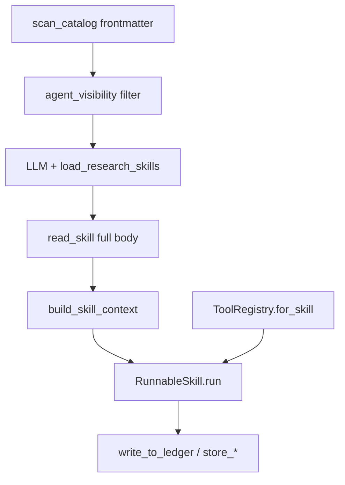

# Equity Research Skills 与 Tools 控制方案

> 模块路径：`tradingagents/equity_research/skills/`、`tradingagents/equity_research/tools/`  
> 相关文档：[文件结构](file-structure.md) · [Memory](memory.md) · [Context](context.md) · [Storage](storage.md)

## 设计原则

本模块将 **Skills**（研究方法论 / 行为指令）与 **Tools**（数据与副作用操作）解耦，通过注册表统一管理：

| 概念 | 加载策略 | 运行时接口 |
|------|----------|-----------|
| **Skill** | 两阶段：catalog 发现 → 按需全文解析 | `RunnableSkill.run(SkillInput, tools)` |
| **Tool** | 启动时全量注册 LangChain `@tool` | Agent 绑定用 `BaseTool`；handler 调用用 plain `callable` |

Skill 声明允许使用的 tool 名；运行时 `ToolRegistry.for_skill()` 过滤，实现最小权限原则。

---

## 1. Skill 定义格式

### 1.1 文件位置

- 定义目录：[`skills/definitions/*.skill.md`](../../tradingagents/equity_research/skills/definitions/)（共 15 个）
- 编写模板：[`skills/SKILL.template.md`](../../tradingagents/equity_research/skills/SKILL.template.md)

### 1.2 Frontmatter 字段

| 字段 | 角色 |
|------|------|
| `name` | 唯一标识，与文件名一致 |
| `description` | 一行英文描述，进入 catalog |
| `when_to_use` | 自然语言触发条件，进入 catalog |
| `tags` | 分类标签，用于 agent 可见性过滤 |
| `tools` | 允许调用的 tool 名列表（启动时校验） |
| `handler` | 可选 Python handler（`module:Class` 格式） |
| `compatible_with` | 可配对 skill 名（仅元数据，不写入 prompt） |
| `composable` | 是否可与其他 skill 组合 |
| `version` | 版本号 |

### 1.3 Markdown 章节

| 章节 | 注入时机 |
|------|----------|
| `## Constraints` | `read_skill()` 后写入 `active_skill_context.constraints` |
| `## Prompt Template` | 变量替换后写入 `active_skill_context.prompt_template` |
| `## Query Guidance` | 写入 `active_skill_context.query_guidance`（搜索型 skill） |

**不在 prompt 中引用其他 skill 名**；配对提示仅通过 `compatible_with` 元数据表达。

### 1.4 已注册 Skill 列表

| Skill | 用途 |
|-------|------|
| `broker_consensus_mining` | 卖方观点与共识挖掘 |
| `variant_view_discovery` | 预期差 / 变异观点 |
| `business_model_analysis` | 商业模式与收入驱动 |
| `historical_financial_analysis` | 历史财务趋势 |
| `industry_analysis` | 行业与竞争格局 |
| `forecast_assumption_builder` | 预测假设构建 |
| `valuation` | 确定性估值计算 |
| `risk_counterthesis` | 风险与反证 |
| `catalyst_monitoring` | 催化剂日历 |
| `dynamic_research_planning` | 阶段感知规划 |
| `thesis_exploration_dag` | 论点 DAG 初始化 |
| `scientific_investment_reasoning` | 结构化假设推理 |
| `collaborative_memory` | 跨分支 ledger 检索 |
| `section_writing` | 章节草稿撰写 |
| `standardized_qa` | 证据 / 模型 / 合规评分 |

---

## 2. Skill 注册与加载链路

```text
SkillLoader.scan_catalog()
    # 启动时仅解析 frontmatter → dict[str, SkillCatalogEntry]
    ↓
SkillRegistry.read_skill(name)
    # 懒加载完整 markdown → LoadedSkill
    ↓
SkillRegistry.get(name)
    # → RunnableSkill（缓存）
    ↓
RunnableSkill.run(SkillInput, tools)
    # handler 执行 或 PromptSkillRunner LLM 回退
```

### 2.1 关键模块

| 文件 | 职责 |
|------|------|
| [`skills/loader.py`](../../tradingagents/equity_research/skills/loader.py) | 解析 `.skill.md`；`format_skill_prompt()` 变量替换 |
| [`skills/registry.py`](../../tradingagents/equity_research/skills/registry.py) | `SkillRegistry`：扫描、读取、`select_for_objective()` |
| [`skills/catalog.py`](../../tradingagents/equity_research/skills/catalog.py) | `format_catalog_for_prompt()` 生成 LLM 可见表 |
| [`skills/runnable.py`](../../tradingagents/equity_research/skills/runnable.py) | `RunnableSkill`、`PromptSkillRunner`、`resolve_handler()` |
| [`skills/handlers/impl.py`](../../tradingagents/equity_research/skills/handlers/impl.py) | 15 个具体 handler 实现 |
| [`skills/base.py`](../../tradingagents/equity_research/skills/base.py) | `SkillInput`、`SkillOutput`、`LoadedSkill` 等类型 |

### 2.2 Objective 默认映射

[`skills/registry.py`](../../tradingagents/equity_research/skills/registry.py) 的 `OBJECTIVE_SKILL_MAP` 在 LLM 未选择或选择无效时提供回退：

| objective | 默认 skill |
|-----------|-----------|
| `consensus` | `broker_consensus_mining` |
| `assumption` | `market_assumption_decomposition` |
| `memory` | `collaborative_memory` |
| `planning` | `dynamic_research_planning` |
| `thesis` | `thesis_exploration_dag` |
| `valuation` | `valuation` |
| `qa` | `standardized_qa` |
| `default` | `variant_view_discovery` |

---

## 3. Agent 可见性控制

[`skills/agent_visibility.py`](../../tradingagents/equity_research/skills/agent_visibility.py) 定义各 Agent 可见的 catalog 子集：

| agent_id | 规则 |
|----------|------|
| `consensus_subgraph` | `include_names`: broker_consensus_mining, variant_view_discovery（严格白名单，不按 tag 扩展） |
| `assumption_subgraph` | `include_names`: market_assumption_decomposition only |
| `dynamic_planning` | `include_tags_any`: planning, thesis, reasoning, memory |
| `research_loop` | `exclude_tags_any`: writing, qa |
| `risk_mapping` | `include_names`: risk_counterthesis |
| `section_writing` | `include_names`: section_writing |

**配置覆盖**：`config.equity_research.agent_skills.{agent_id}` 可覆盖 `include_names`、`exclude_names`、`include_tags_any`、`exclude_tags_any`。

`SkillRegistry.get_eligible_catalog(graph_name)` 在注入前调用 `filter_eligible_catalog()`，确保 LLM 只看到当前 Agent 允许的技能。

---

## 4. Skill 选择与注入路径

| 场景 | 机制 | 代码位置 |
|------|------|----------|
| 共识子图 | LLM + `load_research_skills` 三节点 | `agents/shared/skill_selector.py`、`agents/consensus/subgraph.py` |
| Research loop | `strategy.skills_to_run`（dynamic planning 产出，≤2） | `agents/research_loop.py` |
| Domain agents | `BaseDomainAgent` 按 `skill_names` 顺序执行 | `agents/domain/base.py` |
| Lead analyst | `select_for_objective()` 或 agent 配置 | `agents/lead_analyst.py` |

### 4.1 load_research_skills 工具

[`tools/skill_tools.py`](../../tradingagents/equity_research/tools/skill_tools.py) 的 `make_load_research_skills_tool()`：

1. 预计算 `eligible` catalog 与 `valid_names`
2. LLM 调用时过滤非法名、截断至 `max_skills`
3. 空选时回退 `select_for_objective(objective)`
4. 对每个选中名调用 `registry.read_skill()` 预热缓存
5. 返回 JSON：`skill_names`、`catalog_snapshot`、`reason`

`create_skill_context_apply` 解析 `ToolMessage` 内容后调用 `build_skill_context()` 写入 state（详见 [Context 文档](context.md)）。

---

## 5. Tool 注册架构

### 5.1 ToolRegistry 初始化

[`tools/registry.py`](../../tradingagents/equity_research/tools/registry.py) 的 `ToolRegistry.__init__`：

1. 加载 `STATIC_LANGCHAIN_TOOLS`（[`tools/lc/__init__.py`](../../tradingagents/equity_research/tools/lc/__init__.py)，50+ 工具）
2. 绑定动态系统工具：`ls_tools`、`tool_registry_lookup`、`ls_skills`、`skill_registry_lookup`、`state_snapshot`
3. 若 `deps` 可用，注册 `perplexity_search`

每个 LangChain tool 经 [`tools/tool_adapters.py`](../../tradingagents/equity_research/tools/tool_adapters.py) 的 `make_registry_callable()` 转为 plain callable，存入 `_tools` 字典。

### 5.2 核心 API

| 方法 | 用途 |
|------|------|
| `get(name)` | 返回 plain callable，供 skill handler 调用 |
| `get_langchain_tool(name)` | 返回 `BaseTool`，供 Agent `bind_tools` |
| `for_skill(allowed_tools)` | 按 skill 声明过滤，返回 `{name: callable}` 子集 |
| `for_skill_langchain(allowed_tools)` | 同上，返回 `BaseTool` 列表 |
| `list_tools()` | 全部已注册工具名 |
| `call(name, *args, **kwargs)` | 便捷调用 |

### 5.3 工具分类与元数据

[`tools/tool_catalog.py`](../../tradingagents/equity_research/tools/tool_catalog.py) 维护 10 类元数据：

`system` · `search` · `document` · `finance` · `code` · `data` · `artifact` · `quality` · `human` · `memory`（及 `academic`、`browser` 等扩展类）

每条记录含 `description`、`inputs`、`risk_level`、`implemented` 标志。`implemented: False` 的条目对应 [`tools/lc/stubs.py`](../../tradingagents/equity_research/tools/lc/stubs.py) + [`tools/stub_impl.py`](../../tradingagents/equity_research/tools/stub_impl.py) 的占位实现，调用时抛出 `ToolNotImplementedError`。

### 5.4 厂商路由

[`tools/interface.py`](../../tradingagents/equity_research/tools/interface.py) 的 `route_equity_tool()` 按配置将 finance / search 类工具链接到 yfinance、FMP、EDGAR、Tavily、Jina 等厂商，与主项目 `dataflows/vendor_routing.py` 的 `equity_research` 配置段联动。

### 5.5 LangChain 包装层

[`tools/lc/`](../../tradingagents/equity_research/tools/lc/) 按类别拆分 `@tool` 装饰器：

| 文件 | 包装模块 |
|------|----------|
| `search.py` | `search_tools` |
| `finance.py` | `finance_tools` |
| `document.py` | `document_tools` |
| `memory.py` | `evidence_memory`、`memory_tools` |
| `data.py` | `data_tools` |
| `stubs.py` | 未实现工具占位 |

---

## 6. Skill ↔ Tool 绑定

### 6.1 声明与校验

每个 `.skill.md` 的 `tools:` 列表在 `SkillLoader` 扫描时与 `known_tools`（来自 `ToolRegistry.list_tools()`）校验，未知工具名产生 warning。

### 6.2 运行时过滤

```python
# research_loop.py 典型用法
skill = skill_registry.get(skill_name)
allowed = skill.manifest.allowed_tools  # 来自 frontmatter tools:
tools = tool_registry.for_skill(allowed)
result = skill.run(SkillInput(state=state, ...), tools)
```

Handler 内部以函数调用方式使用 tool，例如 `tools["store_claim"](state, claim)`，不经过 LangChain ToolNode。

### 6.3 双接口设计意义

| 调用方 | 接口 | 原因 |
|--------|------|------|
| LangGraph Agent 节点 | `BaseTool` + `ToolNode` | 与 LangChain 工具循环集成 |
| Skill handler | plain `callable` | 避免序列化开销；直接传 `state` dict |
| 系统发现工具 | `BaseTool` | LLM 可浏览 registry |

---

## 7. 发现型系统工具

[`tools/system_tools.py`](../../tradingagents/equity_research/tools/system_tools.py) 提供运行时自省能力：

| 工具 | 作用 |
|------|------|
| `ls_tools` | 列出已注册工具（可按 category 过滤） |
| `tool_registry_lookup` | 按关键词搜索工具元数据 |
| `ls_skills` | 列出 skill catalog |
| `skill_registry_lookup` | 按关键词 / tag 搜索 skill |
| `state_snapshot` | 返回当前 state 关键字段摘要 |

这些工具在 `ToolRegistry._bind_system_tools()` 中动态注册，依赖 `skill_registry` 引用以解析 skill 相关查询。

---

## 8. Domain Agent 与 Lead Analyst

### 8.1 Domain Agent 映射

[`agents/domain/`](../../tradingagents/equity_research/agents/domain/) 中各 Agent 预绑 skill 列表，由 `LeadAnalystAgent` 按 objective 调度：

| Agent | Skills |
|-------|--------|
| EvidenceAnalyst | `collaborative_memory` |
| ConsensusAnalyst | `broker_consensus_mining`, `variant_view_discovery` |
| BusinessAnalyst | `business_model_analysis` |
| IndustryAnalyst | `industry_analysis` |
| ForecastAgent | `forecast_assumption_builder` |
| ValuationAgent | `valuation` |
| RiskAgent | `risk_counterthesis` |
| ICChallenge | `standardized_qa` |
| WritingAgent | `section_writing` |

`BaseDomainAgent.run()` 对每个 skill 调用 `registry.get()` → `for_skill()` → `run()`。

### 8.2 ResearchLoopRuntime 中的双注册表

[`agents/research_loop.py`](../../tradingagents/equity_research/agents/research_loop.py) 在 `__init__` 中：

```python
self.tool_registry = ToolRegistry(deps)
self.skill_registry = SkillRegistry(
    deps=deps,
    known_tools=set(self.tool_registry.list_tools()),
    config=deps.config,
)
```

确保 skill 定义中的 `tools` 与已注册工具集一致。

---

## 9. 端到端控制流



---

## 10. 扩展指南

### 新增 Skill

1. 复制 [`skills/SKILL.template.md`](../../tradingagents/equity_research/skills/SKILL.template.md) 到 `skills/definitions/{name}.skill.md`
2. 填写 frontmatter 与三个 markdown 章节
3. 若需确定性逻辑，在 `skills/handlers/impl.py` 实现 handler 并在 frontmatter 声明 `handler:`
4. 在 `agent_visibility.py` 或 config 中配置可见性
5. 运行 `pytest tests/equity_research/test_skill_loader.py`

### 新增 Tool

1. 在对应 `tools/{category}_tools.py` 实现核心函数
2. 在 `tools/lc/{category}.py` 添加 `@tool` 包装
3. 在 `tools/lc/__init__.py` 的 `STATIC_LANGCHAIN_TOOLS` 注册
4. 在 `tools/tool_catalog.py` 补充元数据（`implemented: True`）
5. 在需要此工具的 `.skill.md` 的 `tools:` 列表中声明

### 配置项

```python
"equity_research": {
    "agent_skills": {
        "research_loop": {"exclude_tags_any": ["writing"]},
    },
    "tools": {
        "python_exec_sandbox": False,
        "shell_exec_sandbox": False,
    },
    "tool_vendors": {},   # 覆盖默认厂商链
    "data_vendors": {},
}
```
