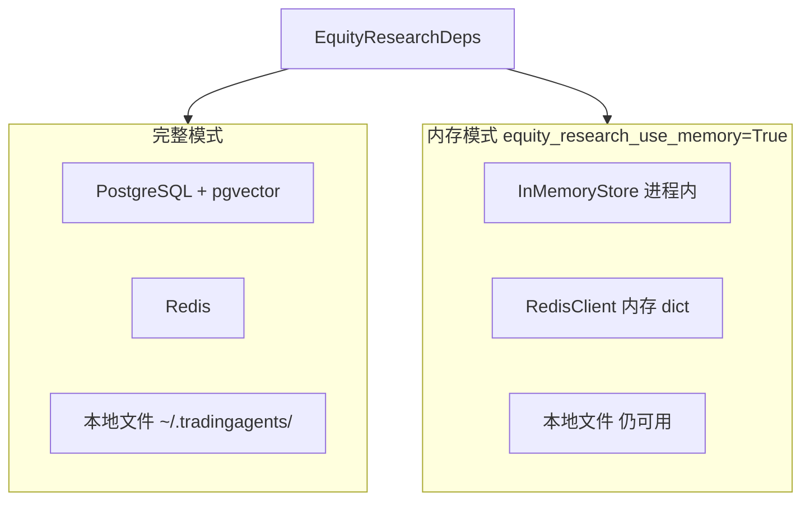
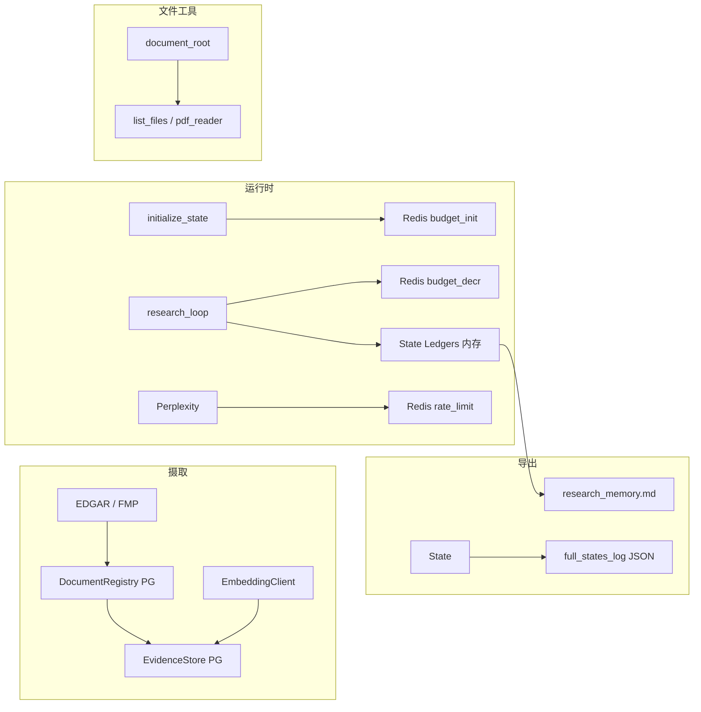

# Equity Research 存储方案：Redis、PostgreSQL 与本地文件

> 语言：[中文](storage.md) | [English](../../README.md) · [中文主文档](../../README.zh-CN.md) · [文档索引](../zh/README.md)  
> 模块路径：`tradingagents/equity_research/storage/`、`integrations/redis_cache.py`、`export/`  
> 相关文档：[文件结构](file-structure.md) · [Memory](memory.md) · [产品概览](../EQUITY_RESEARCH.md)

## 设计原则

Equity Research 将持久化职责拆到三类后端，各自解决不同问题：

| 后端 | 职责 | 是否必需 |
|------|------|----------|
| **PostgreSQL** | 跨会话的结构化数据：文档注册、证据片段、事实、执行轨迹；可选 pgvector 向量检索 | 否（可回退内存） |
| **Redis** | 运行时计数：Perplexity 限流、报告级资源预算、语义缓存 | 否（可回退进程内 dict） |
| **本地文件** | 人类可读导出、运行日志、Agent 可读文档工作区 | 是（默认写入 `~/.tradingagents/`） |

三类存储通过 [`agents/deps.py`](../../tradingagents/equity_research/agents/deps.py) 的 `EquityResearchDeps` 统一装配，各 Agent 节点通过 `deps.documents`、`deps.evidence`、`deps.redis` 等访问，不直接操作连接字符串。

**与图内 Ledger 的关系**：LangGraph 状态中的 ledger（`evidence_ledger`、`claim_ledger` 等）是运行时工作记忆；PostgreSQL 存储的是可跨报告、可向量检索的**持久化副本**。两者通过 ingest / evidence agent 双写，详见 [Memory 文档](memory.md)。

---

## 配置与环境变量

### 顶层配置键（`default_config.py`）

```python
config = {
    "postgres_url": "postgresql+psycopg://localhost/tradingagents_equity",
    "redis_url": "redis://localhost:6379/0",
    "equity_research_results_dir": "~/.tradingagents/equity_research",
    "equity_research_use_memory": False,  # True 时跳过 PG/Redis，全用内存
    "equity_research": {
        "perplexity_rate_limit": 20,
        "budget": {
            "max_search_queries": 5,
            "max_extraction_docs": 8,
        },
        "embedding_provider": "hash",       # 或 openai / qwen
        "embedding_model": "text-embedding-3-small",
        "embedding_dim": 1024,
        "document_root": None,              # 文档工具沙箱根目录
        "code_root": None,                  # 代码工具沙箱根目录
    },
}
```

### 环境变量

| 变量 | 用途 | 默认值 |
|------|------|--------|
| `TRADINGAGENTS_POSTGRES_URL` | PostgreSQL 连接串（SQLAlchemy） | `postgresql+psycopg://localhost/tradingagents_equity` |
| `TRADINGAGENTS_REDIS_URL` | Redis 连接串 | `redis://localhost:6379/0` |
| `TRADINGAGENTS_EQUITY_RESEARCH_DIR` | 研究结果与导出根目录 | `~/.tradingagents/equity_research` |
| `OPENAI_API_KEY` | embedding API（`embedding_provider` 非 hash 时） | — |

也可在 Python 中直接覆盖 `config["postgres_url"]`、`config["redis_url"]`，优先级高于环境变量。

---

## PostgreSQL

### 1.1 初始化

**创建数据库**：

```bash
createdb tradingagents_equity
psql -d tradingagents_equity -f scripts/setup_pgvector.sql
```

`setup_pgvector.sql` 仅执行 `CREATE EXTENSION IF NOT EXISTS vector`。表结构由代码在运行时创建。

**代码初始化**：`EquityResearchGraph(debug=True, init_database=True)` 调用 [`storage/db.py`](../../tradingagents/equity_research/storage/db.py) 的 `init_db()`：

1. 尝试 `CREATE EXTENSION IF NOT EXISTS vector`
2. `Base.metadata.create_all()` 建表
3. 为 `evidence_fragment` 添加 `embedding_vec vector(1024)` 列及 IVFFlat 索引

也可手动调用：

```python
from tradingagents.equity_research.storage.db import init_db
init_db(config)
```

### 1.2 数据表

| 表名 | Store 类 | 用途 |
|------|----------|------|
| `document_registry` | `DocumentRegistry` | 已摄取文档元数据（EDGAR、财报电话会等） |
| `evidence_fragment` | `EvidenceStore` | 证据摘录；含 `embedding`（JSON）与 `embedding_vec`（pgvector） |
| `structured_fact` | `FactStore` | 结构化财务/经营事实 |
| `research_trace` | `TraceStore` | 节点执行审计日志 |

ORM 模型定义于 [`storage/db.py`](../../tradingagents/equity_research/storage/db.py)。

`document_registry` 关键字段：

- `doc_fingerprint`：按 ticker + source_type + title + published_date 去重
- `access_path`：本地文件路径（若文档来自文件系统）
- `source_url`：远程来源 URL

### 1.3 写入时机

| 阶段 | 代码位置 | 操作 |
|------|----------|------|
| 文档摄取 | `workflow_agents.create_ingest_documents` | `deps.documents.register()` — EDGAR 申报 |
| 财报电话会 | `task_analysis.analyze_research_task` | `register` + `deps.evidence.insert()` + embedding |
| 证据检索 | `evidence_agents` | `register` + `insert`；`deps.facts.insert()` 提取结构化事实 |
| Perplexity 搜索 | `perplexity_tool.py` | 搜索结果注册为文档 |
| 节点追踪 | `deps.trace()` | `deps.traces.append()` + 同步写入 state `research_traces` |

### 1.4 向量检索

[`storage/evidence_store.py`](../../tradingagents/equity_research/storage/evidence_store.py) 的 `search_similar(ticker, query_embedding, top_k)`：

- pgvector 可用时：按 cosine 距离排序
- 不可用时：回退 `_fallback_text_search()`，按 ticker 取前 N 条

Embedding 由 [`integrations/embeddings.py`](../../tradingagents/equity_research/integrations/embeddings.py) 生成。默认 `embedding_provider: "hash"` 使用确定性哈希向量，无需 API；生产环境可改为 `openai` 并配置 `OPENAI_API_KEY`。

### 1.5 内存回退

当 `equity_research_use_memory=True`，或 PostgreSQL 连接失败时，[`agents/deps.py`](../../tradingagents/equity_research/agents/deps.py) 自动切换到 [`storage/in_memory.py`](../../tradingagents/equity_research/storage/in_memory.py)：

- `InMemoryDocumentRegistry`
- `InMemoryEvidenceStore`
- `InMemoryFactStore`
- `InMemoryTraceStore`

数据仅存于当前 Python 进程，重启后丢失；无 pgvector 语义检索。

```python
config = DEFAULT_CONFIG.copy()
config["equity_research_use_memory"] = True
graph = EquityResearchGraph(config=config, init_database=False)
```

---

## Redis

实现于 [`integrations/redis_cache.py`](../../tradingagents/equity_research/integrations/redis_cache.py) 的 `RedisClient`。

### 2.1 三大用途

#### 速率限制（Rate Limit）

Perplexity API 调用前检查：

```python
deps.perplexity = PerplexityClient.from_config(
    config,
    rate_limiter=lambda: deps.redis.rate_limit("perplexity", max_calls),
)
```

- Redis key：`rate:perplexity`
- 默认窗口：60 秒
- 上限：`equity_research.perplexity_rate_limit`（默认 20）
- 超限返回 `False`，调用方应跳过或等待

#### 资源预算（Budget）

每份报告在 `initialize_state` 时初始化（[`agents/init_agents.py`](../../tradingagents/equity_research/agents/init_agents.py)）：

```python
deps.redis.budget_init(report_id, {
    "search_queries": budget.max_search_queries,    # 默认 5
    "extraction_docs": budget.max_extraction_docs,  # 默认 8
})
```

Redis key 格式：`budget:{report_id}:{resource}`

| 资源 | 扣减位置 | 说明 |
|------|----------|------|
| `search_queries` | `evidence_agents` 检索证据、Perplexity 搜索 | 每次搜索 `budget_decr` |
| `extraction_docs` | `evidence_agents` 文档提取 | 每篇文档 `budget_decr` |

读取：`deps.redis.budget_get(report_id, "search_queries")`；为 0 时 agent 应停止对应操作。

#### 语义缓存（Semantic Cache）

```python
deps.redis.semantic_cache_get(key)   # 读 JSON
deps.redis.semantic_cache_set(key, value, ttl=900)  # 默认 TTL 15 分钟
```

- Redis key：`semcache:{key}`
- `RedisClient.cache_key(*parts)` 生成 SHA256 短 key

当前为基础设施能力，供搜索/embedding 结果去重扩展使用。

### 2.2 内存回退

`equity_research_use_memory=True` 或 Redis 连接失败时，`RedisClient` 使用进程内 `_memory: dict`：

- `rate_limit()` 始终返回 `True`（不限流）
- `budget_*` 在 dict 中模拟计数
- `semantic_cache_*` 在 dict 中存 JSON 字符串

Redis 单点故障时，budget 操作会静默回退到内存 dict，不中断流水线。

---

## 本地文件

### 3.1 目录布局

默认根目录：`~/.tradingagents/equity_research/`（可由 `TRADINGAGENTS_EQUITY_RESEARCH_DIR` 覆盖）

```text
~/.tradingagents/equity_research/
└── {TICKER}/
    └── {report_id}/
        ├── research_memory.md          # export_report 节点导出
        ├── full_state.json             # 完整状态快照
        └── full_states_log_{date}.json # propagate 结束时追加日志
```

路径解析：

- 导出：[`export/markdown_memory.py`](../../tradingagents/equity_research/export/markdown_memory.py) — `export_research_memory()`
- 运行日志：[`graph/equity_research_graph.py`](../../tradingagents/equity_research/graph/equity_research_graph.py) — `_save_state_log()`

两者均读取 `config["equity_research_results_dir"]`；`export_research_memory` 在未配置时会拼 `{home}/{ticker}/{report_id}`。

### 3.2 文档工作区（document_root）

Agent 通过 document 类工具读写本地文件，根目录由 [`tools/workspace_utils.py`](../../tradingagents/equity_research/tools/workspace_utils.py) 解析：

```python
get_document_root()
# 优先级：equity_research.document_root
#        → equity_research_results_dir
#        → results_dir
#        → "."
```

`resolve_safe_path(file_path)` 强制路径落在 root 内，防止目录穿越。

受影响的工具（[`tools/document_tools.py`](../../tradingagents/equity_research/tools/document_tools.py)）：

| 工具 | 作用 |
|------|------|
| `list_files` | 列出目录内容 |
| `file_reader` | 读 txt/json/csv（最大 50k 字符） |
| `pdf_reader` | 读 PDF（最多 50 页，需 pypdf） |
| `docx_reader` | 读 Word（需 python-docx） |
| `table_extractor` | 从 html/csv/pdf 提取表格 |

Artifact 输出目录：`get_document_root() / "artifacts"`（[`tools/data_tools.py`](../../tradingagents/equity_research/tools/data_tools.py)）。

### 3.3 代码工作区（code_root）

```python
get_code_root()
# 优先级：equity_research.code_root → project_dir → "."
```

供 code 类工具（`python_exec`、`shell_exec` 等，默认关闭沙箱）限定执行范围。配置项：

```python
"equity_research": {
    "document_root": "/path/to/research/docs",
    "code_root": "/path/to/sandbox",
    "tools": {
        "python_exec_sandbox": False,
        "shell_exec_sandbox": False,
    },
}
```

### 3.4 本地文件与 PostgreSQL 的关联

文档注册时可写入 `access_path` 指向 `document_root` 下的文件：

```python
deps.documents.register(
    ticker="NVDA",
    source_type="local_pdf",
    title="Investor Presentation",
    access_path="/path/under/document_root/deck.pdf",
    file_hash="sha256...",
)
```

Agent 随后可通过 `file_reader` / `pdf_reader` 读取同一文件，同时将摘录写入 `deps.evidence.insert()` 进入 PostgreSQL。

---

## 部署模式对比



| 模式 | 配置 | PostgreSQL | Redis | 本地文件 | 适用场景 |
|------|------|------------|-------|----------|----------|
| 生产 | 默认 | 是 | 是 | 是 | 多报告、向量检索、预算/限流 |
| 开发/测试 | `equity_research_use_memory=True` | 内存 | 内存 dict | 是 | 无 DB 快速冒烟 |
| PG 不可用 | 自动回退 | 内存 | 视 Redis 而定 | 是 | 降级运行 |

---

## 端到端数据流



---

## 运维与排查

### 验证 PostgreSQL

```bash
psql "$TRADINGAGENTS_POSTGRES_URL" -c "\dt"
psql "$TRADINGAGENTS_POSTGRES_URL" -c "SELECT COUNT(*) FROM document_registry;"
```

集成测试：`pytest tests/equity_research/test_storage_pg.py -m integration`（需设置 `TRADINGAGENTS_POSTGRES_URL`）。

### 验证 Redis

```bash
redis-cli -u "$TRADINGAGENTS_REDIS_URL" KEYS "budget:*"
redis-cli -u "$TRADINGAGENTS_REDIS_URL" KEYS "rate:*"
```

### 查看本地导出

```bash
ls ~/.tradingagents/equity_research/NVDA/
cat ~/.tradingagents/equity_research/NVDA/{report_id}/research_memory.md
```

### 常见问题

| 现象 | 可能原因 | 处理 |
|------|----------|------|
| 日志出现 `PostgreSQL storage unavailable` | PG 未启动或连接串错误 | 检查 `TRADINGAGENTS_POSTGRES_URL`；或设 `equity_research_use_memory=True` |
| Perplexity 调用过多 | 超出 `perplexity_rate_limit` | 调大配置或等待 60 秒窗口重置 |
| 搜索/提取提前停止 | Redis budget 耗尽 | 增大 `equity_research.budget` 或检查 `budget:*` key |
| 向量检索无结果 | pgvector 未安装或 embedding 为空 | 运行 `setup_pgvector.sql`；检查 `embedding_provider` |
| 文件工具报 path escapes | 路径超出 `document_root` | 将文件放入 `document_root` 或使用相对路径 |

---

## 扩展指南

| 场景 | 建议做法 |
|------|----------|
| 新增持久化实体 | 在 `storage/db.py` 加 ORM 模型 → 新建 `*_store.py` → 在 `deps.py` 装配 |
| 新增预算维度 | 在 `budget_init` 增加 resource 名 → 在对应 agent 调用 `budget_decr` |
| 自定义导出格式 | 扩展 `export/markdown_memory.py` 或在 `final_agents` 增加节点 |
| 挂载本地研报目录 | 设置 `equity_research.document_root` 指向研报文件夹 |
