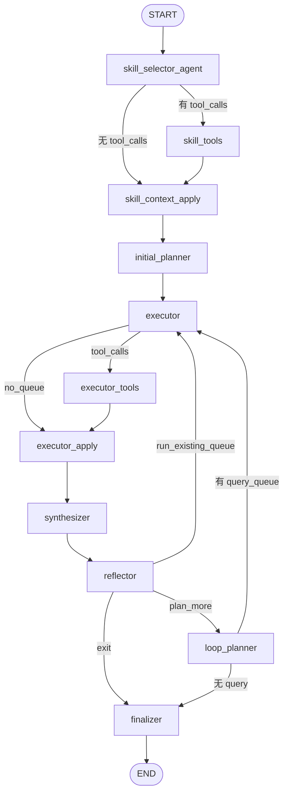

> 英文原文见 `tradingagents/equity_research/agents/assumption/RUNTIME.md`

# Assumption Subgraph 运行时说明

本文档描述 `assumption` 子图在运行时的执行流程、各步骤 Prompt、Skill 加载行为，以及输入/输出字段。

实现入口：`agents/assumption/subgraph.py` → `GenericResearchSubgraph` + `ASSUMPTION_TASK_PROFILE`（`tasks/assumption/profile.py`）。

**前置依赖**：通常在 `consensus` 子图完成后运行（见 `agents/task_analysis.py`），以 consensus 结果作为只读上下文。

---

## 执行流程概览

与 consensus 共用同一 `GenericResearchSubgraph` 骨架，但 **不启用 human_review**。



默认最多 **3 轮**迭代（`max_iterations=3`），覆盖率阈值 **0.7**（`coverage_threshold=0.7`）。

---

## 子图输入（seed state）

由 `_seed_assumption_state` 从父状态构造：

| 字段 | 来源 | 说明 |
|------|------|------|
| `ticker`, `sector`, `report_type`, ... | 父 state | 标的与报告上下文 |
| `max_iterations` | `max_assumption_iterations` 或 profile 默认 3 | 迭代上限 |
| `structured_view` | 空 `AssumptionView`（`assumption_map: []`） | 条目式假设视图 |
| `search_memory` | `consensus_search_memory` | **仅 dedupe**，planner 标注 do not summarize |
| `evidence_buffer` | **空** | 不继承 `consensus_evidence_buffer` |
| `parent_context` | 扩展 | 含 `consensus_view`, `consensus_report`（只读锚点） |
| `human_followup_query` | 父 state（可选） | 人工追问（profile 未启用 human_review 节点，字段可传入但不触发中断） |

---

## 子图输出（map result）

由 `_map_assumption_result` 写回父状态：

| 父 state 字段 | 子图来源 | 说明 |
|---------------|----------|------|
| `assumption_view` | `structured_view` | 完整 `AssumptionView` |
| `assumption_map` | `view.assumption_map` | 条目式假设列表 |
| `consensus_assumptions` | 兼容 shim | `{id: statement}` + `top_research_priorities` |
| `research_directions` | `view.top_research_priorities` | 研究优先级 |
| `assumption_report` | `final_report` | Markdown 报告 |
| `assumption_search_memory` | `search_memory` | 假设探测搜索记忆 |
| `assumption_evidence_buffer` | `evidence_buffer` | 假设探测证据 |
| `documents`, `api_calls`, `compliance_flags`, `errors`, `research_traces` | 子图累积 | 同上 |

---

## 各步骤 Prompt 与 I/O

### 1. skill_selector_agent

**LLM**：`deps.quick_llm`（bind `load_research_skills` tool）

**Prompt**（`tasks/assumption/prompts.py` → `build_skill_prompt`）：

```
Select equity research skills to probe assumptions behind market consensus on {ticker}.
Sector: {sector}
Report type: {report_type}
Consensus context:
{consensus_view 格式化全文}

Skill catalog:
{catalog_table}

Choose skill names from the catalog only. Return at most two skill names.
```

**输入**：`ticker`, `sector`, `report_type`, `parent_context.consensus_view`

**输出**：`messages`（可能含 `load_research_skills` tool call）

---

### 2. skill_tools → skill_context_apply

**无 LLM Prompt**。

**输出**：`active_skills`, `active_skill_context`, `skill_catalog`, `loaded_skills`

Fallback skill 目标为 `market_assumption_decomposition`（`OBJECTIVE_SKILL_MAP["assumption"]`）。注意：该 skill 定义文件当前为 `market_assumption_decomposition.md`（非 `*.skill.md`），**可能未进入运行时目录扫描**；若 fallback 失败，将退回到目录中第一个可用 skill（通常为 `broker_consensus_mining`）。

---

### 3. initial_planner

**LLM**：`deps.deep_llm` → 结构化输出 `QueryPlan`

**Prompt**（`build_initial_planner_prompt`）：

```
Generate an initial Perplexity search query queue to probe key assumptions behind market consensus on {ticker}.

Market consensus view:
{consensus_view 格式化文本}

Active skills:
{skill names}
{format_skill_context(active_skill_context)}
{Prior search memory: ...}

Use only publicly available sources: SEC filings, earnings calls, broker research summaries, news, and consensus data providers. Do not use MNPI, insider tips, or unauthorized expert network content.

Produce 3-5 query items covering assumption themes. Each item must include:
- query: 10-80 English words
- target_dimension: one of
  - business_model
  - market_sentiment
  - key_metrics
  - valuation
  - earnings_focus
  - expectation_changes
  - benchmark_expectations
  - model_drivers
  - debates
  - stress_test
  - next_data
- mode: exploratory or targeted
- priority: integer (higher = run first)
Do not repeat queries already in prior search memory.
```

**输入**：consensus 视图、`active_skill_context`、`search_memory`（含 consensus 历史）

**输出**：`query_queue`（3–5 条）；失败时用 `default_queries(ticker)` 兜底，且每条 query 自动追加合规后缀

**Query 去重**：与 `executed_queries` / `search_memory` 比对，语义相似度 > 0.7 则过滤。

**默认兜底 queries**（`tasks/assumption/queries.py`）：

| 维度 | 示例 query 主题 |
|------|----------------|
| `business_model` | 收入模式、利润率 |
| `market_sentiment` | 牛熊情绪、分析师评级 |
| `key_metrics` | 投资者关注 KPI |
| `debates` | 投资辩论、variant view |
| `stress_test` | 共识假设压力测试 |

---

### 4. executor（dispatch → tools → apply）

与 consensus 相同：通过 `batch_perplexity_search` 工具批量搜索，无 LLM Prompt。子图节点为 `executor` → `executor_tools` → `executor_apply`。

**输出**：`pending_evidence`, `evidence_buffer`, `search_memory`, `query_queue`, `documents`, `api_calls`

---

### 5. synthesizer

**LLM**：`deps.quick_llm` → 结构化输出 `AssumptionViewUpdate`

**Prompt**（`build_synthesizer_prompt`）：

```
Update the assumption research view for {ticker} using new search evidence.

Market consensus (read-only context):
{consensus_view 格式化文本}

Current assumption view:
{format_assumption_view(view)}

New search evidence (this round only):
{evidence_text}

Merge incrementally. Populate current_assumptions from evidence only.
Add research_suggestions (direction, rationale, priority, related_assumption).
Add concise research_directions titles (list of strings).
Label unverified claims [UNVERIFIED]. Keep conflicts with [CON].
Update dimension_coverage for probed assumption dimensions.
```

**输入**：`structured_view`（`AssumptionView`）, `pending_evidence`, `parent_context.consensus_view`

**输出**：更新后的 `structured_view`，清空 `pending_evidence`

#### Merge / 语义去重

Synthesizer 产出的 `AssumptionViewUpdate` 经 `tasks/assumption/merge.merge_assumption_view` 增量合并：

| 字段 | 去重策略 |
|------|----------|
| `assumption_map` | 按 `id` 合并；无 id 时 `statement` 语义相似度 ≥ **0.85** 视为同条 |
| `research_suggestions` | `direction` 相似则合并：priority 取 min、合并 rationale 与 next_checks |
| `top_research_priorities` / `open_questions` / `watchlist` | `merge_list_by_similarity`（threshold 0.85） |
| 子列表字段（`evidence_for` 等） | 字符串子列表同样语义去重 |

底层相似度：`memory.retrieval.text_similarity`（Jaccard token overlap）+ `canonical_key` 预检。

---

### 6. reflector

**LLM**：`deps.quick_llm` → 结构化输出 `AssumptionCoverageEvaluation`

**Prompt**（`build_reflector_prompt`）：

```
Evaluate coverage of assumption probing for {ticker}.
Assumption view:
{format_assumption_view(view)}
{Search history summary: ...}

Score each assumption dimension as empty, partial, sufficient, or strong.
Provide an overall_score between 0 and 1.
List critical_gaps as dimension names still weak.
List suggested_focus as dimensions to prioritize next.
```

**输出**：`coverage_report`, `coverage_history`, `iterations`, `exploration_graph`

**退出条件**：`overall_score >= 0.7` 且无 `critical_gaps`，或达到 `max_iterations=3`

---

### 7. loop_planner

**LLM**：`deps.deep_llm` → `QueryPlan`（最多 2 条）

**Prompt**（`build_loop_planner_prompt`）：

```
Generate up to 2 new Perplexity queries to fill assumption gaps for {ticker}.
Last coverage evaluation (round {iterations}):
{coverage_report_formatted}

Market consensus:
{consensus_view}

Current assumption view:
{assumption_view}

Prior search memory: ...
Executed queries: ...

{format_skill_context(skill_ctx)}

Use only publicly available sources: ... (合规后缀)

Produce up to 2 query items. Prioritize weak assumption dimensions.
- target_dimension: one of [11 个 assumption 维度]
```

---

### 8. finalizer

**LLM**：`deps.quick_llm` → 自由文本 Markdown

**Prompt**（`build_finalizer_prompt`）：

```
Write a concise assumption probe report for {ticker} (target 400-800 words, aim for roughly {report_max_chars} characters).

{assemble_and_compact_context: consensus_report + assumption_view + coverage + search_memory + skills}

Include:
- Key assumptions behind consensus
- Research suggestions and directions for follow-up work
- Data gaps and recommended next checks
```

动态材料经 `assemble_and_compact_context` 一次拼装（`consensus_report` **不再** `[:1500]` 硬切）。

**输出**：`final_report` → 映射为父 state 的 `assumption_report`；**不做硬截断**，`report_max_chars` 仅作为 prompt 软引导。

---

## Skill 加载

### 可见目录（`agent_visibility_id=assumption_subgraph`）

限定为 **仅** `market_assumption_decomposition`（严格白名单）：

| Skill | 说明 |
|-------|------|
| `market_assumption_decomposition` | 唯一可见 skill，亦为 fallback |

### 预计加载与注入内容

选中 skill 后，以下内容通过 `format_skill_context` 注入 planner / finalizer：

| 注入字段 | 含义 |
|----------|------|
| `constraints` | skill 约束（如：不重复共识、聚焦隐含假设） |
| `query_guidance` | 搜索主题模板（按商业模型、需求、供给、财务、竞争、辩论等分类） |
| `prompt_template` | 角色与任务说明（变量：`{ticker}`, `{sector}`, `{report_type}`, `{instrument_context}`, `{objective}`） |

### 最相关 skill：market_assumption_decomposition

设计意图上的 assumption 专用 skill（`skills/definitions/market_assumption_decomposition.md`）：

- **描述**：逆向推导市场共识背后的隐含假设，识别研究方向
- **when_to_use**：已有结构化 consensus 后，需要挖掘假设、不确定性、辩论点
- **Constraints 要点**：
  - 不重复陈述共识报告
  - 聚焦「市场为何相信当前共识」
  - 区分证据、假设、推测
  - 标注可观测、可证伪、对估值影响大的假设
- **Query Guidance 主题**：商业模式、需求假设、供给假设、财务假设、竞争假设、辩论发现、验证信号

### 其他可能被选中的 skill（全目录可见）

| Skill | 与 assumption 任务的相关性 |
|-------|---------------------------|
| `forecast_assumption_builder` | 建模假设构建 |
| `business_model_analysis` | 商业模式驱动因素 |
| `valuation` | 估值假设 |
| `risk_counterthesis` | 反方论点、压力测试 |
| `variant_view_discovery` | 与市场共识的差异 |
| `broker_consensus_mining` | fallback 时可能被加载 |

---

## 数据结构

### AssumptionView（`structured_view` / `assumption_view`）

| 字段 | 类型 | 说明 |
|------|------|------|
| `ticker`, `as_of`, `coverage_score` | 元数据 | 标的与时间戳 |
| `current_assumptions` | `ConsensusAssumptions` | 当前假设集合 |
| `research_suggestions` | `ResearchSuggestion[]` | 方向、理由、优先级、关联假设 |
| `research_directions` | `string[]` | 研究方向标题 |
| `dimension_coverage` | `dict[str, CoverageStatus]` | 11 维覆盖度 |
| `source_doc_ids` | `string[]` | 来源文档 ID |

### ConsensusAssumptions（`consensus_assumptions`）

| 字段 | 说明 |
|------|------|
| `business_model` | 商业模式假设 |
| `market_sentiment` | 市场情绪 |
| `key_metrics_watched` | 关注指标 |
| `valuation_rationale` | 估值逻辑 |
| `earnings_focus` | 财报关注点 |
| `recent_expectation_changes` | 近期预期变化 |
| `benchmark_expectations` | 市场基准预期 |
| `sellside_model_drivers` | 卖方模型驱动变量 |
| `key_debates` | 关键辩论 |
| `stress_test_candidates` | 压力测试候选 |
| `recommended_next_data` | 建议下一步验证数据 |
| `sources` | 引用 URL |

### 11 个 Assumption 维度

`business_model`, `market_sentiment`, `key_metrics`, `valuation`, `earnings_focus`, `expectation_changes`, `benchmark_expectations`, `model_drivers`, `debates`, `stress_test`, `next_data`

---

## 合规

Assumption 的 planner 与 loop_planner 均追加 `COMPLIANCE_QUERY_SUFFIX`（`tasks/consensus/compliance.py`）：

> Use only publicly available sources: SEC filings, earnings calls, broker research summaries, news, and consensus data providers. Do not use MNPI, insider tips, or unauthorized expert network content.

`normalize_query_items` 也会为每条 query 自动 `append_compliance_suffix`。

---

## 与 Consensus 的关系

| 方面 | Consensus | Assumption |
|------|-----------|------------|
| 目标 | 构建市场共识五维度视图 | 挖掘共识背后的隐含假设与研究机会 |
| 结构化 schema | `StructuredConsensusView` | `AssumptionView` |
| 读取 consensus | — | `parent_context.consensus_view` + `consensus_report` |
| 搜索记忆起点 | 空或自身历史 | 继承 `consensus_search_memory` |
| 证据起点 | 空 | 继承 `consensus_evidence_buffer` |
| Human review | 默认开启（可配置） | 关闭 |
| 迭代上限 | 5 | 3 |
| 覆盖率阈值 | 0.75 | 0.7 |

---

## 配置要点

| 配置路径 | 默认值 | 作用 |
|----------|--------|------|
| `equity_research.prompt_context_max_chars` | 32000 | 统一 prompt context 预算 |
| `equity_research.structured_output_max_retries` | 3 | 结构化输出重试 |
| `equity_research.batch_search_concurrency` | batch_size | 并发搜索数 |
| profile `report_max_chars` | 4000 | finalizer prompt 软引导字数（不硬截断） |
