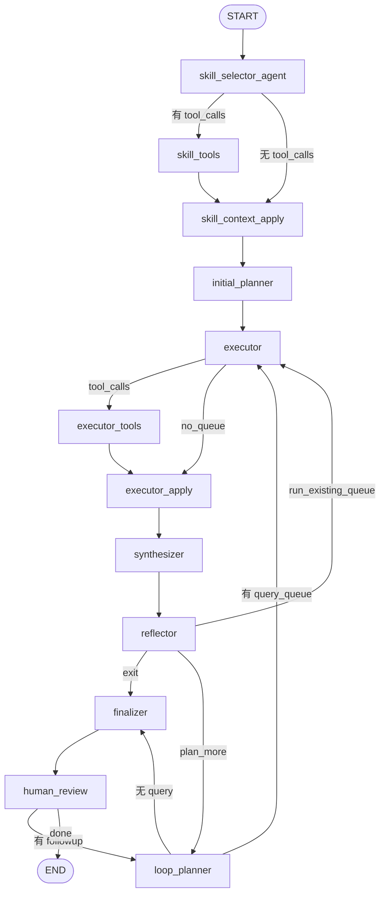

> 英文原文见 `tradingagents/equity_research/agents/consensus/RUNTIME.md`

# Consensus Subgraph 运行时说明

本文档描述 `consensus` 子图在运行时的执行流程、各步骤 Prompt、Skill 加载行为，以及输入/输出字段。

实现入口：`agents/consensus/subgraph.py` → `GenericResearchSubgraph` + `CONSENSUS_TASK_PROFILE`（`tasks/consensus/profile.py`）。

---

## 执行流程概览



默认最多 **5 轮**迭代（`max_iterations=5`），覆盖率阈值 **0.75**（`coverage_threshold=0.75`）。`reflector` 判定 `routing_decision=exit` 时进入 `finalizer`。

---

## 子图输入（seed state）

由 `_seed_consensus_state` 从父状态构造，关键字段：

| 字段 | 来源 | 说明 |
|------|------|------|
| `ticker`, `sector`, `report_type`, `instrument_context`, `report_id` | 父 state | 标的与报告上下文 |
| `documents`, `api_calls` | 父 state | 已有文档与 API 调用计数 |
| `max_iterations` | `max_consensus_iterations` 或 profile 默认 5 | 迭代上限 |
| `structured_view` | 空 `StructuredConsensusView` | 子图内结构化视图 |
| `search_memory` | `consensus_search_memory`（若有） | 可复用历史搜索记忆 |
| `human_followup_query` | 父 state（可选） | 人工追问，触发 human review 后再规划 |

典型父状态来源：`task_analysis` 工作流在 SEC ingest 之后调用 consensus。

---

## 子图输出（map result）

由 `_map_consensus_result` 写回父状态：

| 父 state 字段 | 子图来源 | 说明 |
|---------------|----------|------|
| `consensus_view` | `structured_view` | `StructuredConsensusView` |
| `consensus_report` | `final_report` | Markdown 报告 |
| `consensus_evidence_buffer` | `evidence_buffer` | 全部搜索证据 |
| `consensus_search_memory` | `search_memory` | 搜索记忆 |
| `consensus_iterations` | `iterations` | 完成轮数 |
| `documents`, `api_calls` | 子图累积 | 新增 doc_id、Perplexity 调用次数 |
| `compliance_flags`, `errors`, `research_traces` | 子图（若有） | 合规标记与追踪 |

---

## 各步骤 Prompt 与 I/O

### 1. skill_selector_agent

**LLM**：`deps.quick_llm`（bind `load_research_skills` tool）

**Prompt**（`tasks/consensus/prompts.py` → `build_skill_prompt`）：

```
Select equity research skills to load for building market consensus on {ticker}.
Sector: {sector}
Report type: {report_type}
Instrument context: {instrument_context}

Skill catalog (read descriptions and when_to_use before deciding):
{catalog_table}

Choose skill names from the catalog only.
You may return an empty load_skills list if no skill is needed.
Return at most two skill names.
```

**输入**：`ticker`, `sector`, `report_type`, `instrument_context` + 可见 skill 目录表

**输出**：`messages`（含 AIMessage，可能带 `load_research_skills` tool call）

---

### 2. skill_tools → skill_context_apply

**无 LLM Prompt**。执行 `load_research_skills(skill_names)` tool。

**输入**：tool call 中的 skill 名称列表（最多 2 个）

**输出**：

| 字段 | 说明 |
|------|------|
| `active_skills` | 已加载 skill 名 |
| `active_skill_context` | 见下方「Skill 加载内容」 |
| `skill_catalog` | 本次可见目录快照 |
| `loaded_skills` | 同 `active_skills` |

若 LLM 未选 skill 或选择无效，fallback 为 `broker_consensus_mining`（`OBJECTIVE_SKILL_MAP["consensus"]`）。

---

### 3. initial_planner

**LLM**：`deps.deep_llm` → 结构化输出 `QueryPlan`

**Prompt**（`build_initial_planner_prompt`）：

```
Generate an initial Perplexity search query queue for market consensus on {ticker}.
Sector: {sector}
Report type: {report_type}
Active skills:
{skill names}

{format_skill_context(active_skill_context)}
{Prior search memory: ...}

Produce exactly 5 query items, one for each dimension. Each item must include:
- query: 10-80 English words
- target_dimension: one of
  - quantitative_estimates
  - kpi_focus
  - pricing_assumptions
  - narrative_framework
  - recent_delta
- mode: exploratory or targeted
- priority: integer (higher = run first)

Do not repeat queries already covered in prior search memory.
```

**输入**：`active_skill_context`, `search_memory`, 标的元数据

**输出**：`query_queue`（最多 5 条 `QueryItem`）；LLM 失败时用 `default_queries(ticker)` 兜底

**Query 去重**：与 `executed_queries` / `search_memory` 中已有 query 做语义比对（`memory.retrieval.text_similarity`，Jaccard token overlap）；相似度 > 0.7 则过滤，避免重复搜索。

---

### 4. executor（dispatch → tools → apply）

**无 LLM Prompt**。`executor` 从 `query_queue` 按 `priority` 取最多 5 条，构造 `batch_perplexity_search` 工具调用；`executor_tools`（ToolNode）执行搜索；`executor_apply` 将结果写回状态。

**工具**：`batch_perplexity_search`（[`search_tools.py`](../../tools/search_tools.py) + [`tools/lc/search.py`](../../tools/lc/search.py)）

- 支持单条 query 或 query 列表
- 批内相同 query（规范化精确匹配）只调一次 Perplexity，结果 fan-out 到各 item
- `search_memory` 中已有相同 query 时复用缓存，不增加 `api_calls`
- 多条未缓存 query 时按 `batch_search_concurrency` 并发

**每条搜索输入**：`query`, `mode`, `target_dimension`, `ticker`

**输出**（由 `executor_apply` 写入）：

| 字段 | 说明 |
|------|------|
| `pending_evidence` | 本轮新证据（供 synthesizer 消费） |
| `evidence_buffer` | 累积证据 |
| `search_memory` | 追加 `SearchRecord` |
| `executed_queries` | 已执行 query 列表 |
| `query_queue` | 剩余未执行队列 |
| `documents`, `api_calls` | 新 doc_id 与调用计数 |

---

### 5. synthesizer

**LLM**：`deps.quick_llm` → 结构化输出 `ConsensusViewUpdate`

**Prompt**（`build_synthesizer_prompt`）：

```
Update the structured consensus view for {ticker} using search evidence.
Current view:
{format_consensus_view(view)}

New search evidence (this round only):
{evidence_text}

Merge incrementally — do not erase existing content.
If there is any conflict between existing content and new evidence, add a structured conflict record; do not append [CON] tags.
For every numeric estimate include period, basis, and source_quality when known.
Do not use Reddit, YouTube, or social media as core estimate evidence.
Attribute evidence only to its target_dimension.
Update dimension_coverage for each dimension.
Do not fabricate numbers without citation in sources.
```

**输入**：`structured_view`, `pending_evidence`

**输出**：更新后的 `structured_view`（同步写 `consensus_view`），清空 `pending_evidence`

#### Merge / 语义去重

Synthesizer 产出的 `ConsensusViewUpdate` 经 `tasks/consensus/merge.merge_view_update` 增量合并：

| 字段类型 | 去重策略 |
|----------|----------|
| 字符串列表（`key_debates`、`growth_drivers`、`risk_factors` 等） | `runtime/utils/dedupe.merge_list_by_similarity`（底层 `memory.retrieval.text_similarity`，threshold **0.85**）；相似命中时保留更长条目 |
| `sources` / `source_doc_ids` | 精确去重（URL 不做语义合并） |
| 标量冲突 | 写入 `ConflictRecord` 结构化对象，不用 `[CON]` 文本拼接 |

---

### 6. reflector

**LLM**：`deps.quick_llm` → 结构化输出 `CoverageEvaluation`

**Prompt**（`build_reflector_prompt`）：

```
Evaluate coverage of the consensus view for {ticker}.
View:
{format_consensus_view(view)}
{Search history summary: ...}

Score each dimension as empty, partial, sufficient, or strong.
Provide an overall_score between 0 and 1.
List critical_gaps as dimension names still weak.
List suggested_focus as dimensions to prioritize next.
```

**输入**：`structured_view`, `search_memory`

**输出**：

| 字段 | 说明 |
|------|------|
| `coverage_report` | 含 `dimension_scores`, `overall_score`, `critical_gaps`, `routing_decision` |
| `coverage_history` | 每轮评估快照 |
| `iterations` | 轮次 +1 |
| `exploration_graph` | 探索图节点 |

**路由逻辑**（`coverage_reflector_router`）：

- `routing_decision=exit` → `finalizer`
- `query_queue` 非空 → 回到 `executor`
- 否则 → `loop_planner`

---

### 7. loop_planner（缺口补搜，可重复）

**LLM**：`deps.deep_llm` → `QueryPlan`（最多 2 条）

**Prompt**（`build_loop_planner_prompt`）：

```
Generate up to 2 new Perplexity queries to find consensus gaps in the view for {ticker}.
Last coverage evaluation (round {iterations}):
{coverage_report_formatted}

Current consensus view:
{view_text}

Prior search memory: ...
Executed queries: ...

{format_skill_context(skill_ctx)}
{Analyst follow-up requests: ...}  # 若有人工追问历史

Produce a query plan with up to 2 items. Each item must include:
- query: 10-80 English words, different from prior queries
- target_dimension: one of [五个 consensus 维度]
- mode: exploratory or targeted
- priority: integer
Prioritize dimensions still weak per the coverage evaluation above.
Do not re-search topics already sufficient or strong.
Do not repeat topics already covered in prior search memory.
If there is any conflicts between existing content and new evidence, leave both side view.
```

**输出**：追加到 `query_queue`；无新 query 则路由到 `finalizer`

**Query 去重**：与 `executed_queries` / `search_memory` 比对，语义相似度 > 0.7 则过滤（同 planner）。

---

### 8. finalizer

**LLM**：`deps.quick_llm` → 自由文本 Markdown

**Prompt**（`build_finalizer_prompt`）：

```
Write a moderate-length market consensus report for {ticker} (target 800-1500 words, aim for roughly {report_max_chars} characters).

Structured consensus view:
{view_text}

Key assumptions behind consensus:
{assumptions}  # 注：consensus profile 未单独跑 assumption probe，此字段通常为空

Coverage evaluation:
{coverage}

Search memory summary: ...
Active skills context: ...

Requirements:
- Organize by the five consensus dimensions
- Include a section titled 'Key Assumptions Behind Consensus'
- Note evidence gaps explicitly
- Include key citation URLs inline
- Do not fabricate numbers without sources
- Disclose any compliance flags at the end
Return markdown only.
```

**输出**：`final_report`（同时写 `consensus_report`）；**不做硬截断**，`report_max_chars` 仅作为 prompt 软引导。

---

### 9. human_review（可选，默认开启）

**无 LLM Prompt**。配置项：`equity_research.consensus_human_review`（`enabled`, `interrupt`）。

**输入**：`final_report`, `coverage_report`, `human_followup_query`

**输出**：`human_review_payload`；若有 `human_followup_query`，设置 `_pending_human_followup=True` 并路由回 `loop_planner`

---

## Skill 加载

### 可见目录（`agent_visibility_id=consensus_subgraph`）

在 `skills/agent_visibility.py` 中按 **严格 `include_names` 白名单** 过滤（不再用 tag 扩展）：

| Skill | 纳入原因 |
|-------|----------|
| `broker_consensus_mining` | 显式白名单 |
| `variant_view_discovery` | 显式白名单 |

`market_assumption_decomposition` 虽带 `consensus` tag，但已显式 exclude，不会进入 consensus 目录。

### 预计加载与注入内容

LLM 通过 `load_research_skills` 最多选 **2 个** skill。选中后 `build_skill_context` 将以下内容注入后续 planner prompt（`format_skill_context`）：

| 字段 | 来源（skill 文件 section） |
|------|---------------------------|
| `constraints` | `## Constraints` |
| `query_guidance` | `## Query Guidance` |
| `prompt_template` | `## Prompt Template`（变量替换：`{ticker}`, `{sector}`, `{report_type}`, `{instrument_context}`） |
| `tools` | frontmatter `tools` |
| `compatible_with` | frontmatter |

#### broker_consensus_mining（consensus 默认 fallback）

- **用途**：重建市场共识五维度框架
- **Query Guidance 示例**：分析师营收/EPS 共识、KPI、估值倍数、牛熊叙事、近期修正
- **Constraints**：仅公开信息；覆盖五维度；标注来源可靠性

#### variant_view_discovery（可选）

- **用途**：在已有共识基础上识别与市场不同的 variant view
- **Constraints**：每个 variant 须引用具体共识假设；限制最高重要性缺口

---

## 五个 Consensus 维度

| 维度 | 含义 |
|------|------|
| `quantitative_estimates` | 分析师营收/EPS/FCF 估计区间 |
| `kpi_focus` | 市场关注的核心 KPI |
| `pricing_assumptions` | 估值倍数、隐含增速、同业对比 |
| `narrative_framework` | 牛熊案例、关键辩论 |
| `recent_delta` | 近期预期修正、指引变化、情绪变化 |

---

## 配置要点

| 配置路径 | 默认值 | 作用 |
|----------|--------|------|
| `equity_research.consensus_human_review` | `enabled=false` | 人工审阅 |
| `equity_research.prompt_context_max_chars` | 32000 | 统一 prompt context 预算；超长才一次 soft compact |
| `equity_research.consensus_context_max_chars` | 32000 | legacy 对齐键（回退读 `prompt_context_max_chars`） |
| `equity_research.consensus_report_max_chars` | 6000 | finalizer prompt 软引导字数（不硬截断） |
| `equity_research.structured_output_max_retries` | 3 | 结构化输出重试 |
| `equity_research.batch_search_concurrency` | batch_size | 并发搜索数 |
