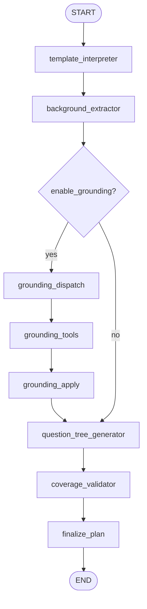

> 英文原文见 `tradingagents/equity_research/agents/section_planner/RUNTIME.md`

# Section Planner 运行时说明

本文档描述 **Section Question Tree Compiler**（section planner 子图）在运行时的定位、输入/输出、各节点 Prompt、Tool 调用，以及在外层流水线中的衔接方式。

实现入口：

- 子图：`agents/section_planner/subgraph.py` → `SectionPlannerSubgraph`
- 外层节点：`agents/dynamic_planning.py` → 串行对每个 section 调用子图
- 手动 CLI：根目录 `demo_planner.py`
- 可视化：`scripts/visualize_planner_trace.py`

相关任务配置：`tasks/section_planner/`（schemas / prompts / validate / template）  
Section 元数据（`intent_hint`、`grounding_queries`、`required_outputs`）：`templates/report_template.py`

---

## 定位

Planner **不做**：

- 写报告正文
- ReAct 深搜 / 多轮 PER 循环
- Skill 选择与加载
- 假设探索或评分

Planner **只做**：

```text
section schema + background reports → executable research question tree (JSON)
```

即：给定一个 equity research section，结合 template 的 `required_outputs` 和已有背景（consensus / assumption 报告），输出可交给后续 `research_loop` / writing 的问题树。

**模型**：子图内所有 LLM 调用统一使用 `deps.quick_llm`（与 consensus 子图的 planner 使用 `deep_llm` 不同）。

**Skills**：本子图 **不加载、不调用** 任何 research skill；`downstream_agent` 字段仅为问题节点上的**建议标签**，供后续 loop 参考。

---

## 执行流程概览



**Grounding 分支条件**（`grounding_router`）：

- `enable_grounding == True`
- 且 `allowed_tools` 含 `"web_search"`

默认关闭。外层可通过 `state.enable_planner_grounding` 或 `config.equity_research.planner_grounding` 开启；`demo_planner.py --with-grounding` 同理。

---

## 子图输入（seed state）

由 `empty_section_planner_state(req)` 或 `build_section_planner_request(...)` 构造。

### SectionPlannerRequest 字段

| 字段 | 来源 | 说明 |
|------|------|------|
| `ticker` | 父 state | 标的 |
| `section_id` | 调用方指定 | 如 `4_industry_and_competition` |
| `section_title` | `MVP1_REPORT_TEMPLATE[section_id].title` | 章节标题 |
| `required_outputs` | template | 该 section 必须覆盖的输出项列表 |
| `section_intent_hint` | template `intent_hint` | 章节分析意图提示 |
| `background_reports` | 父 state | `consensus_report` / `assumption_report` / `final_report` |
| `user_focus` | 父 state（可选） | 用户关注点，如「市场预期与一致观点」 |
| `time_horizon` | 父 state / mandate（可选） | 如 `FY26-FY27` |
| `extra_context` | 父 state | `sector`, `industry`, `report_type` |
| `enable_grounding` | 配置或 CLI | 是否走轻量 web grounding |
| `allowed_tools` | 自动设置 | grounding 开启时为 `["web_search"]`，否则 `[]` |

### SectionPlannerState 运行时字段

| 字段 | 写入节点 | 说明 |
|------|----------|------|
| `extracted_background` | `background_extractor` | 结构化背景抽取结果 |
| `grounding_queries` | `grounding_dispatch` | 本次 grounding 查询列表（最多 5 条） |
| `grounding_notes` | `grounding_apply` | 格式化后的搜索摘要文本 |
| `plan` | `question_tree_generator` → `coverage_validator` | `SectionResearchPlan` dict |
| `exploration_graph` | `finalize_plan` | 本 section 的 ExplorationNode |
| `messages` | `grounding_dispatch` | 临时 tool call 消息，apply 后清空 |
| `api_calls` | `grounding_apply` | grounding 搜索次数累计 |
| `errors`, `research_traces` | 各节点 | 错误与 trace |

背景报告由 `pack_background` **全文拼接**（不再 `[:20000]` 硬切）。`background_extractor` 与 `question_tree_generator` 各自对拼装后的动态材料做 **一次** soft compact（预算见 `prompt_context_max_chars`，默认 32000）。详见 [Context 文档](../../equity_research/context.md)。

---

## 子图输出

单次 `compiled.invoke(subgraph_input)` 返回：

| 字段 | 类型 | 说明 |
|------|------|------|
| `plan` | `SectionResearchPlan` dict | 本章问题树（见下方 schema） |
| `exploration_graph` | dict | 含一个 `ExplorationNode`，`branch_id = {ticker}_{section_id}_planner` |
| `api_calls` | int | 本子图累计 API 调用（主要为 grounding） |
| `errors` | list[str] | 非致命错误 |
| `research_traces` | list[dict] | 各节点 `deps.trace` 日志 |

### SectionResearchPlan 结构

```json
{
  "ticker": "NVDA",
  "section_id": "4_industry_and_competition",
  "section_title": "Industry Analysis & Competitive Landscape",
  "planning_thesis": "本章分析角度一句话",
  "root_question": "section 总问题",
  "nodes": [
    {
      "id": "q0",
      "parent_id": null,
      "level": 0,
      "question": "...",
      "rationale": "...",
      "priority": 1,
      "required_evidence": ["..."],
      "suggested_sources": ["..."],
      "expected_output": "tam_estimate",
      "downstream_agent": "industry_research",
      "stop_condition_hint": "..."
    }
  ],
  "coverage_map": { "tam_estimate": ["q1"], "...": ["q_id"] },
  "execution_order": ["q1", "q2", "q0"],
  "data_quality_flags": ["..."],
  "planner_notes": "..."
}
```

`finalize_plan` 写入的 `ExplorationNode`：

| ExplorationNode 字段 | 内容 |
|---------------------|------|
| `structured_view_snapshot` | `{ "type": "section_research_plan", "plan": <上表> }` |
| `query_plan` | 各 `ResearchQuestionNode` 的扁平列表 |
| `coverage_score` | 无 flags → `1.0`，否则 `0.8` |
| `routing_decision` | `"ready_for_research_loop"` |

---

## 外层 `dynamic_planning` 节点

路径：`graph/setup.py` 中 `analyze_research_task` → **`dynamic_planning`** → `research_loop`。

对每个 section（`MVP1_SECTION_ORDER`，**跳过** `1_investment_summary`）串行调用子图，写回父 state：

| 父 state 字段 | 来源 | 说明 |
|---------------|------|------|
| `section_plans` | 各 section 的 `plan` | `section_id → SectionResearchPlan` |
| `planner_exploration_graph` | 合并各 section `exploration_graph` | 多 branch 的探索图 |
| `research_plan` | `aggregate_research_plan()` | 兼容旧 `ResearchPlan.core_questions` |
| `research_strategy` | `derive_strategy_shim()` | 兼容 `research_loop` 的 stage / priority_questions |
| `research_phase` | strategy.stage | 首次通常为 `orientation` |
| `api_calls`, `research_traces`, `errors` | 累积 | |

`research_strategy` 为 shim，不替代子图产出的 `section_plans`；`research_loop` 内部仍有独立的 `_dynamic_plan` stage 逻辑。

---

## 各步骤 Prompt、Tool 与 I/O

### 1. template_interpreter

**LLM**：无  
**Skills**：无  
**Tools**：无

**逻辑**：`interpret_section_template(section_id)` 读取 `MVP1_REPORT_TEMPLATE`。

**输入**：`section_id`

**输出**：

| 字段 | 说明 |
|------|------|
| `section_title` | template title |
| `required_outputs` | template 必填输出列表 |
| `section_intent_hint` | template `intent_hint` |

**Trace**：`section_planner_template_interpreter`

---

### 2. background_extractor

**LLM**：`deps.quick_llm` → 结构化输出 `BackgroundExtraction`  
**Skills**：无  
**Tools**：无

**Prompt**（`tasks/section_planner/prompts.py` → `build_background_extractor_prompt`）：

```
You are an equity research analyst extracting section-relevant context from background reports.

Ticker: {ticker}
Section ID: {section_id}
Section Title: {section_title}
Section Intent: {section_intent_hint}

BACKGROUND REPORTS:
{consensus_report / assumption_report / final_report 拼接，≤20k chars}

Extract ONLY what is relevant to this section. Do not write the report section.
Return structured JSON with:
- market_implied_assumptions
- controversies
- model_drivers
- evidence_for
- evidence_against
- falsification_tests
- evidence_gaps
- next_data_to_watch

Mark uncertain facts as needing verification. Do not invent verified facts.
```

**输入**：`background_reports`, `section_intent_hint`, section 元数据

**输出**：`extracted_background`（`BackgroundExtraction.model_dump()`）

**Fallback**：无背景 → `evidence_gaps: ["no background reports provided"]`；LLM 失败 → 空结构 + error

**Trace**：`section_planner_background_extractor`

---

### 3. grounding_dispatch（可选）

**LLM**：无  
**Skills**：无  
**Tools**：准备调用 `batch_light_grounding_search`（不直接执行）

**逻辑**：`build_grounding_queries(section_id, ticker)` 从 template 生成最多 **5** 条查询：

1. 通用三条：`{ticker} latest earnings call key debates`、`consensus estimates key assumptions`、`{section_title} latest developments`
2. 加上该 section 的 `grounding_queries` 模板（format `{ticker}` / `{section_title}`）

**输出**：

| 字段 | 说明 |
|------|------|
| `grounding_queries` | 查询字符串列表 |
| `messages` | `AIMessage` + `tool_calls` → `batch_light_grounding_search` |

---

### 4. grounding_tools

**LLM**：无  
**Skills**：无  
**Tools**：LangGraph `ToolNode([batch_light_grounding_search])`

**Tool 实现**：`tools/lc/planner.py`

- 对每条 query 调用 `search_tools.web_search(query)`
- 每条最多取 **3** 条结果摘要
- 返回 `{ "snippets": [...], "api_calls": N, "errors": [...] }`

**说明**：这是 **轻量 grounding**，仅帮助 planner 补洞、避免明显过时；**不是**完整研究搜索。

---

### 5. grounding_apply

**LLM**：无  
**Skills**：无  
**Tools**：无（解析上一步 ToolMessage）

**输入**：`messages` 中最后一条 `ToolMessage`

**输出**：

| 字段 | 说明 |
|------|------|
| `grounding_notes` | 按 query 格式化的文本摘要 |
| `api_calls` | 累加 grounding 搜索次数 |
| `messages` | 清空 |

**Trace**：`section_planner_grounding_apply`

---

### 6. question_tree_generator

**LLM**：`deps.quick_llm` → 结构化输出 `SectionPlannerLLMOutput`  
**Skills**：无  
**Tools**：无

**Prompt**（`build_question_tree_prompt`）核心约束：

```
You are an equity research section planner.

Your job is NOT to write the report section.
Your job is to create an executable research question tree for ONE section.

INPUTS:
- Ticker, Section ID, Section Title, Section Intent Hint
- Required Outputs: [...]
- User Focus, Time Horizon, Extra Context

BACKGROUND REPORTS: ...
EXTRACTED BACKGROUND: {extracted_background JSON}
OPTIONAL LIGHT GROUNDING NOTES: ...

TASK:
1. Identify the analytical purpose of this section.
2. Extract section-relevant assumptions, controversies, model drivers, and evidence gaps.
3. Generate exactly one root question.
4. Generate 3 to 7 mandatory sub-questions (level 1).
5. Generate sub-sub-questions only if necessary for evidence collection.
6. Every question must be concrete, researchable, and evidence-seeking.
7. Map every required_output to at least one question node in coverage_map.
8. Provide execution_order from highest priority to lowest priority.
9. Provide data_quality_flags if background is incomplete / stale / inconsistent.
10. Do not write final prose.
11. Do not invent verified facts.
12. Plan must be usable by downstream research agents.

Return STRICT JSON matching schema example: {SectionPlannerLLMOutput schema}
```

**输入**：template 字段 + `extracted_background` + `grounding_notes` + 原始 background

**输出**：`plan`（经 `finalize_plan_from_llm_output` 归一化后的 `SectionResearchPlan`）

**Fallback**：LLM 失败时生成最小 root question + `data_quality_flags`

**Trace**：`section_planner_question_tree_generator`

---

### 7. coverage_validator

**LLM**：无  
**Skills**：无  
**Tools**：无

**逻辑**：`tasks/section_planner/validate.py`

- `normalize_plan_dict`：补全缺失 nodes、coverage_map、execution_order
- `validate_and_repair`：检查每个 `required_output` 有映射；L1 子问题数量 flags（<3 或 >7）；空 question flags

**输出**：修复后的 `plan`

**Trace**：`section_planner_coverage_validator`

---

### 8. finalize_plan

**LLM**：无  
**Skills**：无  
**Tools**：无

**逻辑**：

1. 确认 `SectionResearchPlan` 最终 dict
2. `ExplorationGraph.new_node(...)` 写入 planner 节点（见上文 ExplorationNode 表）
3. 设置 `last_updated`

**Trace**：`section_planner_finalize`

---

## Planner 停止条件

Planner 自身 **单遍执行**，无迭代 loop。满足以下条件即结束：

1. 有且只有一个 root question（level 0）
2. 尽量有 3–7 个 level-1 sub-questions（不足/过多记入 `data_quality_flags`）
3. 所有 `required_outputs` 在 `coverage_map` 中有映射（validator 会强制补全）
4. 输出合法 `SectionResearchPlan` JSON

边际收益递减的停止留给后续 `research_loop`，不塞进 planner。

---

## 手动测试

### demo_planner.py

```bash
# 单 section
uv run python demo_planner.py NVDA --section-id 4_industry_and_competition --json

# 从已有 JSON 注入背景
uv run python demo_planner.py NVDA --background-json out/nvda5.json --all-sections -o out/nvda_planner.json

# 完整：task_analysis → 全 section 规划 + grounding
uv run python demo_planner.py NVDA --with-task-analysis --all-sections --with-grounding -o out/nvda_planner.json
```

输出 JSON 含 `subgraph_outputs.section_planner`（与 `task_analysis` 输出风格对齐）。

### 可视化

```bash
uv run python scripts/visualize_planner_trace.py out/nvda_planner.json -o out/nvda_planner.html
```

生成 HTML：section 总览、每章问题树、coverage map、execution order、exploration branches。

---

## 源码索引

| 主题 | 路径 |
|------|------|
| 子图拓扑 | `agents/section_planner/subgraph.py` |
| 节点实现 | `agents/section_planner/nodes.py` |
| 状态 / request 构建 | `agents/section_planner/state.py` |
| 外层聚合 | `agents/section_planner/aggregate.py` |
| 外层节点 | `agents/dynamic_planning.py` |
| Schemas | `tasks/section_planner/schemas.py` |
| Prompts | `tasks/section_planner/prompts.py` |
| 校验 / 修复 | `tasks/section_planner/validate.py` |
| Template 解读 | `tasks/section_planner/template.py` |
| Section 元数据 | `templates/report_template.py` |
| Grounding tool | `tools/lc/planner.py` |
| 结构化 LLM 调用 | `runtime/utils/structured_invoke.py` |
| Exploration 图 | `runtime/exploration_graph.py` |
| 单元测试 | `tests/equity_research/test_section_planner.py` |
| 可视化测试 | `tests/scripts/test_visualize_planner_trace.py` |

---

## 与 consensus / research_loop 的边界

| | Section Planner | GenericResearchSubgraph (consensus) | research_loop |
|--|-----------------|-------------------------------------|---------------|
| 目标 | 单 section 问题树 | 市场共识结构化视图 | 投资论点 DAG 探索 |
| 循环 | 无（单遍） | PER 多轮 | 多轮 R&D |
| LLM | 全部 `quick_llm` | planner `deep_llm`，其余多 `quick_llm` | mixed |
| Skills | **不使用** | `load_research_skills` | `skills_to_run` |
| 搜索 | 可选轻量 `web_search`（≤5 query） | Perplexity 批量深搜 | evidence agents |
| 产出 | `section_plans` | `consensus_view` / `consensus_report` | `research_graph` |

典型流水线：

```text
analyze_research_task (consensus + assumption)
  → dynamic_planning (section_plans × 9 sections)
  → research_loop
  → modeling / valuation / writing
```
