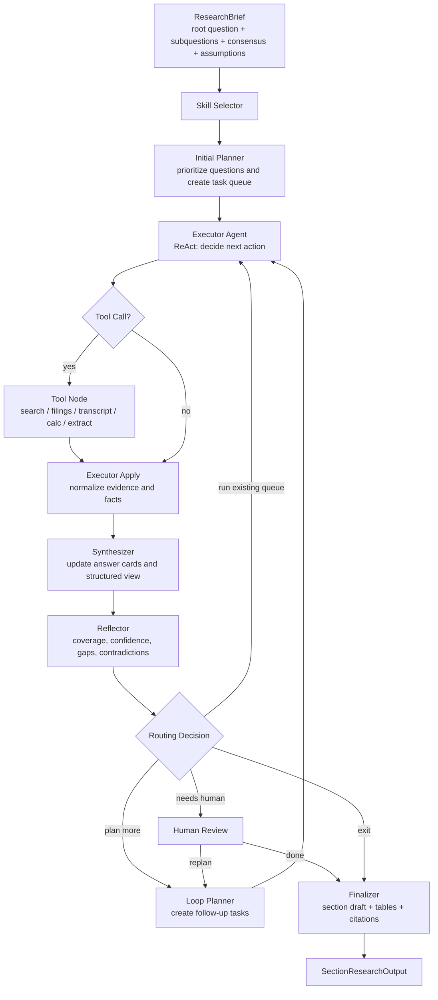
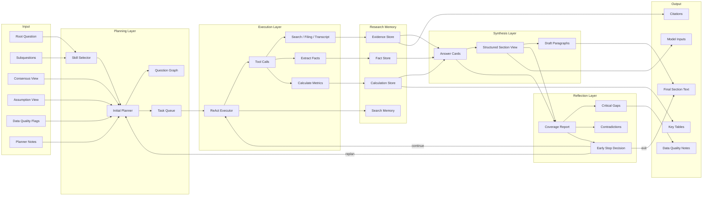

# Research Loop 重构建议：从“硬编码 9 步论点 DAG”改为“问题驱动的 Agent Loop”

你的直觉是对的：当前 `research_loop` 把太多职责压在一个运行时里了。它同时在做：

- 阶段规划；
- 父节点选择；
- 记忆检索；
- 问题识别；
- 假设生成；
- 虚拟 IC；
- 快速尽调；
- 证据检索；
- 事实提取；
- 主张验证；
- skill 执行；
- 评分；
- DAG 更新；
- 停止判断。

这导致两个问题：

1. **耦合过重**：每一步都依赖上一层的具体字段，比如 `hypothesis_nodes`、`research_graph`、`active_hypothesis_ids`、`evidence_fragments`。
2. **灵活性不足**：如果你只想给一个 section 的 root question、subquestions、consensus 和 assumptions，让 Agent 自主研究，目前架构不自然，因为它强制套进“投资论点 DAG + hypothesis node”的框架里。

我建议把它重构为一个 **Question-Centric Plan → Execute → Reflect → Replan → Synthesize** 的 Agent Loop。

---

# 1. 核心重构方向

## 1.1 从 Thesis DAG 改为 Question Graph / Task Graph

当前 `research_graph` 是围绕“投资论点分支”设计的。对于 section research 来说，这太重了。

你现在的输入其实已经是一个很好的 **研究问题树**：

```text
Root question
 ├── q1 segment / product revenue model
 ├── q2 operating metrics
 ├── q3 pricing
 ├── q4 customers and channels
 ├── q5 unit economics
 ├── q6 margins
 ├── q7 data center compute vs networking
 ├── q8 ASP / config mix / Blackwell pricing
 ├── q9 customer concentration
 └── q10 unit economics proxies
```

所以应该把核心状态从：

```python
research_graph: thesis DAG
hypothesis_nodes: hypothesis registry
```

改成：

```python
question_graph: research question DAG
task_queue: executable research tasks
answer_cards: per-question structured findings
evidence_store: normalized evidence
fact_store: extracted facts and metrics
calculation_store: derived calculations
coverage_report: what is still missing
section_draft: synthesized writing output
```

也就是说，先不要强迫 Agent 生成“投资论点”。  
让它先把每个 section 的问题研究清楚，再在后续 modeling / IC 阶段升维成 thesis。

---

## 1.2 从固定 9 步改为通用 Agent Loop

建议目标架构：

```text
Input Research Brief
    ↓
Skill Selector
    ↓
Initial Planner
    ↓
Executor Agent with Tools
    ↓
Evidence / Fact / Calculation Apply
    ↓
Synthesizer
    ↓
Reflector
    ↓
Replan or Continue or Finalize
```

这和你给的 `GenericResearchSubgraph` 非常接近。  
区别是：这里的 `TaskProfile` 应该围绕 **section research** 和 **question graph** 重新定义。

---

# 2. 新架构设计

## 2.1 推荐命名

可以把新 loop 命名为：

```python
SectionResearchLoop
```

或者更通用一点：

```python
AutonomousResearchLoop
```

它不应该知道太多关于：

- investment thesis DAG；
- hypothesis scoring；
- virtual IC；
- modeling workflow；
- final recommendation。

它只负责：

> 给定一个 section research brief，自动排优先级、检索证据、提取事实、完成计算、判断覆盖度、生成该 section 的结构化研究产出。

---

# 3. 新输入结构

你现在给的输入可以标准化成一个 `ResearchBrief`。

```python
class ResearchBrief(BaseModel):
    section_id: str
    section_title: str
    planning_thesis: str
    root_question: str

    questions: list[ResearchQuestion]
    coverage_outputs: list[str]
    data_quality_flags: list[str]
    planner_notes: str | None = None

    consensus_view: str | dict | None = None
    assumption_view: dict | None = None
    research_directions: dict | None = None
```

其中：

```python
class ResearchQuestion(BaseModel):
    question_id: str
    level: int
    question: str
    expected_output: str
    agent: str | None = None
    parent_id: str | None = None
    dependencies: list[str] = []
    priority_hint: float | None = None
```

你的 NVIDIA business model 输入就可以变成：

```json
{
  "section_id": "3_business_model",
  "section_title": "Business Model & Revenue Drivers",
  "planning_thesis": "This section should establish how NVIDIA monetizes its AI compute platform...",
  "root_question": "How does NVIDIA generate revenue across its AI compute and networking platform...",
  "questions": [
    {
      "question_id": "q1",
      "level": 1,
      "question": "What is NVIDIA’s revenue model by segment and product category?",
      "expected_output": "Revenue model explanation with segment mix and dominant monetization engines.",
      "agent": "financial_statement_analyst"
    },
    {
      "question_id": "q3",
      "level": 1,
      "question": "How does NVIDIA price its core products and systems?",
      "expected_output": "Pricing model analysis explaining whether pricing power is intact.",
      "agent": "pricing_analyst"
    }
  ],
  "data_quality_flags": [
    "Latest figures need verification from NVIDIA filings.",
    "Product-level pricing disclosures are incomplete.",
    "Customer concentration may be partially disclosed."
  ]
}
```

---

# 4. 新状态设计

建议统一使用一个 `SectionResearchState`。

```python
class SectionResearchState(TypedDict, total=False):
    ticker: str
    company_name: str
    section_id: str
    research_brief: dict

    # planning
    question_graph: dict
    task_queue: list[dict]
    active_task: dict | None
    plan_history: list[dict]

    # execution
    messages: list[Any]
    tool_calls: list[dict]
    search_memory: list[dict]
    documents: list[dict]
    evidence_store: list[dict]
    pending_evidence: list[dict]

    # extraction / calculation
    fact_store: list[dict]
    metric_store: list[dict]
    calculation_store: list[dict]

    # synthesis
    answer_cards: dict[str, dict]
    structured_view: dict
    section_draft: str

    # reflection
    coverage_report: dict
    coverage_history: list[dict]
    unresolved_gaps: list[dict]
    contradiction_flags: list[dict]
    data_quality_flags: list[dict]

    # control
    iterations: int
    max_iterations: int
    status: Literal["continue", "sufficient", "needs_human", "failed"]
    errors: list[str]
    api_calls: int
```

---

# 5. 新 Loop 的节点设计

## 5.1 总体节点

建议保留你已有的通用范式，但把它重新包装为 section research 专用。

```text
skill_selector
initial_planner
executor_agent
tool_node
executor_apply
synthesizer
reflector
loop_planner
finalizer
human_review(optional)
```

---

## 5.2 Mermaid 总体数据流



---

# 6. 每个节点的职责、输入和输出

---

## 6.1 Skill Selector

### 目的

根据 section、root question、subquestions、sector、data quality flags 自动选择 skill。

比如 NVIDIA business model section 可以选择：

- `business_model_analysis`
- `financial_statement_segment_analysis`
- `pricing_proxy_analysis`
- `customer_channel_analysis`
- `margin_bridge_analysis`
- `unit_economics_proxy_framework`

### 输入

```python
{
    "ticker": "NVDA",
    "section_id": "3_business_model",
    "research_brief": {...},
    "sector": "Semiconductors",
    "industry": "GPU / AI Accelerators"
}
```

### 输出

```python
{
    "active_skills": [
        "business_model_analysis",
        "financial_statement_segment_analysis",
        "pricing_proxy_analysis",
        "customer_channel_analysis",
        "margin_bridge_analysis"
    ],
    "active_skill_context": {...}
}
```

### 重构建议

你现有的 `create_skill_selector_agent` 可以基本复用。  
但建议 skill selector 不再服务于某个固定 task，而是服务于：

```python
section_id + root_question + agents required by subquestions
```

---

## 6.2 Initial Planner

### 目的

把 ResearchBrief 转换为可执行任务队列。

它应该做四件事：

1. 解析 question graph；
2. 自动排序；
3. 为每个问题制定 evidence plan；
4. 生成初始 `task_queue`。

### 输入

```python
research_brief
consensus_view
assumption_view
active_skill_context
data_quality_flags
```

### 输出

```python
{
    "question_graph": {...},
    "task_queue": [
        {
            "task_id": "t_q1_segment_revenue",
            "question_id": "q1",
            "objective": "Verify NVIDIA revenue by segment and product category...",
            "task_type": "evidence_search",
            "priority": 95,
            "required_sources": ["10-K", "10-Q", "earnings release"],
            "expected_artifacts": ["segment revenue table", "segment mix calculation"],
            "success_criteria": {
                "min_primary_sources": 1,
                "must_extract_metrics": ["revenue_by_segment", "data_center_revenue"],
                "confidence_threshold": 0.75
            }
        }
    ],
    "plan_history": [...]
}
```

---

# 7. 自动优先级设计

你希望 loop 能自动排优先级。建议 planner 使用显式 scoring。

## 7.1 Priority Score

可以用：

```text
priority_score =
    0.25 * section_materiality
  + 0.20 * dependency_importance
  + 0.20 * uncertainty_or_gap
  + 0.15 * data_staleness_risk
  + 0.10 * evidence_availability
  + 0.10 * downstream_model_usefulness
```

### 字段解释

| 因子 | 说明 |
|---|---|
| `section_materiality` | 该问题对 section 主旨的重要性 |
| `dependency_importance` | 是否是其他问题的前置问题 |
| `uncertainty_or_gap` | 当前共识或假设中不确定性有多大 |
| `data_staleness_risk` | 是否受 data quality flags 影响 |
| `evidence_availability` | 是否容易用 primary source 验证 |
| `downstream_model_usefulness` | 是否会进入 forecast / valuation model |

---

# 8. Executor：从固定 evidence agents 改成 ReAct Agent

当前 `_full_development()` 是硬编码：

```python
allocate_budget
virtual_evaluate
retrieve_evidence
extract_facts
verify_claims
run skills
```

建议改成一个 ReAct executor。

## 8.1 Executor 输入

```python
{
    "active_task": {
        "question_id": "q1",
        "objective": "Verify NVIDIA revenue model by segment...",
        "required_sources": ["10-K", "10-Q", "earnings release"],
        "expected_artifacts": ["segment revenue table"]
    },
    "research_brief": {...},
    "consensus_view": {...},
    "assumption_view": {...},
    "active_skill_context": {...},
    "search_memory": [...],
    "answer_cards": {...}
}
```

## 8.2 Executor 行为

Executor 不应该只会搜索。  
它应该可以根据任务动态选择工具：

```text
Thought: I need primary-source segment revenue.
Action: fetch_sec_filing(ticker="NVDA", form="10-K")

Observation: Filing retrieved.

Thought: I need extract segment revenue table.
Action: extract_financial_table(doc_id=...)

Observation: Data center revenue, gaming revenue...

Thought: I should compute segment mix.
Action: calculate_metric(formula="segment_revenue / total_revenue")

Observation: Data center = xx% of revenue.

Thought: Need citation and answer card update.
Action: write_answer_card(question_id="q1", ...)
```

---

# 9. Tool 设计建议

你已有 batch search executor。建议把 tools 分三层。

---

## 9.1 原子工具 Atomic Tools

这些工具只做一件事。

| Tool | 作用 |
|---|---|
| `search_web` | 搜索公开资料 |
| `batch_search_web` | 批量搜索 |
| `fetch_sec_filing` | 拉取 10-K / 10-Q / 8-K |
| `fetch_earnings_release` | 拉取 earnings release |
| `fetch_earnings_call_transcript` | 拉取电话会 transcript |
| `extract_kpi_from_text` | 从文本提取 KPI |
| `extract_table_from_filing` | 从 filing 提取表格 |
| `calculate_metric` | 计算比例、同比、margin、mix |
| `compare_periods` | 比较多个 period 的变化 |
| `write_evidence` | 写入 evidence store |
| `write_fact` | 写入 fact store |
| `write_answer_card` | 写入 answer card |
| `flag_data_quality_issue` | 写入数据质量问题 |
| `retrieve_memory` | 从已有 evidence / answer cards 中检索 |

---

## 9.2 复合工具 Composite Tools

这些工具可以内部调用多个原子工具，但对 Agent 暴露为一个高层动作。

| Tool | 作用 |
|---|---|
| `verify_segment_revenue` | 自动找 filing、提取 segment revenue、计算 mix |
| `build_margin_bridge` | 提取 GM/OM，分析 mix、cost、ramp impact |
| `build_customer_concentration_read` | 检索 customer concentration 和 channel evidence |
| `build_pricing_proxy_read` | 搜索 ASP、system price、config mix proxy |
| `build_unit_economics_proxy` | 构造 verified vs inferred unit economics 框架 |

---

## 9.3 Skill 与 Tool 的关系

建议明确区分：

### Tool

负责执行动作：

```text
search, fetch, extract, calculate, write
```

### Skill

负责给 Agent 提供专业方法论：

```text
how to analyze pricing power
how to structure business model
how to build margin bridge
how to handle incomplete unit economics disclosure
```

Skill 不应该承担太多状态写入职责。  
Skill 更像 “prompt + constraints + analysis framework + allowed tools”。

---

# 10. Answer Card：建议作为核心中间产物

比起直接写 `claims`，建议每个 question 产出一个 `AnswerCard`。

```python
class AnswerCard(BaseModel):
    question_id: str
    question: str
    short_answer: str

    verified_facts: list[dict]
    inferred_estimates: list[dict]
    calculations: list[dict]
    evidence_ids: list[str]
    citations: list[dict]

    confidence: float
    data_quality: Literal["high", "medium", "low"]
    open_gaps: list[str]
    contradiction_flags: list[str]

    implications: list[str]
    draft_paragraph: str | None = None
```

这样 `q1` 可以输出：

```json
{
  "question_id": "q1",
  "short_answer": "NVIDIA monetizes primarily through Data Center GPUs, accelerated computing systems, networking, gaming GPUs, automotive platforms, and professional visualization products.",
  "verified_facts": [
    {
      "metric": "Data Center revenue",
      "period": "latest fiscal year",
      "value": "...",
      "source": "10-K"
    }
  ],
  "calculations": [
    {
      "metric": "Data Center revenue mix",
      "formula": "Data Center revenue / total revenue",
      "value": "..."
    }
  ],
  "confidence": 0.86,
  "open_gaps": [
    "Product-level compute versus networking split is only partially disclosed."
  ]
}
```

---

# 11. Synthesizer：从 evidence 合并到 answer cards 和 section view

当前 `synthesizer` 是把 `pending_evidence` merge 到 `structured_view`。

建议增强为两层：

## 11.1 Question-level Synthesizer

负责更新单个 `AnswerCard`。

输入：

```python
active_task
pending_evidence
fact_store
calculation_store
existing_answer_card
```

输出：

```python
answer_cards[question_id]
pending_evidence = []
```

---

## 11.2 Section-level Synthesizer

负责把所有 `AnswerCard` 合并为 section view。

```python
structured_view = {
    "section_id": "3_business_model",
    "business_model_map": {...},
    "revenue_driver_summary": {...},
    "pricing_power_summary": {...},
    "customer_channel_summary": {...},
    "unit_economics_framework": {...},
    "margin_driver_summary": {...},
    "key_metrics_table": [...],
    "open_gaps": [...],
    "confidence": 0.0
}
```

---

# 12. Reflector：早停判断的核心

当前早停主要依赖：

```python
best_score >= threshold
iterations >= max_iterations
```

这对 autonomous research 不够细。

建议 reflector 按 **coverage outputs + question-level confidence + data quality flags** 判断。

---

## 12.1 Question-level Stop Criteria

每个 question 有自己的停止条件。

例如：

```python
{
    "question_id": "q1",
    "done": true,
    "confidence": 0.82,
    "reasons": [
        "Segment revenue verified from primary source.",
        "Segment mix calculated.",
        "No blocking contradiction."
    ]
}
```

判断逻辑：

```text
question_done =
    confidence >= threshold
    and required_artifacts_completed
    and min_primary_sources_satisfied
    and no_blocking_data_quality_flag
```

---

## 12.2 Section-level Stop Criteria

整个 section 可以早停，当：

```text
section_done =
    all critical coverage outputs completed
    and root question answerable
    and no blocking data quality flags
    and enough primary-source evidence
    and section draft has citations
```

建议 coverage report：

```python
class CoverageReport(BaseModel):
    overall_score: float
    question_scores: dict[str, float]
    coverage_outputs_completed: list[str]
    critical_gaps: list[dict]
    data_quality_issues: list[dict]
    contradictions: list[dict]
    recommended_next_action: Literal[
        "run_existing_queue",
        "plan_more",
        "needs_human",
        "exit"
    ]
```

---

## 12.3 Early Stop Router

```python
def section_reflector_router(state):
    report = state.get("coverage_report", {})
    if report.get("recommended_next_action") == "needs_human":
        return "needs_human"
    if report.get("recommended_next_action") == "exit":
        return "exit"
    if state.get("task_queue"):
        return "run_existing_queue"
    return "plan_more"
```

---

# 13. Loop Planner：只为缺口 replan

Loop planner 不应该重新规划所有内容。  
它只应该针对 reflector 发现的缺口追加任务。

例如 reflector 发现：

```json
{
  "critical_gaps": [
    {
      "question_id": "q8",
      "gap": "Need better evidence on Blackwell system-level pricing and configuration mix.",
      "suggested_source": "earnings call transcript, supply chain commentary, reputable secondary source"
    }
  ]
}
```

Loop planner 追加：

```json
{
  "task_id": "followup_q8_blackwell_pricing_proxy",
  "question_id": "q8",
  "objective": "Find public proxies for Blackwell system-level ASP and configuration mix.",
  "task_type": "pricing_proxy_search",
  "priority": 88,
  "required_sources": ["earnings call", "reputable secondary"],
  "expected_artifacts": ["pricing proxy table", "confidence caveats"]
}
```

---

# 14. Finalizer：生成 section 输出，而不是 final investment thesis

当前 finalizer 偏向 final report / consensus report。

对于 section research，它应该输出：

```python
class SectionResearchOutput(BaseModel):
    section_id: str
    section_title: str

    final_section_text: str
    executive_summary: str

    answer_cards: dict[str, AnswerCard]
    key_tables: list[dict]
    calculations: list[dict]
    citations: list[dict]

    data_quality_notes: list[str]
    unresolved_gaps: list[str]
    model_inputs: dict
```

其中 `model_inputs` 很重要。  
例如 business model section 可能输出：

```json
{
  "model_inputs": {
    "segment_revenue_mix": {...},
    "data_center_growth_drivers": [...],
    "gross_margin_sensitivity_drivers": [...],
    "pricing_power_assessment": "high but monitor Blackwell ramp and customer concentration",
    "customer_concentration_risk": "medium"
  }
}
```

这些可以直接给后面的 `modeling_workflow` 使用。

---

# 15. 推荐的新 LangGraph 结构

可以参考你之前的 `GenericResearchSubgraph`，但建议改成如下结构。

```python
class SectionResearchSubgraph:
    def build(self) -> StateGraph:
        graph = StateGraph(SectionResearchState)

        graph.add_node("skill_selector", create_section_skill_selector(deps, tp))
        graph.add_node("initial_planner", create_section_initial_planner(deps, tp))

        graph.add_node("executor_agent", create_react_executor_agent(deps, tp))
        graph.add_node("executor_tools", create_section_tool_node(deps, tp))
        graph.add_node("executor_apply", create_executor_apply_node(deps, tp))

        graph.add_node("synthesizer", create_section_synthesizer(deps, tp))
        graph.add_node("reflector", create_section_reflector(deps, tp))
        graph.add_node("loop_planner", create_section_loop_planner(deps, tp))
        graph.add_node("finalizer", create_section_finalizer(deps, tp))

        graph.add_edge(START, "skill_selector")
        graph.add_edge("skill_selector", "initial_planner")
        graph.add_edge("initial_planner", "executor_agent")

        graph.add_conditional_edges(
            "executor_agent",
            executor_router,
            {
                "tools": "executor_tools",
                "apply": "executor_apply",
            },
        )

        graph.add_edge("executor_tools", "executor_apply")
        graph.add_edge("executor_apply", "synthesizer")
        graph.add_edge("synthesizer", "reflector")

        graph.add_conditional_edges(
            "reflector",
            section_reflector_router,
            {
                "run_existing_queue": "executor_agent",
                "plan_more": "loop_planner",
                "needs_human": "human_review",
                "exit": "finalizer",
            },
        )

        graph.add_conditional_edges(
            "loop_planner",
            loop_planner_router,
            {
                "run": "executor_agent",
                "exit": "finalizer",
            },
        )

        graph.add_edge("finalizer", END)
        return graph
```

---

# 16. Mermaid：新架构与状态对象



---

# 17. 对原架构的具体替换建议

## 17.1 删除或降级的部分

### 1. `_dynamic_plan`

保留概念，但不要作为硬编码 step 1。  
改成 planner / loop planner 的一部分。

---

### 2. `select_parent_thesis_nodes`

对于 section research 暂时不需要。  
用 `question_graph` 和 `task_queue` 替代。

---

### 3. `scientific_hypothesis_prompt`

不是每个 section 都需要生成投资假设。  
business model section 更需要：

```text
research question → evidence plan → answer card
```

而不是：

```text
research question → investment hypothesis → IC selection
```

可以把 hypothesis generation 放到更高层：

- investment summary；
- recommendation；
- variant view discovery；
- valuation debate。

---

### 4. `virtual IC`

对于 section research 太早。  
建议改成 `Task Prioritizer` 或 `Coverage Reflector`。

---

### 5. `quick_diligence`

可以被 ReAct executor + reflector 替代。

如果某个问题证据很弱，reflector 会标记：

```python
data_quality = "low"
recommended_next_action = "plan_more" or "needs_human"
```

---

### 6. `_full_development`

这是最应该拆掉的部分。

当前：

```python
allocate_budget
virtual_evaluate
retrieve_evidence
extract_facts
verify_claims
run skills
```

应拆成：

```text
executor_agent
tool_node
executor_apply
synthesizer
reflector
```

---

### 7. `aggregate_thesis_score`

Section research 不需要 thesis score。  
需要的是：

```text
coverage score
confidence score
evidence quality score
calculation completeness score
citation completeness score
```

---

## 17.2 保留但改造的部分

| 原模块 | 建议 |
|---|---|
| `SkillRegistry` | 保留，作为 skill selector 的基础 |
| `ToolRegistry` | 保留，但工具要更原子化 |
| `build_memory_context` | 改成 `retrieve_research_memory`，服务于 executor / planner |
| `evidence_agents` | 拆为 tools，而不是固定 agent sequence |
| `synthesizer` | 强化为 AnswerCard synthesizer |
| `reflector` | 成为早停和 replan 核心 |
| `finalizer` | 改成 section finalizer |

---

# 18. NVIDIA 例子的执行方式

以 `3_business_model` 为例，新的 loop 应该这样跑。

---

## 18.1 输入

```text
Root question:
How does NVIDIA generate revenue across its AI compute and networking platform...

Subquestions:
q1-q10

Consensus:
已有市场共识报告

Assumptions:
股价假设、增长假设、争论点

Data flags:
- latest figures stale
- product pricing incomplete
- customer concentration partial
```

---

## 18.2 Initial Planner 输出任务队列

示例：

```json
[
  {
    "task_id": "t1_verify_segment_revenue",
    "question_id": "q1",
    "priority": 95,
    "objective": "Verify NVIDIA revenue by segment and calculate current revenue mix.",
    "required_sources": ["latest 10-K", "latest 10-Q", "earnings release"],
    "expected_artifacts": ["segment revenue table", "segment mix calculation"]
  },
  {
    "task_id": "t2_margin_driver_bridge",
    "question_id": "q6",
    "priority": 92,
    "objective": "Identify gross and operating margin drivers, including product mix and Blackwell ramp costs.",
    "required_sources": ["10-K", "10-Q", "earnings call"],
    "expected_artifacts": ["margin bridge", "margin driver summary"]
  },
  {
    "task_id": "t3_operating_metrics",
    "question_id": "q2",
    "priority": 88,
    "objective": "Identify operating metrics that best explain NVIDIA's business performance.",
    "required_sources": ["earnings call", "investor presentation", "filing"],
    "expected_artifacts": ["operating metrics table"]
  }
]
```

---

## 18.3 Executor 自动执行

比如执行 `t1_verify_segment_revenue`：

```text
Executor Thought:
Need primary source. Search latest NVIDIA 10-K and 10-Q.

Tool:
fetch_sec_filing("NVDA", "10-K")

Tool:
extract_table_from_filing(doc_id, target="revenue by segment")

Tool:
calculate_metric("segment revenue / total revenue")

Tool:
write_answer_card(q1, facts, calculations, citations)
```

---

## 18.4 Synthesizer 更新 q1 AnswerCard

```json
{
  "question_id": "q1",
  "short_answer": "NVIDIA generates the majority of revenue from Data Center, with Gaming, Professional Visualization, Automotive and OEM/Other as secondary contributors.",
  "verified_facts": [...],
  "calculations": [
    {
      "metric": "Data Center revenue mix",
      "formula": "Data Center revenue / total revenue",
      "value": "..."
    }
  ],
  "confidence": 0.88,
  "data_quality": "high",
  "open_gaps": [
    "Product-level split within Data Center requires additional disclosure or proxy."
  ]
}
```

---

## 18.5 Reflector 判断

```json
{
  "overall_score": 0.62,
  "question_scores": {
    "q1": 0.88,
    "q6": 0.30,
    "q3": 0.15
  },
  "critical_gaps": [
    {
      "question_id": "q6",
      "gap": "Need evidence on Blackwell ramp cost impact on gross margin."
    },
    {
      "question_id": "q3",
      "gap": "Need pricing proxy for Blackwell and prior-generation products."
    }
  ],
  "recommended_next_action": "run_existing_queue"
}
```

---

## 18.6 Loop Planner 追加任务

如果 q3 证据不足：

```json
{
  "task_id": "followup_q3_blackwell_pricing_proxy",
  "question_id": "q3",
  "priority": 86,
  "objective": "Find public proxies for Blackwell pricing, ASP, and configuration mix.",
  "required_sources": [
    "earnings call",
    "credible secondary source",
    "channel commentary"
  ],
  "expected_artifacts": [
    "pricing proxy framework",
    "confidence caveats"
  ]
}
```

---

# 19. 推荐的最终输出

最终 `finalizer` 不只是写文章，还应该输出结构化数据。

```json
{
  "section_id": "3_business_model",
  "section_title": "Business Model & Revenue Drivers",
  "final_section_text": "...",
  "executive_summary": "...",
  "answer_cards": {
    "q1": {...},
    "q2": {...},
    "q3": {...}
  },
  "key_tables": [
    {
      "name": "Revenue by Segment",
      "rows": [...]
    },
    {
      "name": "Operating Metrics and Interpretation",
      "rows": [...]
    },
    {
      "name": "Pricing and Unit Economics Proxy Framework",
      "rows": [...]
    }
  ],
  "calculations": [...],
  "citations": [...],
  "data_quality_notes": [
    "Direct product-level pricing is not fully disclosed.",
    "Customer concentration is partially disclosed and requires caveats."
  ],
  "model_inputs": {
    "segment_mix": {...},
    "pricing_power": "high",
    "margin_sensitivity_drivers": [...],
    "customer_concentration_risk": "medium"
  }
}
```

---

# 20. 最重要的设计原则

## 原架构

```text
Thesis-first
Hypothesis-first
Graph-first
Score-first
```

## 建议新架构

```text
Question-first
Evidence-first
Coverage-first
AnswerCard-first
Synthesis-last
```

也就是说：

> 不要让 Agent 一开始就“发明论点”。  
> 先让它围绕明确问题自主找证据、做计算、标注置信度和缺口。  
> 最后再由 synthesizer / finalizer 把这些 answer cards 合成为 section。

---

# 21. 最小可行重构路线

如果你不想一次性大改，可以分三步。

---

## Phase 1：保留 LangGraph 框架，替换 research_loop runtime

先实现：

```text
SectionResearchSubgraph
```

节点包括：

```text
skill_selector
initial_planner
executor
executor_tools
executor_apply
synthesizer
reflector
loop_planner
finalizer
```

暂时不要接 `research_graph`。

---

## Phase 2：引入 AnswerCard

把原来的：

```python
claims
evidence_fragments
structured_facts
```

聚合成：

```python
answer_cards[question_id]
```

所有后续写作、评分、早停都基于 answer card。

---

## Phase 3：将 Thesis DAG 后移

等 section research 完成后，再由更高层：

```text
investment_thesis_builder
```

读取：

```python
section_outputs
answer_cards
model_inputs
coverage_reports
```

去生成真正的投资论点 DAG。

---

# 22. 一句话建议

你应该把当前 `research_loop` 从“投资论点 DAG 的 9 步硬编码研发器”，重构成“以问题树为输入、以 ReAct executor 为执行核心、以 answer cards 为中间产物、以 reflector 控制早停和 replan 的 autonomous section research loop”。这样只需要给它 root question、subquestions、consensus 和 assumptions，它就可以自主排优先级、搜索证据、提取数据、完成计算、判断覆盖度，并最终写出可引用、可追溯、可进入模型的 section research output。