应该迁移的是它的 **研究范式**：

> **Research Phase：探索高质量投资观点**  
> **Development Phase：把观点落实为证据、模型、估值和报告**  
> **Evaluation Strategy：用一致的标准评估每条 thesis 和最终报告质量**

换句话说，你可以做一个：

> **Equity R&D-Agent：一个面向 equity research 的自主研究与研报开发框架**

---

# 1. 先理解 R&D-Agent 对你最有价值的东西

这篇文章的核心不是“多 agent”本身，而是它把复杂任务拆成了六个可替换组件：

```text
Research Phase
1. Planning
2. Exploration Path Structuring
3. Reasoning Pipeline
4. Memory Context

Development Phase
5. Coding Workflow
6. Evaluation Strategy
```

迁移到你这里后，可以变成：

```text
Equity Research Phase
1. Research Planning：动态研究规划
2. Thesis Exploration Structure：投资假设探索图
3. Scientific Investment Reasoning：结构化投资推理
4. Research Memory Context：证据/观点/假设记忆

Equity Development Phase
5. Research Artifact Development：证据包、模型、估值、章节草稿开发
6. Research Evaluation Strategy：一致性、证据强度、IC review、模型质量评估
```

核心思想是：

> 不要让 agent 一次性生成报告，而是让它像分析师一样：  
> **提出投资假设 → 找证据 → 建模型 → 估值 → 验证 → 迭代 → 合并最优观点 → 写报告。**

---

# 2. 从 MLE 到 Equity Research 的核心映射


| R&D-Agent / MLE      | 你的 Equity Research Agent                                      |
| -------------------- | ------------------------------------------------------------- |
| Kaggle competition   | 股票研究任务                                                        |
| Candidate solution   | 投资 thesis / 研究路径 / 报告版本                                       |
| Code implementation  | 证据包、财务模型、估值模型、章节草稿                                            |
| Validation score     | thesis quality score / IC score / valuation consistency score |
| Exploration graph    | 投资假设探索图                                                       |
| Parent node          | 前一版 thesis / 上一版预测 / 上一版估值                                    |
| Hypothesis           | 投资假设，如“毛利率扩张被低估”                                              |
| Debug mode           | 快速证据验证 / proxy model / mini diligence                         |
| Full evaluation      | 完整证据链 + 财务模型 + 估值 + IC review                                 |
| Ensemble / merge     | 合并多个 thesis 分支，形成最终 investment focus                          |
| RAG                  | 选择性使用外部行业/券商报告知识                                              |
| Submit best solution | 输出最终研报和推荐评级                                                   |


---

# 3. 你应该迁移的总框架

建议你把系统定义成：

```text
Equity R&D-Agent
│
├── Research Agent
│   ├── 动态规划研究阶段
│   ├── 生成多个投资假设分支
│   ├── 识别关键研究问题
│   ├── 做 virtual evaluation
│   └── 选择最值得深入的 thesis
│
├── Development Agent
│   ├── 检索证据
│   ├── 抽取事实
│   ├── 建 forecast assumptions
│   ├── 跑 valuation
│   ├── 写 section draft
│   └── 生成 charts/tables
│
├── Evaluation / IC Agent
│   ├── 检查证据强度
│   ├── 检查模型一致性
│   ├── 检查 rating/upside
│   ├── 挑战 thesis
│   └── 选择最终报告版本
│
└── Memory / Ledger
    ├── Evidence Ledger
    ├── Claim Ledger
    ├── Assumption Ledger
    ├── Consensus Ledger
    ├── Valuation Ledger
    └── Issue Ledger
```

这就对应 R&D-Agent 的双阶段结构。

### **Equity R&D-Agent 总体架构图**

```mermaid
flowchart TB

    %% =========================
    %% User / UI Layer
    %% =========================
    User["User / Analyst<br/>研究任务、Ticker、报告类型、资料上传"]
    UI["Analyst Console / Chat UI<br/>人机交互、反馈、审批"]

    User --> UI

    %% =========================
    %% Workflow Layer
    %% =========================
    subgraph Workflow["Workflow Orchestration Layer<br/>LangGraph / Research Runtime"]
        Init["Initialize State<br/>初始化任务"]
        Template["Load Report Template<br/>加载研报模板"]
        Mandate["Create Research Mandate<br/>定义研究目标"]
        RDLoop["R&D Loop Controller<br/>研究-开发循环控制"]
        ModelingGate["Modeling Gate<br/>进入预测/估值"]
        ICGate["Investment Committee Gate<br/>投资委员会审查"]
        FinalQA["Final QA Gate<br/>最终一致性和合规检查"]
        Export["Export Report<br/>导出 Markdown / PDF / Memory"]
    end

    UI --> Init
    Init --> Template
    Template --> Mandate
    Mandate --> RDLoop

    %% =========================
    %% Agent Layer
    %% =========================
    subgraph Agents["Agent Layer<br/>多角色研究 Agent"]
        Lead["Lead Analyst Agent<br/>主分析师 / 总控"]
        EvidenceAgent["Evidence Analyst Agent<br/>证据检索与核验"]
        ConsensusAgent["Consensus Analyst Agent<br/>市场共识与预期差"]
        BusinessAgent["Business Analyst Agent<br/>商业模式与经营驱动"]
        IndustryAgent["Industry Analyst Agent<br/>行业与竞争格局"]
        ForecastAgent["Financial Modeling Agent<br/>财务预测"]
        ValuationAgent["Valuation Agent<br/>估值与目标价"]
        RiskAgent["Risk / Counter-thesis Agent<br/>风险与反方观点"]
        ICAgent["IC Challenge Agent<br/>投资委员会挑战"]
        WritingAgent["Report Writing Agent<br/>研报写作"]
    end

    RDLoop --> Lead
    Lead --> EvidenceAgent
    Lead --> ConsensusAgent
    Lead --> BusinessAgent
    Lead --> IndustryAgent
    Lead --> ForecastAgent
    Lead --> ValuationAgent
    Lead --> RiskAgent
    Lead --> WritingAgent
    ICGate --> ICAgent

    %% =========================
    %% Skills Layer
    %% =========================
    subgraph Skills["Skills Layer<br/>可插拔专业能力"]
        PlanningSkill["Dynamic Research Planning Skill<br/>动态研究规划"]
        ExplorationSkill["Thesis Exploration DAG Skill<br/>多路径假设探索"]
        ReasoningSkill["Scientific Investment Reasoning Skill<br/>科学化投资假设生成"]
        MemorySkill["Collaborative Memory Skill<br/>跨分支记忆共享"]
        BrokerSkill["Broker Report Reading Skill<br/>券商报告解析"]
        ConsensusSkill["Consensus Discovery Skill<br/>市场共识发现"]
        VariantSkill["Variant View Skill<br/>预期差 / 非共识观点"]
        BusinessSkill["Business Model Skill<br/>商业模式拆解"]
        IndustrySkill["Industry Analysis Skill<br/>行业分析"]
        ForecastSkill["Forecast Assumption Skill<br/>预测假设生成"]
        ValuationSkill["Valuation Skill<br/>估值方法和目标价"]
        RiskSkill["Risk-to-Thesis Mapping Skill<br/>风险映射"]
        CatalystSkill["Catalyst Calendar Skill<br/>催化剂日历"]
        QASkill["Standardized Evaluation / QA Skill<br/>标准化质量评估"]
    end

    Lead --> PlanningSkill
    Lead --> ExplorationSkill
    Lead --> ReasoningSkill
    Lead --> MemorySkill
    ConsensusAgent --> BrokerSkill
    ConsensusAgent --> ConsensusSkill
    ConsensusAgent --> VariantSkill
    BusinessAgent --> BusinessSkill
    IndustryAgent --> IndustrySkill
    ForecastAgent --> ForecastSkill
    ValuationAgent --> ValuationSkill
    RiskAgent --> RiskSkill
    Lead --> CatalystSkill
    ICAgent --> QASkill
    WritingAgent --> QASkill

    %% =========================
    %% Tools Layer
    %% =========================
    subgraph Tools["Tools Layer<br/>确定性工具 / 外部动作"]
        DocSearch["Document Search Tool<br/>文档检索"]
        PDFParser["PDF / HTML Parser<br/>文件解析"]
        TableExtractor["Table Extractor<br/>表格抽取"]
        CitationTool["Citation Builder<br/>引用生成"]
        MarketData["Market Data API<br/>股价、市值、EV"]
        FinancialData["Financial Data API<br/>三表、分部数据"]
        BrokerParser["Broker Report Parser<br/>券商报告结构化"]
        CalcEngine["Calculation Engine<br/>CAGR、EPS、FCF、ROIC"]
        ForecastEngine["Forecast Engine<br/>财务预测模型"]
        ValuationEngine["Valuation Engine<br/>DCF、Multiple、SOTP"]
        ChartTool["Chart / Table Generator<br/>图表生成"]
        ComplianceTool["Compliance Checker<br/>合规检查"]
    end

    Skills --> DocSearch
    Skills --> PDFParser
    Skills --> TableExtractor
    Skills --> CitationTool
    Skills --> MarketData
    Skills --> FinancialData
    Skills --> BrokerParser
    Skills --> CalcEngine
    Skills --> ForecastEngine
    Skills --> ValuationEngine
    Skills --> ChartTool
    Skills --> ComplianceTool

    %% =========================
    %% Memory / Ledger Layer
    %% =========================
    subgraph Memory["Memory / Ledger Layer<br/>研究记忆与证据链"]
        EvidenceLedger["Evidence Ledger<br/>证据库"]
        ClaimLedger["Claim Ledger<br/>观点库"]
        AssumptionLedger["Assumption Ledger<br/>假设库"]
        ConsensusLedger["Consensus Ledger<br/>市场共识库"]
        BrokerViewLedger["Broker View Ledger<br/>券商观点库"]
        ResearchGraph["Research Exploration Graph<br/>研究探索图"]
        ForecastLedger["Forecast Ledger<br/>预测版本库"]
        ValuationLedger["Valuation Ledger<br/>估值版本库"]
        IssueLedger["Issue Ledger<br/>问题与打回记录"]
        ReportMemory["Report Memory<br/>章节草稿和最终报告"]
    end

    Tools --> EvidenceLedger
    Tools --> BrokerViewLedger
    Tools --> ConsensusLedger

    PlanningSkill --> ResearchGraph
    ExplorationSkill --> ResearchGraph
    ReasoningSkill --> ClaimLedger
    MemorySkill --> ResearchGraph
    ForecastSkill --> AssumptionLedger
    ForecastSkill --> ForecastLedger
    ValuationSkill --> ValuationLedger
    RiskSkill --> ClaimLedger
    QASkill --> IssueLedger
    WritingAgent --> ReportMemory

    Memory --> Lead
    Memory --> ICGate
    Memory --> FinalQA

    %% =========================
    %% Final Flow
    %% =========================
    RDLoop --> ModelingGate
    ModelingGate --> ForecastAgent
    ForecastAgent --> ValuationAgent
    ValuationAgent --> ICGate
    ICGate --> WritingAgent
    WritingAgent --> FinalQA
    FinalQA --> Export
    Export --> UI

```




---

# 4. 重新定义你的 R&D Loop

R&D-Agent 原始 loop 是：

```text
Planning
→ Select Parents
→ Memory Context
→ Reasoning Pipeline
→ Development
→ Evaluation
→ Update Exploration Graph
```

迁移到 equity research 后可以变成：

```text
Dynamic Research Plan
→ Select Thesis Branches
→ Retrieve Research Memory
→ Generate / Refine Investment Hypotheses
→ Develop Evidence + Model + Valuation Artifacts
→ Evaluate Thesis Quality
→ Update Research Graph
→ Repeat
→ Merge Best Thesis Branches
→ Write Final Report
```

形式化一点：

```python
while budget_remaining:
    plan = dynamic_planner(research_graph, elapsed_time, total_budget)

    parent_nodes = select_thesis_parents(research_graph, plan)

    context = build_memory_context(
        evidence_ledger,
        claim_ledger,
        assumption_ledger,
        consensus_ledger,
        parent_nodes,
        plan,
    )

    thesis_idea = scientific_investment_reasoning(context, parent_nodes, plan)

    artifacts = development_agent.execute(
        thesis_idea,
        tools=[
            retrieval_tools,
            financial_tools,
            valuation_tools,
            writing_tools,
        ],
    )

    score = evaluate_research_artifacts(
        thesis_idea,
        artifacts,
        criteria=[
            evidence_strength,
            consensus_gap,
            financial_materiality,
            valuation_impact,
            risk_adjusted_quality,
            feasibility,
        ],
    )

    research_graph.add_node(
        parents=parent_nodes,
        thesis=thesis_idea,
        artifacts=artifacts,
        score=score,
    )

final_thesis = merge_best_branches(research_graph)
report = write_final_report(final_thesis)
```

### # 迁移 R\&D-Agent 思想后的完整流程图

```mermaid

flowchart TD

    Start(["Start<br/>输入 ticker / 公司 / 报告类型 / 文件"])
    Init["Initialize State<br/>初始化 EquityResearchState"]
    Template["Load Report Template<br/>加载研报模板"]
    Ingest["Ingest Documents<br/>导入年报、季报、电话会、券商报告"]
    AnalyzeTask["Analyze Company Task<br/>识别公司、行业、报告复杂度"]
    Mandate["Create Research Mandate<br/>定义研究目标和约束"]

    Start --> Init --> Template --> Ingest --> AnalyzeTask --> Mandate

    %% =========================
    %% Consensus Setup
    %% =========================
    BrokerViews["Extract Broker Views<br/>解析券商评级、目标价、预测、核心观点"]
    Consensus["Discover Consensus<br/>汇总市场共识"]
    Gap["Find Expectation Gaps<br/>识别预期差和主要分歧"]
    InitGraph["Initialize Research Exploration Graph<br/>初始化研究探索图"]

    Mandate --> BrokerViews --> Consensus --> Gap --> InitGraph

    %% =========================
    %% R&D Loop
    %% =========================
    subgraph RDLoop["Equity R&D Loop<br/>自主研究探索循环"]

        Planning["① Dynamic Research Planning<br/>动态规划<br/>探索 vs 利用<br/>预算分配"]
        SelectParents["② Select Parent Research Nodes<br/>选择父节点 / 研究分支"]
        Memory["③ Retrieve Collaborative Memory<br/>检索跨分支记忆<br/>证据、观点、失败模式"]
        ProblemID["④ Identify Core Research Problems<br/>识别核心研究问题"]
        HypGen["⑤ Generate Candidate Hypotheses<br/>生成投资假设"]
        VirtualIC["⑥ Virtual IC Evaluation<br/>虚拟投委会预评估"]
        Develop["⑦ Develop Selected Hypothesis<br/>开发假设<br/>找证据、抽事实、更新模型"]
        Evaluate["⑧ Standardized Research Evaluation<br/>标准化评估<br/>证据强度、预期差、财务影响"]
        UpdateGraph["⑨ Update Research Graph & Ledgers<br/>更新探索图和 Ledgers"]
        StopCheck{"Stop Condition?<br/>是否停止探索？"}

        Planning --> SelectParents
        SelectParents --> Memory
        Memory --> ProblemID
        ProblemID --> HypGen
        HypGen --> VirtualIC
        VirtualIC --> Develop
        Develop --> Evaluate
        Evaluate --> UpdateGraph
        UpdateGraph --> StopCheck
        StopCheck -- "No<br/>继续探索" --> Planning
    end

    InitGraph --> Planning

    %% =========================
    %% Development Details
    %% =========================
    subgraph DevDetails["Develop Hypothesis 内部动作"]
        QuickMode["Quick Diligence Mode<br/>低成本快速验证"]
        Retrieve["Retrieve Evidence<br/>检索证据"]
        Extract["Extract Facts<br/>抽取事实和数据"]
        Verify["Verify Claims<br/>核验观点"]
        UpdateLedgers["Update Ledgers<br/>Evidence / Claim / Assumption"]
        MaybeModel["Optional Model Update<br/>必要时更新预测或估值假设"]

        QuickMode --> Retrieve --> Extract --> Verify --> UpdateLedgers --> MaybeModel
    end

    Develop -.-> QuickMode
    MaybeModel -.-> Evaluate

    %% =========================
    %% After Research Loop
    %% =========================
    SelectBest["Select Best Thesis Set<br/>选择最优核心观点组合"]
    Merge["Merge Research Traces<br/>合并互补研究路径"]
    BuildAssumptions["Build Forecast Assumptions<br/>构建财务预测假设"]
    Forecast["Run Financial Forecast<br/>运行收入、利润、EPS、FCF预测"]
    ForecastQA{"Forecast Consistency Check<br/>预测一致性检查"}

    StopCheck -- "Yes<br/>进入建模" --> SelectBest
    SelectBest --> Merge --> BuildAssumptions --> Forecast --> ForecastQA

    ForecastQA -- "Fail<br/>假设无来源 / 数字冲突" --> Planning
    ForecastQA -- "Pass" --> ValuationMethod

    %% =========================
    %% Valuation
    %% =========================
    ValuationMethod["Select Valuation Method<br/>选择估值方法<br/>DCF / PE / EV EBITDA / SOTP"]
    PeerSet["Build Peer Set<br/>构建可比公司"]
    RunValuation["Run Valuation<br/>运行估值引擎"]
    Sensitivity["Scenario & Sensitivity<br/>Bull / Base / Bear<br/>敏感性分析"]
    RatingCheck{"Rating / Upside Check<br/>评级和上涨空间一致？"}

    ValuationMethod --> PeerSet --> RunValuation --> Sensitivity --> RatingCheck

    RatingCheck -- "Fail<br/>估值或评级冲突" --> ValuationMethod
    RatingCheck -- "Need more evidence<br/>缺少依据" --> Planning
    RatingCheck -- "Pass" --> RiskMap

    %% =========================
    %% Risk and Catalyst
    %% =========================
    RiskMap["Risk-to-Thesis Mapping<br/>风险映射到核心观点"]
    Catalyst["Catalyst Calendar<br/>催化剂时间线"]
    ICReview{"Investment Committee Review<br/>投委会挑战"}

    RiskMap --> Catalyst --> ICReview

    ICReview -- "Revise Research<br/>补研究" --> Planning
    ICReview -- "Revise Forecast<br/>改预测假设" --> BuildAssumptions
    ICReview -- "Revise Valuation<br/>改估值" --> ValuationMethod
    ICReview -- "Approve" --> WriteSections

    %% =========================
    %% Writing
    %% =========================
    WriteSections["Write Report Sections<br/>写正文章节"]
    ReviewSections{"Review Sections<br/>章节质量检查"}
    WriteFocus["Write Investment Focus Last<br/>最后写投资摘要"]
    PlanCharts["Plan Charts & Tables<br/>规划图表"]
    GenerateCharts["Generate Charts & Tables<br/>生成图表和表格"]
    Assemble["Assemble Report<br/>组装研报"]

    WriteSections --> ReviewSections

    ReviewSections -- "Need more evidence" --> Planning
    ReviewSections -- "Rewrite" --> WriteSections
    ReviewSections -- "Pass" --> WriteFocus

    WriteFocus --> PlanCharts --> GenerateCharts --> Assemble

    %% =========================
    %% Final QA
    %% =========================
    FinalCheck{"Final QA<br/>最终一致性检查"}
    Compliance{"Compliance Check<br/>合规检查"}
    Export["Export Report<br/>导出报告和研究记忆"]
    End(["End"])

    Assemble --> FinalCheck

    FinalCheck -- "Fail<br/>数字/引用/评级不一致" --> WriteSections
    FinalCheck -- "Pass" --> Compliance

    Compliance -- "Fail" --> WriteSections
    Compliance -- "Pass" --> Export --> End
```

---

# 5. 六个组件如何具体迁移

---

## 5.1 Component 1：Planning → Dynamic Research Planning

R&D-Agent 里面 Planning 的核心是：

> 早期多探索，后期多利用；根据剩余时间动态调整策略。

你这里也应该这样。

---

### Equity Research 的阶段规划

可以把研究过程分成四个阶段：

```text
Stage 1：Orientation / Broad Scan
目标：快速理解公司、行业、共识、主要争议
策略：广泛探索，不急着下结论

Stage 2：Thesis Discovery
目标：生成多个可能的投资 thesis
策略：强调差异化观点、反共识、潜在催化剂。或者围绕「发生什么、为什么、影响什么、何时验证」构建不同假设，并识别概率和潜在催化剂

Stage 3：Deep Diligence / Modeling
目标：验证最有希望的几个thesis
策略：深入证据、财务预测、进行情景分析和敏感性分析，重点寻找推翻 thesis 的证据

Stage 4：Convergence / IC Review
目标：合并最佳的 thesis，收敛为最终观点和投资结论
策略：少探索，多验证，多打回，多一致性检查、整合证据，对不同 thesis 进行比较，评估风险收益、关键假设和失败路径，形成评级或投资建议
```

---

### 动态预算示例

```python
RESEARCH_STAGE_POLICY = {
    "early": {
        "goal": "maximize breadth",
        "actions": [
            "parse_broker_reports",
            "discover_consensus",
            "generate_5_to_8_thesis_candidates",
            "quick_evidence_scan",
        ],
        "avoid": [
            "full_dcf",
            "overly_detailed_section_writing",
            "premature_rating",
        ],
    },
    "middle": {
        "goal": "test strongest thesis",
        "actions": [
            "deep_evidence_retrieval",
            "driver_decomposition",
            "build_forecast_assumptions",
            "compare_vs_consensus",
        ],
    },
    "late": {
        "goal": "converge and verify",
        "actions": [
            "run_valuation",
            "scenario_analysis",
            "risk_to_thesis_mapping",
            "ic_review",
            "final_qa",
        ],
        "avoid": [
            "new_unverified_thesis",
            "large_unplanned_research_branch",
        ],
    },
}
```

---

### 迁移后的 Planning Prompt

你可以从文章里的 competition analysis prompt 改成：

```text
You are a senior equity research analyst. 
Your task is to extract structured research context from the company, available documents, market data, and user mandate.

Return JSON with the following schema:

{
  "Company": "...",
  "Ticker": "...",
  "Sector": "...",
  "Business Description": "...",
  "Report Type": "Initiation / Earnings Update / Deep Dive / Sector Note",
  "Investment Time Horizon": "12 months / 3 years / other",
  "Key Business Segments": [...],
  "Main Revenue Drivers": [...],
  "Main Margin Drivers": [...],
  "Key Market Debates": [...],
  "Consensus Metrics Available": [...],
  "Potential Variant View Areas": [...],
  "Required Research Depth": "Low / Medium / High",
  "Longer Research Budget Required": true/false,
  "Reason": "..."
}
```

再加一个动态规划 prompt：

```text
You are the lead analyst managing an equity research project.

Given:
- elapsed research time
- total research budget
- current research graph
- open research questions
- evidence gaps
- model completion status
- valuation completion status

Decide the next research strategy.

Return JSON:
{
  "stage": "orientation / thesis_discovery / diligence_modeling / convergence",
  "exploration_vs_exploitation": "explore / balanced / exploit",
  "priority_questions": [...],
  "skills_to_run": [...],
  "budget_allocation": {
    "evidence_search": 0-100,
    "broker_comparison": 0-100,
    "financial_modeling": 0-100,
    "valuation": 0-100,
    "risk_analysis": 0-100,
    "writing": 0-100
  },
  "avoid_actions": [...],
  "reason": "..."
}
```

---

## 5.2 Component 2：Exploration Path Structuring → Thesis Exploration Graph

R&D-Agent 的关键创新是：

> 不走单链路，而是多分支并行探索，然后后期合并。

你的 equity agent 也不应该只有一条研究路径。

错误做法：

```text
公司介绍 → 行业 → 预测 → 估值 → 风险
```

这会变成普通报告生成器。

更好的做法是：

```text
同时探索多个 investment thesis branches
```

（多个thesis branches可以由模型提供，或者预先根据一个list生成）

例如：

```text
Branch A：Revenue Upside Thesis
市场低估收入增长

Branch B：Margin Expansion Thesis
市场低估利润率改善

Branch C：Multiple Re-rating Thesis
市场低估估值重估可能性

Branch D：Bear Case / Risk Thesis
市场低估竞争或周期风险

Branch E：Capital Return / FCF Thesis
市场低估现金流和股东回报
```

---

### Research Graph Node 设计

```python
class ResearchNode(BaseModel):
    node_id: str
    parent_ids: list[str]
    branch_id: str

    thesis: str
    research_question: str
    expected_model_impact: str

    artifacts: dict
    evidence_ids: list[str]
    claim_ids: list[str]
    assumption_ids: list[str]

    virtual_score: float | None
    real_score: float | None
    status: Literal["proposed", "developed", "evaluated", "merged", "rejected"]

    failure_reason: str | None
```

---

### Thesis Branch 示例

```python
{
    "branch_id": "margin_expansion_branch",
    "thesis": "The market underestimates gross margin expansion due to product mix shift and operating leverage.",
    "parents": ["initial_consensus_gap"],
    "research_questions": [
        "Is mix shift visible in segment data?",
        "Does management commentary support margin expansion?",
        "Do peers show similar margin trajectory?",
        "How much EPS upside comes from 100bps margin improvement?"
    ]
}
```

---

### 迁移后的 SOTA Selection Prompt

文章里是选最好 Kaggle experiment。你这里可以改成选最优 thesis branch：

```text
You are an investment committee member reviewing competing equity research thesis branches.

You are given a list of thesis branches, each with:
- thesis description
- supporting evidence
- contradicting evidence
- consensus gap
- forecast impact
- valuation impact
- risk assessment
- confidence score

Select the most promising thesis branch to carry into the final investment recommendation.

Selection principles:
1. Evidence quality is the primary criterion.
2. Prefer thesis branches with clear variant view versus market consensus.
3. Prefer thesis branches with material financial and valuation impact.
4. Penalize thesis branches that depend on weak, stale, or single-source evidence.
5. Penalize thesis branches with high downside risk and unclear catalysts.
6. When scores are close, prefer the branch with better falsifiability and clear monitoring indicators.

Return JSON:
{
  "selected_branch_id": "...",
  "explanation": "...",
  "key_supporting_evidence_ids": [...],
  "main_risks": [...],
  "required_follow_up": [...]
}
```

---

### 迁移后的 Multi-Trace Merge Prompt

文章里是合并多个 solutions。你这里是合并多个 thesis：

```text
You are a senior equity research analyst merging multiple investment thesis branches into a coherent final investment thesis.

Input:
1. Main thesis branch
2. Supporting thesis branches
3. Bear-case branch
4. Consensus view
5. Forecast and valuation outputs
6. Evidence and risk ledgers

Task:
Merge the strongest elements from different thesis branches into a final investment thesis.
Preserve only claims supported by evidence.
Resolve contradictions explicitly.
Do not combine inconsistent assumptions.

Output JSON:
{
  "final_core_thesis": "...",
  "supporting_points": [...],
  "discarded_claims": [
    {
      "claim": "...",
      "reason": "weak evidence / inconsistent with model / contradicted by data"
    }
  ],
  "integrated_forecast_assumptions": [...],
  "integrated_risks": [...],
  "catalysts": [...],
  "what_would_change_our_view": [...]
}
```

---

## 5.3 Component 3：Reasoning Pipeline → Scientific Investment Reasoning

这篇文章最值得你借鉴的是它的 **scientific multi-step reasoning**。

对应到 equity research，你不应该让 LLM 直接说：

> “公司增长前景良好，因此给予买入。”

而应该强制它走一套投资研究推理流程：

```text
1. Identify core research problem
2. Formulate investment hypothesis
3. Explain mechanism
4. Link hypothesis to financial drivers
5. Estimate valuation impact
6. Evaluate risks and falsifiability
7. Decide whether to develop further
```

---

### Equity Research Problem Identification Prompt

参考文章里的 “Systematic Problem Identification”。

```text
You are a senior equity research analyst.

Your task is to identify the 2-3 most important research problems that must be solved before making an investment recommendation.

Analyze across the following dimensions:

1. Consensus Gap Identification
- What does the market currently believe?
- Where might consensus be wrong?
- Which assumptions differ most across brokers?

2. Business Driver Uncertainty
- Which revenue, margin, cost, capex, or cash flow drivers are most uncertain?
- Which drivers have the largest impact on EPS or valuation?

3. Industry and Competitive Dynamics
- Are there changes in market share, pricing, regulation, supply/demand, or competitive behavior?

4. Valuation Debate
- Is the stock cheap or expensive relative to peers, history, growth, or risk?
- Is multiple expansion or compression justified?

5. Risk and Counter-Thesis
- What evidence could invalidate the bullish or bearish case?
- What leading indicators should be monitored?

Return JSON:
{
  "key_research_problems": [
    {
      "problem": "...",
      "category": "consensus_gap / revenue_driver / margin_driver / competition / valuation / risk",
      "why_it_matters": "...",
      "financial_statement_link": "revenue / gross_margin / opex / capex / eps / fcf / multiple",
      "required_evidence": [...],
      "priority": "critical / high / medium / low"
    }
  ]
}
```

---

### Equity Hypothesis Generation Prompt

参考文章里的五维评估协议。

```text
You are a research scientist formulating testable investment hypotheses.

For each hypothesis, perform:
1. Hypothesis proposal
2. Mechanism explanation
3. Evidence plan
4. Forecast linkage
5. Five-dimensional evaluation

Hypothesis requirements:
- Specific and decisive
- Testable with available data
- Linked to a financial driver
- Has clear upside/downside implication
- Has identifiable catalysts or monitoring indicators

Five-dimensional scoring, 1-10:
1. Problem-Hypothesis Alignment
   How directly does the hypothesis address a key research problem?

2. Expected Financial Impact
   How material is the impact on revenue, EPS, FCF, or valuation?

3. Variant View Strength
   How different is this from market consensus?

4. Evidence Feasibility
   Can this be supported or rejected using available sources?

5. Risk-Reward Balance
   Does the potential upside justify the risk and uncertainty?

Classify each hypothesis as:
- Revenue Growth
- Margin Expansion
- Cost Efficiency
- Market Share
- Valuation Re-rating
- Capital Allocation
- Balance Sheet
- Regulatory/Policy
- Bear Case

Return JSON:
{
  "hypotheses": [
    {
      "hypothesis": "...",
      "category": "...",
      "mechanism": "...",
      "expected_financial_impact": "...",
      "expected_valuation_impact": "...",
      "required_evidence": [...],
      "potential_counter_evidence": [...],
      "catalysts": [...],
      "scores": {
        "alignment": 0,
        "financial_impact": 0,
        "variant_view": 0,
        "evidence_feasibility": 0,
        "risk_reward": 0
      },
      "overall_score": 0,
      "recommended_next_action": "develop / park / reject"
    }
  ]
}
```

---

## 5.4 Component 4：Memory Context → Research Memory / Ledgers

R&D-Agent 的 memory 不是简单聊天记录，而是：

> 历史方案、实验结果、失败原因、最佳方案、跨分支共享。

你这里也应该做 ledger 化。

---

### 必须有的 Memory

```text
Evidence Ledger
记录所有证据和出处

Claim Ledger
记录所有观点和支持/反对证据

Assumption Ledger
记录所有预测和估值假设

Consensus Ledger
记录市场共识、broker forecasts、rating、target price

Research Graph
记录每条 thesis branch 的演化和评分

Issue Ledger
记录未解决问题、blocking issues、打回原因
```

---

### Memory Retrieval 逻辑

不要把所有 memory 都塞给 LLM。  
应该按当前 thesis 检索相关 memory。

你可以借鉴文章里的 sampling kernel：

```text
retrieval_score =
α * semantic_similarity
+ β * research_score
+ γ * recency
+ δ * source_reliability
- λ * redundancy
```

对于 equity research，可以这样：

```python
memory_score = (
    0.30 * semantic_similarity_to_current_question
    + 0.25 * evidence_reliability
    + 0.20 * thesis_node_score
    + 0.15 * recency_score
    + 0.10 * financial_materiality
    - 0.10 * redundancy_penalty
)
```

---

### 迁移后的 Structured Experiment Analysis Prompt

文章里是分析当前 experiment 是否击败 SOTA。  
你这里是分析当前 thesis iteration 是否优于 previous best thesis。

```text
You are an advanced equity research reviewer analyzing the current research iteration.

Compare the current thesis, evidence, forecast assumptions, and valuation impact against the previous best thesis.

Step-by-step process:

1. Verify Research Output Validity
- Are all claims clearly stated?
- Are all material claims supported by citations?
- Are assumptions explicit?

2. Evaluate Alignment with Research Mandate
- Does this thesis address the key investment question?
- Does it fit the report type and investment horizon?

3. Compare Against Previous Best Thesis
- Is the evidence stronger?
- Is the consensus gap clearer?
- Is the financial impact more material?
- Is the risk better understood?

4. Validate Forecast Linkage
- Does the thesis flow into revenue, margin, EPS, FCF, or multiple assumptions?

5. Assess Hypothesis Status
- Supported
- Partially supported
- Refuted
- Inconclusive

Return JSON:
{
  "current_iteration_quality": 0-10,
  "improved_vs_previous_best": true/false,
  "improvement_reason": "...",
  "weakened_areas": [...],
  "validated_claims": [...],
  "unsupported_claims": [...],
  "new_reusable_insights": [...],
  "recommended_next_action": "continue / merge / revise / reject"
}
```

---

## 5.5 Component 5：Coding Workflow → Research Artifact Development Workflow

在 MLE 里，Development 是写代码、debug、跑模型。

在 equity research 里，Development 应该变成：

> 把 thesis 变成可审计的研究产物。

包括：

```text
1. Evidence Pack
2. Fact Table
3. Consensus Bridge
4. Forecast Assumption Table
5. Financial Forecast
6. Valuation Output
7. Sensitivity Table
8. Section Draft
9. Chart/Table Artifact
```

---

### Debug Mode 怎么迁移？

文章里的 debug mode 是先用 10% 数据跑代码，避免浪费。

你这里可以迁移成：

> **Mini Diligence / Quick Validation Mode**

也就是不要一开始就全量读所有报告、建完整模型，而是先做快速验证：

```text
Quick Validation Mode:
- 只检索 top 5 相关证据；
- 只解析最近一次 earnings call；
- 只比较 3-5 个核心 peers；
- 只做 simplified forecast bridge；
- 只估算 EPS / valuation sensitivity；
- 如果 thesis 分数高，再进入 full diligence。
```

---

### Mini Diligence Prompt

```text
You are performing a quick diligence check on an investment hypothesis.

Goal:
Determine whether this hypothesis is worth full research development.

Use limited evidence:
- Maximum 5 evidence items
- Prefer primary sources
- Include at least 1 possible counter-evidence item if available
- Estimate rough financial materiality
- Do not write a full report section

Return JSON:
{
  "hypothesis": "...",
  "quick_evidence_summary": [...],
  "counter_evidence": [...],
  "rough_financial_materiality": "...",
  "confidence": 0-1,
  "recommended_action": "full_diligence / park / reject",
  "reason": "..."
}
```

---

### Full Development Workflow

当一个 thesis 通过 quick validation 后，再进入完整开发：

```text
full evidence search
→ fact extraction
→ claim verification
→ forecast assumption update
→ valuation sensitivity
→ risk mapping
→ section drafting
```

---

## 5.6 Component 6：Evaluation Strategy → Research Evaluation / IC Scoring

R&D-Agent 的 Evaluation Strategy 很重要：固定 split、统一 metric、aggregated evaluation。

你这里也需要统一评估标准，否则不同 thesis branch 没法比较。

---

### Thesis Score 建议

```python
thesis_score = (
    0.20 * evidence_strength
    + 0.20 * consensus_gap_strength
    + 0.20 * financial_materiality
    + 0.15 * valuation_impact
    + 0.10 * catalyst_clarity
    + 0.10 * risk_adjusted_quality
    + 0.05 * novelty
)
```

每个维度定义：


| 维度                    | 含义                            |
| --------------------- | ----------------------------- |
| Evidence Strength     | 证据是否可靠、充分、近期、可引用              |
| Consensus Gap         | 是否真正区别于市场共识                   |
| Financial Materiality | 是否影响收入、利润、现金流                 |
| Valuation Impact      | 是否能改变 target price / multiple |
| Catalyst Clarity      | 是否有可观察催化剂                     |
| Risk-adjusted Quality | 风险是否可控、可监控                    |
| Novelty               | 是否不是套话                        |


---

### Aggregated Evaluation

对应文章里的 aggregated evaluation。  
你这里可以让多个 evaluator 对同一个 thesis 打分：

```text
1. Lead Analyst Evaluator
2. Bear Case Evaluator
3. Financial Model Evaluator
4. Valuation Evaluator
5. Evidence Quality Evaluator
6. Compliance Evaluator
```

最后形成综合评分。

```python
final_thesis_score = weighted_average([
    lead_analyst_score,
    evidence_score,
    forecast_score,
    valuation_score,
    bear_case_score,
    compliance_score,
])
```

---

# 6. 你的 Agent 可以采用的完整 R&D 架构

建议做成：

```text
initialize
→ company_and_task_analysis
→ dynamic_research_planning
→ generate_initial_thesis_branches
→ research_loop
    → select_parent_thesis_nodes
    → build_memory_context
    → identify_key_research_problems
    → generate_hypotheses
    → virtual_evaluate_hypotheses
    → quick_diligence
    → if promising:
        full_development
            → retrieve_evidence
            → extract_facts
            → verify_claims
            → update_assumptions
            → update_forecast
            → update_valuation_sensitivity
            → write_section_artifact
    → evaluate_thesis_node
    → update_research_graph
→ branch_merge
→ full_forecast
→ full_valuation
→ risk_mapping
→ IC_review
→ write_investment_focus
→ assemble_report
→ final_QA
→ export
```

---

# 7. 推荐 LangGraph 结构

你不需要让每个小步骤都变成全局 node。  
建议外层 graph 管 phase，内层 skill 自己跑小 loop。

---

## 外层 Graph

```python
g.add_node("initialize_state", create_initialize_state(deps))
g.add_node("analyze_research_task", create_analyze_research_task(deps))
g.add_node("dynamic_planning", create_dynamic_planning(deps))
g.add_node("research_loop", create_research_loop_skill(deps))
g.add_node("modeling_workflow", create_modeling_workflow(deps))
g.add_node("valuation_workflow", create_valuation_workflow(deps))
g.add_node("branch_merge", create_branch_merge(deps))
g.add_node("risk_mapping", create_risk_mapping(deps))
g.add_node("investment_committee_review", create_ic_review(deps))
g.add_node("write_investment_focus", create_write_investment_focus(deps))
g.add_node("assemble_report", create_assemble_report(deps))
g.add_node("final_qa", create_final_qa(deps))
g.add_node("export_report", create_export_report(deps))

g.set_entry_point("initialize_state")
g.add_edge("initialize_state", "analyze_research_task")
g.add_edge("analyze_research_task", "dynamic_planning")
g.add_edge("dynamic_planning", "research_loop")

g.add_conditional_edges(
    "research_loop",
    research_loop_router,
    {
        "continue_research": "dynamic_planning",
        "ready_for_modeling": "modeling_workflow",
        "need_human_review": "investment_committee_review",
    },
)

g.add_edge("modeling_workflow", "valuation_workflow")
g.add_edge("valuation_workflow", "branch_merge")
g.add_edge("branch_merge", "risk_mapping")
g.add_edge("risk_mapping", "investment_committee_review")

g.add_conditional_edges(
    "investment_committee_review",
    ic_router,
    {
        "approve": "write_investment_focus",
        "revise_research": "dynamic_planning",
        "revise_model": "modeling_workflow",
        "revise_valuation": "valuation_workflow",
    },
)

g.add_edge("write_investment_focus", "assemble_report")
g.add_edge("assemble_report", "final_qa")

g.add_conditional_edges(
    "final_qa",
    final_qa_router,
    {
        "pass": "export_report",
        "revise_report": "assemble_report",
        "revise_research": "dynamic_planning",
        "revise_model": "modeling_workflow",
    },
)

g.add_edge("export_report", END)
```

---

# 8. Research Loop 内部可以参考 R&D-Agent Algorithm 1

你可以把 research loop 写成一个 Skill 内部循环：

```python
class EquityResearchLoopSkill:
    async def run(self, state):
        while budget_remaining(state):
            plan = planning_component(state)

            parents = select_parent_thesis_nodes(
                graph=state.research_graph,
                plan=plan,
            )

            memory_context = build_memory_context(
                graph=state.research_graph,
                ledgers=state.ledgers,
                parents=parents,
                plan=plan,
            )

            problems = identify_key_research_problems(memory_context)

            hypotheses = generate_investment_hypotheses(
                problems=problems,
                memory_context=memory_context,
                plan=plan,
            )

            selected_hypothesis = virtual_evaluate_and_select(
                hypotheses=hypotheses,
                criteria=plan.criteria,
            )

            quick_result = quick_diligence(selected_hypothesis)

            if quick_result.recommended_action == "reject":
                update_graph_rejected(...)
                continue

            artifacts = develop_research_artifacts(
                selected_hypothesis,
                mode="full" if quick_result.confidence > 0.7 else "limited",
            )

            score = evaluate_thesis_artifacts(artifacts)

            update_research_graph(
                parents=parents,
                hypothesis=selected_hypothesis,
                artifacts=artifacts,
                score=score,
            )

        return SkillResult(...)
```

---

# 9. 文章里的 RAG 发现对你很重要

文章里有一个有意思的发现：

> RAG 并不总是提升表现；对于简单任务可能引入噪音，只对高难度任务更有帮助。

迁移到你的系统：

不要默认所有任务都疯狂 RAG。  
你应该做 **Selective RAG**。

---

## Equity Research 中什么时候用 RAG？

适合用外部知识：

```text
1. 公司业务复杂；
2. 新行业、新技术、新政策；
3. 市场分歧很大；
4. 用户要求 deep dive；
5. 缺少标准财务数据；
6. 需要读大量 broker reports；
7. 需要理解行业术语或监管框架。
```

不适合过度 RAG：

```text
1. 普通 earnings update；
2. 公司业务简单；
3. 数据已经结构化；
4. 只需要更新 target price；
5. 结论主要由财务模型决定。
```

可以加一个 RAG Planner：

```python
{
  "use_external_knowledge": true/false,
  "reason": "...",
  "source_types": [
    "filings",
    "earnings_call",
    "broker_reports",
    "industry_reports",
    "news",
    "expert_transcripts"
  ],
  "max_sources": 10,
  "noise_risk": "low / medium / high"
}
```

---

# 10. Prompt 迁移总表


| 文章 Prompt                         | 你这里的 Prompt                                |
| --------------------------------- | ------------------------------------------ |
| Competition Analysis              | Company / Research Mandate Analysis        |
| Dynamic Expert Role Assignment    | Dynamic Analyst Role Assignment            |
| Intelligent SOTA Selection        | Best Thesis Branch Selection               |
| Multi-Trace Solution Merging      | Multi-Thesis Merge                         |
| Systematic Problem Identification | Key Investment Problem Identification      |
| Scientific Hypothesis Generation  | Testable Investment Hypothesis Generation  |
| Structured Experiment Analysis    | Research Iteration Analysis                |
| Memory-Enhanced Code Generation   | Memory-Enhanced Section / Model Generation |
| Iterative Debug Mode              | Quick Diligence Mode                       |
| Systematic Code Evaluation        | Research Artifact Evaluation               |
| Automated Data Sampling           | Evidence Sampling / Source Selection       |
| Standardized Grading              | Thesis / Report Quality Scoring            |


---

# 11. 一个完整的 Equity R&D-Agent Prompt Pack

下面是你可以直接迁移使用的一组 prompts。

---

## 11.1 Research Task Analysis Prompt

```text
You are a senior equity research analyst.

Analyze the user’s research mandate and available company context.

Return JSON:
{
  "company": "...",
  "ticker": "...",
  "sector": "...",
  "report_type": "initiation / earnings_update / deep_dive / sector_note",
  "investment_horizon": "12-month / multi-year",
  "business_description": "...",
  "key_segments": [...],
  "key_financial_drivers": [...],
  "key_industry_drivers": [...],
  "known_market_debates": [...],
  "likely_consensus_gap_areas": [...],
  "required_research_depth": "low / medium / high",
  "recommended_research_budget": "short / standard / extended",
  "reason": "..."
}
```

---

## 11.2 Dynamic Planning Prompt

```text
You are the lead analyst managing an equity research project.

Given:
- elapsed time
- total budget
- current research graph
- current best thesis
- unresolved issues
- evidence gaps
- model status
- valuation status

Decide the next research plan.

Return JSON:
{
  "current_stage": "orientation / exploration / diligence / convergence",
  "strategy": "explore / balanced / exploit",
  "priority_research_questions": [...],
  "skills_to_run_next": [...],
  "budget_allocation": {
    "consensus_analysis": 0-100,
    "evidence_retrieval": 0-100,
    "broker_report_reading": 0-100,
    "financial_modeling": 0-100,
    "valuation": 0-100,
    "risk_analysis": 0-100,
    "writing": 0-100
  },
  "stop_conditions": [...],
  "avoid_actions": [...],
  "reason": "..."
}
```

---

## 11.3 Key Investment Problem Identification Prompt

```text
You are an equity research strategist.

Identify the 2-3 most important unresolved research problems.

Focus on fewer but higher-impact problems.

Analyze:
1. Consensus gap
2. Revenue driver uncertainty
3. Margin driver uncertainty
4. Competitive dynamics
5. Valuation debate
6. Risk and counter-thesis
7. Catalyst visibility

Return JSON:
{
  "problems": [
    {
      "problem": "...",
      "category": "...",
      "why_it_matters": "...",
      "financial_link": "revenue / margin / EPS / FCF / multiple / WACC",
      "evidence_needed": [...],
      "priority": "critical / high / medium / low"
    }
  ]
}
```

---

## 11.4 Scientific Investment Hypothesis Prompt

```text
You are a research scientist generating testable investment hypotheses.

For each key problem, propose specific hypotheses.

Each hypothesis must:
- Be precise
- Be testable
- Have a financial statement linkage
- Have potential valuation impact
- Include required evidence
- Include possible counter-evidence
- Include catalysts or monitoring indicators

Score each hypothesis from 1 to 10:
1. Problem-Hypothesis Alignment
2. Expected Financial Impact
3. Variant View Strength
4. Evidence Feasibility
5. Risk-Reward Balance

Return JSON:
{
  "hypotheses": [
    {
      "hypothesis": "...",
      "category": "revenue_growth / margin_expansion / valuation_rerating / risk / capital_allocation",
      "mechanism": "...",
      "financial_statement_link": "...",
      "expected_valuation_impact": "...",
      "required_evidence": [...],
      "counter_evidence_to_seek": [...],
      "catalysts": [...],
      "scores": {
        "alignment": 0,
        "financial_impact": 0,
        "variant_view": 0,
        "evidence_feasibility": 0,
        "risk_reward": 0
      },
      "overall_score": 0,
      "recommended_action": "develop / park / reject"
    }
  ]
}
```

---

## 11.5 Virtual Evaluation Prompt

```text
You are an investment committee reviewer.

Evaluate the proposed investment hypotheses before committing research resources.

Select the hypothesis with the best combination of:
- Evidence feasibility
- Variant view
- Financial materiality
- Valuation impact
- Risk-adjusted attractiveness
- Catalyst clarity

Return JSON:
{
  "selected_hypothesis_id": "...",
  "selection_reason": "...",
  "rejected_hypotheses": [
    {
      "hypothesis_id": "...",
      "reason": "..."
    }
  ],
  "required_next_research_actions": [...],
  "main_risks_to_test": [...]
}
```

---

## 11.6 Quick Diligence Prompt

```text
You are performing quick diligence on an investment hypothesis.

Use limited resources to decide whether the hypothesis deserves full research.

Rules:
- Use maximum 5 evidence items.
- Prefer primary sources.
- Include at least 1 counter-evidence item if available.
- Estimate rough financial materiality.
- Do not write a full report section.

Return JSON:
{
  "hypothesis": "...",
  "supporting_evidence": [...],
  "counter_evidence": [...],
  "rough_financial_materiality": "...",
  "confidence": 0-1,
  "recommended_action": "full_diligence / park / reject",
  "reason": "..."
}
```

---

## 11.7 Research Iteration Analysis Prompt

```text
You are analyzing the latest research iteration.

Compare the current thesis and artifacts against the previous best thesis.

Check:
1. Evidence quality
2. Consensus gap clarity
3. Forecast linkage
4. Valuation impact
5. Risk coverage
6. Catalyst clarity
7. Contradictions or unsupported claims

Return JSON:
{
  "iteration_score": 0-10,
  "improved_vs_previous_best": true/false,
  "improvement_reason": "...",
  "validated_claims": [...],
  "unsupported_claims": [...],
  "contradictions": [...],
  "new_reusable_insights": [...],
  "recommended_action": "continue / merge / revise / reject"
}
```

---

## 11.8 Thesis Merge Prompt

```text
You are merging multiple equity research thesis branches.

Create one coherent final investment thesis.

Inputs:
- Best bullish thesis branch
- Best bearish thesis branch
- Consensus view
- Forecast assumptions
- Valuation outputs
- Evidence ledger
- Risk ledger

Rules:
- Keep only evidence-supported claims.
- Explicitly resolve contradictions.
- Do not combine incompatible assumptions.
- Link every core thesis point to forecast or valuation impact.
- Include what would change our view.

Return JSON:
{
  "final_investment_thesis": "...",
  "core_thesis_points": [...],
  "forecast_implications": [...],
  "valuation_implications": [...],
  "risks": [...],
  "catalysts": [...],
  "discarded_claims": [...],
  "what_would_change_our_view": [...]
}
```

---

# 12. 你应该怎么改现有系统

你现在已有：

```text
discover_consensus
find_expectation_gaps
generate_hypotheses
virtual_evaluate
allocate_budget
retrieve_evidence
extract_facts
verify_claims
evaluate_stop_condition
write_section
financial_forecast
valuation_mock
investment_committee_review
```

这些和 R&D-Agent 很接近。建议这样改：

---

## 12.1 把 `generate_hypotheses` 升级为 Scientific Reasoning Pipeline

不要只生成几个 bullet thesis。  
改成：

```text
identify_key_research_problems
→ generate_testable_hypotheses
→ five_dimension_scoring
→ virtual_evaluate
```

---

## 12.2 把 section loop 改成 thesis graph loop

现在你大概率是：

```text
active_section → research → write
```

建议改成：

```text
active_research_question / active_thesis_branch → research → evaluate → update graph
```

最后再根据 graph 写 section。

也就是说：

> 先研究观点，再写章节。  
> 不要围绕章节研究，要围绕投资问题研究。

---

## 12.3 把 `valuation_mock` 替换成 Development Workflow

```text
build_forecast_assumptions
→ run_forecast_model
→ run_valuation_model
→ scenario_sensitivity
→ rating_check
```

---

## 12.4 加 Research Graph

```python
state["research_graph"] = {
    "nodes": [],
    "edges": [],
    "best_node_id": None,
    "branches": {}
}
```

每次 hypothesis 被验证后，都写入 graph。

---

## 12.5 加 Aggregated Evaluation

每条 thesis 不要只让一个 reviewer 判断。  
至少用多个 evaluator：

```text
Evidence Evaluator
Forecast Evaluator
Valuation Evaluator
Bear-case Evaluator
IC Evaluator
```

---

# 13. 最终推荐配置：Equity R&D-Agent SOTA Config

借鉴文章里的 best configuration，你这里可以采用：

```text
Planning:
Dynamic stage-aware planning

Exploration Path:
Adaptive DAG thesis exploration

Memory:
Collaborative ledger memory with cross-branch retrieval

Reasoning:
Scientific investment reasoning pipeline + virtual evaluation

Development:
Quick diligence first, then full evidence/model/valuation development

Evaluation:
Aggregated thesis evaluation + IC review + final QA
```

也就是：

```python
EQUITY_RD_AGENT_CONFIG = {
    "planning": "dynamic_stage_aware",
    "exploration_path": "adaptive_dag_thesis_graph",
    "memory_context": "collaborative_ledger_memory",
    "reasoning_pipeline": "scientific_investment_reasoning",
    "development_workflow": "quick_diligence_then_full_development",
    "evaluation_strategy": "aggregated_quality_evaluation",
}
```

---

# 14. 最关键的产品原则

你应该把 R&D-Agent 的思想迁移成这句话：

> **不要让 agent 生成报告。**  
> **让 agent 竞争、验证、淘汰和合并投资假设。**  
> **报告只是最终研究图谱的表达形式。**

